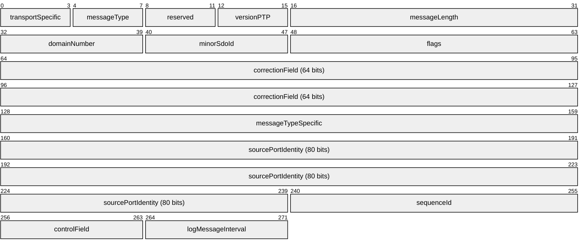
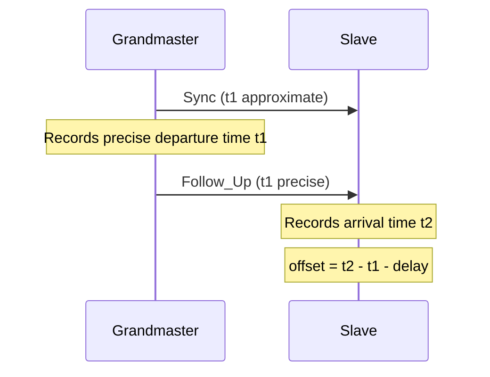
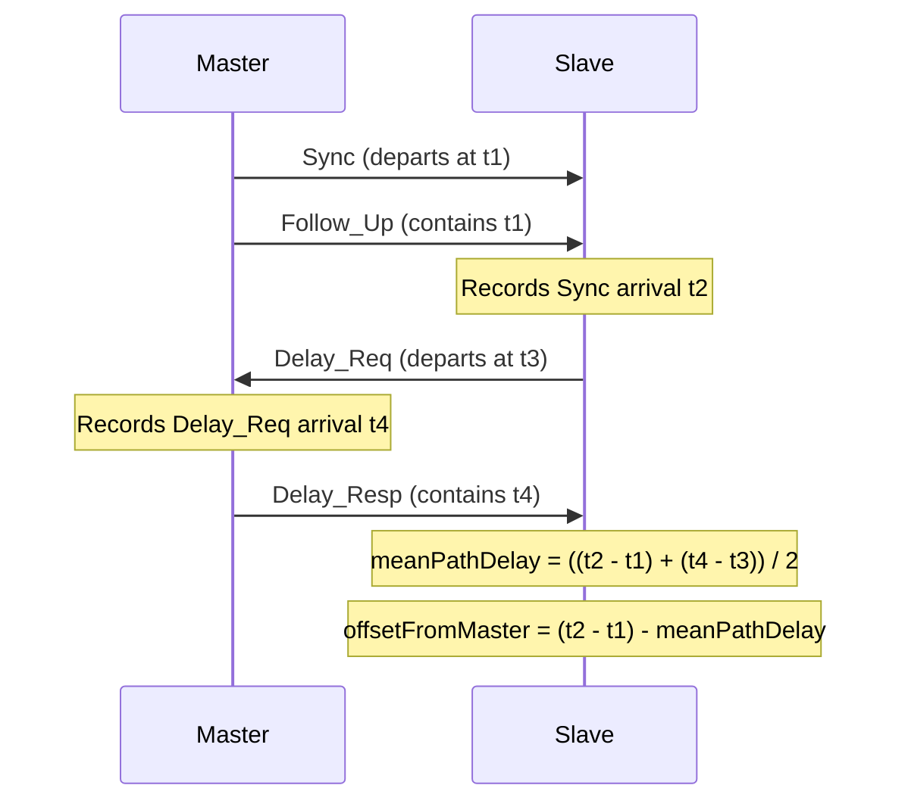
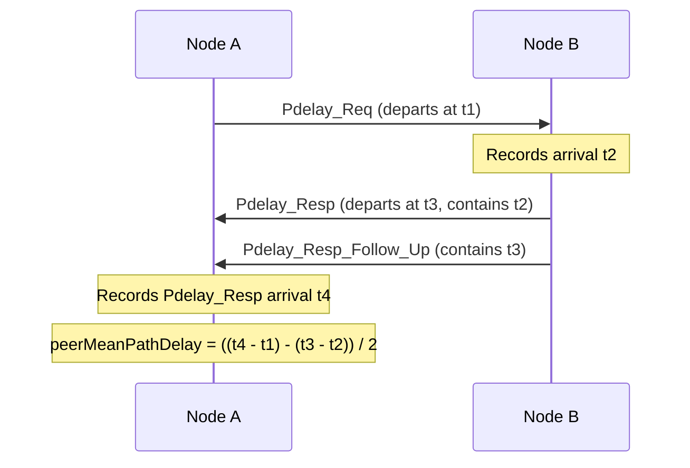
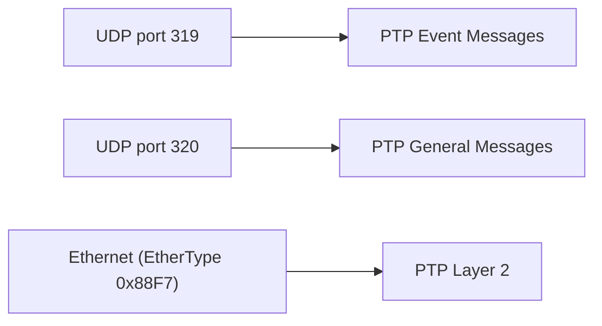

# PTP (Precision Time Protocol)

> **Standard:** [IEEE 1588-2019](https://standards.ieee.org/standard/1588-2019.html) | **Layer:** Application (Layer 7) | **Wireshark filter:** `ptp`

PTP synchronizes clocks across networked devices with sub-microsecond accuracy, far exceeding what NTP can achieve. It is the timing backbone for telecom networks, financial trading systems, power grids, broadcast media, and industrial automation. PTP uses a master-slave hierarchy where a Grandmaster clock distributes time to all other clocks in a PTP domain. Hardware timestamping at the physical layer is key to achieving nanosecond-level precision. The protocol was originally defined as IEEE 1588-2002 (PTPv1) and significantly revised in IEEE 1588-2008 (PTPv2); the current edition is IEEE 1588-2019.

## Header

The PTP common header is 34 bytes (272 bits). All PTP messages begin with this header, followed by message-type-specific fields and optional TLVs.

## Key Fields

| Field | Size | Description |
|-------|------|-------------|
| transportSpecific | 4 bits | Transport-specific flags (e.g., 0x1 for 802.1AS) |
| messageType | 4 bits | Type of PTP message |
| versionPTP | 4 bits | PTP version number (2 for PTPv2) |
| messageLength | 16 bits | Total message length in bytes |
| domainNumber | 8 bits | PTP domain (0-127), allowing multiple independent PTP instances |
| flags | 16 bits | Bitfield for two-step, unicast, leap second indicators, etc. |
| correctionField | 64 bits | Nanoseconds correction (fixed-point, 48.16 format) accumulated by transparent clocks |
| sourcePortIdentity | 80 bits | Unique identity: clockIdentity (64 bits) + portNumber (16 bits) |
| sequenceId | 16 bits | Sequence number for matching requests to responses |
| controlField | 8 bits | Legacy field for backward compatibility with PTPv1 |
| logMessageInterval | 8 bits | Message transmission rate as log2 seconds (e.g., -3 = 8 per second) |

## Message Types

### Event Messages (Timestamped)

| Value | Name | Description |
|-------|------|-------------|
| 0x0 | Sync | Master-to-slave time synchronization |
| 0x1 | Delay_Req | Slave-to-master delay measurement request (E2E) |
| 0x2 | Pdelay_Req | Peer delay measurement request (P2P) |
| 0x3 | Pdelay_Resp | Peer delay measurement response (P2P) |

### General Messages (Not Timestamped at Hardware Level)

| Value | Name | Description |
|-------|------|-------------|
| 0x8 | Follow_Up | Carries precise Sync departure timestamp (two-step clocks) |
| 0x9 | Delay_Resp | Master's response to Delay_Req with receive timestamp |
| 0xA | Pdelay_Resp_Follow_Up | Carries precise Pdelay_Resp departure timestamp |
| 0xB | Announce | Clock quality advertisement for BMCA |
| 0xC | Signaling | Negotiation messages (unicast, intervals) |
| 0xD | Management | Configuration and monitoring of PTP nodes |

### Flags Field

| Bit | Name | Description |
|-----|------|-------------|
| 0 | alternateMasterFlag | Sender is an alternate master |
| 1 | twoStepFlag | Follow_Up message will follow (two-step clock) |
| 2 | unicastFlag | Message is unicast (not multicast) |
| 5 | PTP profile Specific 1 | Defined by PTP profile |
| 6 | PTP profile Specific 2 | Defined by PTP profile |
| 8 | leap61 | Last minute of current UTC day has 61 seconds |
| 9 | leap59 | Last minute of current UTC day has 59 seconds |
| 10 | currentUtcOffsetValid | The UTC offset field is valid |
| 11 | ptpTimescale | Using PTP (TAI) timescale |
| 12 | timeTraceable | Timescale is traceable to a primary reference |
| 13 | frequencyTraceable | Frequency is traceable to a primary reference |

## Clock Synchronization

### Two-Step Clock (Most Common)

The master sends a Sync message and records the exact departure timestamp afterward, then sends it in a Follow_Up:

### One-Step Clock

The master embeds the precise departure timestamp directly in the Sync message as it leaves the hardware, eliminating the need for a Follow_Up. This requires hardware capable of modifying the packet on the fly.

## Delay Measurement

### End-to-End (E2E) Delay Measurement

Used with Ordinary Clocks and Boundary Clocks. The slave measures delay to the master:

### Peer-to-Peer (P2P) Delay Measurement

Used with Transparent Clocks. Each link measures its own delay independently:

P2P delay measurement works per-link, so each network hop knows its own delay. Transparent clocks update the correctionField as Sync messages pass through, accumulating total path delay.

## Best Master Clock Algorithm (BMCA)

BMCA selects the Grandmaster by comparing Announce messages from all clocks. Clocks are compared using these fields, in priority order:

| Priority | Field | Description |
|----------|-------|-------------|
| 1 | priority1 | User-configurable (0-255, lower wins) |
| 2 | clockClass | Clock quality class (e.g., 6 = primary reference) |
| 3 | clockAccuracy | Expected accuracy (e.g., 0x21 = within 100 ns) |
| 4 | offsetScaledLogVariance | Clock stability metric |
| 5 | priority2 | Tiebreaker (0-255, lower wins) |
| 6 | clockIdentity | Unique ID (lowest wins as final tiebreaker) |

## Clock Types

| Type | Description |
|------|-------------|
| Ordinary Clock (OC) | Single-port clock; acts as master or slave |
| Boundary Clock (BC) | Multi-port clock; slave on one port, master on others; re-generates Sync messages |
| Transparent Clock (TC) | Forwards PTP messages and updates correctionField with residence time; does not participate in BMCA |
| Grandmaster (GM) | The root time source for the entire PTP domain; selected by BMCA |

## PTP Profiles

| Profile | Standard | Domain | Key Characteristics |
|---------|----------|--------|---------------------|
| Default | IEEE 1588 | General | Multicast, E2E or P2P, domain 0 |
| Telecom (full) | ITU-T G.8275.1 | Telecom | Layer 2 multicast, BC at every hop, sub-us accuracy |
| Telecom (partial) | ITU-T G.8275.2 | Telecom | Unicast, IP transport, BCs not at every hop |
| Power | IEEE C37.238 | Power grid | Layer 2, 1-second Sync rate, VLAN tagged |
| AES67 / SMPTE ST 2059 | AES67 | Broadcast media | Domain 0, PTP over IP multicast, sub-us for audio/video sync |
| Automotive | IEEE 802.1AS (gPTP) | In-vehicle | P2P only, Layer 2, simplified BMCA |

## PTP vs NTP

| Feature | PTP (IEEE 1588) | NTP (RFC 5905) |
|---------|-----------------|----------------|
| Typical accuracy | Sub-microsecond | 1-50 milliseconds |
| Best-case accuracy | < 1 ns (with hardware) | ~100 us (LAN, SW timestamps) |
| Hardware timestamping | Yes (essential for best accuracy) | Optional (rarely used) |
| Network support needed | Boundary / Transparent clocks help | None (end-to-end) |
| Transport | UDP 319/320 or Layer 2 (0x88F7) | UDP port 123 |
| Message rate | Configurable (1-128 per second) | Typically every 64-1024 seconds |
| Hierarchy | Grandmaster selected by BMCA | Stratum levels (manual config) |
| Use cases | Telecom, finance, broadcast, power | General-purpose server/desktop sync |
| Complexity | High (profiles, clock types, HW support) | Low (software-only) |

## Encapsulation

PTP can run over UDP/IPv4, UDP/IPv6, or directly over Ethernet:

### Multicast Addresses

| Scope | IPv4 | IPv6 | Ethernet |
|-------|------|------|----------|
| Default domain (all) | 224.0.1.129 | ff0x::181 | 01:1B:19:00:00:00 |
| Peer delay (P2P) | 224.0.0.107 | ff02::6B | 01:80:C2:00:00:0E |

## Standards

| Document | Title |
|----------|-------|
| [IEEE 1588-2019](https://standards.ieee.org/standard/1588-2019.html) | Precision Clock Synchronization Protocol (current edition) |
| [IEEE 1588-2008](https://standards.ieee.org/standard/1588-2008.html) | PTPv2 (widely deployed edition) |
| [ITU-T G.8275.1](https://www.itu.int/rec/T-REC-G.8275.1) | PTP Telecom Profile (full timing support) |
| [ITU-T G.8275.2](https://www.itu.int/rec/T-REC-G.8275.2) | PTP Telecom Profile (partial timing support) |
| [IEEE C37.238](https://standards.ieee.org/standard/C37_238-2017.html) | PTP Power Profile |
| [IEEE 802.1AS](https://standards.ieee.org/standard/802_1AS-2020.html) | Generalized PTP (gPTP) for automotive/TSN |

## See Also

- [NTP](../naming/ntp.md) -- software-based time synchronization
- [Ethernet](../link-layer/ethernet.md) -- PTP Layer 2 transport (EtherType 0x88F7)
