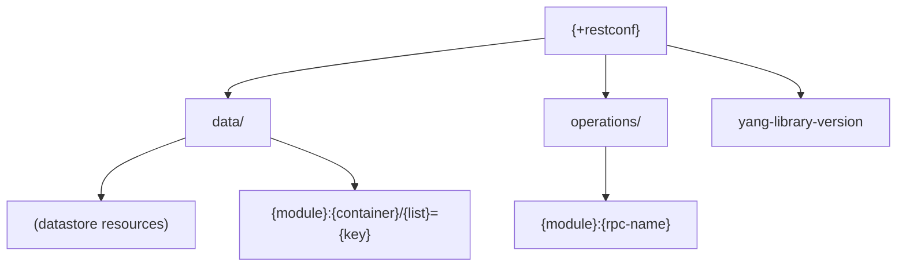
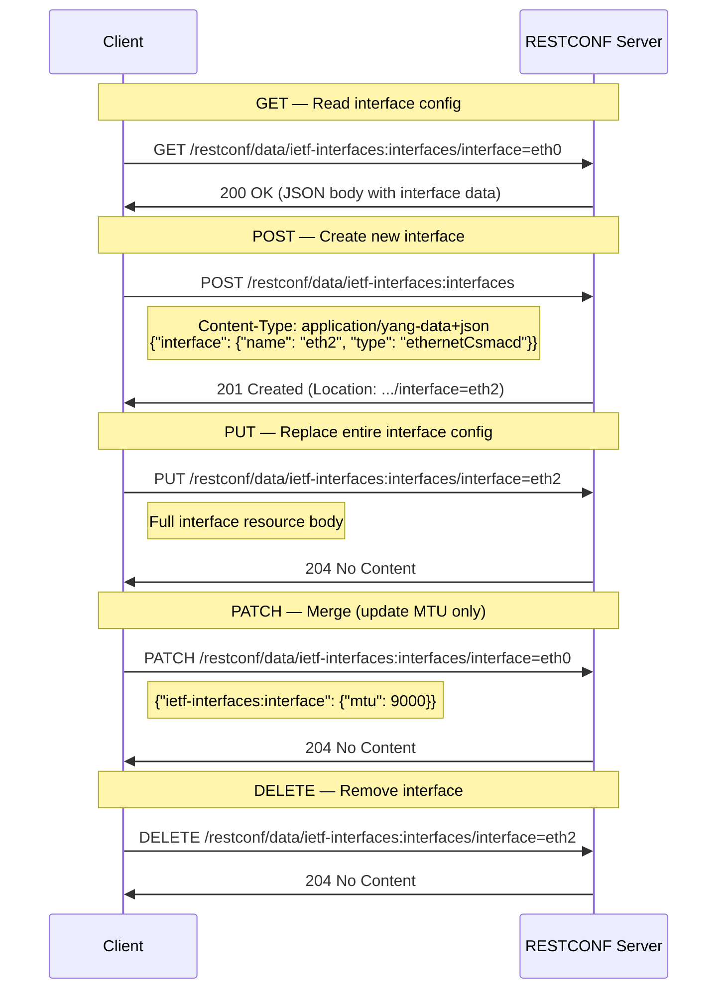
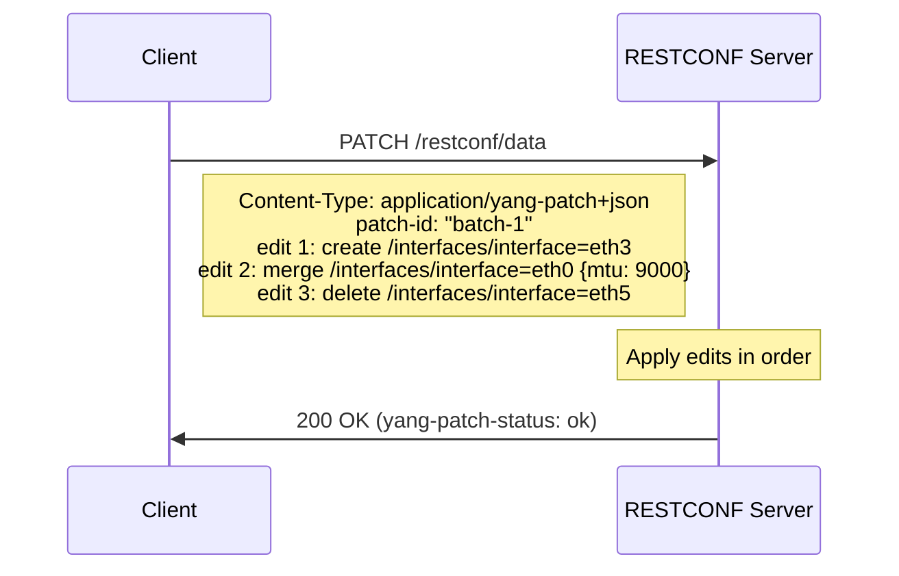
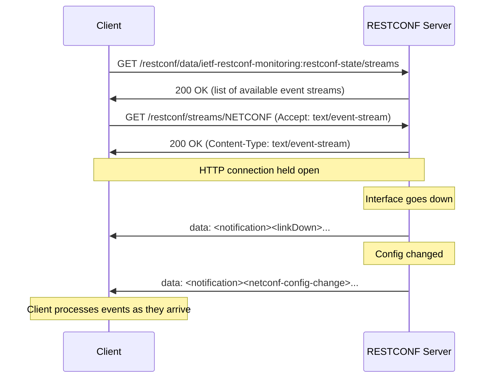
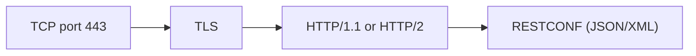

# RESTCONF

> **Standard:** [RFC 8040](https://www.rfc-editor.org/rfc/rfc8040) | **Layer:** Application (Layer 7) | **Wireshark filter:** `http` or `http2`

RESTCONF is an HTTP-based protocol for accessing YANG-modeled data on network devices, providing a RESTful alternative to NETCONF. It maps YANG data nodes to HTTP resources identified by URIs, using standard HTTP methods (GET, POST, PUT, PATCH, DELETE) for CRUD operations. Data is encoded as JSON (application/yang-data+json) or XML (application/yang-data+xml). RESTCONF runs over HTTPS and is designed for automation tools and web developers who are more familiar with REST APIs than NETCONF's XML-RPC model. It supports event notifications via Server-Sent Events (SSE).

## Resource URI Structure

RESTCONF resources are accessed via a well-known root path:

```
https://{host}/.well-known/host-meta
  → returns the RESTCONF API root (typically /restconf)
```



### URI Patterns

| URI Pattern | Description |
|-------------|-------------|
| `{+restconf}/data` | Root of the unified datastore |
| `{+restconf}/data/{path}` | Specific YANG data node |
| `{+restconf}/data/{module}:{container}` | Top-level container from a module |
| `{+restconf}/data/{module}:{list}={key}` | Specific list entry by key |
| `{+restconf}/data/{module}:{list}={key1},{key2}` | List entry with composite key |
| `{+restconf}/operations/{module}:{rpc}` | Invoke a YANG RPC or action |
| `{+restconf}/data/ietf-restconf-monitoring:restconf-state` | Server capabilities |

### Example URIs

| URI | Description |
|-----|-------------|
| `/restconf/data/ietf-interfaces:interfaces` | All interfaces |
| `/restconf/data/ietf-interfaces:interfaces/interface=eth0` | Interface eth0 |
| `/restconf/data/ietf-interfaces:interfaces/interface=eth0/mtu` | MTU of eth0 |
| `/restconf/operations/ietf-system:restart` | Restart the device |

## HTTP Method Mapping

| HTTP Method | RESTCONF Operation | NETCONF Equivalent | Description |
|-------------|-------------------|-------------------|-------------|
| GET | Read | `<get>`, `<get-config>` | Retrieve data resource |
| POST | Create | `<edit-config>` (create) | Create a new data resource |
| PUT | Create or Replace | `<edit-config>` (replace) | Create or replace entire resource |
| PATCH | Merge | `<edit-config>` (merge) | Merge data into existing resource |
| DELETE | Delete | `<edit-config>` (delete) | Remove a data resource |
| POST (on operations) | RPC | `<rpc>` | Invoke a YANG-defined operation |

## Media Types

| Media Type | Description |
|------------|-------------|
| `application/yang-data+json` | JSON encoding per RFC 7951 |
| `application/yang-data+xml` | XML encoding per RFC 7950 |
| `application/yang-patch+json` | YANG Patch in JSON (RFC 8072) |
| `application/yang-patch+xml` | YANG Patch in XML (RFC 8072) |

## CRUD Operations



## Query Parameters

| Parameter | Description | Example |
|-----------|-------------|---------|
| `depth` | Limit subtree depth (1 = no children, unbounded = all) | `?depth=2` |
| `fields` | Select specific fields to return | `?fields=name;mtu` |
| `filter` | XPath filter expression (if supported) | `?filter=/if:interfaces/if:interface[name='eth0']` |
| `content` | config, nonconfig, or all | `?content=config` |
| `with-defaults` | report-all, trim, explicit, report-all-tagged | `?with-defaults=report-all` |
| `insert` | Where to insert in ordered list: first, last, before, after | `?insert=first` |
| `point` | Reference entry for before/after insert | `?point=/list=key3` |

## YANG Patch (RFC 8072)

YANG Patch enables ordered, batch edit operations in a single HTTP PATCH request:



### YANG Patch Edit Operations

| Operation | Description |
|-----------|-------------|
| create | Create new resource; fail if it exists |
| delete | Remove resource; fail if it does not exist |
| insert | Insert into ordered list (with point/where) |
| merge | Merge with existing data (like PATCH) |
| move | Reorder entry in an ordered list |
| replace | Replace existing resource; fail if it does not exist |
| remove | Remove resource if it exists; no error if absent |

## Event Notifications (SSE)

RESTCONF delivers YANG notifications via Server-Sent Events (SSE) over HTTP:



### SSE Message Format

```
event: notification
data: {
data:   "ietf-restconf:notification": {
data:     "eventTime": "2025-03-21T10:15:30Z",
data:     "ietf-interfaces:link-down": {
data:       "if-name": "eth1"
data:     }
data:   }
data: }
```

## HTTP Status Codes

| Status Code | RESTCONF Meaning |
|-------------|-----------------|
| 200 OK | Successful GET, PATCH, or POST (RPC) |
| 201 Created | Resource successfully created (POST) |
| 204 No Content | Successful PUT, PATCH, or DELETE (no body) |
| 400 Bad Request | Malformed request or invalid data |
| 401 Unauthorized | Authentication required |
| 403 Forbidden | Insufficient authorization (NACM) |
| 404 Not Found | Resource does not exist |
| 405 Method Not Allowed | HTTP method not supported on this resource |
| 409 Conflict | Resource already exists (POST create) or data conflict |
| 412 Precondition Failed | ETag/If-Match condition not met |
| 415 Unsupported Media Type | Content-Type not supported |

## RESTCONF vs NETCONF vs gNMI

| Feature | RESTCONF | NETCONF | gNMI |
|---------|----------|---------|------|
| Transport | HTTPS (port 443) | SSH (port 830) | gRPC/HTTP2 (TLS) |
| Encoding | JSON or XML | XML | Protobuf, JSON_IETF |
| Data model | YANG | YANG | YANG (OpenConfig) |
| API style | RESTful (resource-oriented) | RPC (operation-oriented) | RPC (protobuf service) |
| Candidate datastore | No (typically) | Yes | No |
| Transactions | Per-request (YANG Patch for batch) | Full lock/commit | Per-Set atomic |
| Streaming telemetry | SSE (limited) | Notifications (RFC 5277) | Native bidirectional (Subscribe) |
| Tooling | curl, Postman, any HTTP client | ncclient, specialized tools | gNMIc, gRPC clients |
| Learning curve | Low (familiar REST/JSON) | Medium (XML/SSH) | Medium (gRPC/protobuf) |
| Bulk operations | YANG Patch | Native | Set with multiple operations |
| Adoption | Growing (REST-friendly) | Widespread | Growing (telemetry focus) |

## Encapsulation



RESTCONF MUST use HTTPS. The API root is typically `/restconf` but is discovered via `/.well-known/host-meta`.

## Standards

| Document | Title |
|----------|-------|
| [RFC 8040](https://www.rfc-editor.org/rfc/rfc8040) | RESTCONF Protocol |
| [RFC 8072](https://www.rfc-editor.org/rfc/rfc8072) | YANG Patch Media Type |
| [RFC 7951](https://www.rfc-editor.org/rfc/rfc7951) | JSON Encoding of Data Modeled with YANG |
| [RFC 7950](https://www.rfc-editor.org/rfc/rfc7950) | The YANG 1.1 Data Modeling Language |
| [RFC 8341](https://www.rfc-editor.org/rfc/rfc8341) | Network Configuration Access Control Model (NACM) |
| [RFC 8340](https://www.rfc-editor.org/rfc/rfc8340) | YANG Tree Diagrams |
| [RFC 8525](https://www.rfc-editor.org/rfc/rfc8525) | YANG Library |
| [RFC 8040 Errata](https://www.rfc-editor.org/errata/rfc8040) | RESTCONF Errata |

## See Also

- [NETCONF](netconf.md) -- SSH/XML-based YANG datastore management
- [gNMI](gnmi.md) -- gRPC-based streaming telemetry and config
- [SNMP](snmp.md) -- legacy polling-based network monitoring
