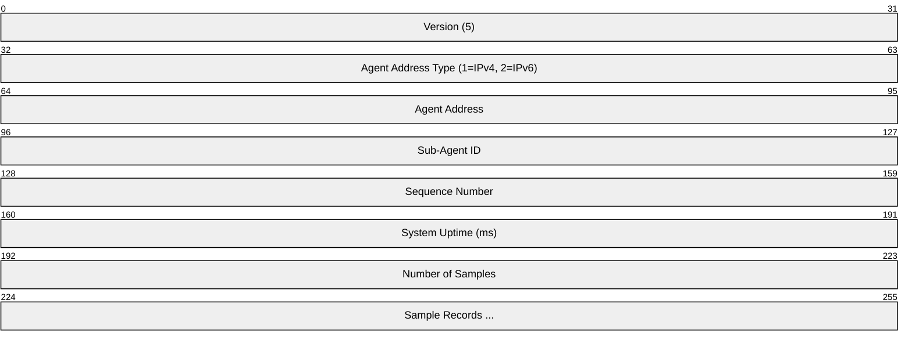
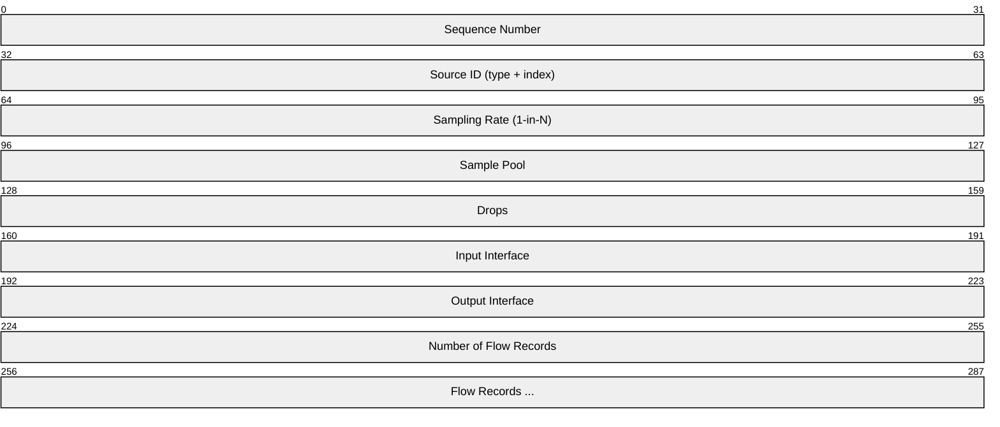
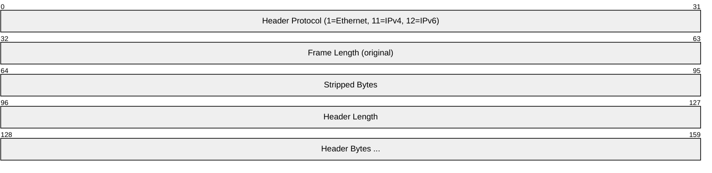
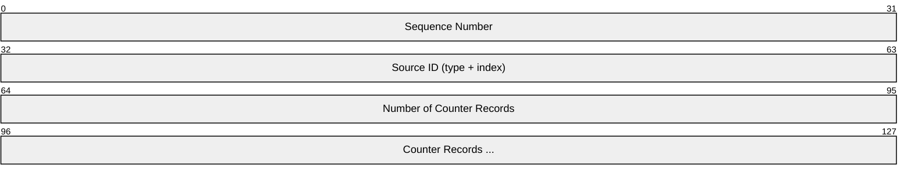
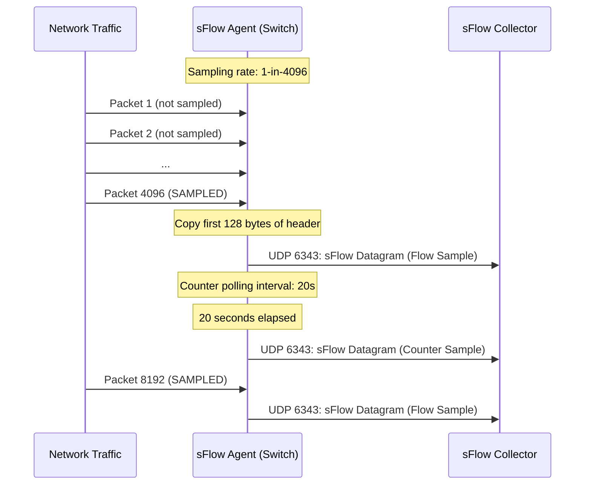
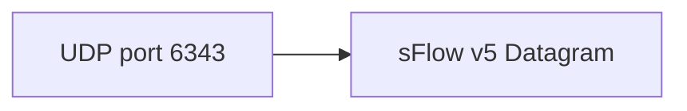

# sFlow

> **Standard:** [RFC 3176](https://www.rfc-editor.org/rfc/rfc3176) / [sFlow v5 Specification](https://sflow.org/sflow_version_5.txt) | **Layer:** Application (Layer 7) | **Wireshark filter:** `sflow`

sFlow is a sampling-based network monitoring technology for high-speed switched and routed networks. It combines random packet sampling (1-in-N) with periodic interface counter polling to provide real-time, network-wide traffic visibility with minimal impact on device performance. sFlow agents embedded in switches and routers export sampled data as UDP datagrams to a central collector for analysis. Unlike flow-cache-based approaches (NetFlow/IPFIX), sFlow is stateless on the agent -- each sampled packet is immediately exported, enabling linear scalability even at 100 Gbps+ link speeds.

## sFlow v5 Datagram

## Key Fields

| Field | Size | Description |
|-------|------|-------------|
| Version | 32 bits | sFlow datagram version (5) |
| Agent Address Type | 32 bits | 1 = IPv4, 2 = IPv6 |
| Agent Address | 32 or 128 bits | IP address of the sFlow agent |
| Sub-Agent ID | 32 bits | Identifies the sub-agent (e.g., line card) within the device |
| Sequence Number | 32 bits | Per-agent datagram sequence number (detects lost datagrams) |
| System Uptime | 32 bits | Milliseconds since agent last rebooted |
| Number of Samples | 32 bits | Count of sample records in this datagram |
| Sample Records | Variable | Flow Samples and/or Counter Samples |

## Sample Types

Each sFlow datagram contains one or more sample records. The two primary types are:

| Enterprise | Format | Sample Type | Description |
|------------|--------|-------------|-------------|
| 0 | 1 | Flow Sample | Sampled packet header and metadata |
| 0 | 2 | Counter Sample | Interface and system counters |
| 0 | 3 | Flow Sample (expanded) | Extended format with 32-bit source ID |
| 0 | 4 | Counter Sample (expanded) | Extended format with 32-bit source ID |

## Flow Sample

A Flow Sample is generated when a packet is randomly selected for sampling:

### Flow Sample Fields

| Field | Size | Description |
|-------|------|-------------|
| Sequence Number | 32 bits | Per-source sample sequence (detects drops) |
| Source ID | 32 bits | High 8 bits: type (0=ifIndex, 1=sMonitor, 2=VLAN); low 24 bits: index |
| Sampling Rate | 32 bits | Current sampling rate (e.g., 1-in-4096) |
| Sample Pool | 32 bits | Total packets observed since agent start |
| Drops | 32 bits | Packets dropped due to resource limits |
| Input Interface | 32 bits | SNMP ifIndex of ingress interface (0x3FFFFFFF = unknown) |
| Output Interface | 32 bits | SNMP ifIndex of egress interface (0x3FFFFFFF = unknown, 0x80000000+ = multiple/broadcast) |
| Number of Flow Records | 32 bits | Count of flow records following |

### Flow Record Types

| Enterprise | Format | Type | Description |
|------------|--------|------|-------------|
| 0 | 1 | Raw Packet Header | Sampled packet header bytes (up to 128 bytes typically) |
| 0 | 2 | Ethernet Frame Data | Source/dest MAC, EtherType, frame length |
| 0 | 3 | IPv4 Data | Extracted IP header fields |
| 0 | 4 | IPv6 Data | Extracted IPv6 header fields |
| 0 | 1001 | Extended Switch | Source/dest VLAN and priority |
| 0 | 1002 | Extended Router | Next-hop, source/dest mask lengths |
| 0 | 1003 | Extended Gateway | BGP AS path, communities, local pref |
| 0 | 1004 | Extended User | Source/dest user ID (authentication) |
| 0 | 1005 | Extended URL | URL direction and content |

### Raw Packet Header Record

| Field | Size | Description |
|-------|------|-------------|
| Header Protocol | 32 bits | Protocol of the sampled header (1 = Ethernet) |
| Frame Length | 32 bits | Original length of the sampled frame |
| Stripped Bytes | 32 bits | Bytes stripped before sampling (e.g., preamble, FCS) |
| Header Length | 32 bits | Number of header bytes included |
| Header Bytes | Variable | First N bytes of the packet (typically 128) |

## Counter Sample

Counter Samples are polled periodically (default every 20 seconds) and report cumulative interface statistics:

### Counter Record Types

| Enterprise | Format | Type | Description |
|------------|--------|------|-------------|
| 0 | 1 | Generic Interface | Standard interface counters (ifInOctets, ifOutOctets, etc.) |
| 0 | 2 | Ethernet Interface | Ethernet-specific counters (collisions, CRC errors) |
| 0 | 3 | Token Ring | Token Ring counters |
| 0 | 4 | 100 BaseVG | VG counters |
| 0 | 5 | VLAN | Per-VLAN counters |
| 0 | 1001 | Processor | CPU utilization, memory usage, total/free memory |

### Generic Interface Counters

| Field | Size | Description |
|-------|------|-------------|
| ifIndex | 32 bits | SNMP interface index |
| ifType | 32 bits | Interface type (6 = Ethernet, 53 = PPP, etc.) |
| ifSpeed | 64 bits | Interface speed in bps |
| ifDirection | 32 bits | 0 = unknown, 1 = full-duplex, 2 = half-duplex |
| ifStatus | 32 bits | Bit 0: ifAdminStatus, Bit 1: ifOperStatus |
| ifInOctets | 64 bits | Input byte counter |
| ifInUcastPkts | 32 bits | Input unicast packets |
| ifInMulticastPkts | 32 bits | Input multicast packets |
| ifInBroadcastPkts | 32 bits | Input broadcast packets |
| ifInDiscards | 32 bits | Input discarded packets |
| ifInErrors | 32 bits | Input error packets |
| ifInUnknownProtos | 32 bits | Input unknown protocol packets |
| ifOutOctets | 64 bits | Output byte counter |
| ifOutUcastPkts | 32 bits | Output unicast packets |
| ifOutMulticastPkts | 32 bits | Output multicast packets |
| ifOutBroadcastPkts | 32 bits | Output broadcast packets |
| ifOutDiscards | 32 bits | Output discarded packets |
| ifOutErrors | 32 bits | Output error packets |
| ifPromiscuousMode | 32 bits | Promiscuous mode (0 = false, 1 = true) |

## Sampling and Collection Flow

## sFlow vs NetFlow/IPFIX

| Feature | sFlow | NetFlow v5/v9 | IPFIX |
|---------|-------|---------------|-------|
| Approach | Packet sampling + counters | Flow cache export | Flow cache export |
| Agent state | Stateless (no flow cache) | Stateful (maintains flow cache) | Stateful (maintains flow cache) |
| Sampling | Random 1-in-N packet | Deterministic or sampled | Deterministic or sampled |
| Data exported | Raw packet headers | Aggregated flow records | Aggregated flow records |
| Counter export | Built-in periodic polling | Separate (SNMP) | Separate (SNMP) |
| Layer 2 visibility | Yes (MAC, VLAN, etc.) | Limited (v9 can include) | Yes (templates) |
| Transport | UDP (port 6343) | UDP (port 2055 typical) | UDP/TCP/SCTP (port 4739) |
| Scalability | Linear (stateless) | CPU-bound (flow cache) | CPU-bound (flow cache) |
| Non-IP traffic | Yes (any EtherType) | No (IP only) | Mostly IP |
| Standard | RFC 3176 + sflow.org v5 | Cisco proprietary | IETF RFC 7011 |
| Latency | Near real-time | Depends on timeouts | Depends on timeouts |

## Configuration Example

Typical sFlow agent configuration on a switch:

| Parameter | Typical Value | Description |
|-----------|---------------|-------------|
| Collector IP | 10.0.0.100 | sFlow collector address |
| Collector Port | 6343 | UDP destination port |
| Sampling Rate | 1-in-4096 | Packet sampling rate (adjust for link speed) |
| Polling Interval | 20 seconds | Counter polling frequency |
| Header Size | 128 bytes | Bytes of packet header to capture |
| Agent Address | Switch management IP | Source address in sFlow datagrams |

### Recommended Sampling Rates

| Link Speed | Sampling Rate |
|------------|---------------|
| 100 Mbps | 1-in-256 |
| 1 Gbps | 1-in-1024 to 1-in-4096 |
| 10 Gbps | 1-in-4096 to 1-in-8192 |
| 40 Gbps | 1-in-8192 to 1-in-16384 |
| 100 Gbps | 1-in-16384 to 1-in-65536 |

## Encapsulation

sFlow datagrams are sent over UDP. Port 6343 is IANA-assigned. The collector address and port are configurable on the agent.

## Standards

| Document | Title |
|----------|-------|
| [RFC 3176](https://www.rfc-editor.org/rfc/rfc3176) | InMon Corporation's sFlow: A Method for Monitoring Traffic in Switched and Routed Networks (Informational) |
| [sFlow v5](https://sflow.org/sflow_version_5.txt) | sFlow Version 5 specification (sflow.org) |
| [sFlow.org](https://sflow.org/) | sFlow standards body and resources |
| [IANA port 6343](https://www.iana.org/assignments/service-names-port-numbers/) | sFlow UDP port assignment |

## See Also

- [NetFlow/IPFIX](netflow.md) -- flow-cache-based traffic monitoring
- [SNMP](snmp.md) -- complementary device and interface monitoring
- [OTLP](otlp.md) -- modern observability telemetry protocol
