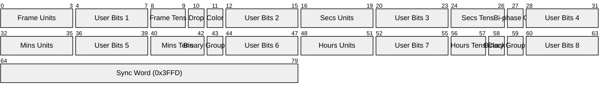
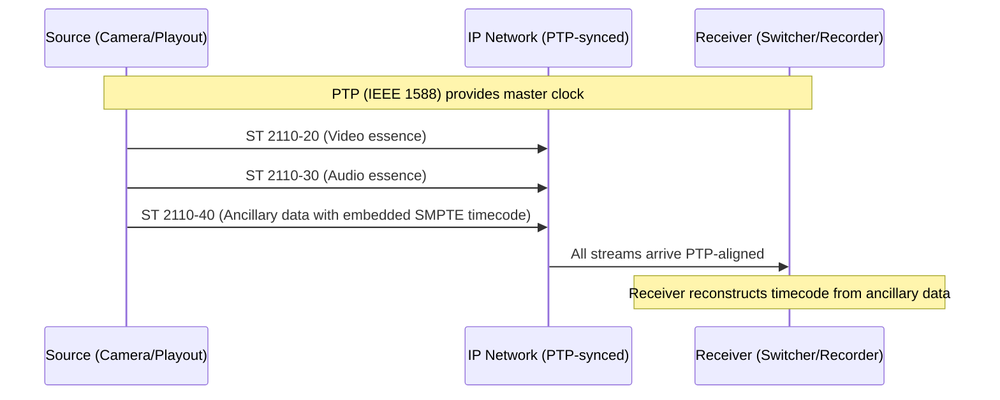

# SMPTE Timecode (SMPTE ST 12M / LTC / VITC)

> **Standard:** [SMPTE ST 12-1:2014](https://www.smpte.org/standards) | **Layer:** Physical / Application | **Wireshark filter:** N/A (analog/embedded signal; appears in ST 2110-40 ancillary data as `smpte_2110`)

SMPTE timecode is a standardized labeling system for uniquely identifying every frame of video or film with a timestamp in hours:minutes:seconds:frames format. It is used throughout broadcast television, film production, music recording, and live events to synchronize multiple pieces of equipment -- cameras, audio recorders, video editors, lighting consoles, and playout servers. The two primary forms are LTC (Linear Timecode), an audio-frequency signal carried on a dedicated track or cable, and VITC (Vertical Interval Timecode), embedded in the vertical blanking interval of analog video signals. Modern IP-based workflows carry timecode as ancillary data within SMPTE ST 2110-40 streams.

## LTC Frame (80 bits)

LTC encodes one timecode value per video frame as an 80-bit word using Manchester bi-phase encoding on an audio-frequency carrier.



The 16-bit sync word `0x3FFD` at the end of every frame allows receivers to identify frame boundaries and determine playback direction (the sync word reads differently when tape runs in reverse).

## Key Fields

| Field | Size | Description |
|-------|------|-------------|
| Frame Units | 4 bits | Ones digit of frame number (0-9) |
| Frame Tens | 2 bits | Tens digit of frame number (0-2) |
| Seconds Units | 4 bits | Ones digit of seconds (0-9) |
| Seconds Tens | 3 bits | Tens digit of seconds (0-5) |
| Minutes Units | 4 bits | Ones digit of minutes (0-9) |
| Minutes Tens | 3 bits | Tens digit of minutes (0-5) |
| Hours Units | 4 bits | Ones digit of hours (0-9) |
| Hours Tens | 2 bits | Tens digit of hours (0-2) |
| Drop Frame Flag | 1 bit | 1 = drop-frame timecode (29.97 fps) |
| Color Frame Flag | 1 bit | 1 = locked to color framing sequence |
| Clock Flag | 1 bit | 1 = timecode is locked to real-time clock |
| Binary Group Flags | 2 bits | Indicate how user bits should be interpreted |
| Bi-phase Correction | 1 bit | Ensures each frame has even number of transitions |
| User Bits | 32 bits (8x4) | 32 bits of user-defined data (8 groups of 4 bits) |
| Sync Word | 16 bits | Fixed pattern `0x3FFD` for frame synchronization |

## Frame Rates

| Frame Rate | Standard | Region | Notes |
|------------|----------|--------|-------|
| 24 fps | Film | Worldwide | Cinema standard |
| 25 fps | PAL/SECAM | Europe, Asia, Africa | Broadcast standard for 50 Hz regions |
| 29.97 fps | NTSC | Americas, Japan | Actual rate for NTSC color television |
| 30 fps | NTSC (B&W) | Americas | Original black-and-white rate, used in audio/music |

## Drop-Frame Timecode

NTSC color video runs at 29.97 fps, not exactly 30 fps. Over time, non-drop timecode drifts from real wall-clock time (approximately 3.6 seconds per hour). Drop-frame timecode compensates by skipping frame numbers 00 and 01 at the start of each minute, except every 10th minute.

| Minute | Frames Skipped | Example |
|--------|---------------|---------|
| :01 through :09 | Skip frames :00 and :01 | 01:02:00;02 follows 01:01:59;29 |
| :00, :10, :20, :30, :40, :50 | No skip (count normally) | 01:10:00;00 follows 01:09:59;29 |

Drop-frame timecode is denoted with semicolons (01:00:00;00) while non-drop uses colons (01:00:00:00).

## VITC (Vertical Interval Timecode)

VITC is embedded in the vertical blanking interval (VBI) of analog video signals, typically on lines 14-16 and 16-18 of the video field.

| Feature | LTC | VITC |
|---------|-----|------|
| Carrier | Audio signal on track/cable | Video signal in VBI lines |
| Encoding | Manchester bi-phase modulation | NRZ (Non-Return-to-Zero) |
| Bits per frame | 80 | 90 (80 data + CRC + sync) |
| Readable at high speed | Yes (shuttle, fast-forward) | No (lost at high speeds) |
| Readable at pause/slow | No (signal too low frequency) | Yes (embedded in each frame) |
| Redundancy | One copy per frame | Two identical lines per field |
| Connectable via | Audio cable (XLR, BNC) | Part of video signal |
| Standards | SMPTE ST 12-1 | SMPTE ST 12-2 |

In practice, professional video decks generate both LTC and VITC simultaneously to ensure timecode is readable at all transport speeds.

## User Bits

Each LTC/VITC frame carries 32 bits (8 nibbles) of user-defined data interleaved with the timecode digits. Common uses:

| Use | Description |
|-----|-------------|
| Date code | Store recording date (day/month/year) in BCD |
| Reel number | Identify tape reel or media clip |
| Scene/take | Encode scene and take numbers for film |
| Character set | ASCII characters (requires multiple frames) |
| Custom flags | Production-specific metadata |

The Binary Group Flags in the LTC frame indicate how user bits should be interpreted (unspecified, BCD date, page/line character set, etc.).

## MIDI Timecode (MTC)

MTC carries SMPTE timecode over MIDI connections using quarter-frame messages, allowing music sequencers and DAWs to synchronize with video equipment.

| MTC Message | MIDI Status | Description |
|-------------|------------|-------------|
| Quarter Frame | 0xF1 | Sends one nibble of timecode per message (8 messages = 2 frames) |
| Full Frame | 0xF0 (SysEx) | Sends complete timecode value in one message (used for locate) |

Quarter-frame messages transmit two per frame, taking 2 full frames (8 messages) to send a complete timecode value. This creates a 2-frame offset that receivers must compensate for.

## Timecode over IP

### SMPTE ST 2110-40

In modern IP-based broadcast facilities, timecode is carried as ancillary data within SMPTE ST 2110-40 RTP streams. The timecode appears as a SMPTE ST 12-1 ancillary data packet embedded in the RTP payload alongside other metadata (closed captions, AFD, etc.).



## Timecode Display Format

```
HH:MM:SS:FF     (non-drop frame)
HH:MM:SS;FF     (drop-frame, semicolons)
```

Examples:
- `01:23:45:12` -- 1 hour, 23 minutes, 45 seconds, frame 12 (non-drop)
- `00:59:59;29` -- last frame before the 1-hour mark (29.97 drop-frame)
- `01:00:00;02` -- first displayable frame after the hour (frames 00 and 01 skipped at :00 because it is not a 10th minute)

## Standards

| Document | Title |
|----------|-------|
| [SMPTE ST 12-1:2014](https://www.smpte.org/standards) | Time and Control Code (timecode definition) |
| [SMPTE ST 12-2:2014](https://www.smpte.org/standards) | Time and Control Code -- Vertical Interval (VITC) |
| [SMPTE ST 12-3:2016](https://www.smpte.org/standards) | Time and Control Code -- Transmission by Data Packets |
| [SMPTE ST 2110-40](https://www.smpte.org/standards) | Ancillary Data over IP (carries timecode in IP workflows) |
| [IEC 60461](https://www.iec.ch/) | Time and control code for video/audio (international equivalent) |
| [MIDI 1.0 Specification](https://www.midi.org/specifications) | MIDI Timecode (MTC) quarter-frame messages |

## See Also

- [PTP (IEEE 1588)](ptp.md) -- precision clock synchronization used alongside timecode in IP facilities
- [MIDI](../bus/midi.md) -- carries MIDI Timecode (MTC) for music/video sync
- [DMX512](../bus/dmx512.md) -- lighting protocol often synchronized via timecode
