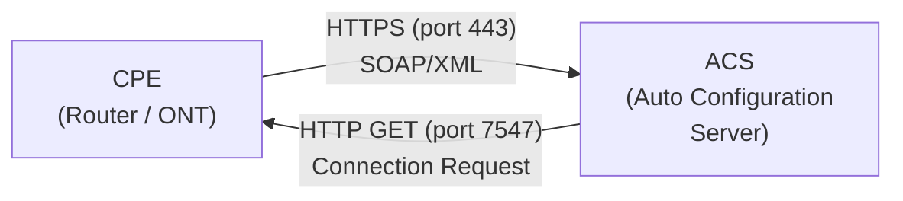
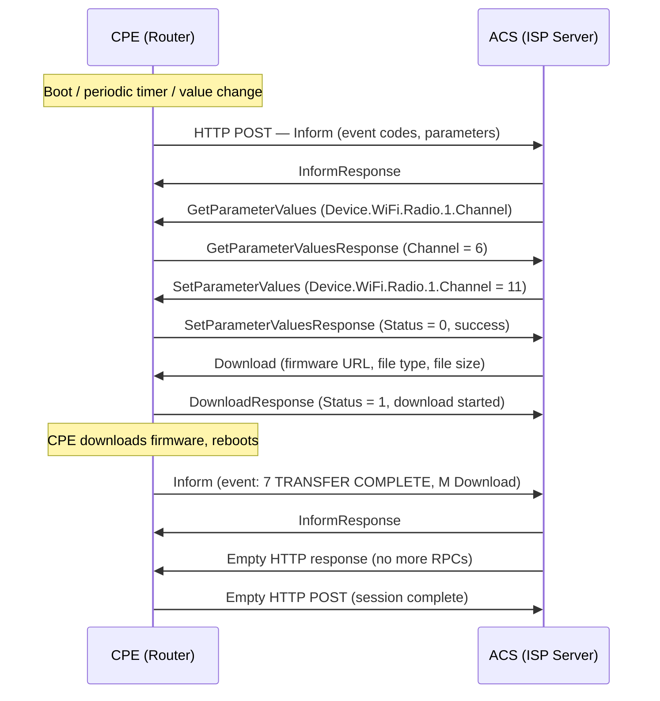
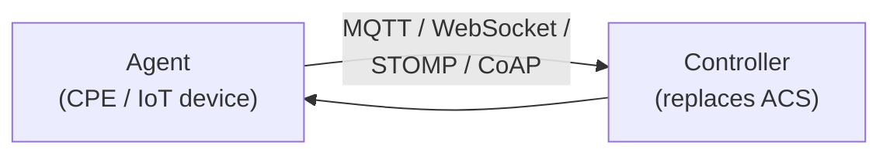
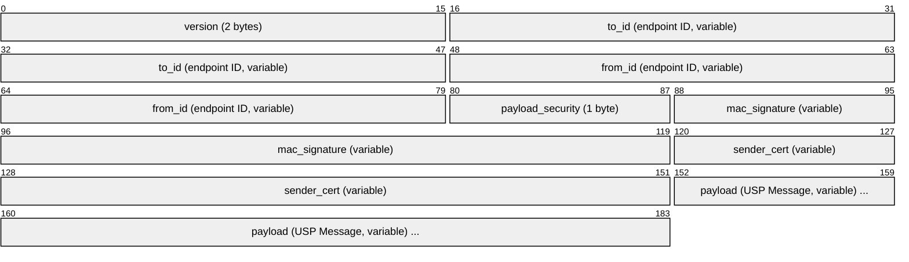
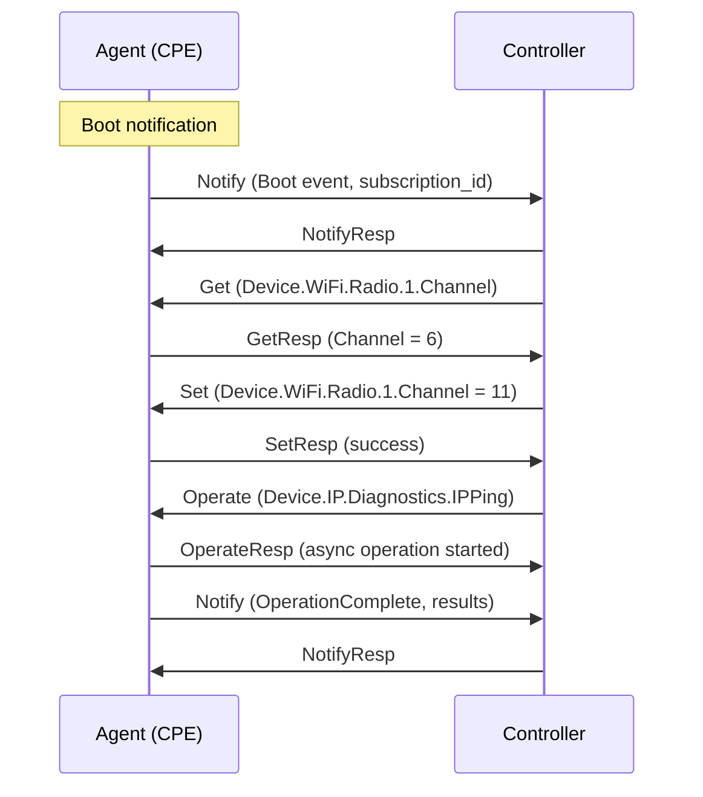

# TR-069 (CWMP) / TR-369 (USP)

> **Standard:** [Broadband Forum TR-069](https://www.broadband-forum.org/technical/download/TR-069.pdf) | **Layer:** Application (Layer 7) | **Wireshark filter:** `http` (TR-069 is SOAP/HTTP)

TR-069 (CPE WAN Management Protocol / CWMP) is how ISPs remotely manage customer premises equipment — routers, ONTs, set-top boxes, and gateways. It uses SOAP over HTTP/HTTPS between the CPE and an ACS (Auto Configuration Server), enabling remote configuration, firmware updates, diagnostics, and monitoring without truck rolls. TR-369 (User Services Platform / USP) is its modern replacement, using Protocol Buffers over MQTT, WebSocket, or other transports. Both use the same TR-181 data model, a hierarchical parameter tree describing every configurable aspect of the device.

## TR-069 (CWMP)

### Session Architecture

| Component | Role |
|-----------|------|
| CPE | Customer Premises Equipment — runs a TR-069 agent |
| ACS | Auto Configuration Server — ISP's management platform |
| Connection Request | ACS-initiated HTTP GET to CPE (port 7547) triggers CPE to connect back |

### Session Flow

### Inform Message

The Inform is the cornerstone of TR-069 — every session begins with one. The CPE sends an Inform to the ACS containing:

| Inform Field | Description |
|-------------|-------------|
| DeviceId | Manufacturer, OUI, ProductClass, SerialNumber |
| Event | List of event codes that triggered the session |
| MaxEnvelopes | Max SOAP envelopes per HTTP message |
| CurrentTime | CPE's current time |
| RetryCount | Number of retries for this session attempt |
| ParameterList | Key parameter values (forced + notification-triggered) |

### Event Codes

| Code | Name | Trigger |
|------|------|---------|
| 0 BOOTSTRAP | First boot | CPE contacts ACS for the first time (factory reset or new device) |
| 1 BOOT | Reboot | CPE has rebooted |
| 2 PERIODIC | Timer | Periodic inform interval expired |
| 4 VALUE CHANGE | Parameter changed | A parameter with active notification changed value |
| 6 CONNECTION REQUEST | ACS-initiated | ACS sent a Connection Request to port 7547 |
| 7 TRANSFER COMPLETE | Download/upload done | File transfer completed |
| 8 DIAGNOSTICS COMPLETE | Diag done | A diagnostic test (ping, traceroute, speed test) finished |
| M Download | Manufacturer | Download requested by ACS |
| M Reboot | Manufacturer | Reboot requested by ACS |

### RPC Methods

| Method | Direction | Description |
|--------|-----------|-------------|
| Inform | CPE -> ACS | Session initiation with device identity and events |
| GetParameterValues | ACS -> CPE | Read one or more parameter values |
| SetParameterValues | ACS -> CPE | Write one or more parameter values |
| GetParameterNames | ACS -> CPE | Discover available parameters (walk the tree) |
| AddObject | ACS -> CPE | Create a new instance (e.g., new port forwarding rule) |
| DeleteObject | ACS -> CPE | Delete an instance |
| Download | ACS -> CPE | Instruct CPE to download a file (firmware, config) |
| Upload | ACS -> CPE | Instruct CPE to upload a file (config backup, logs) |
| Reboot | ACS -> CPE | Reboot the CPE |
| FactoryReset | ACS -> CPE | Restore factory defaults |
| GetRPCMethods | Both | Discover supported RPC methods |
| ScheduleInform | ACS -> CPE | Schedule a future Inform |
| SetVouchers | ACS -> CPE | Install vouchers (rare) |

### Data Model (TR-181)

TR-069 uses a hierarchical dot-separated parameter tree. TR-181 (Device:2) is the current standard data model; TR-098 (InternetGatewayDevice:1) is the legacy model.

| Parameter Path | Type | Description |
|---------------|------|-------------|
| Device.DeviceInfo.Manufacturer | string | Device manufacturer name |
| Device.DeviceInfo.SoftwareVersion | string | Current firmware version |
| Device.WiFi.Radio.{i}.Channel | uint | WiFi channel number |
| Device.WiFi.Radio.{i}.Enable | bool | WiFi radio enabled |
| Device.WiFi.SSID.{i}.SSID | string | WiFi network name |
| Device.IP.Interface.{i}.IPv4Address.{i}.IPAddress | string | IPv4 address on an interface |
| Device.NAT.PortMapping.{i}.ExternalPort | uint | Port forwarding external port |
| Device.DNS.Client.Server.{i}.DNSServer | string | DNS server address |
| Device.ManagementServer.URL | string | ACS URL |
| Device.ManagementServer.PeriodicInformInterval | uint | Inform interval in seconds |

`{i}` indicates a multi-instance object (table row). AddObject creates new instances; DeleteObject removes them.

### Connection Request

When the ACS needs to reach the CPE outside of a scheduled session:

1. ACS sends **HTTP GET** to the CPE's Connection Request URL (typically `http://<CPE-IP>:7547/`)
2. CPE authenticates the request (HTTP Digest)
3. CPE initiates a new CWMP session to the ACS (Inform with event 6 CONNECTION REQUEST)

| Parameter | Description |
|-----------|-------------|
| Port | 7547 (default CPE listening port) |
| Authentication | HTTP Digest (username/password) |
| NAT traversal | Problematic — CPE behind NAT may not be reachable; STUN or periodic Inform used as workarounds |

### TR-069 Security

| Mechanism | Description |
|-----------|-------------|
| TLS/HTTPS | CPE connects to ACS over HTTPS |
| HTTP Digest | Authentication for both ACS URL access and Connection Requests |
| Client certificates | Optional mutual TLS authentication |
| ACS URL | Typically provisioned during manufacturing or via DHCP option 43 |

## TR-369 (USP — User Services Platform)

TR-369 is the modern replacement for TR-069, designed for IoT-scale management with better transport flexibility and security:

### Architecture

| TR-069 Term | TR-369 Term |
|------------|-------------|
| CPE | Agent |
| ACS | Controller |
| SOAP/XML | Protocol Buffers (protobuf) |
| HTTP/HTTPS | MQTT, WebSocket, STOMP, CoAP |
| Session-based | Message-based (no session) |

### USP Record (Protobuf)

Every USP exchange is wrapped in a USP Record:

| Field | Description |
|-------|-------------|
| version | USP protocol version |
| to_id | Destination endpoint ID (e.g., `os::012345-ABCdef`) |
| from_id | Source endpoint ID |
| payload_security | 0 = PLAINTEXT, 1 = TLS12 |
| mac_signature | HMAC or digital signature over the record |
| sender_cert | X.509 certificate of the sender |
| payload | Serialized USP Message (protobuf) |

### USP Message Flow

### USP Message Types

| Message | Direction | Description |
|---------|-----------|-------------|
| Get | Controller -> Agent | Read parameter values |
| GetResp | Agent -> Controller | Parameter values response |
| Set | Controller -> Agent | Write parameter values |
| SetResp | Agent -> Controller | Write confirmation |
| Add | Controller -> Agent | Create object instance |
| Delete | Controller -> Agent | Delete object instance |
| Operate | Controller -> Agent | Execute a command (ping, traceroute, firmware update) |
| Notify | Agent -> Controller | Event notification (value change, boot, operation complete) |
| GetSupportedDM | Controller -> Agent | Discover supported data model |
| GetInstances | Controller -> Agent | List object instances |
| GetSupportedProtocol | Both | Protocol version negotiation |

### USP Transports

| Transport | Protocol | Port | Use Case |
|-----------|----------|------|----------|
| MQTT | MQTT 3.1.1 / 5.0 | 8883 (TLS) | Primary — scalable pub/sub for large deployments |
| WebSocket | RFC 6455 | 443 | NAT-friendly, browser-compatible |
| STOMP | STOMP 1.2 | 61613 | Enterprise messaging integration |
| CoAP | RFC 7252 | 5684 (DTLS) | Constrained IoT devices |

### USP Advantages over CWMP

| Feature | TR-069 (CWMP) | TR-369 (USP) |
|---------|--------------|--------------|
| Encoding | SOAP/XML (verbose) | Protocol Buffers (compact) |
| Transport | HTTP/HTTPS only | MQTT, WebSocket, STOMP, CoAP |
| Model | Session-based (CPE connects to ACS) | Message-based (bidirectional, event-driven) |
| NAT traversal | Problematic (Connection Request) | Solved (MQTT broker, WebSocket) |
| Scalability | Moderate (HTTP sessions) | High (MQTT pub/sub) |
| Security | TLS + HTTP Digest | TLS + protobuf signatures + E2E encryption |
| Data model | TR-181 (Device:2) | TR-181 (same — full compatibility) |
| IoT support | Limited | Designed for IoT (lightweight, async) |
| Multi-controller | No (single ACS) | Yes (multiple controllers with permissions) |
| Commands | RPC methods | Operate (extensible command framework) |

## TR-069 vs TR-369 Comparison

| Aspect | TR-069 (CWMP) | TR-369 (USP) |
|--------|--------------|--------------|
| Year | 2004 | 2018 |
| Encoding | SOAP 1.1 / XML | Protocol Buffers |
| Transport | HTTP/HTTPS | MQTT, WebSocket, STOMP, CoAP |
| Session model | Session (Inform starts, empty POST ends) | Stateless messages |
| Data model | TR-181 Device:2 / TR-098 IGD:1 | TR-181 Device:2 |
| CPE port | 7547 (Connection Request) | N/A (broker-mediated) |
| Authentication | HTTP Digest, TLS certs | TLS, X.509, protobuf signatures |
| Firmware mgmt | Download RPC | Operate command |
| Bulk data | TR-157 Bulk Data Collection | Native Notify + Get |
| Deployment | Ubiquitous (billions of devices) | Growing (new deployments) |

## Standards

| Document | Title |
|----------|-------|
| [TR-069](https://www.broadband-forum.org/technical/download/TR-069.pdf) | CPE WAN Management Protocol (CWMP) |
| [TR-369](https://usp.technology/) | User Services Platform (USP) |
| [TR-181](https://usp-data-models.broadband-forum.org/) | Device:2 Data Model |
| [TR-098](https://www.broadband-forum.org/technical/download/TR-098.pdf) | InternetGatewayDevice:1 Data Model (legacy) |
| [TR-104](https://www.broadband-forum.org/technical/download/TR-104.pdf) | VoIP data model for TR-069 |
| [TR-135](https://www.broadband-forum.org/technical/download/TR-135.pdf) | STB data model for TR-069 |
| [TR-157](https://www.broadband-forum.org/technical/download/TR-157.pdf) | Bulk Data Collection for TR-069 |
| [TR-106](https://www.broadband-forum.org/technical/download/TR-106.pdf) | Data Model Template (CWMP/USP) |

## See Also

- [GPON](../telecom/gpon.md) — ONTs managed via TR-069/OMCI
- [EPON](../telecom/epon.md) — ONUs managed via TR-069/OAM
- [SNMP](snmp.md) — alternative network management protocol
- [MQTT](../messaging/mqtt.md) — primary transport for USP
- [HTTP](../web/http.md) — transport for CWMP (SOAP over HTTP)
