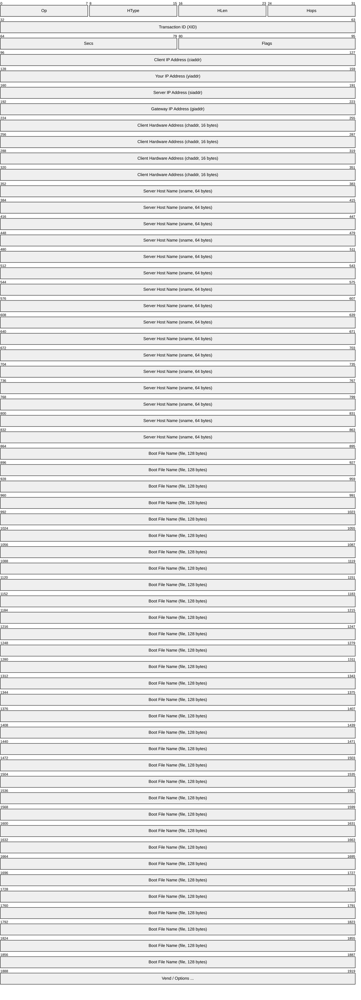
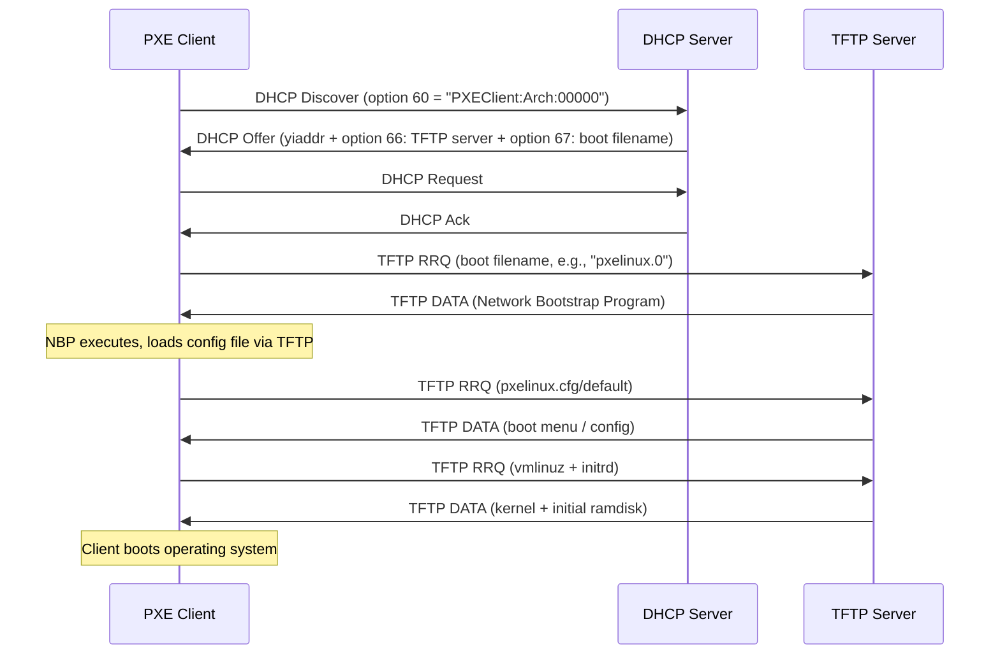
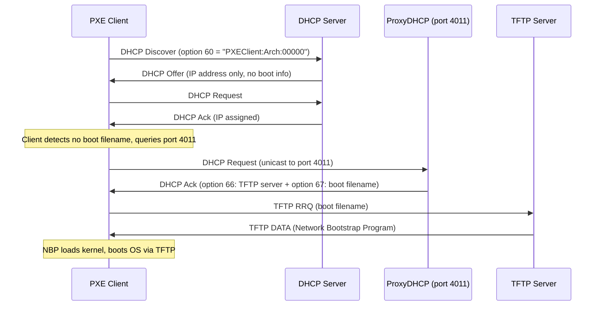
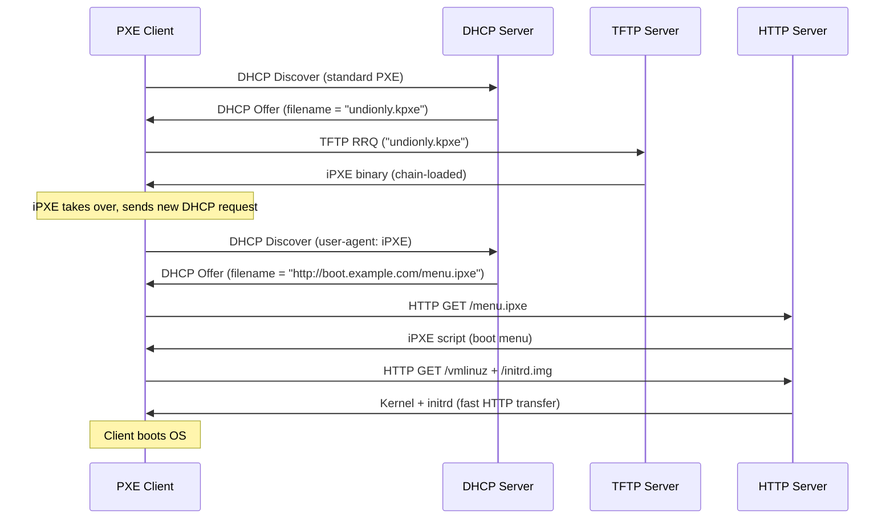
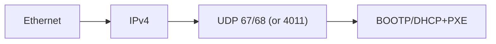

# BOOTP / PXE (Bootstrap Protocol / Preboot Execution Environment)

> **Standard:** [RFC 951](https://www.rfc-editor.org/rfc/rfc951) | **Layer:** Application (Layer 7) | **Wireshark filter:** `bootp` or `dhcp`

BOOTP is the original protocol for automatically assigning IP addresses and boot information to diskless workstations. It was designed to replace RARP with a richer bootstrap mechanism, allowing a client to discover its IP address, a TFTP server address, and a boot filename in a single exchange. DHCP (RFC 2131) evolved from BOOTP, extending it with address leasing, additional options, and dynamic allocation while maintaining backward-compatible message format. PXE (Preboot Execution Environment) builds on DHCP/BOOTP to provide a standardized method for booting computers over the network, downloading a Network Bootstrap Program (NBP) via TFTP or HTTP.

## BOOTP / DHCP Message

The BOOTP and DHCP message formats are identical in their fixed fields. DHCP extends BOOTP through the options field.

The fixed header is 236 bytes. In BOOTP, the final field is a 64-byte vendor-specific area. In DHCP, the options field begins with magic cookie `0x63825363` and is variable-length.

## Key Fields

| Field | Size | Description |
|-------|------|-------------|
| Op | 8 bits | Message type: 1 = BOOTREQUEST (client), 2 = BOOTREPLY (server) |
| HType | 8 bits | Hardware address type (1 = Ethernet) |
| HLen | 8 bits | Hardware address length (6 for Ethernet MAC) |
| Hops | 8 bits | Relay agent hop count, incremented by each relay |
| XID | 32 bits | Transaction ID chosen by client to match requests and replies |
| Secs | 16 bits | Seconds elapsed since client began boot process |
| Flags | 16 bits | Bit 0 = Broadcast flag; bits 1-15 reserved |
| ciaddr | 32 bits | Client's current IP address (set if client is bound) |
| yiaddr | 32 bits | "Your" IP address assigned by the server |
| siaddr | 32 bits | Next server IP address (TFTP server for boot file) |
| giaddr | 32 bits | Relay agent IP address |
| chaddr | 16 bytes | Client hardware address (MAC), zero-padded |
| sname | 64 bytes | Server hostname (null-terminated string, optional) |
| file | 128 bytes | Boot filename (null-terminated string, optional) |
| vend/options | 64+ bytes | Vendor-specific area (BOOTP) or DHCP options |

## BOOTP vs DHCP

| Feature | BOOTP | DHCP |
|---------|-------|------|
| Address allocation | Static (admin-configured table) | Dynamic, automatic, or manual |
| Lease concept | No (permanent assignment) | Yes (time-limited leases) |
| Options field | 64 bytes vendor-specific | Variable-length, extensible |
| Message types | Request and Reply only | Discover, Offer, Request, Ack, Nak, Release, Inform, Decline |
| Client state machine | Simple one-exchange | Multi-step DORA process |
| RFC | RFC 951 | RFC 2131 |
| Backward compatible | -- | Yes, uses same message format |

## PXE Boot Process

### Classic PXE Boot (DHCP + TFTP)

### ProxyDHCP Flow (Separate Boot Server)

When the DHCP server cannot be modified to include PXE options, a ProxyDHCP server provides boot information on a separate port.

## PXE DHCP Options

| Option | Name | Description |
|--------|------|-------------|
| 60 | Vendor Class Identifier | Client sends `PXEClient:Arch:xxxxx:UNDI:yyyzzz` |
| 66 | TFTP Server Name | Hostname or IP of the TFTP boot server |
| 67 | Bootfile Name | Path to the Network Bootstrap Program (e.g., `pxelinux.0`) |
| 97 | Client Machine Identifier (UUID) | 16-byte GUID/UUID of the client system |
| 43 | Vendor-Specific Information | PXE-specific sub-options (boot menu, discovery control) |

### Client System Architecture (Option 60 / RFC 4578)

The architecture type in the vendor class identifier tells the server what kind of bootloader to serve.

| Type | Architecture |
|------|-------------|
| 0 | Intel x86 BIOS |
| 6 | EFI IA32 |
| 7 | EFI x86-64 (UEFI) |
| 9 | EFI x86-64 (UEFI, alternate) |
| 10 | EFI ARM 32-bit |
| 11 | EFI ARM 64-bit (AARCH64) |

## UEFI HTTP Boot

Modern UEFI firmware supports HTTP Boot as an alternative to TFTP, offering significant performance improvements for large boot images.

| Feature | TFTP (Classic PXE) | HTTP Boot (UEFI) |
|---------|-------------------|------------------|
| Transport | UDP, stop-and-wait | TCP, streaming |
| Speed | Slow (512-byte blocks default) | Fast (full TCP throughput) |
| Encryption | None | HTTPS supported |
| Firmware support | BIOS and UEFI | UEFI only |
| DHCP option | Option 67 (filename) | Option 59 (Boot File URL) |
| Example path | `pxelinux.0` | `http://boot.example.com/boot.efi` |

## iPXE Extensions

iPXE is an open-source PXE implementation that extends the standard PXE environment with additional capabilities. It can be chain-loaded from a standard PXE ROM.

| Feature | Standard PXE | iPXE |
|---------|-------------|------|
| Download protocols | TFTP only | TFTP, HTTP, HTTPS, iSCSI, FCoE, AoE |
| Scripting | None | Built-in script engine |
| Boot from SAN | No | iSCSI, FCoE, AoE |
| DNS support | No | Yes |
| Wireless boot | No | Wi-Fi supported |
| VLAN tagging | No | 802.1Q support |
| Embedding | ROM only | ROM, USB, ISO, chain-load |

### iPXE Chain-Loading Flow

## Encapsulation

BOOTP and PXE use the same ports as DHCP: client sends from UDP port 68 to server port 67. ProxyDHCP uses port 4011 for unicast boot service queries.

## Standards

| Document | Title |
|----------|-------|
| [RFC 951](https://www.rfc-editor.org/rfc/rfc951) | Bootstrap Protocol (BOOTP) |
| [RFC 1497](https://www.rfc-editor.org/rfc/rfc1497) | BOOTP Vendor Information Extensions |
| [RFC 1542](https://www.rfc-editor.org/rfc/rfc1542) | Clarifications and Extensions for BOOTP |
| [RFC 2131](https://www.rfc-editor.org/rfc/rfc2131) | Dynamic Host Configuration Protocol (DHCP) |
| [RFC 4578](https://www.rfc-editor.org/rfc/rfc4578) | DHCP Options for PXE (Client Architecture) |
| [RFC 5970](https://www.rfc-editor.org/rfc/rfc5970) | DHCPv6 Options for Network Boot |
| [Intel PXE Specification v2.1](https://www.pix.net/software/pxeboot/archive/pxespec.pdf) | Preboot Execution Environment Specification |
| [RFC 7440](https://www.rfc-editor.org/rfc/rfc7440) | TFTP Windowsize Option (improves PXE transfer speed) |

## See Also

- [DHCP](dhcp.md) -- BOOTP's successor, uses the same message format
- [TFTP](../file-sharing/tftp.md) -- default file transfer protocol for PXE boot
- [HTTP](../web/http.md) -- used by UEFI HTTP Boot and iPXE
- [Ethernet](../link-layer/ethernet.md) -- underlying link layer for PXE
