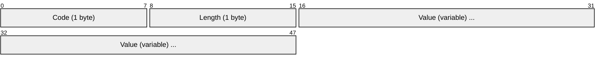
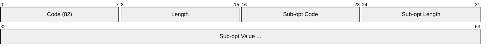

# DHCP Options Reference

> **Standard:** [RFC 2132](https://www.rfc-editor.org/rfc/rfc2132) | **Layer:** Application (Layer 7) | **Wireshark filter:** `dhcp.option`

DHCP options carry configuration parameters and control information between DHCP clients and servers. Options are appended to the fixed-field DHCP message (after the magic cookie `0x63825363`) using a Type-Length-Value (TLV) encoding. The DHCP options mechanism was inherited from BOOTP vendor extensions and greatly expanded. This document is a reference for the most commonly encountered DHCP options in production networks, including those critical for network booting, relay agents, and vendor-specific provisioning.

## Option TLV Format

Each option is encoded as a single-byte code, a single-byte length, and a variable-length value:

| Field | Size | Description |
|-------|------|-------------|
| Code | 1 byte | Option type identifier (0-255) |
| Length | 1 byte | Length of the value field in bytes (not present for options 0 and 255) |
| Value | Variable | Option data, format depends on the option code |

Options 0 (Pad) and 255 (End) are single-byte options with no length or value fields.

## Options by Function: Network Configuration

These options configure the client's IP stack:

| Option | Name | Len | Format | Description |
|--------|------|-----|--------|-------------|
| 1 | Subnet Mask | 4 | IP address | Client's subnet mask (e.g., `255.255.255.0`) |
| 3 | Router | 4n | IP list | Default gateway(s), in preference order |
| 6 | Domain Name Server | 4n | IP list | DNS server(s), in preference order |
| 15 | Domain Name | Variable | String | Client's DNS domain suffix (e.g., `example.com`) |
| 28 | Broadcast Address | 4 | IP address | Subnet broadcast address |
| 33 | Static Route | 8n | IP pairs | Destination/router pairs (obsoleted by Option 121) |
| 42 | NTP Servers | 4n | IP list | Network Time Protocol server(s) |
| 119 | Domain Search List | Variable | DNS encoded | DNS search list (compressed domain names per RFC 1035) |
| 121 | Classless Static Routes | Variable | CIDR + IP | Classless routes: subnet/mask-length + next-hop (RFC 3442) |

## Options by Function: Lease and Timing

These options control address lease duration and renewal timing:

| Option | Name | Len | Format | Description |
|--------|------|-----|--------|-------------|
| 51 | IP Address Lease Time | 4 | uint32 | Lease duration in seconds |
| 58 | Renewal (T1) Time | 4 | uint32 | Seconds until client enters RENEWING state (default: 50% of lease) |
| 59 | Rebinding (T2) Time | 4 | uint32 | Seconds until client enters REBINDING state (default: 87.5% of lease) |

## Options by Function: DHCP Protocol

These options are used by the DHCP protocol itself:

| Option | Name | Len | Format | Description |
|--------|------|-----|--------|-------------|
| 53 | DHCP Message Type | 1 | uint8 | 1=Discover, 2=Offer, 3=Request, 4=Decline, 5=ACK, 6=NAK, 7=Release, 8=Inform |
| 54 | Server Identifier | 4 | IP address | IP address of the DHCP server |
| 55 | Parameter Request List | Variable | uint8 list | List of option codes the client is requesting |
| 57 | Maximum DHCP Message Size | 2 | uint16 | Max DHCP message size the client will accept |
| 61 | Client Identifier | Variable | type + ID | Unique client ID: first byte is hardware type, rest is identifier (often MAC) |

## Options by Function: Client Identification

These options identify the client to the server:

| Option | Name | Len | Format | Description |
|--------|------|-----|--------|-------------|
| 12 | Hostname | Variable | String | Client's hostname (sent by client) |
| 60 | Vendor Class Identifier | Variable | String | Identifies client type/vendor (e.g., `MSFT 5.0`, `PXEClient:Arch:00000`) |
| 61 | Client Identifier | Variable | type + ID | Unique client identifier (see above) |
| 77 | User Class | Variable | String | User-defined class (for policy assignment) |
| 97 | Client Machine Identifier (UUID/GUID) | 17 | type + UUID | Client UUID (type byte 0 + 16-byte UUID; used in PXE environments) |

## Options by Function: Boot and Provisioning

These options support network booting (PXE/BOOTP) and device provisioning:

| Option | Name | Len | Format | Description |
|--------|------|-----|--------|-------------|
| 66 | TFTP Server Name | Variable | String | TFTP server hostname or IP for boot file download |
| 67 | Bootfile Name | Variable | String | Boot filename on the TFTP server |
| 150 | TFTP Server Address | 4n | IP list | TFTP server IP(s) — Cisco extension for IP phones |
| 252 | WPAD (Web Proxy Auto-Discovery) | Variable | String | URL to proxy auto-config (PAC) file (e.g., `http://wpad.example.com/wpad.dat`) |

## Options by Function: Vendor-Specific

| Option | Name | Len | Format | Description |
|--------|------|-----|--------|-------------|
| 43 | Vendor-Specific Information | Variable | TLV-encoded | Vendor-defined sub-options; format depends on Option 60 value |

Option 43 carries vendor-specific sub-options encoded as nested TLV (code-length-value) within the value field. The interpretation depends on the Vendor Class (Option 60). Common uses include Wi-Fi controller discovery, IP phone provisioning, and thin-client configuration.

## Option 82: Relay Agent Information

Option 82 (RFC 3046) is inserted by DHCP relay agents to identify the network location of the client. It contains sub-options:

### Option 82 Sub-options

| Sub-option | Name | Description |
|------------|------|-------------|
| 1 | Circuit ID | Identifies the physical port/VLAN where the client is connected (e.g., switch port, DSLAM slot) |
| 2 | Remote ID | Identifies the relay agent itself (e.g., switch MAC address, hostname) |
| 5 | Link Selection | Subnet the relay agent wants the server to allocate from |
| 6 | Subscriber ID | ISP subscriber identifier |
| 9 | Vendor-Specific Information | Vendor sub-options within Option 82 |
| 11 | Server Identifier Override | Override server ID for relay scenarios |
| 151 | Virtual Subnet Selection | Select address pool by virtual subnet |

Option 82 is widely used by ISPs, managed switches, and wireless controllers to assign IP addresses based on physical location rather than just client identity.

## Option 121: Classless Static Routes

Option 121 (RFC 3442) provides classless static routes, replacing the obsolete Option 33. Each route is encoded as:

| Field | Size | Description |
|-------|------|-------------|
| Subnet mask width | 1 byte | Number of significant bits (0-32) |
| Subnet | 0-4 bytes | Significant octets of the destination subnet (only enough bytes to cover mask width) |
| Router | 4 bytes | Next-hop IP address |

A mask width of 0 indicates a default route. When Option 121 is present, the client must ignore Option 3 (Router) per the RFC.

## Special Options

| Option | Name | Description |
|--------|------|-------------|
| 0 | Pad | Single byte (0x00), no length/value — used for alignment |
| 255 | End | Single byte (0xFF), no length/value — marks end of options |
| 52 | Option Overload | Indicates that sname/file fields carry additional options (1=file, 2=sname, 3=both) |

## Complete Quick Reference

| Code | Name | RFC |
|------|------|-----|
| 1 | Subnet Mask | 2132 |
| 3 | Router | 2132 |
| 6 | Domain Name Server | 2132 |
| 12 | Hostname | 2132 |
| 15 | Domain Name | 2132 |
| 28 | Broadcast Address | 2132 |
| 42 | NTP Servers | 2132 |
| 43 | Vendor-Specific Information | 2132 |
| 51 | IP Address Lease Time | 2132 |
| 53 | DHCP Message Type | 2132 |
| 54 | Server Identifier | 2132 |
| 55 | Parameter Request List | 2132 |
| 57 | Maximum DHCP Message Size | 2132 |
| 58 | Renewal (T1) Time | 2132 |
| 59 | Rebinding (T2) Time | 2132 |
| 60 | Vendor Class Identifier | 2132 |
| 61 | Client Identifier | 2132 |
| 66 | TFTP Server Name | 2132 |
| 67 | Bootfile Name | 2132 |
| 77 | User Class | 3004 |
| 82 | Relay Agent Information | 3046 |
| 97 | Client Machine Identifier (UUID) | 4578 |
| 119 | Domain Search List | 3397 |
| 121 | Classless Static Routes | 3442 |
| 150 | TFTP Server Address (Cisco) | — |
| 252 | WPAD | — |
| 255 | End | 2132 |

## Standards

| Document | Title |
|----------|-------|
| [RFC 2132](https://www.rfc-editor.org/rfc/rfc2132) | DHCP Options and BOOTP Vendor Extensions |
| [RFC 3046](https://www.rfc-editor.org/rfc/rfc3046) | DHCP Relay Agent Information Option (Option 82) |
| [RFC 3442](https://www.rfc-editor.org/rfc/rfc3442) | Classless Static Route Option (Option 121) |
| [RFC 3004](https://www.rfc-editor.org/rfc/rfc3004) | User Class Option (Option 77) |
| [RFC 3397](https://www.rfc-editor.org/rfc/rfc3397) | Domain Search Option (Option 119) |
| [RFC 4578](https://www.rfc-editor.org/rfc/rfc4578) | DHCP PXE Options (Options 93, 94, 97) |
| [RFC 2131](https://www.rfc-editor.org/rfc/rfc2131) | Dynamic Host Configuration Protocol |

## See Also

- [DHCP](dhcp.md) -- the protocol that carries these options
- [DHCPv6](dhcpv6.md) -- IPv6 DHCP uses a different option format (16-bit code + 16-bit length)
- [DNS](dns.md) -- Options 6, 15, and 119 configure DNS behavior
