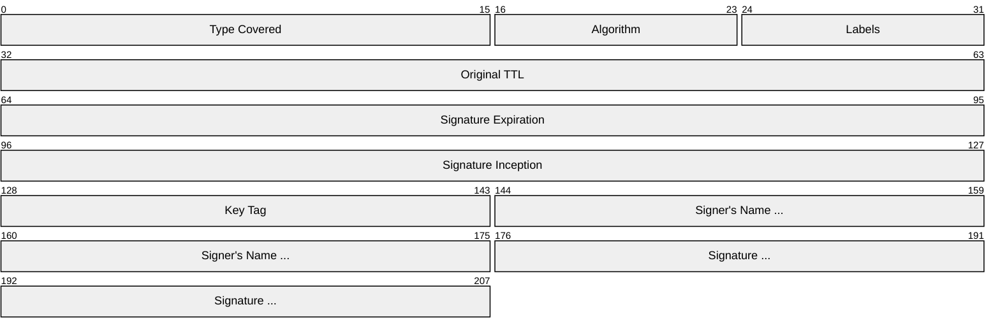
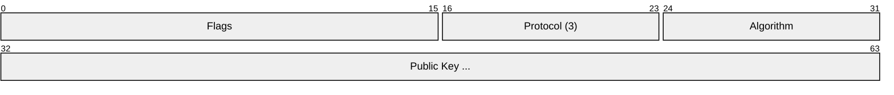
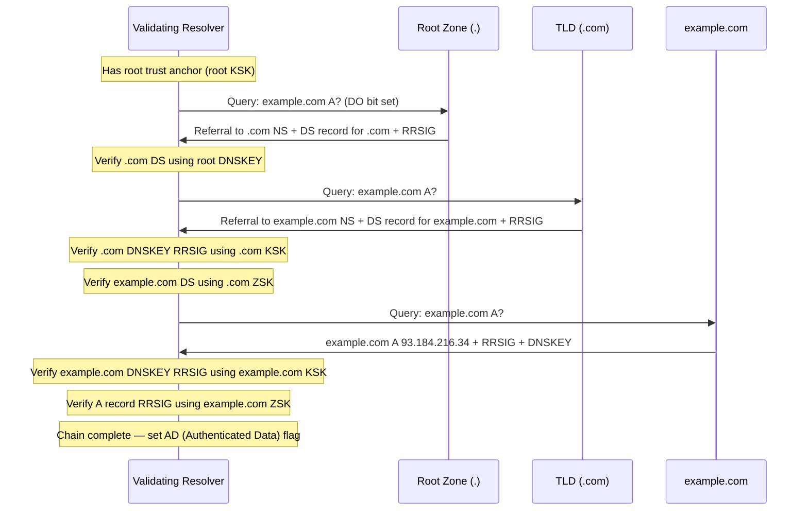
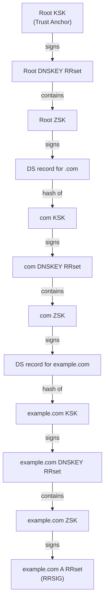
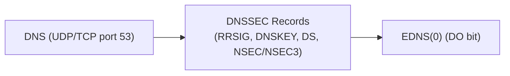

# DNSSEC (DNS Security Extensions)

> **Standard:** [RFC 4033](https://www.rfc-editor.org/rfc/rfc4033) / [RFC 4034](https://www.rfc-editor.org/rfc/rfc4034) / [RFC 4035](https://www.rfc-editor.org/rfc/rfc4035) | **Layer:** Application (Layer 7) | **Wireshark filter:** `dns.flags.ad` (Authenticated Data) or `dns.type == 46` (RRSIG)

DNSSEC adds cryptographic authentication to DNS, allowing resolvers to verify that DNS responses have not been tampered with and genuinely originate from the authoritative zone. It does **not** encrypt DNS traffic — it provides **data origin authentication** and **integrity protection** via digital signatures. DNSSEC introduces new record types (RRSIG, DNSKEY, DS, NSEC/NSEC3) and builds a chain of trust from the signed DNS root zone down through TLDs to individual domains. A validating resolver checks signatures at each level to confirm authenticity.

## New Record Types

| Record Type | Code | Purpose |
|-------------|------|---------|
| RRSIG | 46 | Signature over an RRset (one per record type per zone) |
| DNSKEY | 48 | Public key for the zone (used to verify RRSIGs) |
| DS | 43 | Delegation Signer — hash of a child zone's KSK (links parent to child) |
| NSEC | 47 | Authenticated denial of existence (proves a name/type does not exist) |
| NSEC3 | 50 | Hashed denial of existence (prevents zone walking) |
| NSEC3PARAM | 51 | Parameters for NSEC3 hash computation |

## RRSIG Record

An RRSIG record contains a digital signature covering an entire RRset (all records of one type at one name).

| Field | Size | Description |
|-------|------|-------------|
| Type Covered | 16 bits | DNS record type this RRSIG covers (e.g., 1=A, 28=AAAA, 15=MX) |
| Algorithm | 8 bits | Cryptographic algorithm used (see algorithm table) |
| Labels | 8 bits | Number of labels in the owner name (used for wildcard detection) |
| Original TTL | 32 bits | TTL of the covered RRset (used in signature computation) |
| Signature Expiration | 32 bits | Unix timestamp when signature expires |
| Signature Inception | 32 bits | Unix timestamp when signature becomes valid |
| Key Tag | 16 bits | Short identifier to match this RRSIG to the correct DNSKEY |
| Signer's Name | Variable | Domain name of the zone that generated the signature |
| Signature | Variable | The cryptographic signature bytes |

## DNSKEY Record

A DNSKEY record publishes the zone's public key. There are two key roles:

| Field | Size | Description |
|-------|------|-------------|
| Flags | 16 bits | Bit 7 = Zone Key (must be 1), Bit 15 = SEP (Secure Entry Point, indicates KSK) |
| Protocol | 8 bits | Always 3 (DNSSEC) |
| Algorithm | 8 bits | Cryptographic algorithm |
| Public Key | Variable | Public key material (algorithm-specific encoding) |

### ZSK vs KSK

| Key Type | Flags Value | Description |
|----------|-------------|-------------|
| ZSK (Zone Signing Key) | 256 (bit 7 set) | Signs all RRsets in the zone. Shorter key, rotated frequently. |
| KSK (Key Signing Key) | 257 (bits 7+15 set) | Signs only the DNSKEY RRset. Longer key, rotated infrequently. Its hash is published as a DS record in the parent zone. |

## Chain of Trust

DNSSEC validation follows a hierarchical chain from the root zone down:

### Chain of Trust Linkage

## DS Record

The DS (Delegation Signer) record is published in the **parent** zone and contains a hash of the child zone's KSK, linking the two zones:

| Field | Size | Description |
|-------|------|-------------|
| Key Tag | 16 bits | Tag of the child's DNSKEY being referenced |
| Algorithm | 8 bits | Algorithm of the child's DNSKEY |
| Digest Type | 8 bits | Hash algorithm: 1=SHA-1, 2=SHA-256, 4=SHA-384 |
| Digest | Variable | Hash of the child's DNSKEY record (owner name + RDATA) |

## Cryptographic Algorithms

| Number | Algorithm | Status |
|--------|-----------|--------|
| 5 | RSA/SHA-1 | Deprecated |
| 7 | RSASHA1-NSEC3-SHA1 | Deprecated |
| 8 | RSA/SHA-256 | Widely deployed |
| 10 | RSA/SHA-512 | Supported |
| 13 | ECDSA P-256/SHA-256 | Recommended (smaller keys/signatures) |
| 14 | ECDSA P-384/SHA-384 | Supported |
| 15 | Ed25519 | Recommended (smallest, fastest) |
| 16 | Ed448 | Supported |

## Authenticated Denial of Existence

DNSSEC must prove that a queried name or record type does **not** exist, without allowing an attacker to forge "no such name" responses.

### NSEC (Next Secure)

NSEC records form a sorted chain of all names in the zone. Each NSEC record points to the next name and lists the record types that exist at the current name. A gap in the chain proves a name does not exist.

| Drawback | Description |
|----------|-------------|
| Zone walking | An attacker can enumerate all names in a zone by following the NSEC chain |

### NSEC3 (RFC 5155)

NSEC3 replaces plain names with hashed names, preventing zone enumeration:

| Field | Description |
|-------|-------------|
| Hash Algorithm | 1 = SHA-1 |
| Flags | Bit 0 = Opt-Out (skip unsigned delegations) |
| Iterations | Number of additional hash iterations |
| Salt | Random salt prepended before hashing |
| Next Hashed Owner | Hash of the next existing owner name |
| Type Bit Maps | Record types at this hashed owner name |

| Feature | NSEC | NSEC3 |
|---------|------|-------|
| Name representation | Plaintext domain names | SHA-1 hashes of domain names |
| Zone walking | Trivial | Computationally expensive (requires brute-forcing hashes) |
| Zone file size | Moderate | Larger (hashed records) |
| Response size | Moderate | Larger |
| CPU cost | Lower | Higher (hashing) |

## Key Rollover

Keys must be periodically rotated for security. Two main strategies:

### ZSK Rollover (Pre-Publish)

| Step | Action |
|------|--------|
| 1 | Publish new ZSK in DNSKEY RRset (not yet signing) |
| 2 | Wait for old DNSKEY TTL to expire (propagation) |
| 3 | Sign all RRsets with new ZSK, remove old signatures |
| 4 | Wait for old RRSIG TTL to expire |
| 5 | Remove old ZSK from DNSKEY RRset |

### KSK Rollover (Double-DS)

| Step | Action |
|------|--------|
| 1 | Generate new KSK, add to DNSKEY RRset, sign DNSKEY with both KSKs |
| 2 | Add DS record for new KSK in parent zone (keep old DS too) |
| 3 | Wait for parent DS TTL to expire |
| 4 | Remove old KSK from DNSKEY RRset |
| 5 | Remove old DS from parent zone |

## DNSSEC-Related DNS Flags

| Flag | Bit | Description |
|------|-----|-------------|
| DO (DNSSEC OK) | EDNS(0) | Client requests DNSSEC records in response |
| AD (Authenticated Data) | Header | Resolver asserts all data in the answer is authenticated |
| CD (Checking Disabled) | Header | Client tells resolver to skip DNSSEC validation |

## Encapsulation

DNSSEC records are carried as standard DNS records in DNS responses. The DO bit in the EDNS(0) OPT record signals that the client supports DNSSEC.

## Standards

| Document | Title |
|----------|-------|
| [RFC 4033](https://www.rfc-editor.org/rfc/rfc4033) | DNS Security Introduction and Requirements |
| [RFC 4034](https://www.rfc-editor.org/rfc/rfc4034) | Resource Records for the DNS Security Extensions |
| [RFC 4035](https://www.rfc-editor.org/rfc/rfc4035) | Protocol Modifications for the DNS Security Extensions |
| [RFC 5155](https://www.rfc-editor.org/rfc/rfc5155) | DNS Security (DNSSEC) Hashed Authenticated Denial of Existence (NSEC3) |
| [RFC 6781](https://www.rfc-editor.org/rfc/rfc6781) | DNSSEC Operational Practices, Version 2 |
| [RFC 8624](https://www.rfc-editor.org/rfc/rfc8624) | Algorithm Implementation Requirements and Usage Guidance for DNSSEC |

## See Also

- [DNS](dns.md) — the base DNS protocol that DNSSEC extends
- [DoH](doh.md) — DNS over HTTPS (provides confidentiality; DNSSEC provides authenticity)
- [DoT](dot.md) — DNS over TLS (provides confidentiality; DNSSEC provides authenticity)
- [DANE](../email/dane.md) — DNS-Based Authentication of Named Entities (relies on DNSSEC)
- [X.509](../security/tls.md) — certificate-based authentication (alternative trust model)
