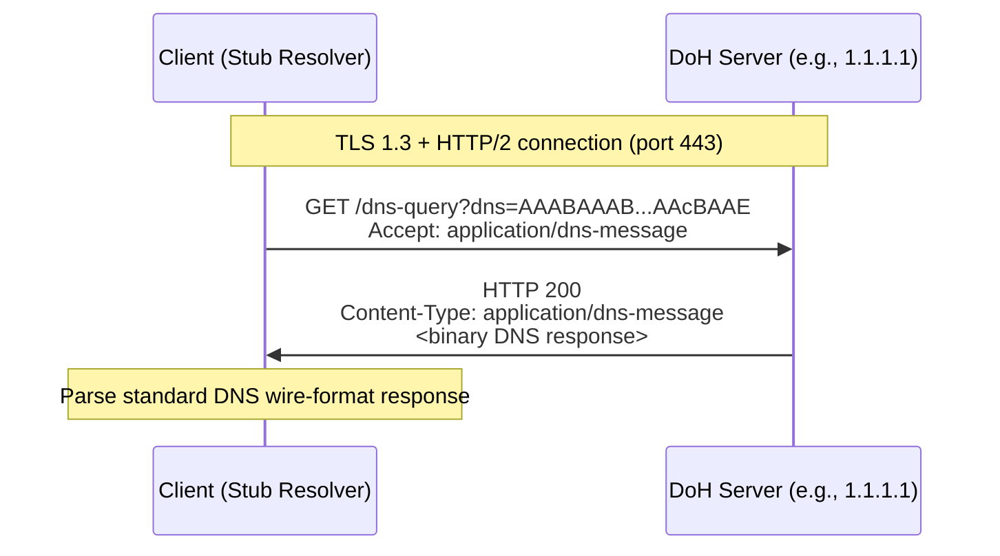
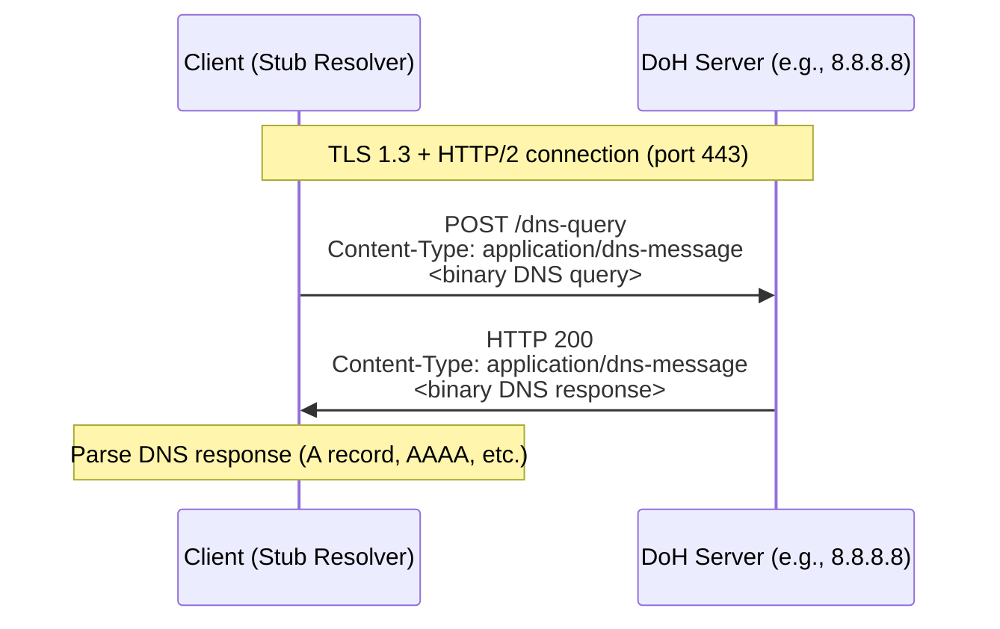
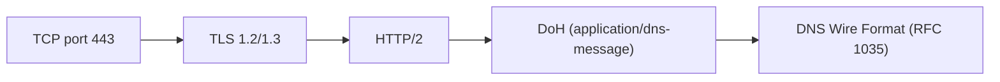

# DoH (DNS over HTTPS)

> **Standard:** [RFC 8484](https://www.rfc-editor.org/rfc/rfc8484) | **Layer:** Application (Layer 7) | **Wireshark filter:** `dns` (only with TLS key log; otherwise `tls`)

DNS over HTTPS encapsulates standard DNS queries and responses inside HTTPS, providing confidentiality, integrity, and authentication for DNS resolution. Because DoH uses the same port as regular HTTPS (443/tcp), DNS traffic blends with normal web traffic and cannot be easily blocked or distinguished by network middleboxes. DoH uses standard DNS wire format ([RFC 1035](https://www.rfc-editor.org/rfc/rfc1035)) as the payload, transported via HTTP/2 or HTTP/3. Clients can send queries using either HTTP GET (base64url-encoded) or POST (binary body).

## Query Methods

DoH supports two HTTP methods for sending DNS queries:

### GET Method

The DNS query is base64url-encoded (without padding) and sent as the `dns` query parameter:

```
GET /dns-query?dns=AAABAAABAAAAAAAAA3d3dwdleGFtcGxlA2NvbQAAAQAB HTTP/2
Accept: application/dns-message
```

### POST Method

The DNS query is sent as binary in the HTTP body:

```
POST /dns-query HTTP/2
Content-Type: application/dns-message
Accept: application/dns-message
Content-Length: 33

<binary DNS wire format query>
```

| Method | Content-Type | DNS Encoding | Cacheability |
|--------|-------------|--------------|--------------|
| GET | N/A (query in URL) | base64url in `?dns=` parameter | Cacheable by HTTP caches |
| POST | `application/dns-message` | Binary wire format in body | Not cached by intermediaries |

## GET Query Flow



## POST Query Flow



## Key Fields

| Field | Value | Description |
|-------|-------|-------------|
| URI Template | `https://{host}/dns-query{?dns}` | Standard DoH endpoint path |
| Content-Type | `application/dns-message` | MIME type for DNS wire format |
| Accept | `application/dns-message` | Client indicates expected response format |
| DNS Payload | RFC 1035 wire format | Standard DNS message (same bytes as UDP DNS) |
| HTTP Version | HTTP/2 or HTTP/3 | Multiplexed streams for parallel queries |
| Port | 443/tcp | Standard HTTPS port |

## HTTP/2 Benefits

| Feature | Benefit for DNS |
|---------|-----------------|
| Multiplexing | Multiple DNS queries in parallel over one TLS connection |
| Header compression (HPACK) | Reduces overhead for repeated headers |
| Server push | Server could proactively push related records (not widely used) |
| Connection reuse | Amortize TLS handshake cost across many queries |

## Padding (RFC 8467)

DNS messages have variable length that can reveal the queried domain. RFC 8467 recommends padding DoH queries and responses to fixed block sizes using EDNS(0) Padding (Option Code 12):

| Recommendation | Query Padding | Response Padding |
|----------------|---------------|------------------|
| RFC 8467 | Pad to 128-byte blocks | Pad to 468-byte blocks |

## Major Providers

| Provider | DoH Endpoint | Notes |
|----------|-------------|-------|
| Cloudflare | `https://cloudflare-dns.com/dns-query` | Also `https://1.1.1.1/dns-query` |
| Google | `https://dns.google/dns-query` | Also supports JSON API |
| Quad9 | `https://dns.quad9.net/dns-query` | Malware blocking |
| NextDNS | `https://dns.nextdns.io/{config_id}` | Customizable filtering |
| AdGuard | `https://dns.adguard-dns.com/dns-query` | Ad/tracker blocking |

## DoH vs DoT vs DNS vs DNSCrypt

| Feature | DNS (Plain) | DoT | DoH | DNSCrypt |
|---------|-------------|-----|-----|----------|
| Encryption | None | TLS | TLS (via HTTPS) | X25519-XSalsa20Poly1305 |
| Port | 53 (UDP/TCP) | 853 (TCP) | 443 (TCP) | 443 or 5443 (UDP/TCP) |
| Visibility | Fully visible | Dedicated port (detectable) | Blends with HTTPS | Dedicated port |
| Blockable | Easily | By blocking port 853 | Hard (same as blocking HTTPS) | By blocking port |
| Standardization | RFC 1035 | RFC 7858 | RFC 8484 | Community spec |
| HTTP features | No | No | Yes (caching, multiplexing) | No |
| Wire format | DNS | DNS over TLS | DNS over HTTP over TLS | Encrypted DNS |

## Privacy and Censorship Considerations

| Consideration | Description |
|---------------|-------------|
| Query privacy | Encrypted queries prevent ISP/network snooping |
| Centralization risk | DoH often shifts trust from ISP to a few large providers |
| Enterprise visibility | DoH bypasses corporate DNS monitoring and content filters |
| Censorship resistance | Cannot block DoH without blocking all HTTPS to the provider |
| Server authentication | TLS certificates authenticate the DoH server |
| SNI leakage | TLS SNI may reveal the DoH server (mitigated by ECH) |

## Encapsulation



## Standards

| Document | Title |
|----------|-------|
| [RFC 8484](https://www.rfc-editor.org/rfc/rfc8484) | DNS Queries over HTTPS (DoH) |
| [RFC 8467](https://www.rfc-editor.org/rfc/rfc8467) | Padding Policies for Extension Mechanisms for DNS (EDNS(0)) |
| [RFC 1035](https://www.rfc-editor.org/rfc/rfc1035) | Domain Names — Implementation and Specification |
| [RFC 7540](https://www.rfc-editor.org/rfc/rfc7540) | HTTP/2 |

## See Also

- [DNS](dns.md) — the underlying DNS wire format and semantics
- [DoT](dot.md) — DNS over TLS on dedicated port 853
- [DNSSEC](dnssec.md) — cryptographic authentication of DNS data (complementary to DoH)
- [TLS](../security/tls.md) — transport encryption layer
- [HTTP](../web/http.md) — application protocol used by DoH
