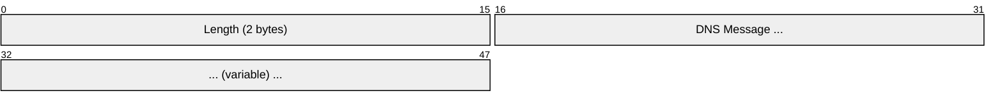
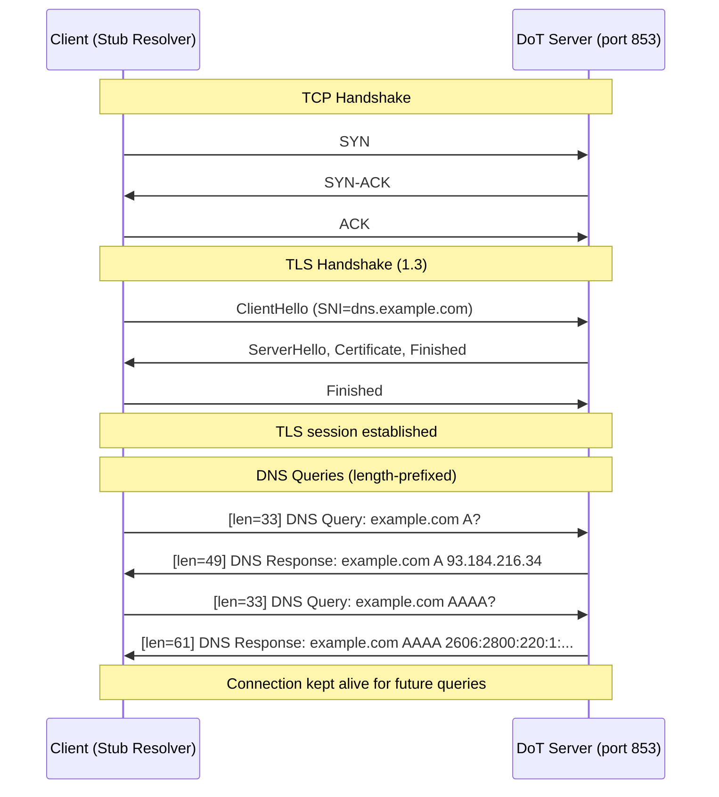
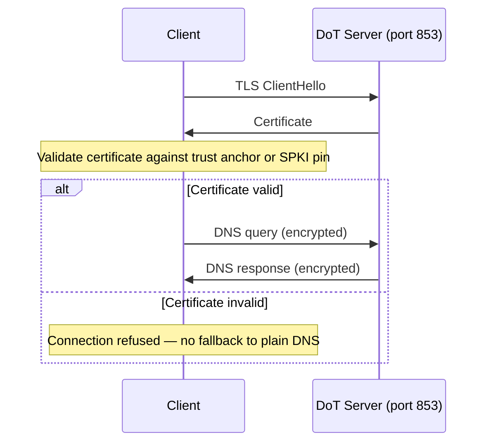
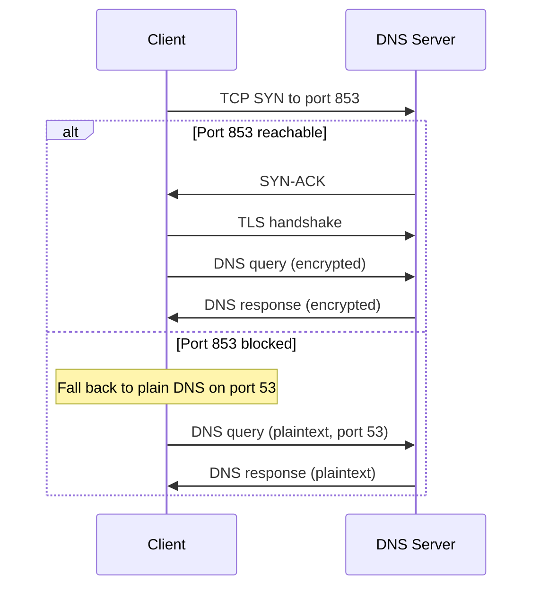
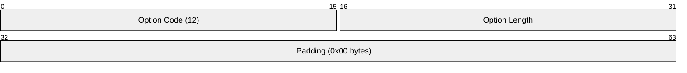
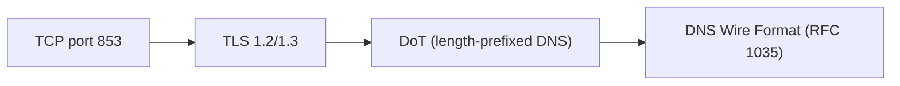

# DoT (DNS over TLS)

> **Standard:** [RFC 7858](https://www.rfc-editor.org/rfc/rfc7858) | **Layer:** Application (Layer 7) | **Wireshark filter:** `dns` (with TLS key log) or `tls && tcp.port == 853`

DNS over TLS encrypts standard DNS queries by wrapping them in a TLS connection on a dedicated port (853/tcp). Unlike plain DNS, which sends queries and responses in cleartext over UDP/TCP port 53, DoT prevents eavesdropping and tampering by network intermediaries. The DNS wire format ([RFC 1035](https://www.rfc-editor.org/rfc/rfc1035)) is preserved unchanged — each DNS message is length-prefixed and sent over the TLS stream, exactly as DNS-over-TCP works but inside a TLS tunnel. DoT was standardized before DoH and uses a dedicated port, making it straightforward to deploy but also straightforward to block.

## Message Framing

DoT uses the same TCP framing as DNS-over-TCP: a 2-byte length prefix followed by the DNS message.

| Field | Size | Description |
|-------|------|-------------|
| Length | 2 bytes | Length of the following DNS message in bytes (network byte order) |
| DNS Message | Variable | Standard DNS wire format message ([RFC 1035](https://www.rfc-editor.org/rfc/rfc1035)) |

Multiple DNS messages can be sent sequentially over the same TLS connection, each with its own length prefix.

## Connection Flow

## Key Parameters

| Parameter | Value | Description |
|-----------|-------|-------------|
| Port | 853/tcp | Dedicated well-known port for DoT |
| TLS Version | TLS 1.2 or 1.3 | TLS 1.3 preferred (1-RTT handshake) |
| DNS Format | RFC 1035 wire format | Identical to DNS-over-TCP payload |
| Framing | 2-byte length prefix | Same as DNS-over-TCP (RFC 1035 Section 4.2.2) |
| Connection reuse | Yes | Persistent TLS session for multiple queries |
| ALPN | Not required | No ALPN token defined for DoT (unlike DoH) |

## TLS Requirements

| Requirement | Description |
|-------------|-------------|
| Server Certificate | X.509 certificate for the DoT server (validates server identity) |
| Certificate Pinning | Optional SPKI (Subject Public Key Info) pinning for known resolvers |
| Session Resumption | TLS session tickets reduce reconnection overhead |
| SNI | Server Name Indication reveals the DoT server hostname |
| Minimum Version | TLS 1.2 required; TLS 1.3 recommended |

## Usage Profiles (RFC 8310)

RFC 8310 defines two usage profiles for DoT:

| Profile | Name | Description |
|---------|------|-------------|
| Strict | Strict Privacy | Client MUST authenticate the server (certificate validation, optional SPKI pin). Connection fails if authentication fails. No fallback to plain DNS. |
| Opportunistic | Opportunistic Privacy | Client attempts DoT but falls back to plain DNS if port 853 is blocked or TLS fails. May skip server authentication. |

### Strict Mode

### Opportunistic Mode

## Padding (EDNS(0) Padding)

DNS message lengths can reveal queried domain names even through TLS. The EDNS(0) Padding option (RFC 7830) adds padding to DNS messages:

| Recommendation | Query Padding | Response Padding |
|----------------|---------------|------------------|
| RFC 8467 | Pad to 128-byte blocks | Pad to 468-byte blocks |

## DoT vs DoH

| Feature | DoT | DoH |
|---------|-----|-----|
| Port | 853 (dedicated) | 443 (shared with HTTPS) |
| Detectability | Easy (distinct port) | Hard (blends with web traffic) |
| Blockability | Easy (block port 853) | Hard (requires blocking HTTPS) |
| Protocol overhead | Lower (just TLS) | Higher (TLS + HTTP/2 framing) |
| HTTP features | None | Caching, multiplexing, server push |
| Enterprise monitoring | Visible as DNS traffic | Hidden in HTTPS traffic |
| NAT/firewall traversal | May be blocked | Usually passes (port 443 open) |
| Standardization | RFC 7858 (2016) | RFC 8484 (2018) |

## Major Providers

| Provider | DoT Server | IP Address |
|----------|-----------|------------|
| Cloudflare | `cloudflare-dns.com` | 1.1.1.1, 1.0.0.1 |
| Google | `dns.google` | 8.8.8.8, 8.8.4.4 |
| Quad9 | `dns.quad9.net` | 9.9.9.9 |
| AdGuard | `dns.adguard-dns.com` | 94.140.14.14 |

## Encapsulation

## Standards

| Document | Title |
|----------|-------|
| [RFC 7858](https://www.rfc-editor.org/rfc/rfc7858) | DNS over Transport Layer Security (DNS over TLS) |
| [RFC 8310](https://www.rfc-editor.org/rfc/rfc8310) | Usage Profiles for DNS over TLS and DNS over DTLS |
| [RFC 7830](https://www.rfc-editor.org/rfc/rfc7830) | The EDNS(0) Padding Option |
| [RFC 8467](https://www.rfc-editor.org/rfc/rfc8467) | Padding Policies for Extension Mechanisms for DNS |
| [RFC 1035](https://www.rfc-editor.org/rfc/rfc1035) | Domain Names — Implementation and Specification |

## See Also

- [DNS](dns.md) — the underlying DNS protocol and wire format
- [DoH](doh.md) — DNS over HTTPS (alternative encrypted DNS transport)
- [DNSSEC](dnssec.md) — cryptographic authentication of DNS data (complementary to DoT)
- [TLS](../security/tls.md) — transport encryption layer
