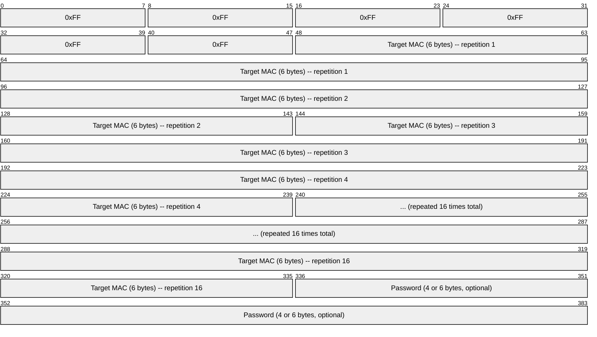
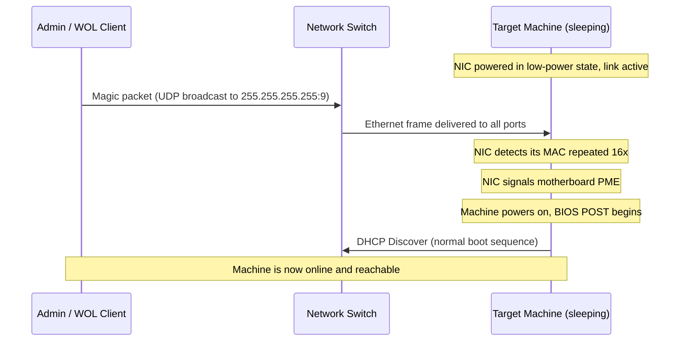
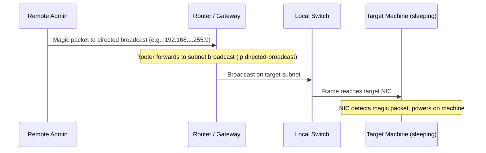
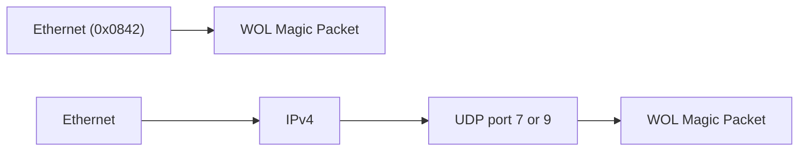

# Wake-on-LAN (WOL)

> **Standard:** AMD Magic Packet Technology (White Paper, 1995) | **Layer:** Data Link (Layer 2) / Application | **Wireshark filter:** `wol`

Wake-on-LAN (WOL) is a mechanism for remotely powering on a computer over the network by sending a specially crafted "magic packet." The target machine's network interface card (NIC) remains minimally powered in sleep, hibernate, or shutdown states, listening for its own MAC address pattern. When the NIC detects a valid magic packet, it signals the motherboard to initiate a full power-on sequence. WOL is widely used in enterprise environments for after-hours patching, remote administration, and energy-saving power management, as well as by home users for remote access to sleeping machines.

## Magic Packet

The magic packet is exactly 102 bytes: 6 bytes of `0xFF` followed by the target machine's 48-bit MAC address repeated 16 times. An optional 4-byte or 6-byte password may be appended for SecureON.

## Key Fields

| Field | Size | Description |
|-------|------|-------------|
| Synchronization stream | 6 bytes | Six bytes of `0xFF` (all ones), marks start of magic packet |
| Target MAC address | 96 bytes | Target machine's 6-byte MAC address repeated 16 times |
| SecureON password | 0, 4, or 6 bytes | Optional password for Secure Wake-on-LAN |

## Wake-on-LAN Flow

### Local Subnet Wake

### Wake-on-WAN (Across Subnets)

## Transport Methods

The magic packet can be delivered via several transport mechanisms. It only needs to arrive as a data payload -- the NIC scans every incoming frame for the pattern regardless of protocol.

| Method | Description |
|--------|-------------|
| UDP Broadcast (port 7 or 9) | Most common: sent to `255.255.255.255` or subnet broadcast on port 7 (Echo) or 9 (Discard) |
| Raw Ethernet frame | EtherType `0x0842`, no IP/UDP headers required, NIC matches at Layer 2 |
| UDP Directed Broadcast | Sent to a specific subnet's broadcast address (e.g., `10.0.1.255`) for cross-subnet wake |
| Subnet unicast | Sent to the target's last-known IP with a static ARP entry to prevent ARP failure |

## SecureON (Secure Wake-on-LAN)

Some NICs support a password that must be appended to the magic packet. The NIC stores the password in non-volatile memory and only triggers wake if the password matches.

| Feature | Standard WOL | SecureON |
|---------|-------------|----------|
| Authentication | None (any sender with MAC knowledge) | 4-byte or 6-byte password required |
| Password storage | N/A | Stored in NIC EEPROM/firmware |
| Security level | Low (MAC addresses are easily discovered) | Marginal improvement (password sent in cleartext) |
| Configuration | BIOS/UEFI + OS driver | NIC firmware utility |

## Requirements

For Wake-on-LAN to function, several conditions must be met:

| Requirement | Description |
|-------------|-------------|
| NIC support | Network adapter must support WOL (nearly all modern NICs do) |
| BIOS/UEFI setting | WOL or "Wake on PCI/PCIe" must be enabled in firmware settings |
| OS driver configuration | NIC driver must enable WOL before shutdown (e.g., `ethtool -s eth0 wol g` on Linux) |
| Standby power | NIC must receive standby power (5V SB from ATX PSU) during sleep/shutdown |
| Link state | NIC must maintain Ethernet link while system is sleeping (link LED stays on) |
| Switch port | Switch port must remain active (not disabled by spanning tree or power saving) |
| Broadcast routing | For WAN wake: routers must forward directed broadcasts (`ip directed-broadcast` on Cisco) |

## WOL vs IPMI / BMC

For enterprise servers, Intelligent Platform Management Interface (IPMI) provides a more robust out-of-band management alternative.

| Feature | Wake-on-LAN | IPMI / BMC |
|---------|-------------|------------|
| Power on | Yes | Yes |
| Power off | No | Yes (hard or graceful) |
| Power cycle | No | Yes |
| Console access | No | Yes (SOL, KVM) |
| Health monitoring | No | Yes (fans, temps, voltages) |
| BIOS/UEFI access | No | Yes (remote KVM) |
| Dedicated NIC | No (shares main NIC) | Yes (dedicated management port) |
| Authentication | None or weak password | Strong (user/pass, RAKP) |
| Cost | Free (built into NIC) | Requires BMC hardware |
| Protocol | Magic packet (Layer 2) | IPMI over LAN (UDP 623) |

## Common WOL Tools

| Tool | Platform | Description |
|------|----------|-------------|
| `etherwake` | Linux | Send magic packets from command line |
| `wakeonlan` | Linux/macOS | Perl-based WOL utility |
| `wol` | Linux | Simple command-line WOL sender |
| `wolcmd` | Windows | Command-line magic packet sender |
| PowerShell | Windows | `Send-WolPacket` or custom script using `[Net.Sockets.UdpClient]` |

## Encapsulation

The magic packet can ride directly in an Ethernet frame (EtherType `0x0842`) or inside a UDP datagram on port 7 or 9. The NIC pattern-matches the payload regardless of encapsulation.

## Standards

| Document | Title |
|----------|-------|
| [AMD Magic Packet Technology](https://www.amd.com/content/dam/amd/en/documents/archived-tech-docs/white-papers/20213.pdf) | Original AMD white paper defining the magic packet format |
| [IEEE 802.3](https://standards.ieee.org/standard/802_3-2022.html) | Ethernet standard, defines PME (Power Management Event) signaling |
| [ACPI Specification](https://uefi.org/specifications) | Advanced Configuration and Power Interface, defines system sleep states (S1-S5) |

## See Also

- [Ethernet](../link-layer/ethernet.md) -- transport layer for magic packets
- [ARP](../link-layer/arp.md) -- static ARP entries needed for unicast WOL across subnets
- [DHCP](dhcp.md) -- machine acquires IP after waking up
- [UDP](../transport-layer/udp.md) -- common transport for magic packets
