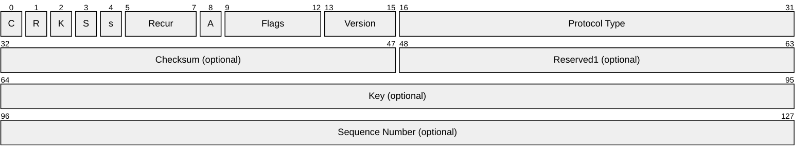
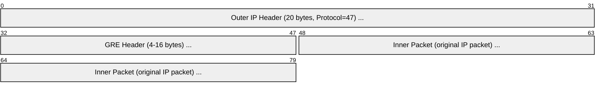

# GRE (Generic Routing Encapsulation)

> **Standard:** [RFC 2784](https://www.rfc-editor.org/rfc/rfc2784) | **Layer:** Network (Layer 3) | **Wireshark filter:** `gre`

GRE is a tunneling protocol that encapsulates a wide variety of network-layer protocols inside point-to-point virtual links. It wraps an inner packet (the payload) with a GRE header and an outer IP header, creating a tunnel between two endpoints. GRE is simple and stateless — no encryption, no authentication, no reliability by default. It is widely used for site-to-site tunnels, carrier networks (MPLS over GRE), connecting non-contiguous subnets, and as the transport for PPTP VPN. GRE is often paired with IPsec for encryption.

## Header

The minimum GRE header is 4 bytes. Optional fields add up to 12 more bytes depending on the flags.

## Key Fields

| Field | Size | Description |
|-------|------|-------------|
| C (Checksum) | 1 bit | 1 = Checksum and Reserved1 fields present |
| R (Routing) | 1 bit | Deprecated (RFC 2784); must be 0 |
| K (Key) | 1 bit | 1 = Key field present |
| S (Sequence) | 1 bit | 1 = Sequence Number field present |
| s (Strict Source) | 1 bit | Deprecated; must be 0 |
| Recur | 3 bits | Deprecated; must be 0 |
| A (Ack) | 1 bit | Enhanced GRE (RFC 2637, PPTP) |
| Flags | 4 bits | Reserved; must be 0 |
| Version | 3 bits | 0 = standard GRE, 1 = Enhanced GRE (PPTP) |
| Protocol Type | 16 bits | EtherType of the encapsulated payload |
| Checksum | 16 bits | Optional; over GRE header + payload |
| Key | 32 bits | Optional; tunnel identifier (demultiplexing) |
| Sequence Number | 32 bits | Optional; for ordering |

## Protocol Type Values

| Value | Encapsulated Protocol |
|-------|----------------------|
| 0x0800 | IPv4 |
| 0x86DD | IPv6 |
| 0x6558 | Transparent Ethernet Bridging (GRETAP) |
| 0x880B | PPP (used by PPTP) |
| 0x8847 | MPLS Unicast |

## Encapsulation

A GRE tunnel wraps the inner packet with a GRE header and new outer IP header:

### Full Stack Example

## Common Uses

| Use Case | Description |
|----------|-------------|
| Site-to-site tunnel | Connect remote networks over the Internet |
| GRE over IPsec | GRE provides multicast/multiprotocol; IPsec provides encryption |
| PPTP | GRE carries PPP for VPN (Enhanced GRE, version 1) |
| GRETAP | Tunnel Ethernet frames (bridge remote L2 segments) |
| MPLS over GRE | Carry MPLS labels across non-MPLS networks |
| ERSPAN | Cisco remote SPAN — mirror traffic via GRE |

### GRE over IPsec

GRE alone has no security. Wrapping GRE in IPsec adds encryption and authentication while preserving GRE's ability to carry multicast and non-IP protocols.

## MTU Considerations

GRE adds overhead that reduces the effective MTU:

| Component | Size |
|-----------|------|
| Outer IP header | 20 bytes |
| GRE header (minimum) | 4 bytes |
| GRE header (with key + seq) | 12 bytes |
| **Total overhead** | **24-32 bytes** |

With a 1500-byte Ethernet MTU, the inner packet MTU is typically **1476 bytes** (or less with IPsec).

## Standards

| Document | Title |
|----------|-------|
| [RFC 2784](https://www.rfc-editor.org/rfc/rfc2784) | Generic Routing Encapsulation (GRE) |
| [RFC 2890](https://www.rfc-editor.org/rfc/rfc2890) | Key and Sequence Number Extensions to GRE |
| [RFC 1701](https://www.rfc-editor.org/rfc/rfc1701) | GRE (original, partially superseded) |
| [RFC 2637](https://www.rfc-editor.org/rfc/rfc2637) | PPTP (uses Enhanced GRE) |
| [RFC 7676](https://www.rfc-editor.org/rfc/rfc7676) | IPv6 over GRE |

## See Also

- [IPv4](ip.md) — outer and inner layer; GRE is IP protocol 47
- [IPsec](ipsec.md) — commonly paired with GRE for encrypted tunnels
- [MPLS](mpls.md) — can be carried over GRE
- [PPP](../link-layer/ppp.md) — carried by GRE in PPTP
