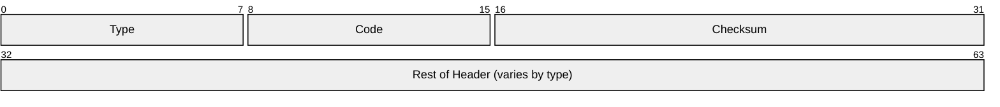
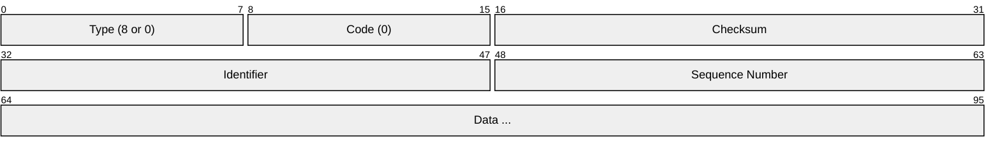
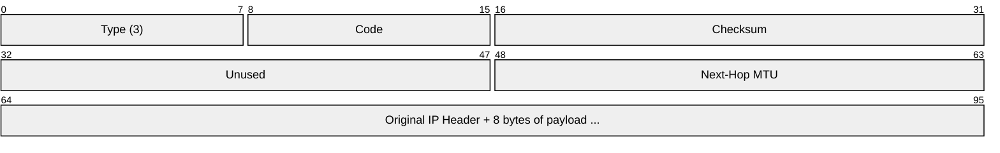
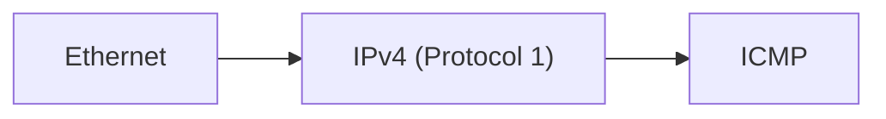

# ICMP (Internet Control Message Protocol)

> **Standard:** [RFC 792](https://www.rfc-editor.org/rfc/rfc792) | **Layer:** Network (Layer 3) | **Wireshark filter:** `icmp`

ICMP is a supporting protocol for IPv4 that carries diagnostic and error messages. It is used by network tools like `ping` and `traceroute` and by routers to report delivery problems back to the source. ICMP messages are encapsulated inside IP packets but are considered part of the network layer, not the transport layer. IPv6 has its own version: ICMPv6 ([RFC 4443](https://www.rfc-editor.org/rfc/rfc4443)).

## Header

The first 4 bytes are common to all ICMP messages. The remaining content depends on the Type and Code.

## Key Fields

| Field | Size | Description |
|-------|------|-------------|
| Type | 8 bits | ICMP message type |
| Code | 8 bits | Subtype providing additional context |
| Checksum | 16 bits | Error check over the entire ICMP message |
| Rest of Header | 32 bits | Content varies by message type |

## Field Details

### Common Types

| Type | Name | Description |
|------|------|-------------|
| 0 | Echo Reply | Response to ping |
| 3 | Destination Unreachable | Packet could not be delivered |
| 4 | Source Quench | Congestion control (deprecated) |
| 5 | Redirect | Router advises a better route |
| 8 | Echo Request | Ping request |
| 9 | Router Advertisement | Router announces its presence |
| 10 | Router Solicitation | Host asks for router info |
| 11 | Time Exceeded | TTL expired (used by traceroute) |
| 12 | Parameter Problem | Bad header field |
| 13 | Timestamp Request | Request round-trip time measurement |
| 14 | Timestamp Reply | Reply to timestamp request |

### Echo Request / Reply (Type 8 / 0)

Used by `ping`. The identifier and sequence number allow matching replies to requests.

### Destination Unreachable (Type 3)

| Code | Meaning |
|------|---------|
| 0 | Network Unreachable |
| 1 | Host Unreachable |
| 2 | Protocol Unreachable |
| 3 | Port Unreachable |
| 4 | Fragmentation Needed (DF set) |
| 5 | Source Route Failed |
| 6 | Destination Network Unknown |
| 7 | Destination Host Unknown |
| 13 | Communication Administratively Prohibited |

### Time Exceeded (Type 11)

Sent when TTL reaches zero (code 0) or fragment reassembly times out (code 1). This is how `traceroute` works — it sends packets with incrementally increasing TTL values.

| Code | Meaning |
|------|---------|
| 0 | TTL expired in transit |
| 1 | Fragment reassembly time exceeded |

## Encapsulation

## Standards

| Document | Title |
|----------|-------|
| [RFC 792](https://www.rfc-editor.org/rfc/rfc792) | Internet Control Message Protocol |
| [RFC 1122](https://www.rfc-editor.org/rfc/rfc1122) | Requirements for Internet Hosts — ICMP requirements |
| [RFC 4443](https://www.rfc-editor.org/rfc/rfc4443) | ICMPv6 for IPv6 |
| [RFC 1191](https://www.rfc-editor.org/rfc/rfc1191) | Path MTU Discovery |

## See Also

- [IPv4](ip.md)
- [IPv6](ipv6.md) — ICMPv6 replaces ICMP and ARP for IPv6
