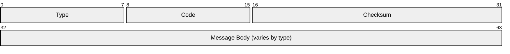
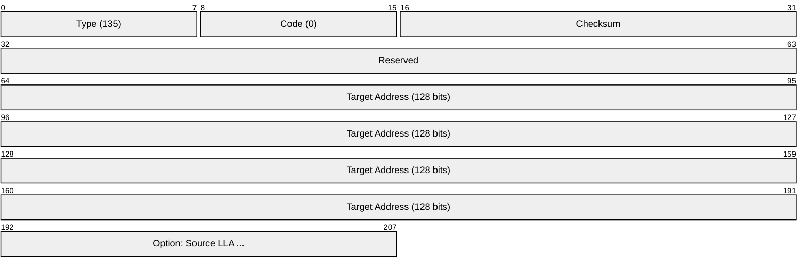
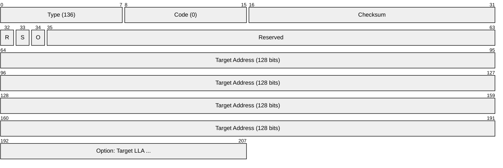
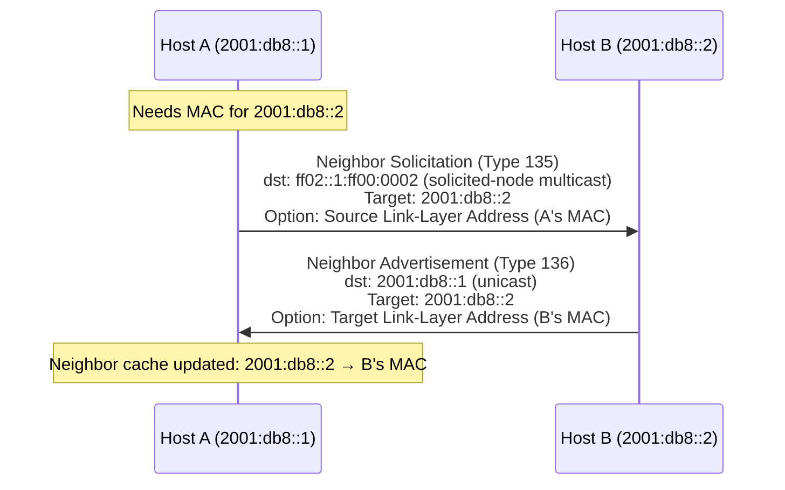
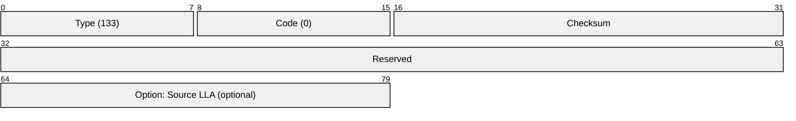
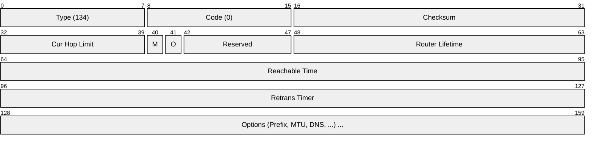
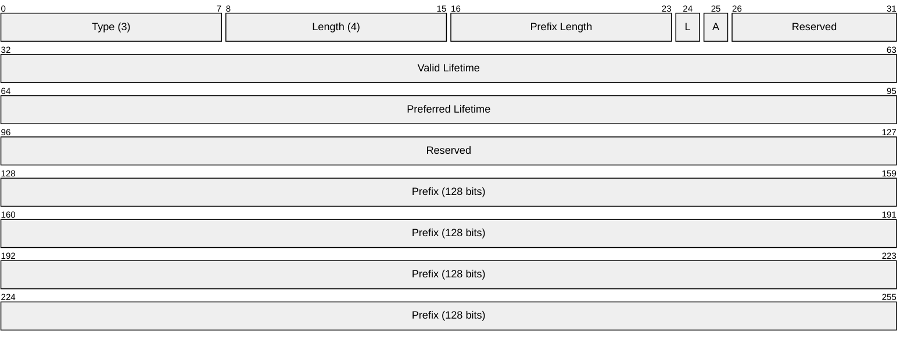
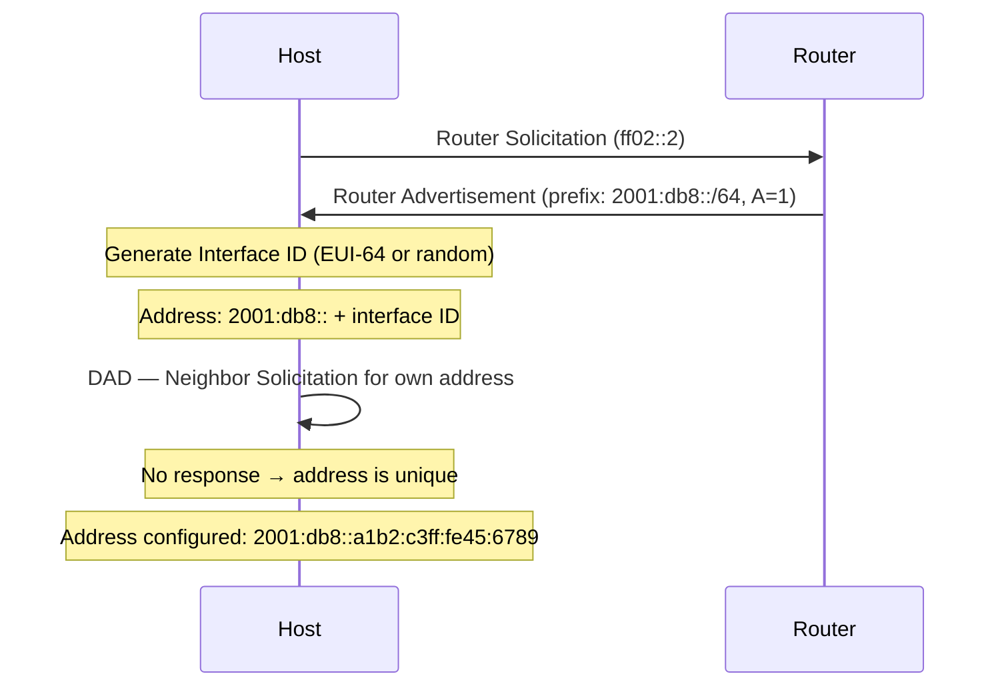
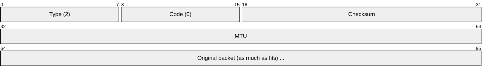
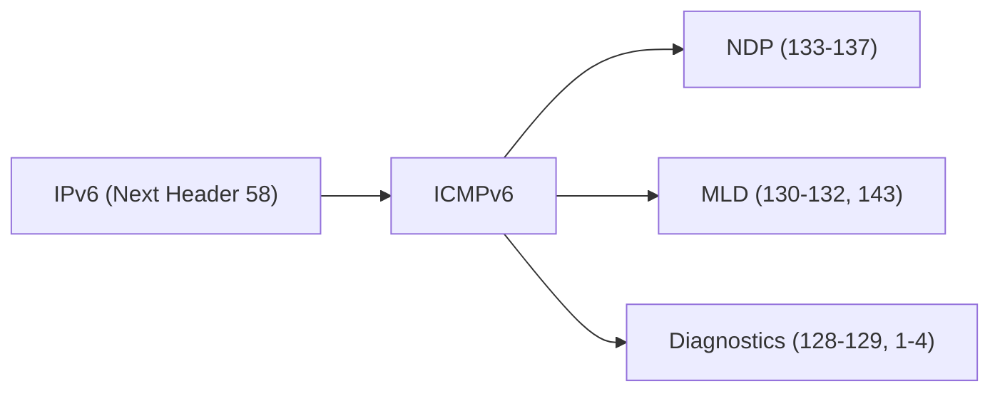

# ICMPv6 (Internet Control Message Protocol for IPv6)

> **Standard:** [RFC 4443](https://www.rfc-editor.org/rfc/rfc4443) | **Layer:** Network (Layer 3) | **Wireshark filter:** `icmpv6`

ICMPv6 is the IPv6 equivalent of ICMP, but with a significantly expanded role. Beyond basic diagnostics (ping, traceroute) and error reporting, ICMPv6 absorbs functions that were separate protocols in IPv4 — most notably ARP (replaced by Neighbor Discovery) and IGMP (replaced by Multicast Listener Discovery). ICMPv6 is mandatory for IPv6 operation; you cannot firewall it away like you sometimes can with ICMPv4.

## Header

The checksum covers a pseudo-header (source/dest IPv6 addresses, payload length, next header = 58), the ICMPv6 header, and the message body.

## Key Fields

| Field | Size | Description |
|-------|------|-------------|
| Type | 8 bits | Message type (0-127 = error, 128-255 = informational) |
| Code | 8 bits | Subtype providing context |
| Checksum | 16 bits | Over pseudo-header + ICMPv6 message |
| Message Body | Variable | Type-specific content |

## Message Types

### Error Messages (Type 0-127)

| Type | Name | Description |
|------|------|-------------|
| 1 | Destination Unreachable | Packet could not be delivered |
| 2 | Packet Too Big | MTU exceeded (path MTU discovery) |
| 3 | Time Exceeded | Hop limit reached (traceroute) |
| 4 | Parameter Problem | Malformed header field |

### Informational Messages (Type 128-255)

| Type | Name | Description |
|------|------|-------------|
| 128 | Echo Request | Ping request |
| 129 | Echo Reply | Ping reply |
| 130 | Multicast Listener Query | MLD — router asks who listens (replaces IGMP Query) |
| 131 | Multicast Listener Report | MLD — host reports group membership |
| 132 | Multicast Listener Done | MLD — host leaves multicast group |
| 133 | Router Solicitation (RS) | NDP — host asks for router info |
| 134 | Router Advertisement (RA) | NDP — router announces itself and prefixes |
| 135 | Neighbor Solicitation (NS) | NDP — resolve IPv6 → MAC (replaces ARP request) |
| 136 | Neighbor Advertisement (NA) | NDP — respond with MAC (replaces ARP reply) |
| 137 | Redirect | NDP — router redirects to a better next-hop |
| 143 | MLDv2 Report | Multicast Listener Discovery v2 |

## Neighbor Discovery Protocol (NDP)

NDP is the most critical function of ICMPv6 — it replaces ARP, ICMP Router Discovery, and ICMP Redirect from IPv4.

### Neighbor Solicitation (Type 135) — "ARP Request"

Sent to the solicited-node multicast address `ff02::1:ffXX:XXXX` (last 24 bits of the target IP).

### Neighbor Advertisement (Type 136) — "ARP Reply"

| Flag | Name | Description |
|------|------|-------------|
| R | Router | 1 = sender is a router |
| S | Solicited | 1 = response to a Neighbor Solicitation |
| O | Override | 1 = override existing neighbor cache entry |

### Address Resolution Flow (Replaces ARP)

### Router Solicitation (Type 133)

Sent by a host at boot to `ff02::2` (all-routers multicast) to request immediate Router Advertisements rather than waiting for the next periodic RA.

### Router Advertisement (Type 134)

| Flag | Name | Description |
|------|------|-------------|
| M | Managed | 1 = use DHCPv6 for address configuration |
| O | Other Config | 1 = use DHCPv6 for other info (DNS, NTP) |

### RA Options

| Type | Name | Description |
|------|------|-------------|
| 1 | Source Link-Layer Address | Router's MAC address |
| 3 | Prefix Information | Network prefix for SLAAC (address autoconfiguration) |
| 5 | MTU | Link MTU |
| 25 | RDNSS | Recursive DNS Server addresses (RFC 8106) |
| 31 | DNSSL | DNS Search List (RFC 8106) |

### Prefix Information Option (Type 3)

| Flag | Name | Description |
|------|------|-------------|
| L | On-Link | 1 = prefix is on-link (hosts can communicate directly) |
| A | Autonomous | 1 = hosts can use this prefix for SLAAC |

### SLAAC (Stateless Address Autoconfiguration)

### Duplicate Address Detection (DAD)

Before using a new IPv6 address, the host sends a Neighbor Solicitation for its own address with source `::` (unspecified). If no Neighbor Advertisement comes back, the address is unique.

## Destination Unreachable (Type 1)

| Code | Meaning |
|------|---------|
| 0 | No route to destination |
| 1 | Communication administratively prohibited |
| 2 | Beyond scope of source address |
| 3 | Address unreachable |
| 4 | Port unreachable |
| 5 | Source address failed ingress/egress policy |
| 6 | Reject route to destination |

## Packet Too Big (Type 2)

IPv6 does **not** allow routers to fragment packets. If a packet exceeds the link MTU, the router drops it and sends a Packet Too Big message with the MTU value. The source then adjusts its packet size. This is Path MTU Discovery — it's mandatory in IPv6.

## Multicast Listener Discovery (MLD)

MLD replaces IGMP for IPv6 multicast management:

| ICMPv6 Type | MLD Equivalent | IGMP Equivalent |
|-------------|---------------|-----------------|
| 130 | Multicast Listener Query | IGMP Membership Query |
| 131 | Multicast Listener Report (v1) | IGMP Membership Report |
| 132 | Multicast Listener Done | IGMP Leave Group |
| 143 | MLDv2 Report | IGMPv3 Report |

## ICMPv6 vs ICMPv4

| Function | IPv4 | IPv6 |
|----------|------|------|
| Ping | ICMP Echo (type 8/0) | ICMPv6 Echo (type 128/129) |
| Traceroute | ICMP Time Exceeded (type 11) | ICMPv6 Time Exceeded (type 3) |
| Path MTU | ICMP Fragmentation Needed (type 3/4) | ICMPv6 Packet Too Big (type 2) |
| Address resolution | ARP (separate protocol) | NDP Neighbor Solicitation/Advertisement (ICMPv6 135/136) |
| Router discovery | ICMP Router Solicitation/Advertisement | NDP RS/RA (ICMPv6 133/134) |
| Redirect | ICMP Redirect (type 5) | ICMPv6 Redirect (type 137) |
| Multicast membership | IGMP (separate protocol) | MLD (ICMPv6 130-132, 143) |
| Duplicate address detection | Gratuitous ARP | NDP DAD (ICMPv6 135 with :: source) |

## Key Multicast Addresses

| Address | Scope | Purpose |
|---------|-------|---------|
| `ff02::1` | Link-local | All nodes |
| `ff02::2` | Link-local | All routers |
| `ff02::1:ffXX:XXXX` | Link-local | Solicited-node (NDP target lookup) |
| `ff02::16` | Link-local | MLDv2 reports |
| `ff02::1:2` | Link-local | DHCPv6 servers and relay agents |

## Encapsulation

## Standards

| Document | Title |
|----------|-------|
| [RFC 4443](https://www.rfc-editor.org/rfc/rfc4443) | ICMPv6 |
| [RFC 4861](https://www.rfc-editor.org/rfc/rfc4861) | Neighbor Discovery for IPv6 (NDP) |
| [RFC 4862](https://www.rfc-editor.org/rfc/rfc4862) | IPv6 Stateless Address Autoconfiguration (SLAAC) |
| [RFC 3810](https://www.rfc-editor.org/rfc/rfc3810) | Multicast Listener Discovery Version 2 (MLDv2) |
| [RFC 8106](https://www.rfc-editor.org/rfc/rfc8106) | IPv6 RA Options for DNS (RDNSS, DNSSL) |
| [RFC 7559](https://www.rfc-editor.org/rfc/rfc7559) | Packet-Too-Big Message for IPv6 (PMTUD) |
| [RFC 3971](https://www.rfc-editor.org/rfc/rfc3971) | SEcure Neighbor Discovery (SEND) |

## See Also

- [IPv6](ipv6.md) — ICMPv6 is mandatory for IPv6 operation
- [ICMP](icmp.md) — IPv4 equivalent (much simpler scope)
- [ARP](../link-layer/arp.md) — IPv4 address resolution (replaced by NDP in IPv6)
- [IGMP](igmp.md) — IPv4 multicast management (replaced by MLD in IPv6)
- [Ethernet](../link-layer/ethernet.md) — link-layer addresses resolved by NDP
