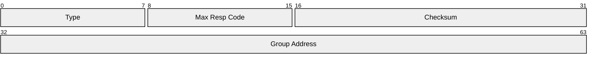
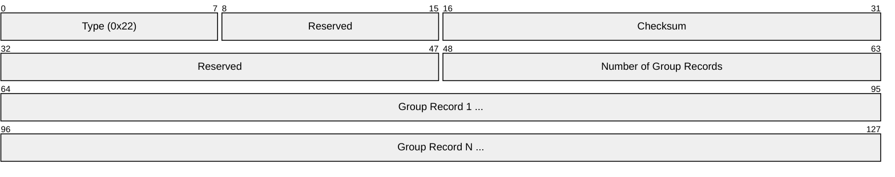
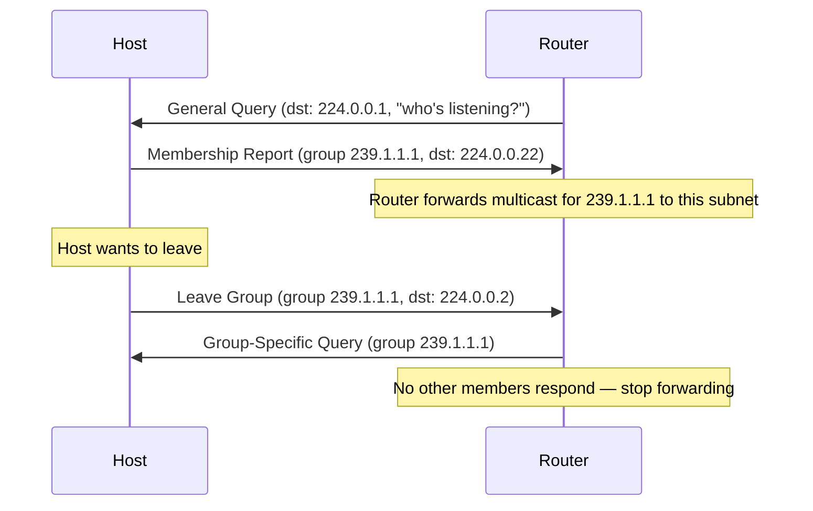
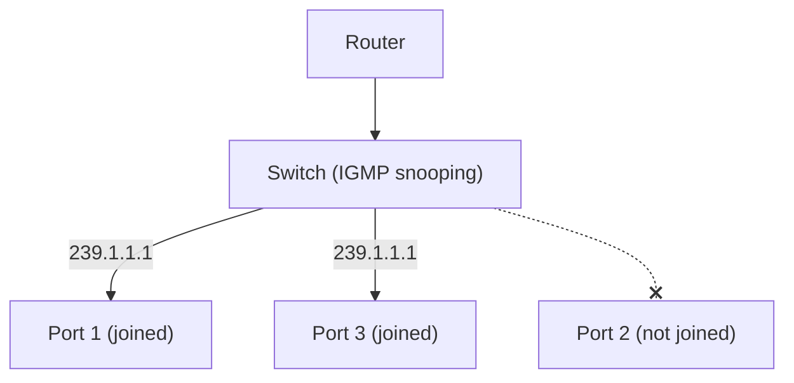
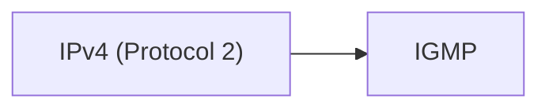

# IGMP (Internet Group Management Protocol)

> **Standard:** [RFC 3376](https://www.rfc-editor.org/rfc/rfc3376) (IGMPv3) | **Layer:** Network (Layer 3) | **Wireshark filter:** `igmp`

IGMP manages multicast group membership between hosts and their local router. When a host wants to receive multicast traffic (e.g., IPTV, live streaming, stock feeds), it sends an IGMP report to join the multicast group. The local router uses this to decide which multicast streams to forward to the local subnet. IGMP operates between hosts and their first-hop router only — multicast routing between routers uses PIM.

## IGMPv3 Message

## Message Types

| Type | Name | Direction | Description |
|------|------|-----------|-------------|
| 0x11 | Membership Query | Router → Hosts | Ask which groups hosts are subscribed to |
| 0x16 | Membership Report (v2) | Host → Router | Report group membership |
| 0x22 | Membership Report (v3) | Host → Router | Report with source filtering |
| 0x17 | Leave Group (v2) | Host → Router | Leave a multicast group |

## IGMPv3 Report

### Group Record

| Field | Size | Description |
|-------|------|-------------|
| Record Type | 8 bits | MODE_IS_INCLUDE, MODE_IS_EXCLUDE, etc. |
| Aux Data Len | 8 bits | Length of auxiliary data (usually 0) |
| Number of Sources | 16 bits | Source addresses for source-specific multicast |
| Multicast Address | 32 bits | Group being joined/left |
| Source Addresses | 32 bits each | Sources to include or exclude |

## Join/Leave Flow

## IGMP Snooping

Layer 2 switches examine IGMP messages to learn which ports need multicast traffic, preventing unnecessary flooding to all ports:

## Multicast Address Ranges

| Range | Scope | Description |
|-------|-------|-------------|
| 224.0.0.0/24 | Link-local | IGMP, OSPF, VRRP (not forwarded by routers) |
| 224.0.0.1 | Link-local | All hosts |
| 224.0.0.2 | Link-local | All routers |
| 224.0.0.22 | Link-local | IGMPv3 reports |
| 224.0.1.0/24 | Internetwork | NTP, SLP, etc. |
| 239.0.0.0/8 | Administratively scoped | Private multicast (like RFC 1918 for unicast) |

## Encapsulation

IGMP is carried directly in IP packets with protocol number 2 and TTL=1.

## Standards

| Document | Title |
|----------|-------|
| [RFC 3376](https://www.rfc-editor.org/rfc/rfc3376) | IGMPv3 |
| [RFC 2236](https://www.rfc-editor.org/rfc/rfc2236) | IGMPv2 |
| [RFC 4541](https://www.rfc-editor.org/rfc/rfc4541) | IGMP and MLD Snooping Considerations |

## See Also

- [IPv4](ip.md) — IGMP is an IPv4 protocol
- [OSPF](ospf.md) — uses multicast 224.0.0.5/6
- [VRRP](vrrp.md) — uses multicast 224.0.0.18
