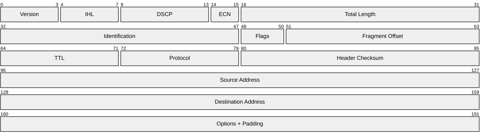
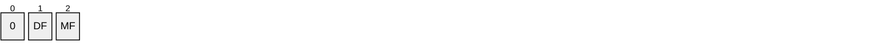
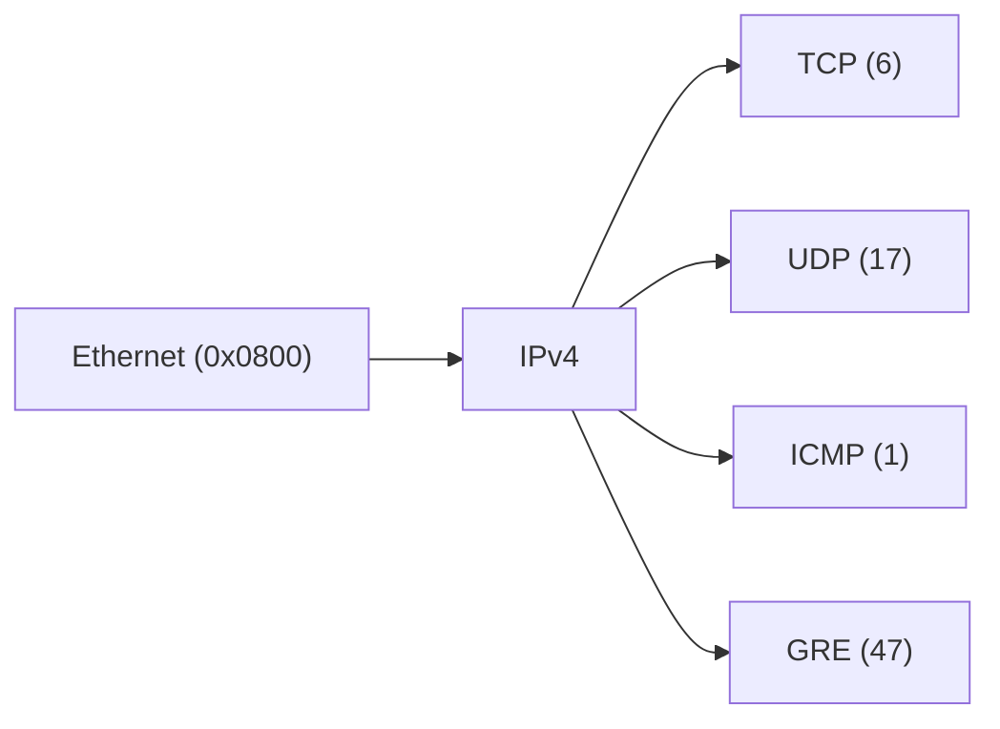

# IPv4 (Internet Protocol version 4)

> **Standard:** [RFC 791](https://www.rfc-editor.org/rfc/rfc791) | **Layer:** Network (Layer 3) | **Wireshark filter:** `ip`

IP is the principal communications protocol for relaying datagrams across network boundaries. It provides logical addressing and routing, allowing packets to traverse heterogeneous networks to reach a destination identified by a unique IP address. IPv4 uses 32-bit addresses and is the foundation of the modern Internet.

## Header

## Key Fields

| Field | Size | Description |
|-------|------|-------------|
| Version | 4 bits | IP version; always `4` for IPv4 |
| IHL | 4 bits | Internet Header Length in 32-bit words (min 5 = 20 bytes) |
| DSCP | 6 bits | Differentiated Services Code Point (QoS) |
| ECN | 2 bits | Explicit Congestion Notification |
| Total Length | 16 bits | Entire packet size in bytes (header + payload), max 65535 |
| Identification | 16 bits | Unique ID for reassembling fragmented datagrams |
| Flags | 3 bits | Fragmentation control flags |
| Fragment Offset | 13 bits | Position of fragment in original datagram (in 8-byte units) |
| TTL | 8 bits | Hop limit; decremented by each router, packet discarded at 0 |
| Protocol | 8 bits | Upper-layer protocol identifier |
| Header Checksum | 16 bits | Error check of the header only (recomputed at each hop) |
| Source Address | 32 bits | Sender's IPv4 address |
| Destination Address | 32 bits | Recipient's IPv4 address |
| Options | Variable | Optional; rarely used in practice |

## Field Details

### DSCP / ECN (formerly Type of Service)

The original ToS byte was redefined by [RFC 2474](https://www.rfc-editor.org/rfc/rfc2474) (DSCP) and [RFC 3168](https://www.rfc-editor.org/rfc/rfc3168) (ECN):

Legacy ToS Precedence values (bits 0-2 of original ToS):

| Value | Meaning |
|-------|---------|
| 111 | Network Control |
| 110 | Internetwork Control |
| 101 | CRITIC/ECP |
| 100 | Flash Override |
| 011 | Flash |
| 010 | Immediate |
| 001 | Priority |
| 000 | Routine |

### Flags

| Bit | Name | Description |
|-----|------|-------------|
| 0 | Reserved | Must be zero |
| 1 | DF | Don't Fragment — 0 = may fragment, 1 = don't fragment |
| 2 | MF | More Fragments — 0 = last fragment, 1 = more fragments follow |

### Protocol

Identifies the upper-layer protocol encapsulated in the payload. Assigned by [IANA](https://www.iana.org/assignments/protocol-numbers).

| Value | Protocol |
|-------|----------|
| 1 | [ICMP](icmp.md) |
| 2 | IGMP |
| 6 | [TCP](../transport-layer/tcp.md) |
| 17 | [UDP](../transport-layer/udp.md) |
| 41 | IPv6 encapsulation |
| 47 | GRE |
| 50 | ESP (IPsec) |
| 51 | AH (IPsec) |
| 89 | OSPF |
| 132 | SCTP |

### IP Addressing

IPv4 uses 32-bit addresses written in dotted-decimal notation (e.g., `192.168.1.1`).

| Range | Purpose |
|-------|---------|
| 10.0.0.0/8 | Private (RFC 1918) |
| 172.16.0.0/12 | Private (RFC 1918) |
| 192.168.0.0/16 | Private (RFC 1918) |
| 127.0.0.0/8 | Loopback |
| 169.254.0.0/16 | Link-local |
| 224.0.0.0/4 | Multicast |
| 255.255.255.255 | Broadcast |

## Encapsulation

## Standards

| Document | Title |
|----------|-------|
| [RFC 791](https://www.rfc-editor.org/rfc/rfc791) | Internet Protocol — primary specification |
| [RFC 1918](https://www.rfc-editor.org/rfc/rfc1918) | Address Allocation for Private Internets |
| [RFC 2474](https://www.rfc-editor.org/rfc/rfc2474) | Definition of the Differentiated Services Field (DSCP) |
| [RFC 3168](https://www.rfc-editor.org/rfc/rfc3168) | The Addition of Explicit Congestion Notification (ECN) to IP |
| [RFC 8200](https://www.rfc-editor.org/rfc/rfc8200) | Internet Protocol, Version 6 (IPv6) Specification |

## See Also

- [IPv6](ipv6.md)
- [ICMP](icmp.md)
- [TCP](../transport-layer/tcp.md)
- [UDP](../transport-layer/udp.md)
- [Ethernet](../link-layer/ethernet.md)
