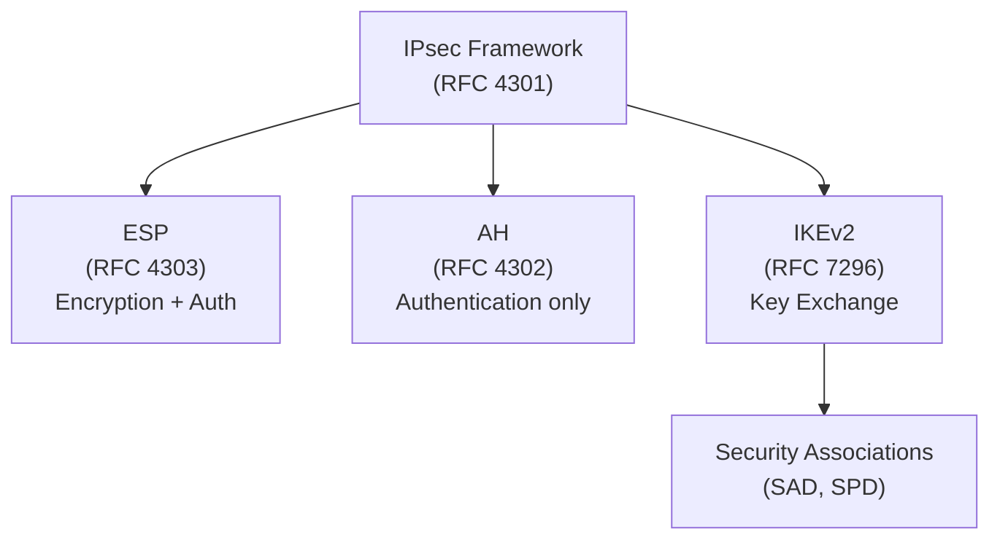
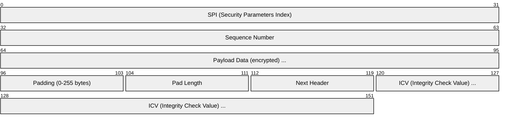
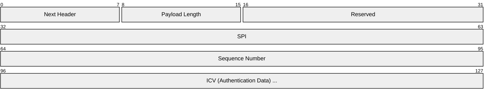
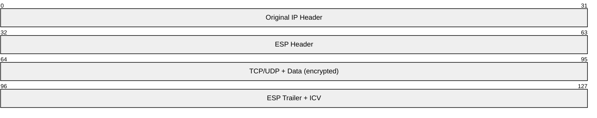
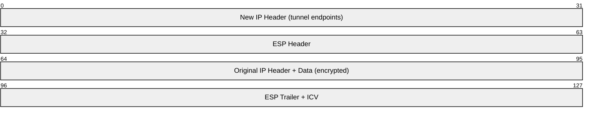
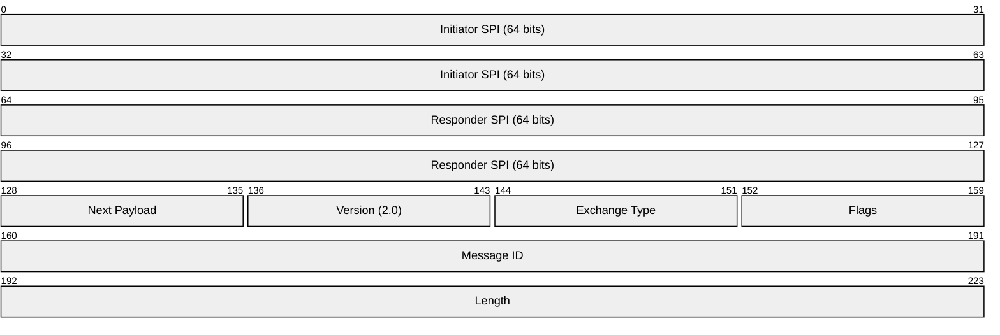
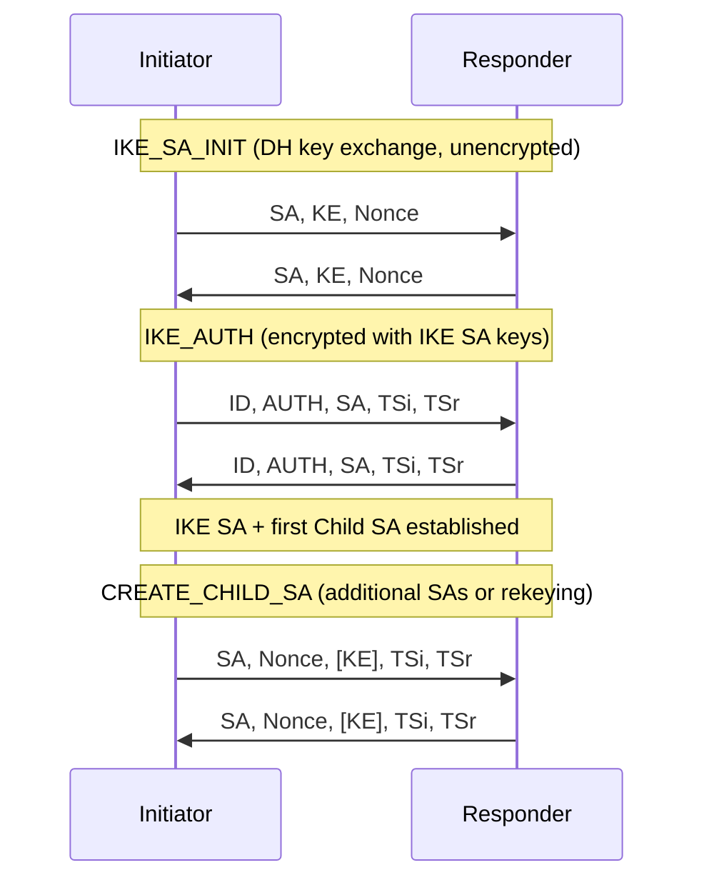
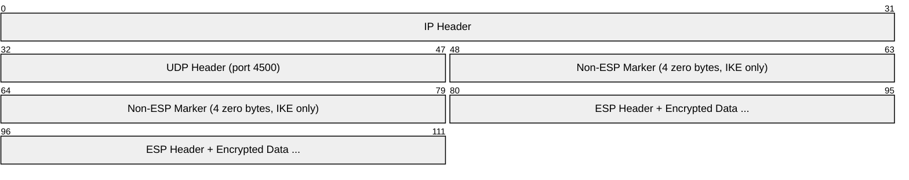
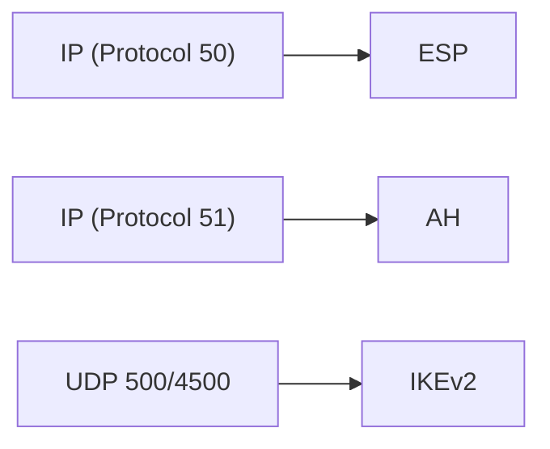

# IPsec (Internet Protocol Security)

> **Standard:** [RFC 4301](https://www.rfc-editor.org/rfc/rfc4301) | **Layer:** Network (Layer 3) | **Wireshark filter:** `esp` or `ah` or `isakmp`

IPsec is a suite of protocols that provides encryption, authentication, and integrity for IP packets. It operates at the network layer, transparently protecting all traffic between two endpoints without changes to applications. IPsec is the foundation of site-to-site VPNs, remote access VPNs, and host-to-host encryption. It consists of two transport protocols (ESP and AH), a key exchange protocol (IKE), and a Security Association database.

## Components

## ESP Header (Encapsulating Security Payload)

ESP is the primary IPsec protocol — it provides both encryption and authentication:

| Field | Size | Description |
|-------|------|-------------|
| SPI | 32 bits | Identifies the Security Association (SA) |
| Sequence Number | 32 bits | Anti-replay protection (monotonically increasing) |
| Payload Data | Variable | Encrypted original packet (or transport header + data) |
| Padding | 0-255 bytes | Aligns to block cipher boundary |
| Pad Length | 8 bits | Number of padding bytes |
| Next Header | 8 bits | Protocol of the encrypted payload (TCP=6, UDP=17, etc.) |
| ICV | Variable | Integrity check (HMAC or AEAD tag, typically 12-16 bytes) |

The SPI + Sequence Number (8 bytes) are not encrypted. Everything from Payload Data through Next Header is encrypted. The ICV covers everything from SPI through Next Header.

## AH Header (Authentication Header)

AH provides authentication and integrity but **no encryption** (rarely used today):

## Modes

### Transport Mode

Encrypts only the payload — the original IP header is preserved:

Used for: host-to-host encryption, L2TP/IPsec VPN.

### Tunnel Mode

Encrypts the entire original packet and wraps it with a new IP header:

Used for: site-to-site VPN, remote access VPN.

## IKEv2 (Internet Key Exchange)

IKE negotiates Security Associations and manages keys. IKEv2 uses UDP port 500 (or 4500 for NAT traversal):

### IKEv2 Header

### IKEv2 Exchanges

### Exchange Types

| Type | Name | Description |
|------|------|-------------|
| 34 | IKE_SA_INIT | Negotiate IKE SA parameters and DH exchange |
| 35 | IKE_AUTH | Authenticate and create first Child SA |
| 36 | CREATE_CHILD_SA | Create additional SAs or rekey |
| 37 | INFORMATIONAL | Delete SAs, notify errors, keepalive |

## Security Association (SA)

An SA is a unidirectional agreement defining:

| Parameter | Description |
|-----------|-------------|
| SPI | Unique identifier for this SA |
| Protocol | ESP or AH |
| Encryption algorithm | AES-CBC, AES-GCM, ChaCha20-Poly1305, etc. |
| Integrity algorithm | HMAC-SHA256, HMAC-SHA384, or AEAD implicit |
| Key material | Encryption and authentication keys |
| Lifetime | Time or byte limit before rekeying |
| Mode | Transport or Tunnel |
| Traffic selectors | Which traffic this SA protects (IP ranges, ports) |

## Common Algorithms

| Category | Algorithms |
|----------|-----------|
| Encryption | AES-128-GCM (preferred), AES-256-GCM, AES-CBC, ChaCha20-Poly1305 |
| Integrity | SHA-256, SHA-384, SHA-512 (or implicit with AEAD) |
| DH Groups | Group 14 (2048-bit MODP), Group 19 (256-bit ECP), Group 20 (384-bit ECP) |
| Authentication | RSA signatures, ECDSA, PSK (pre-shared key), EAP |

## NAT Traversal (NAT-T)

When NAT is detected (via NAT_DETECTION_SOURCE_IP/DESTINATION_IP payloads), IKE switches from UDP 500 to **UDP 4500**, and ESP packets are encapsulated in UDP:

## Encapsulation

## Standards

| Document | Title |
|----------|-------|
| [RFC 4301](https://www.rfc-editor.org/rfc/rfc4301) | Security Architecture for IP |
| [RFC 4303](https://www.rfc-editor.org/rfc/rfc4303) | IP Encapsulating Security Payload (ESP) |
| [RFC 4302](https://www.rfc-editor.org/rfc/rfc4302) | IP Authentication Header (AH) |
| [RFC 7296](https://www.rfc-editor.org/rfc/rfc7296) | Internet Key Exchange Protocol Version 2 (IKEv2) |
| [RFC 3948](https://www.rfc-editor.org/rfc/rfc3948) | UDP Encapsulation of IPsec ESP Packets (NAT-T) |
| [RFC 7383](https://www.rfc-editor.org/rfc/rfc7383) | IKEv2 Message Fragmentation |

## See Also

- [IPv4](ip.md) — IPsec protects IP traffic (protocol 50/51)
- [GRE](gre.md) — commonly paired with IPsec for multiprotocol VPN
- [TLS](../security/tls.md) — application-layer alternative to IPsec
- [UDP](../transport-layer/udp.md) — IKE and NAT-T use UDP
