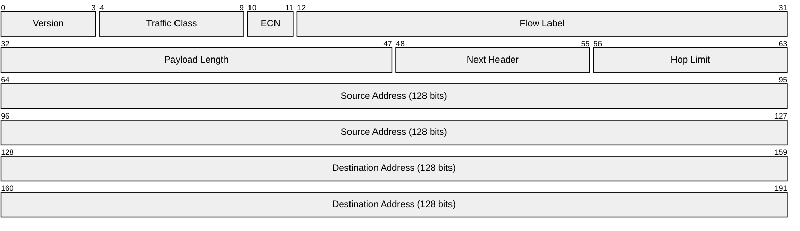
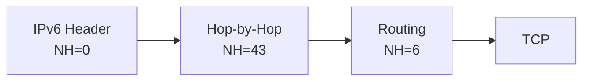
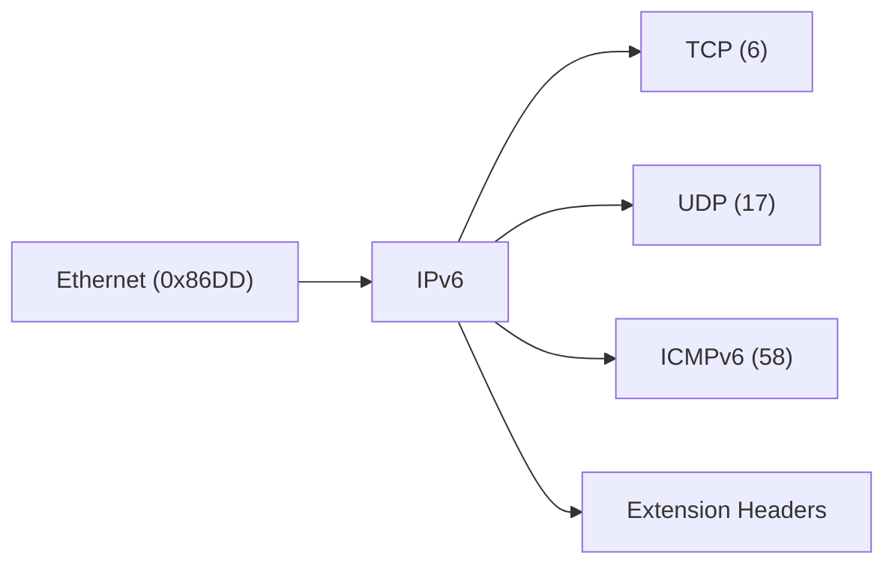

# IPv6 (Internet Protocol version 6)

> **Standard:** [RFC 8200](https://www.rfc-editor.org/rfc/rfc8200) | **Layer:** Network (Layer 3) | **Wireshark filter:** `ipv6`

IPv6 is the successor to IPv4, designed to address the exhaustion of the 32-bit IPv4 address space. It uses 128-bit addresses, providing approximately 3.4 x 10^38 unique addresses. IPv6 simplifies the header format compared to IPv4 (removing the checksum, options, and fragmentation fields from the base header), supports mandatory IPsec, and introduces extension headers for optional features.

## Header

The fixed header is always 40 bytes (320 bits), with no variable-length options — a deliberate simplification over IPv4.

## Key Fields

| Field | Size | Description |
|-------|------|-------------|
| Version | 4 bits | IP version; always `6` |
| Traffic Class | 6 bits | Differentiated Services (DSCP) for QoS |
| ECN | 2 bits | Explicit Congestion Notification |
| Flow Label | 20 bits | Identifies a flow for special handling by routers |
| Payload Length | 16 bits | Size of the payload in bytes (excludes the 40-byte header) |
| Next Header | 8 bits | Identifies the type of the next header (extension or upper-layer) |
| Hop Limit | 8 bits | Equivalent to IPv4 TTL; decremented at each hop |
| Source Address | 128 bits | Sender's IPv6 address |
| Destination Address | 128 bits | Recipient's IPv6 address |

## Field Details

### Next Header

Uses the same values as IPv4's Protocol field ([IANA registry](https://www.iana.org/assignments/protocol-numbers)), plus extension header types:

| Value | Header Type |
|-------|-------------|
| 0 | Hop-by-Hop Options |
| 6 | [TCP](../transport-layer/tcp.md) |
| 17 | [UDP](../transport-layer/udp.md) |
| 43 | Routing |
| 44 | Fragment |
| 50 | ESP (IPsec) |
| 51 | AH (IPsec) |
| 58 | ICMPv6 |
| 59 | No Next Header |
| 60 | Destination Options |
| 135 | Mobility |

### Extension Headers

IPv6 replaces IPv4's variable-length options with a chain of extension headers. Each header contains a Next Header field pointing to the next one:

Recommended processing order per [RFC 8200](https://www.rfc-editor.org/rfc/rfc8200):

1. Hop-by-Hop Options (examined by every node)
2. Destination Options (for first destination)
3. Routing
4. Fragment
5. Authentication (AH)
6. Encapsulating Security Payload (ESP)
7. Destination Options (for final destination)
8. Upper-layer header (TCP, UDP, ICMPv6, etc.)

### IPv6 Addressing

128-bit addresses written in colon-separated hexadecimal (e.g., `2001:0db8:85a3::8a2e:0370:7334`).

| Prefix | Purpose |
|--------|---------|
| `::1/128` | Loopback |
| `::/0` | Default route |
| `fe80::/10` | Link-local |
| `fc00::/7` | Unique local (ULA) |
| `2000::/3` | Global unicast |
| `ff00::/8` | Multicast |

### Key Differences from IPv4

| Feature | IPv4 | IPv6 |
|---------|------|------|
| Address size | 32 bits | 128 bits |
| Header size | 20-60 bytes (variable) | 40 bytes (fixed) |
| Header checksum | Yes | No (removed, relies on link-layer and transport) |
| Fragmentation | Routers and sender | Sender only (via extension header) |
| ARP | Yes | No (replaced by NDP/ICMPv6) |
| Broadcast | Yes | No (replaced by multicast) |
| IPsec | Optional | Mandatory support |

## Encapsulation

## Standards

| Document | Title |
|----------|-------|
| [RFC 8200](https://www.rfc-editor.org/rfc/rfc8200) | Internet Protocol, Version 6 (IPv6) Specification |
| [RFC 4291](https://www.rfc-editor.org/rfc/rfc4291) | IP Version 6 Addressing Architecture |
| [RFC 4443](https://www.rfc-editor.org/rfc/rfc4443) | ICMPv6 for IPv6 |
| [RFC 4861](https://www.rfc-editor.org/rfc/rfc4861) | Neighbor Discovery for IPv6 (NDP) |
| [RFC 4862](https://www.rfc-editor.org/rfc/rfc4862) | IPv6 Stateless Address Autoconfiguration (SLAAC) |
| [RFC 3587](https://www.rfc-editor.org/rfc/rfc3587) | IPv6 Global Unicast Address Format |

## See Also

- [IPv4](ip.md)
- [TCP](../transport-layer/tcp.md)
- [UDP](../transport-layer/udp.md)
- [Ethernet](../link-layer/ethernet.md)
