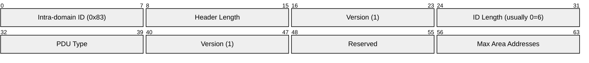
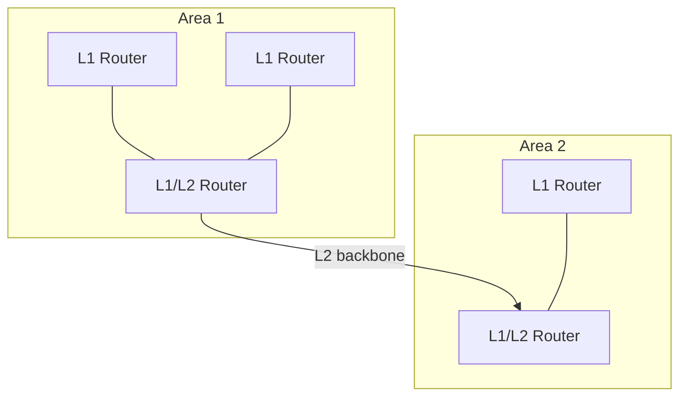
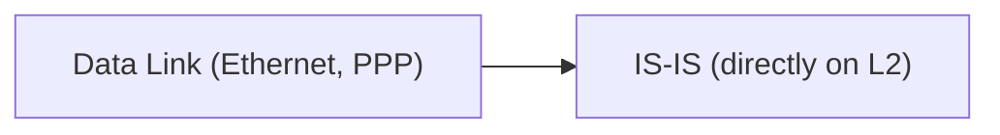

# IS-IS (Intermediate System to Intermediate System)

> **Standard:** [ISO 10589](https://www.iso.org/standard/30932.html) / [RFC 5308](https://www.rfc-editor.org/rfc/rfc5308) | **Layer:** Network (Layer 3) | **Wireshark filter:** `isis`

IS-IS is a link-state interior gateway routing protocol that runs directly over the data link layer (not over IP). Originally designed for OSI networking (CLNP), it was extended to support IPv4 and IPv6 and is now one of the two dominant IGPs alongside OSPF. IS-IS is the preferred IGP for large service provider and data center networks due to its protocol-agnostic design, fast convergence, and efficient flooding. It is the routing protocol of choice for MPLS and Segment Routing deployments.

## PDU Types

| Type | Name | Description |
|------|------|-------------|
| 15 | L1 LAN Hello | Level 1 hello on broadcast networks |
| 16 | L2 LAN Hello | Level 2 hello on broadcast networks |
| 17 | P2P Hello | Hello on point-to-point links |
| 18 | L1 LSP | Level 1 Link State PDU |
| 20 | L2 LSP | Level 2 Link State PDU |
| 24 | L1 CSNP | Level 1 Complete Sequence Numbers PDU |
| 25 | L2 CSNP | Level 2 Complete Sequence Numbers PDU |
| 26 | L1 PSNP | Level 1 Partial Sequence Numbers PDU |
| 27 | L2 PSNP | Level 2 Partial Sequence Numbers PDU |

## Common Header



## Key Concepts

### Hierarchy — Levels

| Level | Scope | Equivalent |
|-------|-------|------------|
| Level 1 (L1) | Intra-area routing | OSPF intra-area |
| Level 2 (L2) | Inter-area (backbone) routing | OSPF backbone (area 0) |
| L1/L2 | Routes between levels (like OSPF ABR) | Area Border Router |



### NET (Network Entity Title)

IS-IS uses a CLNP-style address called a NET:

```
49.0001.1921.6800.1001.00
```

| Component | Value | Description |
|-----------|-------|-------------|
| AFI | 49 | Private addressing (most common) |
| Area ID | 0001 | IS-IS area identifier |
| System ID | 1921.6800.1001 | Unique per router (often derived from loopback IP) |
| SEL | 00 | NSAP selector (always 00 for IS-IS) |

## IS-IS vs OSPF

| Feature | IS-IS | OSPF |
|---------|-------|------|
| Runs on | Directly over L2 (no IP needed) | Over IP (protocol 89) |
| Addressing | NET / NSAP | IP-based (router ID) |
| Levels/Areas | L1 (area) / L2 (backbone) | Area 0 backbone + numbered areas |
| Multi-protocol | Native (IPv4, IPv6, MPLS via TLVs) | Separate: OSPFv2 (IPv4), OSPFv3 (IPv6) |
| LSA/LSP size | Up to 1492 bytes | Up to ~65535 bytes |
| Extension mechanism | TLVs (easy to extend) | LSA types (more rigid) |
| Provider preference | Dominant in SP networks | Common in enterprise |
| Segment Routing | Native TLV support | Supported but IS-IS more common |

## TLV (Type-Length-Value) Extensions

IS-IS is extended via TLVs — adding new capabilities without changing the core protocol:

| TLV | Name | Description |
|-----|------|-------------|
| 2 | IS Neighbors | Adjacencies to other IS-IS routers |
| 128 | IP Internal Reachability | IPv4 prefixes (old format) |
| 130 | IP External Reachability | External IPv4 prefixes |
| 135 | Extended IP Reachability | IPv4 prefixes with TE metrics (wide metrics) |
| 137 | Dynamic Hostname | Hostname mapping for router |
| 236 | IPv6 Reachability | IPv6 prefixes |
| 22 | Extended IS Reachability | Adjacencies with TE metrics |

## Encapsulation



IS-IS does **not** run over IP. It runs directly over the data link layer using:
- EtherType `0xFE` (ISO/LLC/SNAP encapsulation on Ethernet)
- Multicast MACs: `0180.C200.0014` (L1) and `0180.C200.0015` (L2)

## Standards

| Document | Title |
|----------|-------|
| [ISO 10589](https://www.iso.org/standard/30932.html) | IS-IS for intra-domain routing (original) |
| [RFC 1195](https://www.rfc-editor.org/rfc/rfc1195) | Use of IS-IS for routing in TCP/IP and dual environments |
| [RFC 5305](https://www.rfc-editor.org/rfc/rfc5305) | IS-IS Extensions for Traffic Engineering |
| [RFC 5308](https://www.rfc-editor.org/rfc/rfc5308) | Routing IPv6 with IS-IS |
| [RFC 8667](https://www.rfc-editor.org/rfc/rfc8667) | IS-IS Extensions for Segment Routing |

## See Also

- [OSPF](ospf.md) — alternative link-state IGP
- [BGP](../routing/bgp.md) — used alongside IS-IS for inter-AS routing
- [MPLS](mpls.md) — IS-IS commonly drives MPLS label distribution
- [Ethernet](../link-layer/ethernet.md) — IS-IS runs directly on Ethernet
