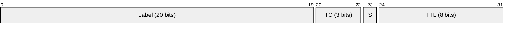
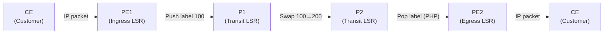
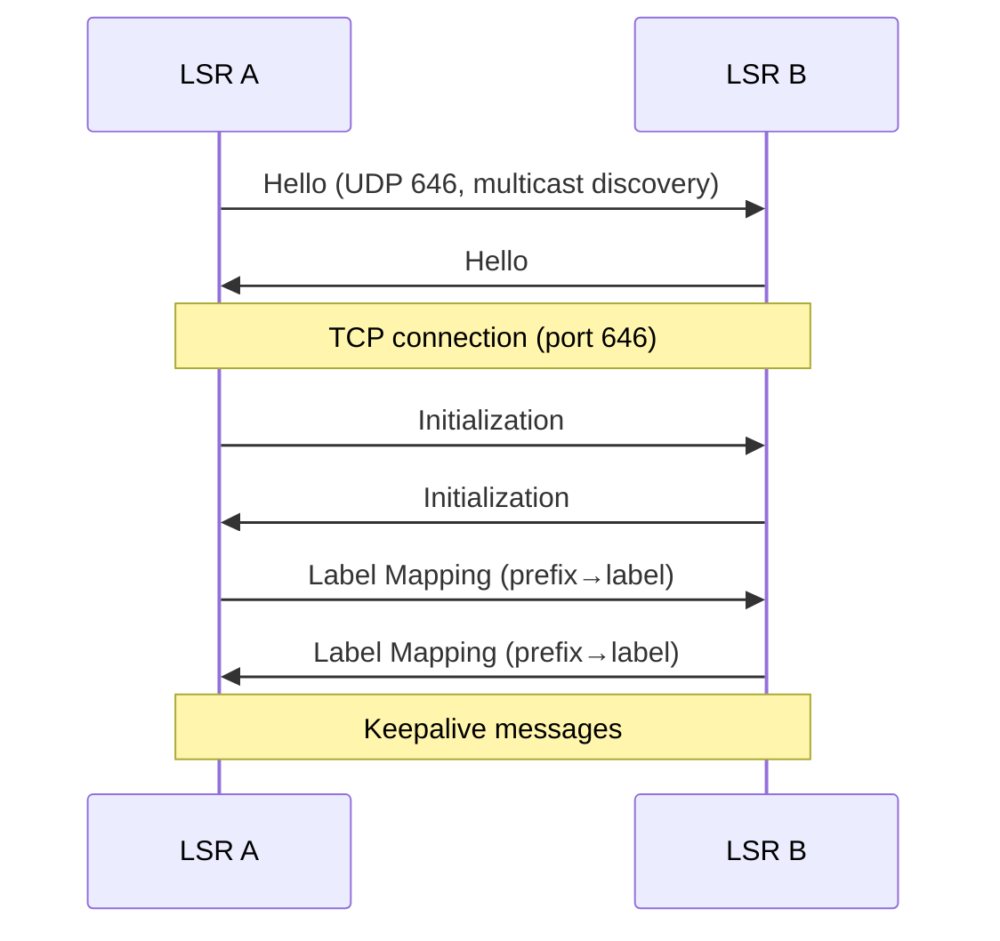
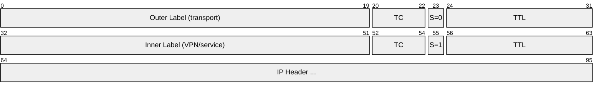
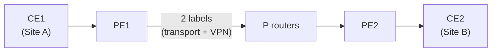
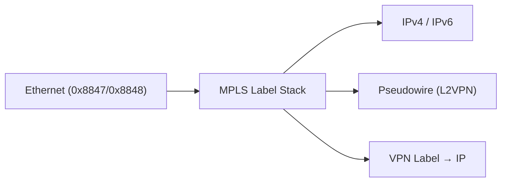

# MPLS (Multiprotocol Label Switching)

> **Standard:** [RFC 3031](https://www.rfc-editor.org/rfc/rfc3031) | **Layer:** Between Layer 2 and 3 ("Layer 2.5") | **Wireshark filter:** `mpls`

MPLS is a high-performance packet forwarding mechanism used in carrier and enterprise backbone networks. Instead of performing a full IP routing lookup at each hop, MPLS routers (Label Switch Routers) forward packets based on short fixed-length labels. This enables traffic engineering, fast reroute, VPNs (L3VPN, L2VPN/VPLS), and QoS at scale. MPLS sits between the data link and network layers — often called "Layer 2.5."

## Label Stack Entry

Each label stack entry is exactly 4 bytes (32 bits). Labels can be stacked — multiple entries form a label stack, processed last-in-first-out.

## Key Fields

| Field | Size | Description |
|-------|------|-------------|
| Label | 20 bits | Forwarding identifier (0-1048575) |
| TC (Traffic Class) | 3 bits | QoS / DiffServ (formerly EXP bits) |
| S (Bottom of Stack) | 1 bit | 1 = this is the last (bottom) label in the stack |
| TTL | 8 bits | Time to Live — decremented at each LSR |

## Reserved Label Values

| Label | Name | Description |
|-------|------|-------------|
| 0 | IPv4 Explicit Null | Pop label, use IPv4 DSCP for QoS |
| 1 | Router Alert | Deliver to local control plane |
| 2 | IPv6 Explicit Null | Pop label, use IPv6 TC for QoS |
| 3 | Implicit Null | Penultimate Hop Popping (PHP) — pop before final hop |
| 4-6 | Reserved | |
| 7 | Entropy Label Indicator | Signals next label is entropy (RFC 6790) |
| 13 | GAL (Generic Associated Channel) | OAM channel (RFC 5586) |
| 14 | OAM Alert | MPLS OAM |
| 15 | Extension | Extended label space |

## Label Operations

| Operation | Description |
|-----------|-------------|
| Push | Add a label to the top of the stack (ingress) |
| Swap | Replace the top label with a new one (transit) |
| Pop | Remove the top label (egress or PHP) |

### Forwarding Example

## Label Distribution

Labels are distributed between LSRs using signaling protocols:

| Protocol | RFC | Description |
|----------|-----|-------------|
| LDP | RFC 5036 | Label Distribution Protocol — automatic label assignment |
| RSVP-TE | RFC 3209 | Resource Reservation Protocol with Traffic Engineering |
| MP-BGP | RFC 4364 | Labels distributed via BGP for L3VPN |
| Segment Routing | RFC 8402 | Labels encoded in the packet by the ingress (no signaling) |

### LDP Session

## Label Stack (Multiple Labels)

MPLS supports stacked labels for nested services:

Common two-label stacks:

| Outer Label | Inner Label | Use Case |
|-------------|-------------|----------|
| Transport (LDP/RSVP) | VPN (BGP) | L3VPN (RFC 4364) |
| Transport | PW (pseudowire) | L2VPN / VPLS |
| Transport | Entropy | Load balancing |

## MPLS Applications

### L3VPN (RFC 4364)

- PE routers maintain per-customer VRFs (Virtual Routing and Forwarding tables)
- MP-BGP distributes VPN labels between PE routers
- Customer routes are isolated from each other and from the core

### Traffic Engineering (RSVP-TE)

- Explicit paths through the network (not shortest-path)
- Bandwidth reservation
- Fast Reroute (FRR) — sub-50ms failover

### Segment Routing

Modern alternative to LDP/RSVP-TE:
- No label distribution protocol needed
- Source routing — ingress encodes the full path as a label stack
- Works with MPLS data plane (SR-MPLS) or IPv6 (SRv6)

## Encapsulation

| EtherType | Description |
|-----------|-------------|
| 0x8847 | MPLS unicast |
| 0x8848 | MPLS multicast |

## Standards

| Document | Title |
|----------|-------|
| [RFC 3031](https://www.rfc-editor.org/rfc/rfc3031) | Multiprotocol Label Switching Architecture |
| [RFC 3032](https://www.rfc-editor.org/rfc/rfc3032) | MPLS Label Stack Encoding |
| [RFC 5036](https://www.rfc-editor.org/rfc/rfc5036) | LDP Specification |
| [RFC 3209](https://www.rfc-editor.org/rfc/rfc3209) | RSVP-TE: Extensions for LSP Tunnels |
| [RFC 4364](https://www.rfc-editor.org/rfc/rfc4364) | BGP/MPLS IP Virtual Private Networks (L3VPN) |
| [RFC 8402](https://www.rfc-editor.org/rfc/rfc8402) | Segment Routing Architecture |
| [RFC 5921](https://www.rfc-editor.org/rfc/rfc5921) | MPLS Transport Profile (MPLS-TP) Framework |

## See Also

- [Ethernet](../link-layer/ethernet.md) — carries MPLS frames
- [IPv4](ip.md) — the network layer MPLS often encapsulates
- [BGP](../routing/bgp.md) — distributes VPN labels in L3VPN
- [OSPF](ospf.md) — IGP that drives LDP label assignment
