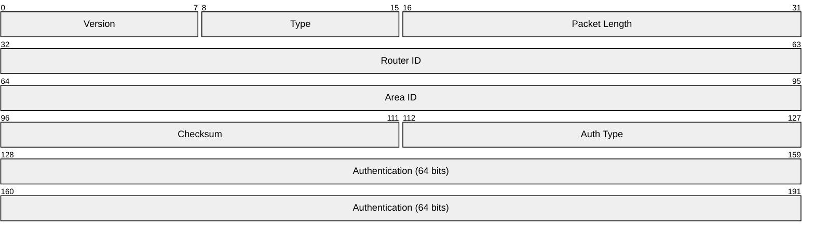
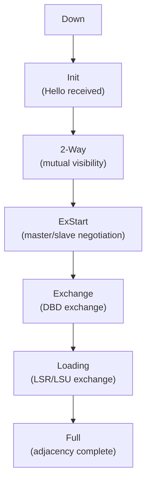
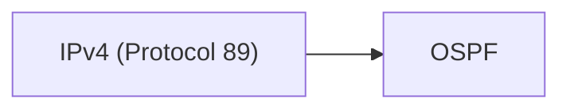

# OSPF (Open Shortest Path First)

> **Standard:** [RFC 2328](https://www.rfc-editor.org/rfc/rfc2328) | **Layer:** Network (Layer 3) | **Wireshark filter:** `ospf`

OSPF is a link-state interior gateway protocol (IGP) used for routing within a single autonomous system. Each router maintains a complete topology map of the network (the link-state database) and uses Dijkstra's SPF algorithm to compute shortest paths. OSPF supports hierarchical routing through areas, VLSM/CIDR, equal-cost multi-path routing, and fast convergence. It runs directly over IP (protocol number 89), not over TCP or UDP. OSPFv3 ([RFC 5340](https://www.rfc-editor.org/rfc/rfc5340)) extends OSPF for IPv6.

## Header

All OSPF packets share a common 24-byte header:

## Key Fields

| Field | Size | Description |
|-------|------|-------------|
| Version | 8 bits | OSPF version (2 for OSPFv2, 3 for OSPFv3) |
| Type | 8 bits | Packet type |
| Packet Length | 16 bits | Total packet length including header |
| Router ID | 32 bits | Unique identifier of the originating router |
| Area ID | 32 bits | OSPF area this packet belongs to (0.0.0.0 = backbone) |
| Checksum | 16 bits | Standard IP checksum over the packet (excluding auth) |
| Auth Type | 16 bits | Authentication type |
| Authentication | 64 bits | Authentication data |

## Field Details

### Packet Types

| Type | Name | Description |
|------|------|-------------|
| 1 | Hello | Neighbor discovery and keepalive |
| 2 | Database Description (DBD) | Summary of link-state database |
| 3 | Link State Request (LSR) | Request specific LSAs |
| 4 | Link State Update (LSU) | Carry one or more LSAs |
| 5 | Link State Acknowledgment (LSAck) | Acknowledge received LSAs |

### Hello Packet

Sent periodically (default every 10 seconds on broadcast networks) to discover and maintain neighbor relationships:

| Field | Description |
|-------|-------------|
| Network Mask | Subnet mask of the interface |
| Hello Interval | Seconds between Hello packets |
| Options | Optional capabilities (E, MC, N/P, DC, EA) |
| Router Priority | Priority for DR/BDR election (0 = ineligible) |
| Dead Interval | Seconds before declaring a neighbor dead (default 40) |
| Designated Router | IP of the current DR |
| Backup Designated Router | IP of the current BDR |
| Neighbor List | Router IDs of known neighbors |

### Authentication Types

| Value | Type |
|-------|------|
| 0 | Null (no authentication) |
| 1 | Simple password (plaintext, 8 bytes) |
| 2 | Cryptographic (MD5 or SHA, per RFC 5709) |

### LSA Types

| Type | Name | Description |
|------|------|-------------|
| 1 | Router LSA | Links of a router within an area |
| 2 | Network LSA | Routers attached to a multi-access network (from DR) |
| 3 | Summary LSA (Network) | Inter-area routes (from ABR) |
| 4 | Summary LSA (ASBR) | Route to an ASBR (from ABR) |
| 5 | AS External LSA | Routes external to the AS (from ASBR) |
| 7 | NSSA External LSA | External routes in Not-So-Stubby Areas |

### Neighbor State Machine

## Encapsulation

OSPF uses multicast addresses `224.0.0.5` (AllSPFRouters) and `224.0.0.6` (AllDRouters).

## Standards

| Document | Title |
|----------|-------|
| [RFC 2328](https://www.rfc-editor.org/rfc/rfc2328) | OSPF Version 2 |
| [RFC 5340](https://www.rfc-editor.org/rfc/rfc5340) | OSPF for IPv6 (OSPFv3) |
| [RFC 3101](https://www.rfc-editor.org/rfc/rfc3101) | OSPF Not-So-Stubby Areas (NSSA) |
| [RFC 5709](https://www.rfc-editor.org/rfc/rfc5709) | OSPFv2 HMAC-SHA Cryptographic Authentication |
| [RFC 2370](https://www.rfc-editor.org/rfc/rfc2370) | OSPF Opaque LSAs |

## See Also

- [IPv4](ip.md)
- [BGP](../routing/bgp.md) — exterior gateway protocol (between autonomous systems)
