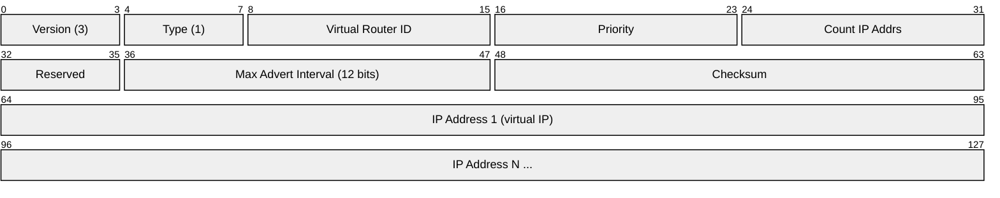
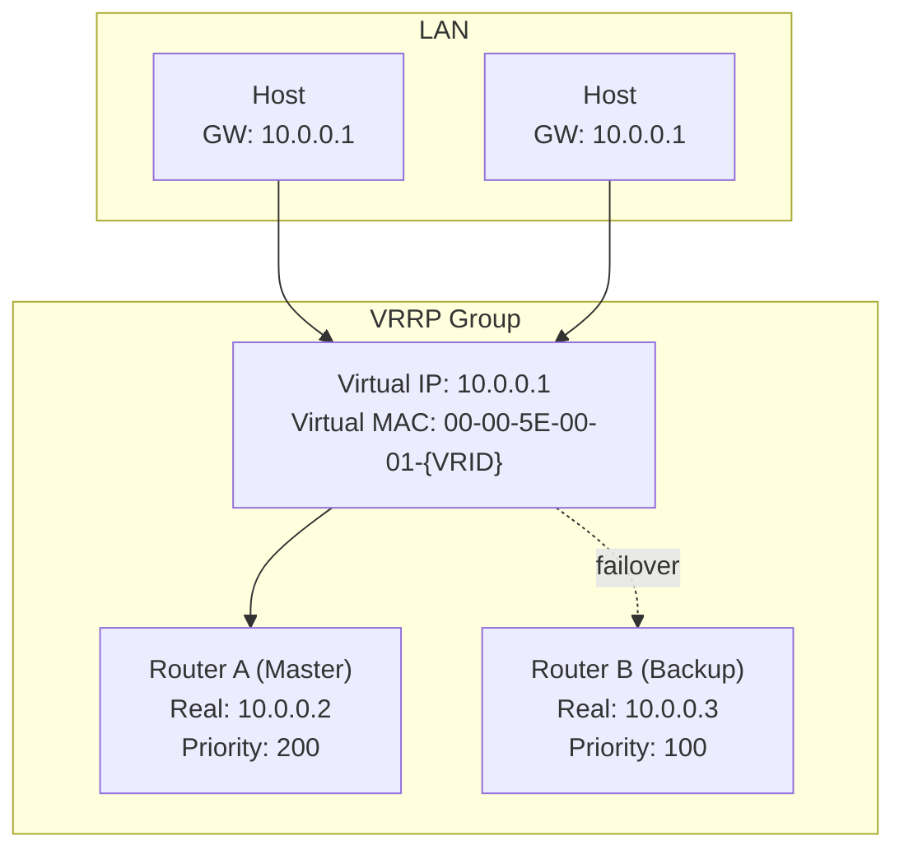
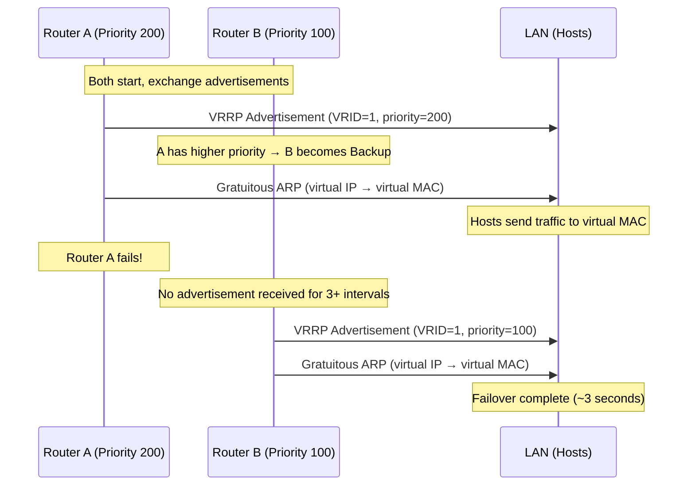
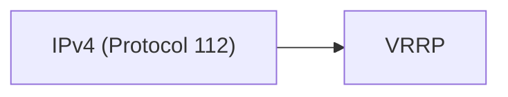

# VRRP (Virtual Router Redundancy Protocol)

> **Standard:** [RFC 5798](https://www.rfc-editor.org/rfc/rfc5798) | **Layer:** Network (Layer 3) | **Wireshark filter:** `vrrp`

VRRP provides automatic default gateway failover for hosts on a LAN. Two or more routers share a virtual IP address and a virtual MAC address. One router is elected Master and handles all traffic to the virtual IP; the others are Backups that take over within seconds if the Master fails. VRRP is essential for high-availability network designs — virtually every enterprise and data center network uses it (or Cisco's proprietary HSRP) for gateway redundancy.

## Packet

## Key Fields

| Field | Size | Description |
|-------|------|-------------|
| Version | 4 bits | VRRP version (3 for VRRPv3) |
| Type | 4 bits | 1 = Advertisement (only type defined) |
| VRID | 8 bits | Virtual Router ID (1-255) — identifies the VRRP group |
| Priority | 8 bits | 1-254 (higher = more preferred); 255 = IP address owner |
| Count IP Addrs | 8 bits | Number of virtual IP addresses |
| Max Advert Interval | 12 bits | Centiseconds between advertisements (default 100 = 1 second) |
| Checksum | 16 bits | Checksum over the VRRP packet |
| IP Addresses | 32 bits each | The virtual IP address(es) this VRID protects |

## How VRRP Works

### Election and Failover

## Priority

| Priority | Meaning |
|----------|---------|
| 255 | Router owns the virtual IP (IP address is configured on this router's interface) |
| 101-254 | High priority (manually configured) |
| 100 | Default priority |
| 1-99 | Low priority |
| 0 | Master is shutting down (triggers immediate failover) |

## Virtual MAC Address

VRRP uses a well-known MAC address based on the VRID:

| IP Version | Virtual MAC Format |
|------------|-------------------|
| IPv4 | `00-00-5E-00-01-{VRID}` |
| IPv6 | `00-00-5E-00-02-{VRID}` |

This ensures that the MAC doesn't change during failover — hosts don't need to update their ARP caches.

## Preemption

When a higher-priority router recovers, it can preempt the current Master:

| Setting | Behavior |
|---------|----------|
| Preempt (default) | Higher-priority router takes over immediately |
| No-preempt | Current Master keeps the role until it fails |

## VRRP vs HSRP

| Feature | VRRP | HSRP (Cisco) |
|---------|------|------|
| Standard | IETF (RFC 5798) | Cisco proprietary |
| Default priority | 100 | 100 |
| Timers | Advertise: 1s, holddown: ~3s | Hello: 3s, holddown: 10s |
| Multicast | 224.0.0.18 (IPv4), ff02::12 (IPv6) | 224.0.0.2 (v1), 224.0.0.102 (v2) |
| Virtual MAC | 00-00-5E-00-01-xx | 00-00-0C-07-AC-xx |
| IP owner | Supported (priority 255) | Not supported |
| IPv6 | Native (VRRPv3) | HSRPv2 |

## Encapsulation

VRRP is carried directly in IP packets with protocol number 112, TTL=255, sent to multicast address `224.0.0.18`.

## Standards

| Document | Title |
|----------|-------|
| [RFC 5798](https://www.rfc-editor.org/rfc/rfc5798) | Virtual Router Redundancy Protocol (VRRP) Version 3 |
| [RFC 3768](https://www.rfc-editor.org/rfc/rfc3768) | VRRP Version 2 (IPv4 only) |

## See Also

- [IPv4](ip.md)
- [ARP](../link-layer/arp.md) — gratuitous ARP used during failover
- [OSPF](ospf.md) — routing protocol often used alongside VRRP
- [IGMP](igmp.md) — VRRP uses multicast 224.0.0.18
