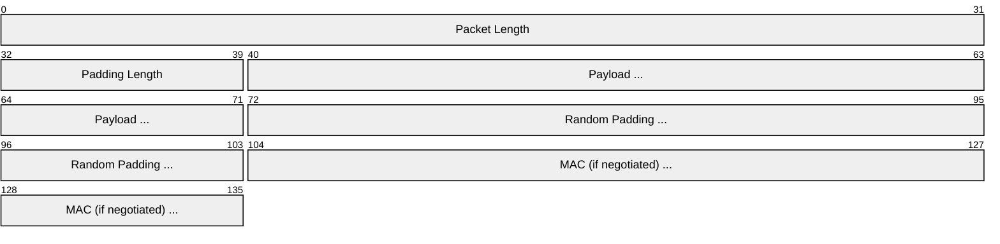
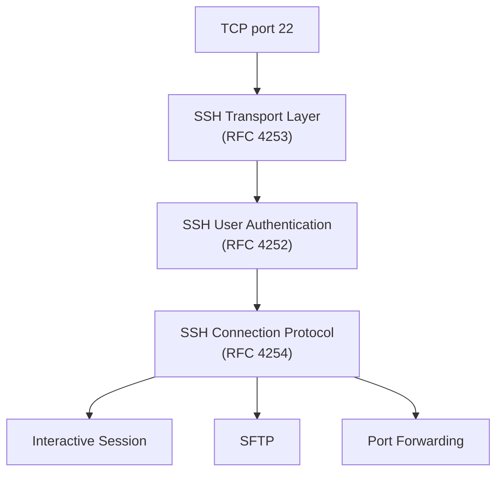
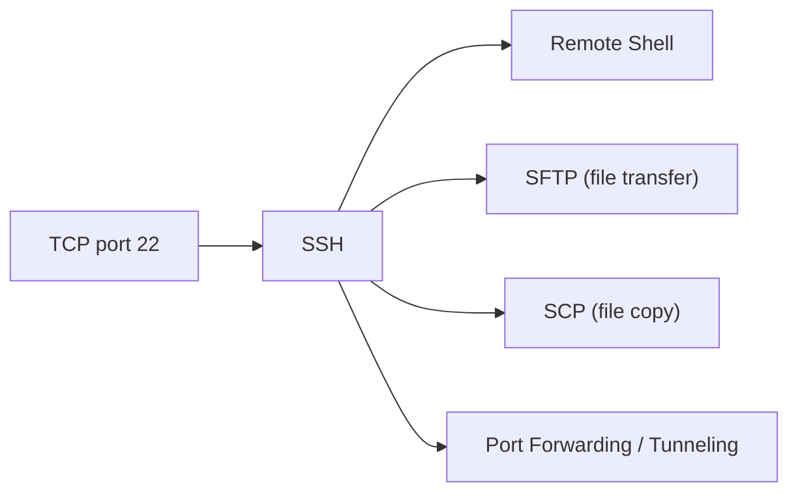

# SSH (Secure Shell)

> **Standard:** [RFC 4253](https://www.rfc-editor.org/rfc/rfc4253) | **Layer:** Application (Layer 7) | **Wireshark filter:** `ssh`

SSH provides encrypted remote login, command execution, and tunneling over an insecure network. It replaced older unencrypted protocols like Telnet and rlogin. SSH is built from three sub-protocols layered on top of each other: the Transport Layer Protocol (key exchange and encryption), the User Authentication Protocol, and the Connection Protocol (multiplexed channels for sessions, port forwarding, etc.).

## Binary Packet

Every SSH message after the version exchange is wrapped in a binary packet:



## Key Fields

| Field | Size | Description |
|-------|------|-------------|
| Packet Length | 32 bits | Length of packet excluding itself and MAC |
| Padding Length | 8 bits | Length of random padding |
| Payload | Variable | The SSH message data |
| Random Padding | Variable | Padding to align to cipher block size (min 4 bytes) |
| MAC | Variable | Message Authentication Code (if negotiated) |

After encryption is negotiated, the entire packet (except MAC) is encrypted and the MAC covers the unencrypted data plus a sequence number.

## Protocol Layers



## Field Details

### Version Exchange

Before binary packets begin, both sides exchange a plaintext version string:

```
SSH-2.0-OpenSSH_9.6\r\n
```

Format: `SSH-protoversion-softwareversion [comments]\r\n`

### Transport Layer Message Types

| Value | Name | Description |
|-------|------|-------------|
| 1 | SSH_MSG_DISCONNECT | Connection terminated |
| 2 | SSH_MSG_IGNORE | Ignored data (anti-traffic analysis) |
| 20 | SSH_MSG_KEXINIT | Key exchange begins |
| 21 | SSH_MSG_NEWKEYS | Key exchange complete, switch to new keys |
| 30-49 | | Key exchange method-specific messages |

### Key Exchange (KEXINIT)

The KEXINIT message contains ordered lists of supported algorithms:

| Field | Description |
|-------|-------------|
| cookie | 16 random bytes |
| kex_algorithms | Key exchange methods (e.g., curve25519-sha256) |
| server_host_key_algorithms | Host key types (e.g., ssh-ed25519, rsa-sha2-512) |
| encryption_algorithms_c2s | Ciphers client-to-server (e.g., aes256-gcm) |
| encryption_algorithms_s2c | Ciphers server-to-client |
| mac_algorithms_c2s | MAC algorithms client-to-server |
| mac_algorithms_s2c | MAC algorithms server-to-client |
| compression_algorithms_c2s | Compression client-to-server |
| compression_algorithms_s2c | Compression server-to-client |

### User Authentication Message Types

| Value | Name | Description |
|-------|------|-------------|
| 50 | SSH_MSG_USERAUTH_REQUEST | Client authentication attempt |
| 51 | SSH_MSG_USERAUTH_FAILURE | Authentication failed (lists remaining methods) |
| 52 | SSH_MSG_USERAUTH_SUCCESS | Authentication succeeded |
| 60 | SSH_MSG_USERAUTH_PK_OK | Public key is acceptable |

Authentication methods: `publickey`, `password`, `keyboard-interactive`, `hostbased`

### Connection Protocol Message Types

| Value | Name | Description |
|-------|------|-------------|
| 90 | SSH_MSG_CHANNEL_OPEN | Open a new channel |
| 91 | SSH_MSG_CHANNEL_OPEN_CONFIRMATION | Channel opened |
| 93 | SSH_MSG_CHANNEL_WINDOW_ADJUST | Flow control window update |
| 94 | SSH_MSG_CHANNEL_DATA | Data on a channel |
| 96 | SSH_MSG_CHANNEL_EOF | No more data |
| 97 | SSH_MSG_CHANNEL_CLOSE | Close the channel |
| 98 | SSH_MSG_CHANNEL_REQUEST | Channel-specific request (shell, exec, subsystem) |

### Common Algorithms (OpenSSH defaults)

| Category | Algorithms |
|----------|-----------|
| Key Exchange | curve25519-sha256, diffie-hellman-group16-sha512 |
| Host Key | ssh-ed25519, rsa-sha2-512, rsa-sha2-256 |
| Cipher | chacha20-poly1305, aes256-gcm, aes128-gcm |
| MAC | (implicit with AEAD ciphers), hmac-sha2-256-etm |

## Encapsulation



## Standards

| Document | Title |
|----------|-------|
| [RFC 4251](https://www.rfc-editor.org/rfc/rfc4251) | SSH Protocol Architecture |
| [RFC 4252](https://www.rfc-editor.org/rfc/rfc4252) | SSH Authentication Protocol |
| [RFC 4253](https://www.rfc-editor.org/rfc/rfc4253) | SSH Transport Layer Protocol |
| [RFC 4254](https://www.rfc-editor.org/rfc/rfc4254) | SSH Connection Protocol |
| [RFC 4256](https://www.rfc-editor.org/rfc/rfc4256) | Generic Message Exchange Authentication (keyboard-interactive) |
| [RFC 8709](https://www.rfc-editor.org/rfc/rfc8709) | Ed25519 and Ed448 Public Key Algorithms for SSH |
| [RFC 8332](https://www.rfc-editor.org/rfc/rfc8332) | Use of RSA Keys with SHA-256 and SHA-512 |
| [RFC 8731](https://www.rfc-editor.org/rfc/rfc8731) | Curve25519 and Curve448 Key Exchange for SSH |

## See Also

- [TCP](../transport-layer/tcp.md)
- [TLS](../security/tls.md) — alternative encryption layer for other protocols
