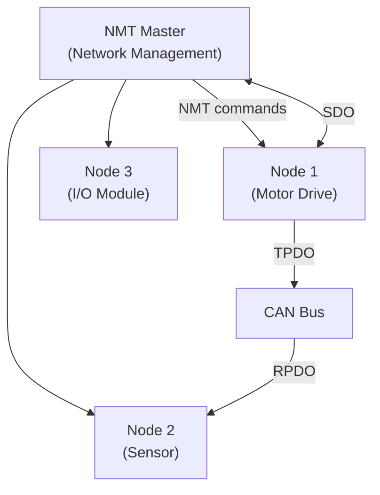
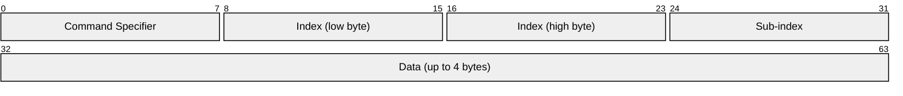
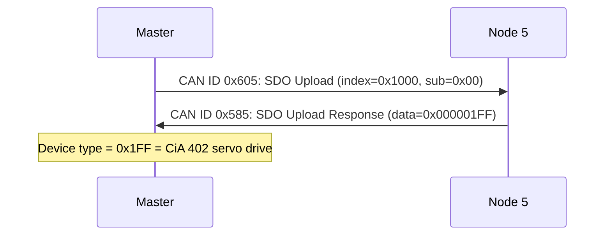
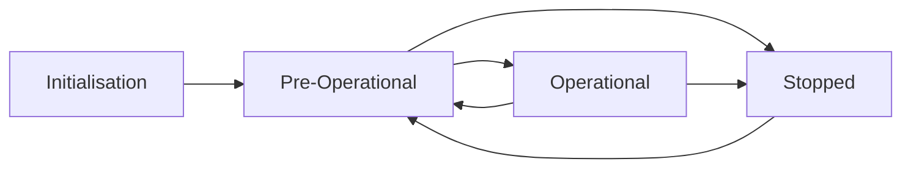

# CANopen

> **Standard:** [CiA 301 (CAN in Automation)](https://www.can-cia.org/canopen/) | **Layer:** Application (Layer 7, over CAN) | **Wireshark filter:** `canopen`

CANopen is a higher-layer protocol running on CAN bus that provides standardized device profiles, network management, and data exchange for embedded systems. It defines how to configure devices (Object Dictionary via SDO), exchange real-time process data (PDO), handle errors (EMCY), and synchronize operations (SYNC/TIME). CANopen is widely used in robotics (joint controllers, grippers), medical devices, maritime, and industrial automation.

## Communication Model

## CAN-ID Allocation (Predefined Connection Set)

CANopen uses the 11-bit CAN identifier to encode function code + node ID:

| CAN-ID Range | Function Code | Object | Direction |
|-------------|---------------|--------|-----------|
| 0x000 | 0x0 | NMT | Master → all |
| 0x080 | 0x1 | SYNC | Master → all |
| 0x080 + NodeID | 0x1 | EMCY | Node → all |
| 0x180 + NodeID | 0x3 | TPDO1 | Node → bus |
| 0x200 + NodeID | 0x4 | RPDO1 | Bus → node |
| 0x280 + NodeID | 0x5 | TPDO2 | Node → bus |
| 0x300 + NodeID | 0x6 | RPDO2 | Bus → node |
| 0x380 + NodeID | 0x7 | TPDO3 | Node → bus |
| 0x400 + NodeID | 0x8 | RPDO3 | Bus → node |
| 0x480 + NodeID | 0x9 | TPDO4 | Node → bus |
| 0x500 + NodeID | 0xA | RPDO4 | Bus → node |
| 0x580 + NodeID | 0xB | SDO response | Node → master |
| 0x600 + NodeID | 0xC | SDO request | Master → node |
| 0x700 + NodeID | 0xE | Heartbeat/NMT Error Control | Node → all |

## Object Dictionary

Every CANopen device has an Object Dictionary (OD) — a structured database of all configuration parameters and process data, indexed by 16-bit index + 8-bit sub-index:

| Index Range | Category | Description |
|-------------|----------|-------------|
| 0x0000 | — | Not used |
| 0x1000-0x1FFF | Communication | Device type, error register, heartbeat, SDO/PDO config |
| 0x2000-0x5FFF | Manufacturer-specific | Vendor-defined parameters |
| 0x6000-0x9FFF | Standardized device profile | Profile-specific (e.g., CiA 402 motion control) |

### Key Objects

| Index | Name | Description |
|-------|------|-------------|
| 0x1000 | Device Type | Device type and profile number |
| 0x1001 | Error Register | Current error status |
| 0x1008 | Manufacturer Device Name | Human-readable name |
| 0x1017 | Producer Heartbeat Time | Heartbeat interval (ms) |
| 0x1400 | RPDO1 Communication Parameter | CAN-ID, transmission type |
| 0x1600 | RPDO1 Mapping Parameter | Which OD entries map to PDO |
| 0x1800 | TPDO1 Communication Parameter | CAN-ID, transmission type |
| 0x1A00 | TPDO1 Mapping Parameter | Which OD entries map to PDO |

## SDO (Service Data Object)

SDO provides confirmed read/write access to any Object Dictionary entry — used for configuration:

### SDO Protocol

| Command | CS byte | Description |
|---------|---------|-------------|
| Download initiate (write) | 0x22/0x23 | Client writes to server |
| Download response | 0x60 | Server confirms write |
| Upload initiate (read) | 0x40 | Client requests read |
| Upload response | 0x42/0x43 | Server returns data |
| Abort | 0x80 | Error (abort code in data) |

### SDO Example (Read Device Type)

## PDO (Process Data Object)

PDOs carry real-time process data without protocol overhead — pure CAN data frames mapped to Object Dictionary entries:

| Feature | SDO | PDO |
|---------|-----|-----|
| Purpose | Configuration | Real-time data |
| Overhead | 4 bytes protocol + data | Data only (0-8 bytes) |
| Confirmation | Yes (request/response) | No (broadcast) |
| Trigger | On request | Event, timer, SYNC, or remote request |
| Typical data | Parameters, firmware | Position, velocity, I/O states |

### PDO Transmission Types

| Type | Trigger | Description |
|------|---------|-------------|
| 0 | Acyclic on SYNC | Transmitted on next SYNC after data change |
| 1-240 | Cyclic on Nth SYNC | Transmitted every N SYNC messages |
| 254 | Event-driven (manufacturer) | Vendor-defined trigger |
| 255 | Event-driven (profile) | Profile-defined trigger |

## NMT (Network Management)

NMT controls the state machine of all nodes:

### NMT Commands (CAN-ID 0x000, 2 bytes)

| CS | Command | Description |
|----|---------|-------------|
| 0x01 | Start Remote Node | Enter Operational |
| 0x02 | Stop Remote Node | Enter Stopped |
| 0x80 | Enter Pre-Operational | Leave Operational |
| 0x81 | Reset Node | Full reset |
| 0x82 | Reset Communication | Reset communication layer |

Node ID 0 = all nodes (broadcast).

## Heartbeat

Each node periodically sends a heartbeat (CAN-ID = 0x700 + NodeID):

| State | Value | Description |
|-------|-------|-------------|
| Boot-up | 0x00 | Node just started |
| Stopped | 0x04 | Node is stopped |
| Operational | 0x05 | Node is operational |
| Pre-Operational | 0x7F | Node is pre-operational |

## Device Profiles

| CiA Profile | Application | Description |
|-------------|-------------|-------------|
| CiA 401 | Generic I/O | Digital/analog I/O modules |
| CiA 402 | Motion Control | Servo drives, stepper motors (most common in robotics) |
| CiA 404 | Measuring Devices | Encoders, sensors |
| CiA 406 | Encoders | Rotary and linear encoders |
| CiA 410 | Inclinometers | Tilt sensors |

### CiA 402 — Motion Control (Robotics)

| Object | Index | Description |
|--------|-------|-------------|
| Controlword | 0x6040 | State machine control (enable, start, halt) |
| Statusword | 0x6041 | State machine status |
| Target Position | 0x607A | Target position (profile position mode) |
| Target Velocity | 0x60FF | Target velocity (profile velocity mode) |
| Target Torque | 0x6071 | Target torque (torque mode) |
| Actual Position | 0x6064 | Current position (encoder feedback) |
| Actual Velocity | 0x606C | Current velocity |

## Standards

| Document | Title |
|----------|-------|
| [CiA 301](https://www.can-cia.org/) | CANopen Application Layer and Communication Profile |
| [CiA 402](https://www.can-cia.org/) | Device profile for drives and motion control |
| [CiA 306](https://www.can-cia.org/) | Electronic Data Sheet (EDS) specification |

## See Also

- [CAN](../bus/can.md) — physical/data link layer CANopen runs on
- [EtherCAT](ethercat.md) — CoE maps CANopen over industrial Ethernet
- [DDS / ROS 2](dds.md) — higher-level robotics middleware
- [MAVLink](mavlink.md) — drone command protocol (some use CAN transport)
- [PROFIBUS](../industrial/profibus.md) — alternative fieldbus
