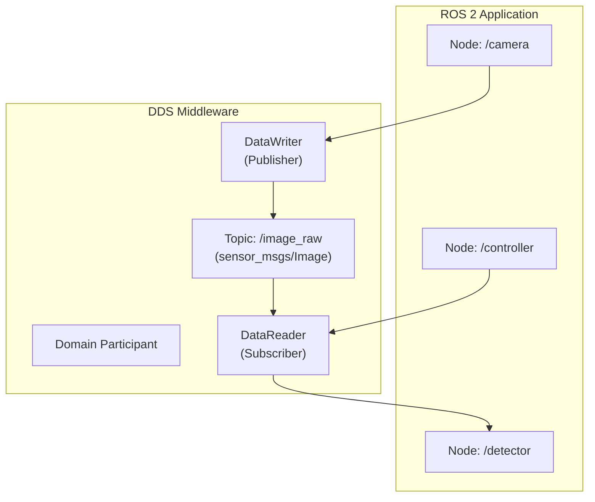
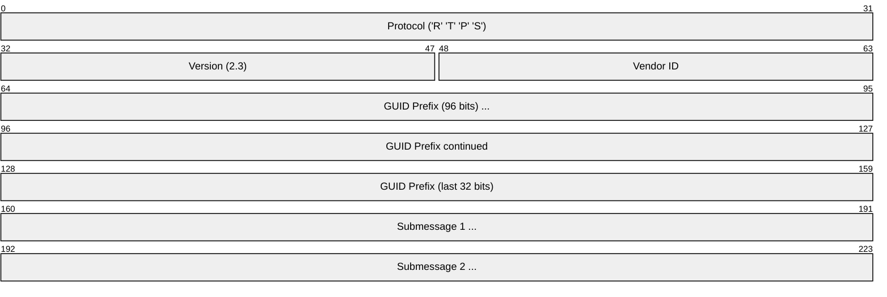
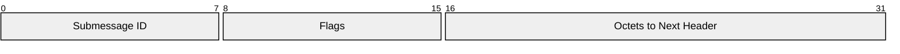
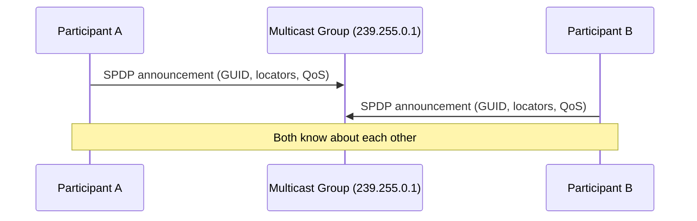
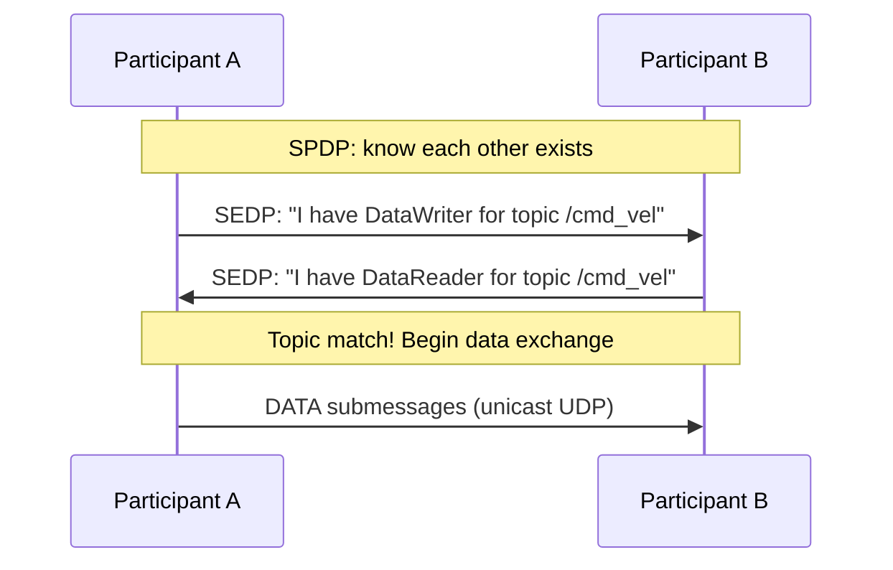
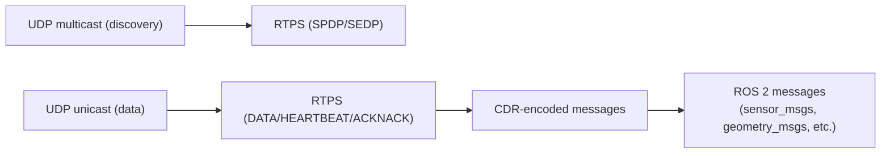

# DDS / ROS 2 (Data Distribution Service)

> **Standard:** [OMG DDS v1.4](https://www.omg.org/spec/DDS/) / [RTPS v2.3](https://www.omg.org/spec/DDSI-RTPS/) | **Layer:** Application (Layer 7) | **Wireshark filter:** `rtps`

DDS (Data Distribution Service) is a middleware protocol for real-time, publish-subscribe data distribution. It is the default communication layer for **ROS 2** (Robot Operating System 2), the dominant framework for robotics software. DDS provides automatic peer discovery, strongly-typed topics, configurable Quality of Service (QoS), and decentralized architecture — no broker required. The wire protocol is RTPS (Real-Time Publish-Subscribe), which runs over UDP multicast for discovery and UDP unicast for data.

## Architecture

DDS is **brokerless** — publishers and subscribers discover each other directly using multicast, then communicate peer-to-peer.

## RTPS Wire Protocol

### RTPS Message

## Key Fields

| Field | Size | Description |
|-------|------|-------------|
| Protocol | 4 bytes | Magic bytes `RTPS` (0x52545053) |
| Version | 2 bytes | Protocol version (major.minor) |
| Vendor ID | 2 bytes | DDS implementation identifier |
| GUID Prefix | 12 bytes | Globally unique identifier for this participant |
| Submessages | Variable | One or more submessages (data, heartbeat, ack, etc.) |

### Submessage Header

### Submessage Types

| ID | Name | Description |
|----|------|-------------|
| 0x01 | PAD | Padding |
| 0x06 | ACKNACK | Acknowledge/negative-acknowledge data |
| 0x07 | HEARTBEAT | Inform readers of available data sequence numbers |
| 0x09 | GAP | Indicate irrelevant sequence numbers |
| 0x12 | INFO_TS | Timestamp for subsequent submessages |
| 0x14 | INFO_SRC | Source participant info |
| 0x15 | DATA | User data payload |
| 0x16 | DATA_FRAG | Fragmented data |

## Discovery

DDS uses a two-phase discovery protocol:

### Simple Participant Discovery Protocol (SPDP)

Participants announce themselves via UDP multicast:

| Parameter | Default Value |
|-----------|---------------|
| Discovery multicast group | 239.255.0.1 |
| Discovery port | 7400 + (250 × domain_id) + participant_id offsets |
| Announcement period | 30 seconds (default) |

### Simple Endpoint Discovery Protocol (SEDP)

After participants discover each other, they exchange their endpoints (DataWriters/DataReaders) via reliable unicast:

## ROS 2 Integration

ROS 2 maps its concepts onto DDS:

| ROS 2 Concept | DDS Concept |
|---------------|-------------|
| Node | Domain Participant |
| Topic | Topic (with type) |
| Publisher | DataWriter |
| Subscriber | DataReader |
| Service | Request/Reply Topics (two topics) |
| Action | Multiple Topics (goal, result, feedback, status) |
| QoS Profile | DDS QoS policies |
| Domain ID | DDS Domain ID (network isolation) |

### ROS 2 Topic Wire Format

ROS 2 messages (e.g., `geometry_msgs/Twist`) are serialized using **CDR** (Common Data Representation) encoding and carried as RTPS DATA submessage payloads.

### Common ROS 2 DDS Implementations

| Implementation | Vendor | ROS 2 RMW |
|---------------|--------|-----------|
| Fast DDS | eProsima | rmw_fastrtps (default) |
| Cyclone DDS | Eclipse | rmw_cyclonedds |
| Connext DDS | RTI | rmw_connextdds |
| GurumDDS | Gurum Networks | rmw_gurumdds |

## Quality of Service (QoS)

DDS provides rich QoS policies — critical for robotics where some data needs reliability and some needs low latency:

| QoS Policy | Options | Description |
|------------|---------|-------------|
| Reliability | BEST_EFFORT, RELIABLE | Guaranteed delivery vs. lowest latency |
| Durability | VOLATILE, TRANSIENT_LOCAL, TRANSIENT, PERSISTENT | Whether late joiners receive historical data |
| History | KEEP_LAST(n), KEEP_ALL | How many samples to retain |
| Deadline | Duration | Maximum expected time between samples |
| Liveliness | AUTOMATIC, MANUAL | How to detect dead writers |
| Lifespan | Duration | How long data is valid |
| Ownership | SHARED, EXCLUSIVE | Multiple or single writer per topic instance |

### ROS 2 QoS Profiles

| Profile | Reliability | Durability | History | Use Case |
|---------|-------------|-----------|---------|----------|
| Sensor data | BEST_EFFORT | VOLATILE | KEEP_LAST(5) | Camera, LiDAR, IMU |
| Parameters | RELIABLE | TRANSIENT_LOCAL | KEEP_LAST(1) | Config parameters |
| Services | RELIABLE | VOLATILE | KEEP_ALL | Request-response |
| Default | RELIABLE | VOLATILE | KEEP_LAST(10) | General purpose |

## Encapsulation

| Port | Usage |
|------|-------|
| 7400 + offsets | Discovery (multicast and unicast, per domain/participant) |
| 7401 + offsets | User data (unicast) |

DDS implementations also support TCP and shared memory transports for scenarios where UDP multicast is unavailable.

## Standards

| Document | Title |
|----------|-------|
| [OMG DDS v1.4](https://www.omg.org/spec/DDS/) | Data Distribution Service for Real-Time Systems |
| [OMG DDSI-RTPS v2.5](https://www.omg.org/spec/DDSI-RTPS/) | DDS Interoperability Wire Protocol (RTPS) |
| [OMG DDS-XTypes v1.3](https://www.omg.org/spec/DDS-XTypes/) | Extensible and Dynamic Topic Types |
| [OMG DDS Security v1.1](https://www.omg.org/spec/DDS-SECURITY/) | DDS Security Specification |
| [ROS 2 Design](https://design.ros2.org/) | ROS 2 middleware abstraction design |

## See Also

- [UDP](../transport-layer/udp.md) — primary transport for RTPS
- [MQTT](../messaging/mqtt.md) — alternative IoT pub-sub (broker-based, simpler)
- [RTP](../voip/rtp.md) — real-time media transport (different domain)
