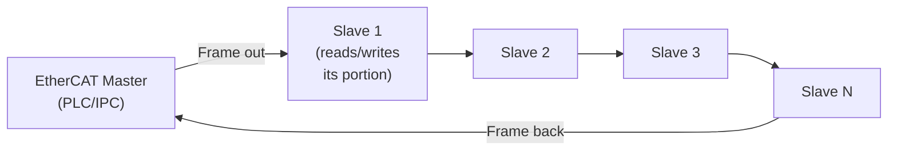
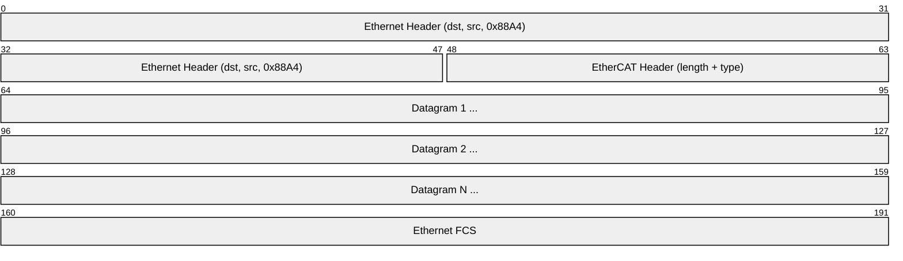
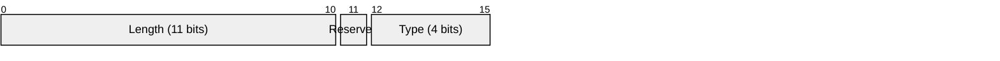
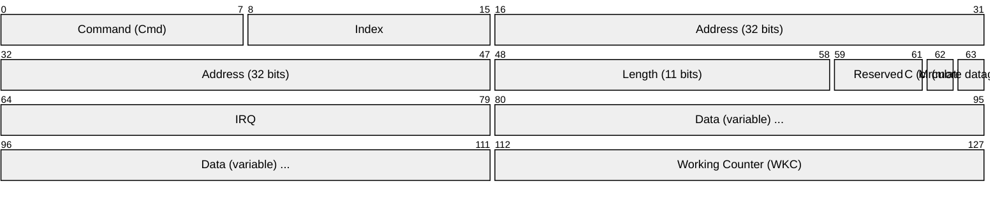
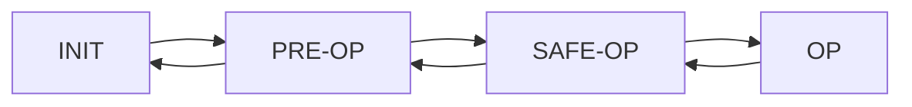

# EtherCAT (Ethernet for Control Automation Technology)

> **Standard:** [IEC 61158 / ETG Specification](https://www.ethercat.org/en/technology.html) | **Layer:** Data Link (Layer 2) | **Wireshark filter:** `ecat` or `ecatmb`

EtherCAT is a real-time industrial Ethernet protocol designed by Beckhoff Automation for high-performance motion control, I/O, and sensor applications. Its key innovation is "processing on the fly" — each slave device reads/writes its data from/to the Ethernet frame as it passes through, without buffering the entire frame. This achieves cycle times as low as 12.5 µs for 100 digital I/O or 100 µs for 100 servo drives. EtherCAT is widely used in CNC machines, robotics, semiconductor manufacturing, and packaging equipment.

## How EtherCAT Works

Unlike standard Ethernet where each device receives, processes, and re-sends frames, EtherCAT frames pass **through** each slave in sequence. Each slave reads its input data and inserts its output data on the fly:



The frame travels through all slaves in a ring (or open line with internal return) and comes back to the master in a single Ethernet frame cycle.

## Frame Structure

EtherCAT frames are standard Ethernet frames with EtherType `0x88A4`:



### EtherCAT Header



### Datagram



| Field | Size | Description |
|-------|------|-------------|
| Command | 8 bits | Read/write type and addressing mode |
| Index | 8 bits | Identifies the datagram (for matching) |
| Address | 32 bits | Slave address (position, configured, or logical) |
| Length | 11 bits | Data field length |
| C (Circulating) | 1 bit | Frame has circulated back to master |
| M (More) | 1 bit | More datagrams follow |
| IRQ | 16 bits | Interrupt request from slaves |
| Data | Variable | Process data (read by/written by slaves on the fly) |
| WKC | 16 bits | Working Counter — incremented by each slave that successfully processes |

## Commands (Addressing Modes)

| Cmd | Name | Addressing | Description |
|-----|------|-----------|-------------|
| 1 | APRD | Auto-increment position | Read from slave at physical position |
| 2 | APWR | Auto-increment position | Write to slave at physical position |
| 4 | FPRD | Configured station address | Read from slave by configured address |
| 5 | FPWR | Configured station address | Write to slave by configured address |
| 7 | BRD | Broadcast | Read from all slaves |
| 8 | BWR | Broadcast | Write to all slaves |
| 10 | LRD | Logical address | Read from logical memory-mapped address |
| 11 | LWR | Logical address | Write to logical memory-mapped address |
| 12 | LRW | Logical address | Simultaneous read/write (most common for process data) |

### Logical Addressing (LRW)

The most efficient mode — the master defines a logical address map. Each slave is configured to read/write specific byte ranges. One LRW datagram can exchange process data with all slaves simultaneously:

```
Logical Address Map:
Offset 0-3:   Slave 1 outputs (master writes, slave reads)
Offset 4-7:   Slave 2 outputs
Offset 8-11:  Slave 1 inputs (slave writes, master reads)
Offset 12-15: Slave 2 inputs
```

## Slave States



| State | Description |
|-------|-------------|
| INIT | Slave detected, mailbox not active |
| PRE-OP | Mailbox active (configuration via CoE/SoE/FoE) |
| SAFE-OP | Process data input active, outputs safe (zero) |
| OP | Full operation — inputs and outputs active |

## Protocols over EtherCAT (Mailbox)

EtherCAT's mailbox carries higher-layer protocols for configuration:

| Protocol | Name | Description |
|----------|------|-------------|
| CoE | CANopen over EtherCAT | Object dictionary, SDO/PDO mapping (most common) |
| SoE | Servo Profile over EtherCAT | SERCOS drive parameters |
| FoE | File Access over EtherCAT | Firmware upload/download |
| EoE | Ethernet over EtherCAT | Standard Ethernet tunneling through EtherCAT |
| AoE | ADS over EtherCAT | Beckhoff TwinCAT access |

## Performance

| Metric | Typical Value |
|--------|---------------|
| Cycle time | 12.5 µs (100 digital I/O), 100 µs (100 servo axes) |
| Jitter | < 1 µs |
| Max slaves | > 65,000 (theoretical), hundreds (practical) |
| Max frame size | 1518 bytes (standard Ethernet) |
| Bandwidth | 100 Mbps (Fast Ethernet), 1 Gbps (EtherCAT G) |
| Topology | Line, star, tree (with junction slaves) |
| Max cable length | 100 m per segment (standard Ethernet copper) |

## Distributed Clocks (DC)

EtherCAT provides hardware-based clock synchronization across all slaves with < 1 µs accuracy:

| Feature | Description |
|---------|-------------|
| Reference clock | First slave with DC capability |
| Propagation delay | Measured and compensated automatically |
| Sync accuracy | < 100 ns typical |
| Sync modes | Free-run, SM-synchronous, DC-synchronous |

## EtherCAT vs Other Industrial Ethernet

| Feature | EtherCAT | PROFINET IRT | EtherNet/IP |
|---------|----------|-------------|-------------|
| Cycle time | 12.5 µs | 250 µs | 1 ms |
| Jitter | < 1 µs | < 1 µs | ~1 ms |
| Topology | Line/star/tree | Star (switched) | Star (switched) |
| Processing | On the fly | Switched | Switched |
| Standard Ethernet | EtherType 0x88A4 | Modified Ethernet | Standard TCP/UDP/IP |
| Application layer | CoE (CANopen) | PROFIdrive | CIP |

## Standards

| Document | Title |
|----------|-------|
| [IEC 61158](https://www.iec.ch/) | Industrial communication networks — Fieldbus |
| [ETG Specification](https://www.ethercat.org/en/technology.html) | EtherCAT Technology Group specifications |
| [IEC 61800-7](https://www.iec.ch/) | Adjustable speed electrical power drive systems (servo profiles) |

## See Also

- [Ethernet](../link-layer/ethernet.md) — EtherCAT uses standard Ethernet frames
- [CAN](../bus/can.md) — CoE maps CANopen over EtherCAT
- [CANopen](canopen.md) — application layer often used with EtherCAT
- [PROFIBUS](../industrial/profibus.md) — legacy fieldbus EtherCAT replaces
