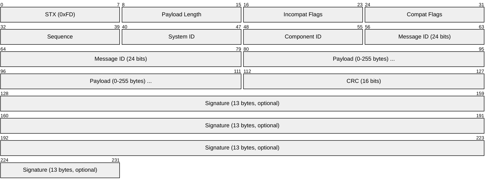
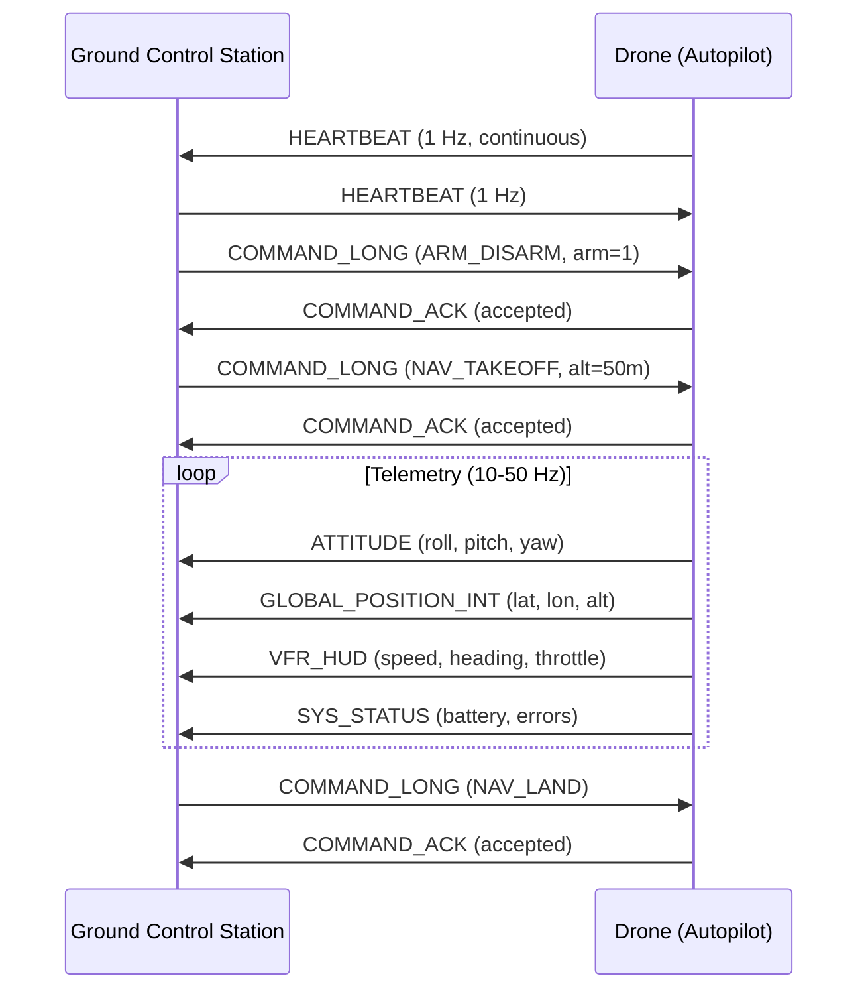

# MAVLink (Micro Air Vehicle Link)

> **Standard:** [MAVLink Protocol (mavlink.io)](https://mavlink.io/en/) | **Layer:** Application (Layer 7) | **Wireshark filter:** `mavlink`

MAVLink is a lightweight binary messaging protocol for communicating with drones, unmanned vehicles, and robotic systems. It is the standard protocol for ArduPilot, PX4, QGroundControl, and most open-source autopilot systems. MAVLink defines ~300 message types covering telemetry (GPS, attitude, battery), commands (takeoff, land, waypoint), parameters, and file transfer. It is designed for unreliable links — messages are self-contained, with CRC integrity checking and optional signing.

## Packet (MAVLink v2)

## Key Fields

| Field | Size | Description |
|-------|------|-------------|
| STX | 8 bits | Start byte: `0xFD` (v2) or `0xFE` (v1) |
| Payload Length | 8 bits | Length of payload in bytes |
| Incompat Flags | 8 bits | Flags that must be understood (bit 0 = signed) |
| Compat Flags | 8 bits | Flags that can be ignored if not understood |
| Sequence | 8 bits | Packet sequence number (0-255, wrapping) |
| System ID | 8 bits | Sending system (vehicle=1, GCS=255) |
| Component ID | 8 bits | Sending component (autopilot=1, camera=100, gimbal=154) |
| Message ID | 24 bits | Identifies the message type |
| Payload | 0-255 bytes | Message-specific data (little-endian) |
| CRC | 16 bits | CRC-16/MCRF4XX over header + payload + CRC_EXTRA |
| Signature | 13 bytes | Optional: link ID + timestamp + SHA-256 hash (first 6 bytes) |

## Common Messages

### Telemetry

| MSG ID | Name | Key Fields | Description |
|--------|------|------------|-------------|
| 0 | HEARTBEAT | type, autopilot, base_mode, system_status | System alive indicator (1 Hz) |
| 1 | SYS_STATUS | battery_voltage, battery_remaining, errors_count | System health |
| 24 | GPS_RAW_INT | lat, lon, alt, fix_type, satellites_visible | Raw GPS data |
| 30 | ATTITUDE | roll, pitch, yaw, rollspeed, pitchspeed, yawspeed | Vehicle orientation (Euler angles) |
| 31 | ATTITUDE_QUATERNION | q1, q2, q3, q4 | Vehicle orientation (quaternion) |
| 32 | LOCAL_POSITION_NED | x, y, z, vx, vy, vz | Local position (North-East-Down) |
| 33 | GLOBAL_POSITION_INT | lat, lon, alt, relative_alt, vx, vy, vz | Global position (WGS84) |
| 74 | VFR_HUD | airspeed, groundspeed, heading, throttle, alt, climb | Heads-up display data |
| 147 | BATTERY_STATUS | voltages, current, remaining, temperature | Detailed battery info |

### Commands

| MSG ID | Name | Description |
|--------|------|-------------|
| 76 | COMMAND_LONG | Send a command (MAV_CMD) with up to 7 parameters |
| 77 | COMMAND_ACK | Acknowledge a command (result code) |
| 11 | SET_MODE | Set flight mode (AUTO, GUIDED, LAND, RTL, etc.) |

### Common MAV_CMDs (in COMMAND_LONG)

| CMD | Name | Description |
|-----|------|-------------|
| 22 | NAV_TAKEOFF | Take off to specified altitude |
| 21 | NAV_LAND | Land at current or specified location |
| 20 | NAV_RETURN_TO_LAUNCH | Return to home position |
| 16 | NAV_WAYPOINT | Navigate to a waypoint |
| 400 | COMPONENT_ARM_DISARM | Arm or disarm motors |
| 176 | DO_SET_MODE | Change flight mode |
| 183 | DO_SET_SERVO | Control a servo output |
| 2500 | DO_CONTROL_VIDEO | Start/stop video capture |

### Mission / Waypoint

| MSG ID | Name | Description |
|--------|------|-------------|
| 44 | MISSION_COUNT | Total number of mission items |
| 39 | MISSION_ITEM_INT | Individual waypoint (lat/lon as int32) |
| 40 | MISSION_REQUEST | Request a specific mission item |
| 47 | MISSION_ACK | Mission transfer complete |

### Parameters

| MSG ID | Name | Description |
|--------|------|-------------|
| 21 | PARAM_REQUEST_LIST | Request all parameters |
| 22 | PARAM_VALUE | Parameter name + value |
| 23 | PARAM_SET | Set a parameter value |

## Typical GCS-Vehicle Flow

## Transport

MAVLink is transport-agnostic — it runs over:

| Transport | Typical Use |
|-----------|-------------|
| Serial (UART) | Autopilot ↔ companion computer, telemetry radio |
| UDP | GCS ↔ vehicle (SITL simulation, Wi-Fi) |
| TCP | GCS ↔ vehicle (reliable link) |
| USB | Direct connection for configuration |
| Radio (SiK, RFD900) | Long-range telemetry (serial over radio) |

Default UDP ports: 14550 (GCS), 14540 (onboard API).

## Message Signing (v2)

MAVLink v2 supports optional message signing to prevent spoofing:

| Field | Size | Description |
|-------|------|-------------|
| Link ID | 1 byte | Identifies the communication channel |
| Timestamp | 6 bytes | 10µs resolution timestamp |
| Signature | 6 bytes | First 6 bytes of SHA-256(secret_key + header + payload + CRC + link_id + timestamp) |

## MAVLink v1 vs v2

| Feature | v1 | v2 |
|---------|----|----|
| STX | 0xFE | 0xFD |
| Message ID | 8 bits (256 messages) | 24 bits (16M messages) |
| Signing | No | Optional |
| Incompat/Compat flags | No | Yes |
| Payload truncation | No | Yes (trailing zeros removed) |

## Standards

| Document | Title |
|----------|-------|
| [MAVLink Protocol](https://mavlink.io/en/) | MAVLink Developer Guide |
| [MAVLink Messages](https://mavlink.io/en/messages/common.html) | Common message definitions |
| [ArduPilot MAVLink](https://ardupilot.org/dev/docs/mavlink-commands-messages.html) | ArduPilot MAVLink reference |

## See Also

- [DDS / ROS 2](dds.md) — alternative robotics middleware (larger systems)
- [CAN](../bus/can.md) — MAVLink can run over CAN (DroneCAN/UAVCAN)
- [UART](../serial/uart.md) — common MAVLink transport
- [UDP](../transport-layer/udp.md) — GCS communication transport
