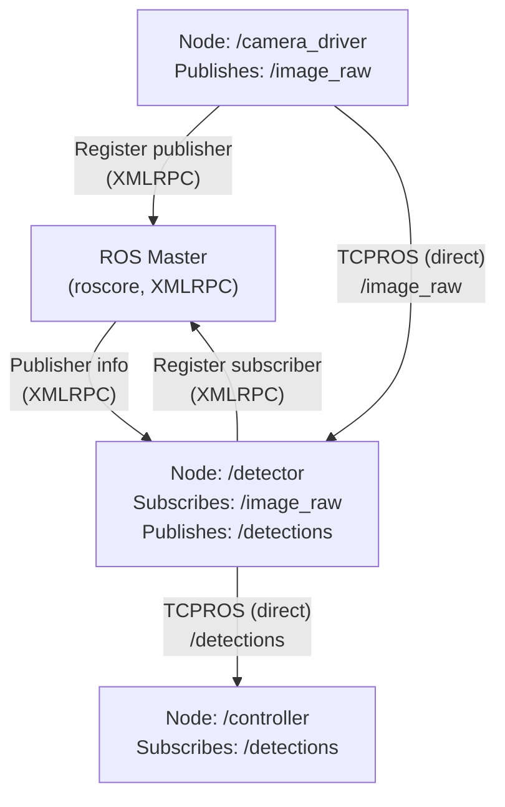
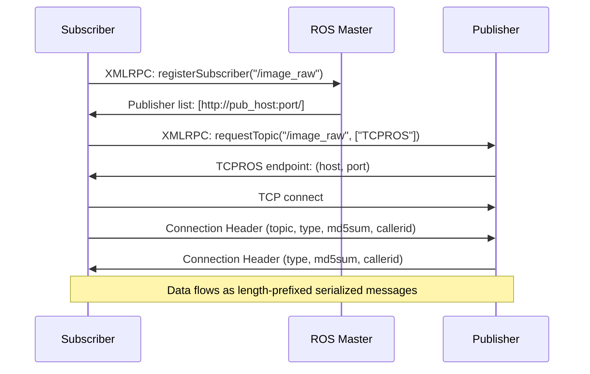
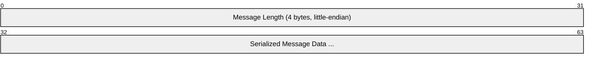
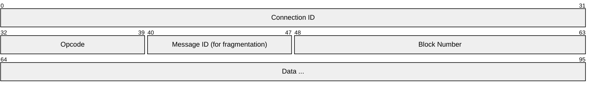
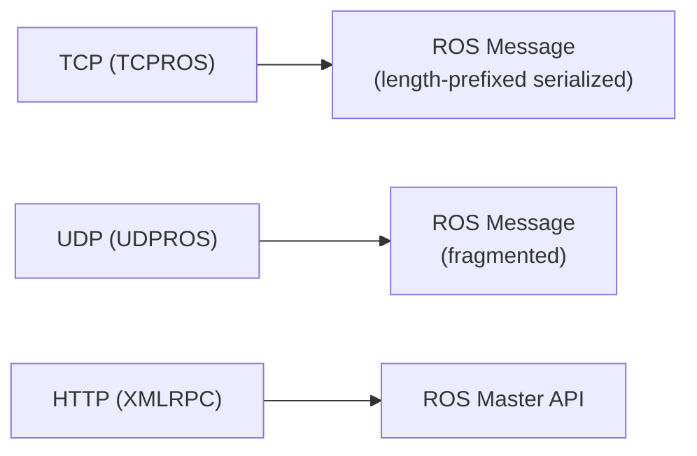

# ROS 1 (Robot Operating System — TCPROS/UDPROS)

> **Standard:** [ROS Wiki (wiki.ros.org)](https://wiki.ros.org/ROS/Technical%20Overview) | **Layer:** Application (Layer 7) | **Wireshark filter:** `tcp` (TCPROS is plain TCP with a custom header)

ROS 1 is the original Robot Operating System middleware that dominated robotics from 2007-2020 and remains widely deployed. Unlike ROS 2 (which uses DDS), ROS 1 uses a centralized architecture with a **ROS Master** (name server) for node discovery and custom transport protocols — **TCPROS** (reliable, default) and **UDPROS** (unreliable, for large data like point clouds). Nodes communicate via topics (pub/sub), services (request/response), and parameters.

## Architecture



Key difference from ROS 2: the ROS Master is a **single point of failure** — if it dies, no new connections can be established (existing ones continue).

## Communication Patterns

| Pattern | Mechanism | Description |
|---------|-----------|-------------|
| Publish/Subscribe | Topics | Many-to-many, asynchronous (TCPROS/UDPROS) |
| Request/Response | Services | One-to-one, synchronous (TCPROS) |
| Shared State | Parameter Server | Key-value store on the ROS Master (XMLRPC) |
| Persistent Stream | Actions | Long-running tasks with feedback (built on topics) |

## TCPROS Protocol

TCPROS is the default transport for topic data and service calls over TCP:

### Connection Handshake



### Connection Header

A series of length-prefixed key=value fields:

```
4 bytes: total header length
4 bytes: field length
N bytes: "callerid=/camera_driver"
4 bytes: field length
N bytes: "topic=/image_raw"
4 bytes: field length
N bytes: "type=sensor_msgs/Image"
4 bytes: field length
N bytes: "md5sum=060021388200f6f0f447d0fcd9c64743"
```

### Header Fields

| Field | Description |
|-------|-------------|
| callerid | Node name of the sender |
| topic | Topic name |
| type | Message type (package/MessageType) |
| md5sum | MD5 hash of the message definition (compatibility check) |
| message_definition | Full message definition text (optional) |
| tcp_nodelay | "1" to set TCP_NODELAY (disable Nagle's algorithm) |
| latching | "1" if publisher sends last message to new subscribers |
| service | Service name (for service connections) |
| persistent | "1" for persistent service connections |

### Data Messages

After the header exchange, each message is sent as:



Messages are serialized using ROS's custom serialization format — fields are packed sequentially in definition order, with 4-byte length prefixes for variable-length types (strings, arrays).

## UDPROS Protocol

UDPROS is used for large, lossy-tolerant data (point clouds, images in degraded networks):

### UDPROS Header



| Opcode | Name | Description |
|--------|------|-------------|
| 0 | DATA0 | First (or only) fragment |
| 1 | DATAN | Subsequent fragment |
| 2 | PING | Keepalive |
| 3 | ERR | Error |

UDPROS fragments messages larger than the UDP MTU and does **not** retransmit lost fragments — the application sees either a complete message or nothing.

## ROS Message Serialization

ROS messages are defined in `.msg` files:

```
# sensor_msgs/Image.msg
Header header
uint32 height
uint32 width
string encoding
uint8 is_bigendian
uint32 step
uint8[] data
```

### Serialization Rules

| Type | Serialization |
|------|---------------|
| bool, uint8, int8 | 1 byte |
| uint16, int16 | 2 bytes, little-endian |
| uint32, int32, float32 | 4 bytes, little-endian |
| uint64, int64, float64 | 8 bytes, little-endian |
| string | 4 bytes length + UTF-8 bytes |
| array[] | 4 bytes length + elements |
| fixed array[N] | N elements (no length prefix) |
| Header | uint32 seq + time stamp + string frame_id |
| time, duration | uint32 secs + uint32 nsecs |

## ROS Master (XMLRPC API)

The ROS Master provides name registration and lookup via XMLRPC over HTTP:

| Method | Description |
|--------|-------------|
| registerPublisher | Announce a publisher for a topic |
| registerSubscriber | Subscribe to a topic |
| unregisterPublisher | Remove a publisher |
| unregisterSubscriber | Remove a subscriber |
| registerService | Register a service |
| lookupService | Find a service provider |
| getTopicTypes | List all topics and their types |
| getSystemState | Full list of publishers, subscribers, services |

## ROS 1 vs ROS 2

| Feature | ROS 1 | ROS 2 |
|---------|-------|-------|
| Middleware | Custom (TCPROS/UDPROS) | DDS (standard) |
| Discovery | Centralized (ROS Master) | Decentralized (DDS multicast) |
| Single point of failure | Yes (Master) | No |
| QoS | None (best-effort or reliable TCP) | DDS QoS (reliability, durability, deadline, etc.) |
| Real-time | Not designed for RT | Supports RT via DDS + RTOS |
| Security | None (anyone can connect) | DDS Security (SROS2) |
| Language support | C++, Python (custom clients) | C, C++, Python (via rcl abstraction) |
| Serialization | Custom | CDR (DDS standard) |
| Multi-robot | Difficult | Namespace/domain isolation |

## Encapsulation



## Standards

ROS 1 is open source with community-maintained specifications:

| Resource | Description |
|----------|-------------|
| [TCPROS Spec](https://wiki.ros.org/ROS/TCPROS) | TCPROS transport protocol |
| [UDPROS Spec](https://wiki.ros.org/ROS/UDPROS) | UDPROS transport protocol |
| [Connection Header](https://wiki.ros.org/ROS/Connection%20Header) | Header field definitions |
| [Master API](https://wiki.ros.org/ROS/Master_API) | XMLRPC API specification |
| [Serialization](https://wiki.ros.org/ROS/Technical%20Overview) | Message serialization format |

## See Also

- [DDS / ROS 2](dds.md) — modern successor using DDS
- [MAVLink](mavlink.md) — drone protocol (often bridged with ROS)
- [TCP](../transport-layer/tcp.md) — TCPROS transport
- [UDP](../transport-layer/udp.md) — UDPROS transport
