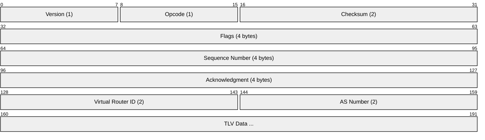
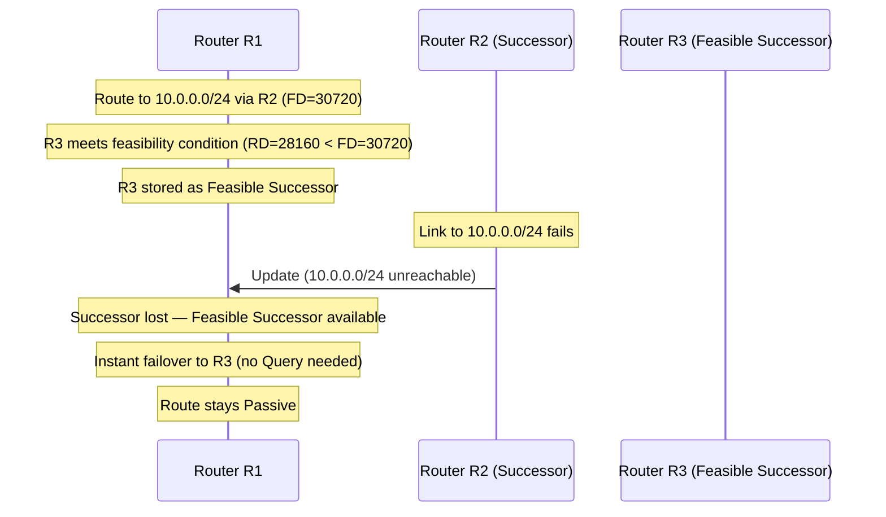
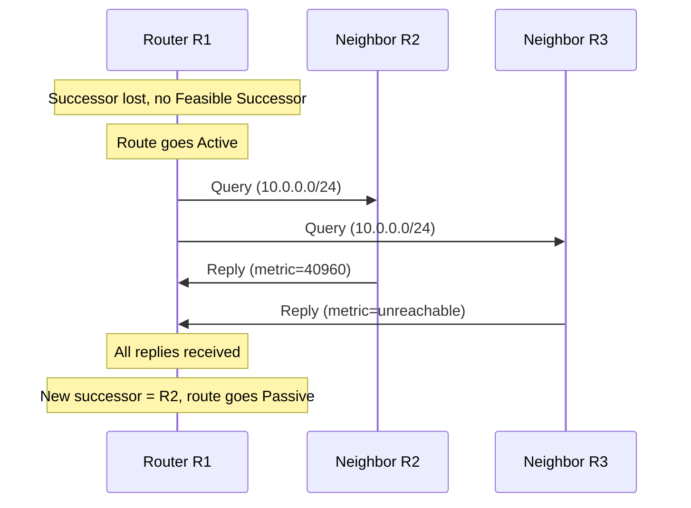
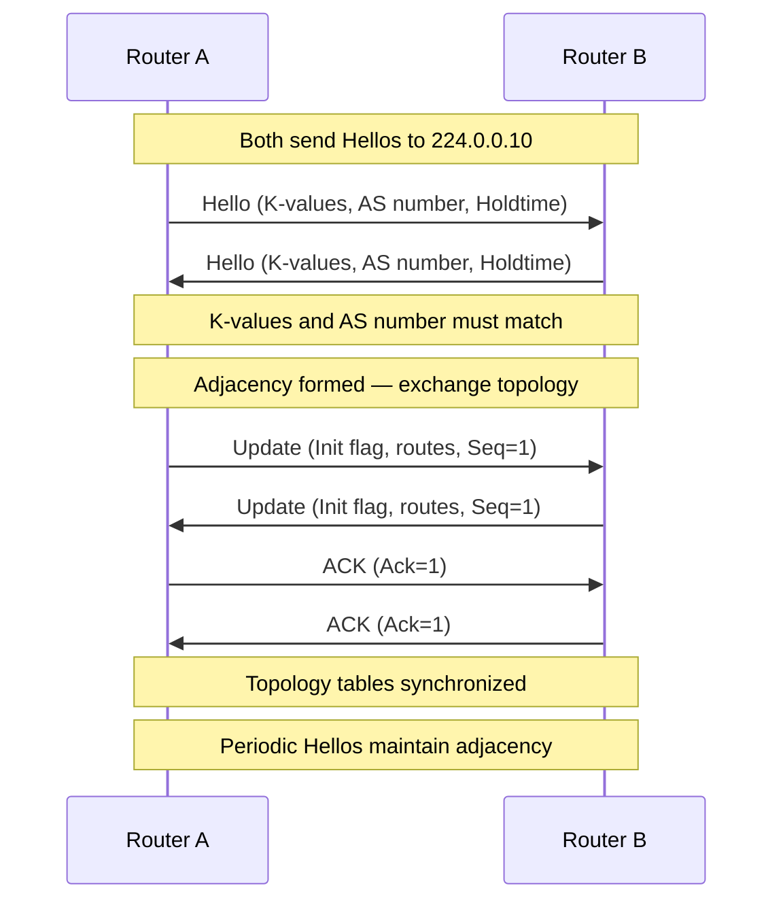
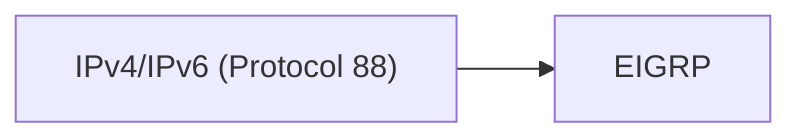

# EIGRP (Enhanced Interior Gateway Routing Protocol)

> **Standard:** [RFC 7868](https://www.rfc-editor.org/rfc/rfc7868) (Informational) | **Layer:** Network (Layer 3) | **Wireshark filter:** `eigrp`

EIGRP is an advanced distance-vector (hybrid) interior gateway routing protocol originally developed by Cisco. It uses the Diffusing Update Algorithm (DUAL) for rapid convergence and loop-free routing. EIGRP maintains a topology table with feasible successors, enabling instant failover without route recomputation. Unlike pure distance-vector protocols, EIGRP sends partial updates only when routes change, conserving bandwidth. Cisco published EIGRP as an informational RFC in 2016, though it remains most widely deployed on Cisco platforms.

## Packet Header

All EIGRP packets share a common 20-byte header:



## Key Fields

| Field | Size | Description |
|-------|------|-------------|
| Version | 1 byte | EIGRP version (currently 2) |
| Opcode | 1 byte | Packet type (Update, Query, Reply, Hello, etc.) |
| Checksum | 2 bytes | Checksum over the entire EIGRP packet |
| Flags | 4 bytes | Init (0x01), Conditional Receive (0x02), Restart (0x04), End-of-Table (0x08) |
| Sequence Number | 4 bytes | Sequence number for reliable delivery |
| Acknowledgment | 4 bytes | Sequence number being acknowledged (0 = none) |
| Virtual Router ID | 2 bytes | Virtual router identifier (0x0001 = unicast AF, 0x0002 = multicast AF) |
| AS Number | 2 bytes | Autonomous System number for this EIGRP domain |

## Opcodes

| Opcode | Name | Description |
|--------|------|-------------|
| 1 | Update | Advertise route information to neighbors |
| 3 | Query | Ask neighbors for a route (DUAL active state) |
| 4 | Reply | Response to a Query with route information |
| 5 | Hello | Neighbor discovery and keepalive |
| 10 | SIA-Query | Stuck-In-Active query (prevents SIA timeout) |
| 11 | SIA-Reply | Response to SIA-Query |

## TLV Types

EIGRP uses TLVs within packets to carry route and parameter data:

| Type | Name | Description |
|------|------|-------------|
| 0x0001 | EIGRP Parameters | K-values and holdtime |
| 0x0002 | Authentication | MD5 or SHA-256 authentication data |
| 0x0003 | Sequence | List of addresses for reliable multicast |
| 0x0004 | Software Version | IOS/EIGRP software version |
| 0x0005 | Next Multicast Sequence | Next multicast sequence number |
| 0x0102 | Internal Route (IPv4) | Classic internal route entry |
| 0x0103 | External Route (IPv4) | Redistributed route entry |
| 0x0402 | Internal Route (IPv6) | IPv6 internal route entry |
| 0x0403 | External Route (IPv6) | IPv6 external route entry |
| 0x0602 | Wide Internal Route | 64-bit wide metric internal route |
| 0x0603 | Wide External Route | 64-bit wide metric external route |

## DUAL Algorithm

The Diffusing Update Algorithm (DUAL) guarantees loop-free routing and fast convergence:

### Key Concepts

| Term | Definition |
|------|-----------|
| Successor | The best next-hop router for a destination (lowest feasible distance) |
| Feasible Distance (FD) | The best metric (composite cost) to a destination from this router |
| Reported Distance (RD) | The metric a neighbor reports for reaching a destination |
| Feasible Successor (FS) | A backup next-hop whose RD is less than the current FD |
| Feasibility Condition | RD of neighbor < FD of current successor (guarantees loop-free path) |
| Active state | Route is being recomputed via Query/Reply diffusion |
| Passive state | Route is stable and in use |

### Route Selection and Failover



### Active Route Recovery (No Feasible Successor)



## Metric Calculation

### Classic Metric (32-bit)

EIGRP composite metric uses K-values to weight components:

```
Metric = 256 * ( K1*BW + (K2*BW)/(256-Load) + K3*Delay ) * ( K5/(K4+Reliability) )
```

| K-Value | Default | Component |
|---------|---------|-----------|
| K1 | 1 | Bandwidth |
| K2 | 0 | Load |
| K3 | 1 | Delay |
| K4 | 0 | Reliability |
| K5 | 0 | Reliability (if K5=0, the reliability term is not used) |

With defaults (K1=1, K2=0, K3=1, K4=0, K5=0):

```
Metric = 256 * (BW + Delay)
Where:
  BW = 10^7 / minimum bandwidth in kbps along the path
  Delay = sum of delays in tens of microseconds along the path
```

### Wide Metrics (64-bit)

Modern EIGRP (Named Mode) uses 64-bit wide metrics to handle high-speed interfaces:

| Component | Classic | Wide Metric |
|-----------|---------|-------------|
| Throughput | 10^7 / BW (kbps) | 10^7 * 65536 / BW (kbps) |
| Latency | Delay / 10 (usec) | Delay * 65536 / 10 (usec) |
| Metric range | 32-bit | 64-bit (top 32 bits used in RIB) |
| Scalability | Cannot differentiate > 1 Gbps | Differentiates up to 100+ Gbps |

## Neighbor Discovery and Adjacency



### Hello and Hold Timers

| Interface Type | Hello Interval | Hold Time |
|----------------|---------------|-----------|
| LAN, point-to-point (high bandwidth) | 5 seconds | 15 seconds |
| Multipoint (T1 and below) | 60 seconds | 180 seconds |

## Named EIGRP Mode

Named EIGRP (introduced in IOS 15.0(1)M) provides a hierarchical configuration structure:

| Component | Purpose |
|-----------|---------|
| Address-Family | IPv4 or IPv6 configuration under a single process |
| af-interface | Per-interface settings (hello, holdtime, authentication, etc.) |
| topology | Route filtering, redistribution, variance, offset-lists |

Benefits over classic mode: unified configuration for IPv4/IPv6, wide metrics, remote neighbor support, and per-AF/per-interface fine-tuning.

## EIGRP vs OSPF

| Feature | EIGRP | OSPF |
|---------|-------|------|
| Algorithm | DUAL (distance-vector/hybrid) | Dijkstra SPF (link-state) |
| Protocol | IP protocol 88 | IP protocol 89 |
| Update type | Partial, bounded updates | LSA flooding within areas |
| Convergence | Instant (feasible successor) or Query/Reply | SPF recalculation |
| Metric | Composite (bandwidth, delay, etc.) | Cost (based on bandwidth) |
| Equal-cost load balancing | Yes (up to 32 paths) | Yes (up to 32 paths) |
| Unequal-cost load balancing | Yes (variance command) | No |
| Hierarchy | Flat (stub routing available) | Areas (backbone + non-backbone) |
| Multi-vendor | Limited (Cisco-centric) | Broad multi-vendor support |
| Standards | RFC 7868 (Informational) | RFC 2328 (Standards Track) |
| IPv6 support | EIGRP for IPv6 / Named Mode | OSPFv3 |

## Encapsulation



EIGRP runs directly over IP with protocol number 88. Hello, Update, Query, and Reply packets are sent to the multicast address `224.0.0.10` (IPv4) or `FF02::A` (IPv6). ACKs are sent unicast.

## Standards

| Document | Title |
|----------|-------|
| [RFC 7868](https://www.rfc-editor.org/rfc/rfc7868) | Cisco's Enhanced Interior Gateway Routing Protocol (EIGRP) |

## See Also

- [OSPF](../network-layer/ospf.md) — link-state IGP alternative
- [BGP](bgp.md) — exterior gateway protocol
- [RIP](rip.md) — simpler distance-vector protocol
- [IS-IS](../network-layer/isis.md) — another link-state IGP
- [IPv4](../network-layer/ip.md) — EIGRP runs over IP protocol 88
