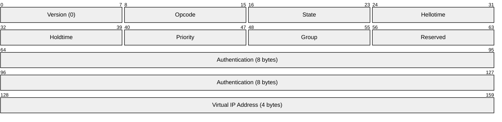
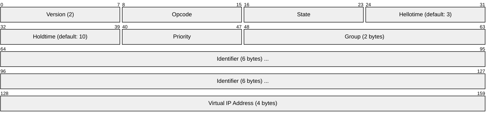
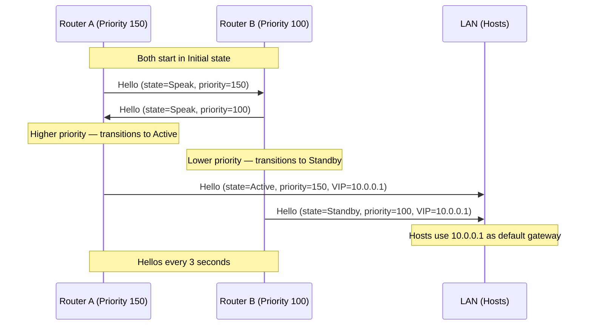
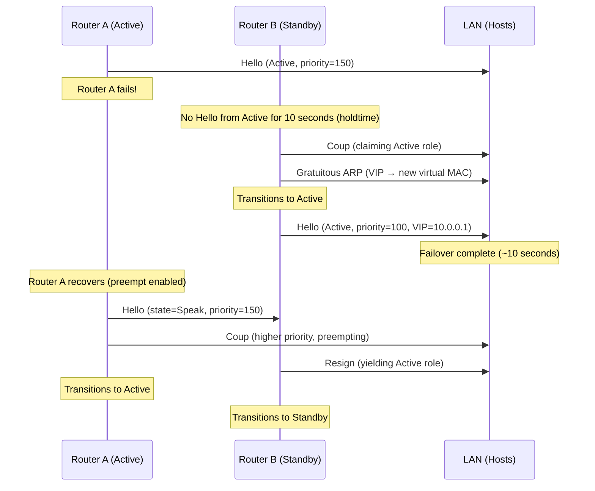

# HSRP (Hot Standby Router Protocol)

> **Standard:** [RFC 2281](https://www.rfc-editor.org/rfc/rfc2281) (Informational, HSRPv1) | **Layer:** Network (Layer 3) | **Wireshark filter:** `hsrp`

HSRP is a Cisco proprietary first-hop redundancy protocol (FHRP) that provides automatic default gateway failover for hosts on a LAN. Two or more routers form an HSRP group sharing a virtual IP address. One router is elected Active and handles all traffic to the virtual IP; the other serves as Standby and takes over if the Active router fails. HSRP is widely deployed on Cisco networks for gateway high availability — it predates the IETF-standard VRRP and remains common in Cisco-only environments.

## HSRPv1 Packet

## HSRPv2 Packet

## Key Fields

| Field | Size | Description |
|-------|------|-------------|
| Version | 1 byte | 0 = HSRPv1, 2 = HSRPv2 |
| Opcode | 1 byte | Message type (Hello, Coup, Resign) |
| State | 1 byte | Current HSRP state of the sender |
| Hellotime | 1 byte | Seconds between Hello messages (default 3) |
| Holdtime | 1 byte | Seconds before declaring Active router down (default 10) |
| Priority | 1 byte | Router priority (0-255, default 100, higher = preferred) |
| Group | 1 byte (v1) / 2 bytes (v2) | HSRP group number |
| Authentication | 8 bytes (v1) | Plain-text authentication string (default: "cisco") |
| Virtual IP | 4 bytes | The shared virtual gateway IP address |

## Opcodes

| Opcode | Name | Description |
|--------|------|-------------|
| 0 | Hello | Periodic keepalive; announces state, priority, timers |
| 1 | Coup | Sent by a router claiming to be the new Active (preemption) |
| 2 | Resign | Sent by the Active router when it is giving up the role |

## States

HSRP routers transition through the following states:

| State | Value | Description |
|-------|-------|-------------|
| Initial | 0 | HSRP starting; no configuration or interface not up |
| Learn | 1 | Waiting to hear from the Active router to learn the virtual IP |
| Listen | 2 | Knows the virtual IP; not Active or Standby; monitoring Hellos |
| Speak | 4 | Sending Hellos, participating in Active/Standby election |
| Standby | 8 | Candidate to become Active; monitors the Active router |
| Active | 16 | Currently forwarding traffic for the virtual IP address |

### State Machine

### Failover Sequence

## Virtual MAC Address

| Version | Virtual MAC Format | Range |
|---------|-------------------|-------|
| HSRPv1 | `0000.0C07.ACxx` | xx = group number (0x00-0xFF, groups 0-255) |
| HSRPv2 (IPv4) | `0000.0C9F.F000`-`0000.0C9F.FFFF` | 12-bit group in last 3 nibbles (groups 0-4095) |
| HSRPv2 (IPv6) | `0005.73A0.0000`-`0005.73A0.0FFF` | 12-bit group (groups 0-4095) |

## HSRPv1 vs HSRPv2

| Feature | HSRPv1 | HSRPv2 |
|---------|--------|--------|
| Group range | 0-255 | 0-4095 |
| Multicast address | 224.0.0.2 | 224.0.0.102 |
| Virtual MAC | 0000.0C07.ACxx | 0000.0C9F.Fxxx |
| Authentication | Plain-text (8 bytes) | MD5 authentication |
| IPv6 support | No | Yes |
| Millisecond timers | No | Yes |
| Source address | Interface IP | Virtual IP |
| Transport | UDP port 1985 | UDP port 1985 |

## Priority and Preemption

| Priority | Meaning |
|----------|---------|
| 255 | Maximum (not reserved like VRRP) |
| 101-254 | High priority (manually configured) |
| 100 | Default |
| 1-99 | Low priority |
| 0 | Triggers immediate resignation from Active role |

### Interface Tracking

HSRP can adjust priority based on tracked interface or object status:

| Tracking Type | Behavior |
|---------------|----------|
| Interface tracking | Decrement priority when a tracked interface goes down |
| Object tracking | Decrement priority based on IP SLA, route existence, etc. |
| Decrement value | Configurable (default 10); if priority drops below Standby, failover occurs |

## HSRP vs VRRP vs GLBP

| Feature | HSRP | VRRP | GLBP |
|---------|------|------|------|
| Standard | Cisco proprietary | IETF RFC 5798 | Cisco proprietary |
| Active/Master | One Active router | One Master router | One AVG + multiple AVFs |
| Load balancing | No (single Active) | No (single Master) | Yes (per-host or round-robin) |
| Default priority | 100 | 100 | 100 |
| Hello timer | 3 seconds | 1 second | 3 seconds |
| Hold timer | 10 seconds | ~3 seconds | 10 seconds |
| Multicast (default) | 224.0.0.2 (v1) | 224.0.0.18 | 224.0.0.102 |
| Virtual MAC | 0000.0C07.ACxx | 0000.5E00.01xx | 0007.B400.xxyy |
| IP owner concept | No | Yes (priority 255) | No |
| Preemption default | Disabled | Enabled | Disabled |
| Groups per interface | Multiple | Multiple | Multiple |
| IPv6 | HSRPv2 | VRRPv3 | Yes |

## Encapsulation

HSRP packets are sent via UDP port 1985 to multicast addresses:
- HSRPv1: `224.0.0.2` (all routers), TTL=1
- HSRPv2: `224.0.0.102`, TTL=1

## Standards

| Document | Title |
|----------|-------|
| [RFC 2281](https://www.rfc-editor.org/rfc/rfc2281) | Cisco Hot Standby Router Protocol (HSRP) |

## See Also

- [VRRP](../network-layer/vrrp.md) — IETF-standard alternative to HSRP
- [EIGRP](eigrp.md) — Cisco routing protocol often deployed alongside HSRP
- [OSPF](../network-layer/ospf.md) — IGP commonly used with HSRP
- [ARP](../link-layer/arp.md) — gratuitous ARP used during HSRP failover
