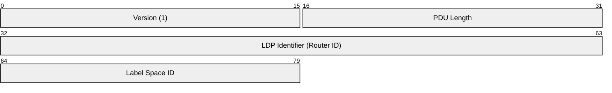
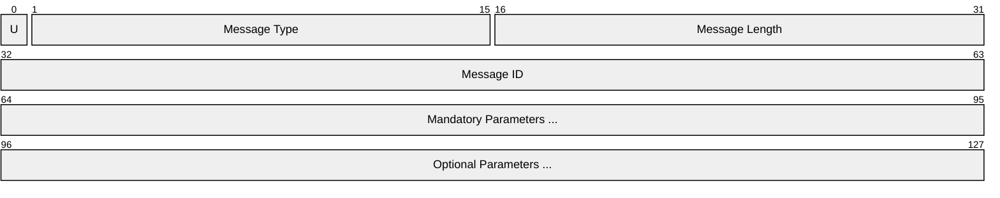
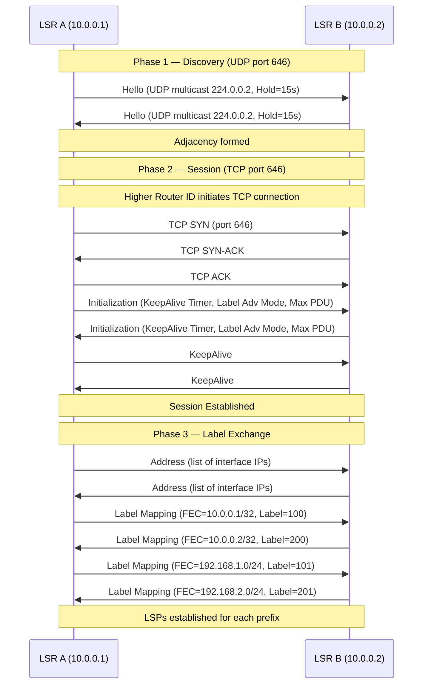
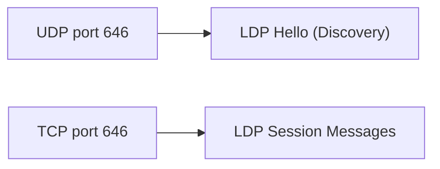

# LDP (Label Distribution Protocol)

> **Standard:** [RFC 5036](https://www.rfc-editor.org/rfc/rfc5036) | **Layer:** Network (Layer 3) | **Wireshark filter:** `ldp`

LDP is a protocol for distributing MPLS labels between Label Switching Routers (LSRs). Each router uses LDP to announce the labels it has assigned to Forwarding Equivalence Classes (FECs), typically IP prefixes from its routing table. This creates Label Switched Paths (LSPs) that follow the shortest IGP path. LDP uses a two-phase approach: UDP (port 646) for neighbor discovery via Hello messages, then TCP (port 646) for reliable session establishment and label exchange.

## LDP PDU Header

Every LDP message is carried inside an LDP PDU with a 10-byte header:

## Key Fields

| Field | Size | Description |
|-------|------|-------------|
| Version | 16 bits | LDP version; always `1` |
| PDU Length | 16 bits | Total length of the PDU excluding the version and length fields |
| LDP Identifier | 32 bits | Router ID of the sending LSR (typically a loopback address) |
| Label Space ID | 16 bits | Identifies the label space (0 for per-platform label space) |

## LDP Message Header

Each message within a PDU has its own header:

| Field | Size | Description |
|-------|------|-------------|
| U (Unknown) | 1 bit | Action when message type is unknown: 0 = send Notification, 1 = ignore |
| Message Type | 15 bits | Type of LDP message |
| Message Length | 16 bits | Length of the message body (excluding type and length) |
| Message ID | 32 bits | Unique identifier for matching requests to responses |

## Field Details

### Message Types

| Type | Name | Description |
|------|------|-------------|
| 0x0100 | Notification | Signal errors or advisory information |
| 0x0200 | Hello | Neighbor discovery (sent via UDP) |
| 0x0300 | Initialization | Negotiate session parameters after TCP connection |
| 0x0201 | KeepAlive | Maintain the TCP session (default every 60s) |
| 0x0300 | Address | Announce interface addresses to the peer |
| 0x0301 | Address Withdraw | Withdraw previously announced addresses |
| 0x0400 | Label Mapping | Bind a label to a FEC |
| 0x0401 | Label Request | Request a label for a FEC |
| 0x0402 | Label Withdraw | Withdraw a previously advertised label binding |
| 0x0403 | Label Release | Release a label received from a peer |
| 0x0404 | Label Abort Request | Abort an outstanding label request |

### Hello Message

Sent as UDP multicast (224.0.0.2, port 646) or targeted UDP unicast:

| Parameter | Description |
|-----------|-------------|
| Hold Time | How long to maintain adjacency without a Hello (default 15s for link, 45s for targeted) |
| T bit | 0 = link Hello (multicast), 1 = targeted Hello (unicast) |
| R bit | Request targeted Hello response |

### Label Mapping TLVs

| TLV | Description |
|-----|-------------|
| FEC TLV | Forwarding Equivalence Class (prefix, host address, wildcard, or CR-LSP) |
| Label TLV | Generic label (20-bit MPLS label value) |
| Hop Count TLV | Loop detection for non-TTL-based networks |
| Path Vector TLV | List of LSR IDs for additional loop detection |

### FEC Element Types

| Type | Description |
|------|-------------|
| Wildcard | All FECs (used in Label Withdraw for mass withdrawal) |
| Prefix | IP prefix (IPv4 or IPv6) with prefix length |
| Host Address | Specific host address binding |

### Label Distribution Modes

| Mode | Description |
|------|-------------|
| Downstream Unsolicited (DU) | LSR advertises labels to peers without being asked (most common) |
| Downstream on Demand (DoD) | LSR only sends labels when requested |
| Independent | LSR assigns labels independently of its peers |
| Ordered | LSR only assigns labels after receiving a label from its downstream peer |
| Liberal retention | Keep labels from all peers (faster convergence, more memory) |
| Conservative retention | Keep labels only from the next-hop peer (less memory) |

## LDP Session Establishment

### Session Maintenance

LDP sessions are maintained through periodic KeepAlive messages. If no LDP message is received within the negotiated KeepAlive timeout (default 180 seconds), the session is torn down and all associated label bindings are removed.

### Graceful Restart

LDP supports graceful restart (RFC 3478), allowing an LSR to preserve its MPLS forwarding state across a control-plane restart. The restarting router signals its intent via the FT Session TLV in the Initialization message, and its peers maintain their label bindings for a configurable recovery period.

## Encapsulation

Discovery uses UDP multicast (or unicast for targeted sessions). All other messages use a TCP session on port 646 for reliable, ordered delivery.

## Standards

| Document | Title |
|----------|-------|
| [RFC 5036](https://www.rfc-editor.org/rfc/rfc5036) | LDP Specification |
| [RFC 5283](https://www.rfc-editor.org/rfc/rfc5283) | LDP Extension for Inter-Area LSPs |
| [RFC 3478](https://www.rfc-editor.org/rfc/rfc3478) | Graceful Restart Mechanism for LDP |
| [RFC 5561](https://www.rfc-editor.org/rfc/rfc5561) | LDP Capabilities |
| [RFC 7552](https://www.rfc-editor.org/rfc/rfc7552) | Updates to LDP for IPv6 |

## See Also

- [MPLS](../tunneling/mpls.md) -- label switching data plane that LDP populates
- [RSVP](rsvp.md) -- constraint-based LSP signaling (traffic engineering)
- [BGP](bgp.md) -- distributes labels for L3VPN and segment routing
