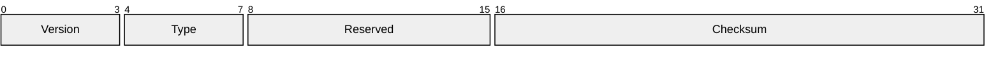
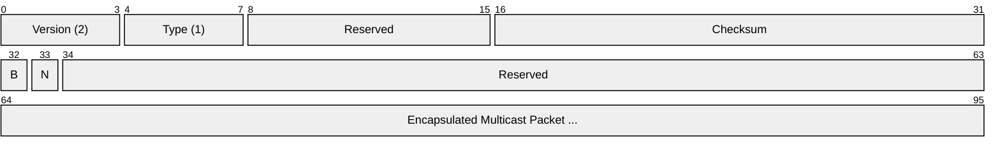
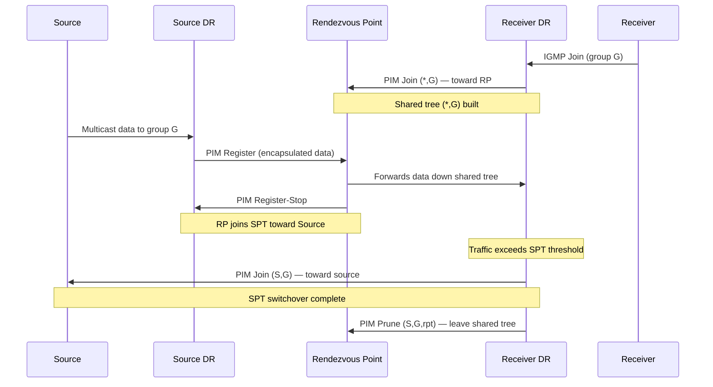
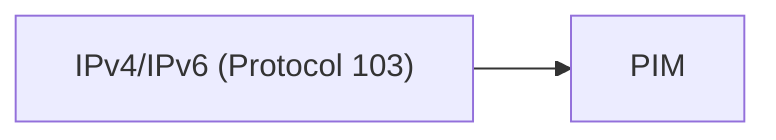

# PIM (Protocol Independent Multicast)

> **Standard:** [RFC 7761](https://www.rfc-editor.org/rfc/rfc7761) (PIM-SM) | **Layer:** Network (Layer 3) | **Wireshark filter:** `pim`

PIM is the dominant multicast routing protocol used to build distribution trees that deliver multicast traffic from sources to receivers across an IP network. It is called "protocol independent" because it does not include its own topology discovery mechanism -- instead, it relies on whatever unicast routing protocol (OSPF, BGP, IS-IS, etc.) has populated the routing table. PIM runs directly over IP (protocol number 103) and comes in two main flavors: Sparse Mode (PIM-SM), which uses explicit joins toward a Rendezvous Point, and Dense Mode (PIM-DM), which floods traffic and prunes branches with no receivers.

## PIM Header

All PIM messages share a common 4-byte header:

## Key Fields

| Field | Size | Description |
|-------|------|-------------|
| Version | 4 bits | PIM version; always `2` |
| Type | 4 bits | Message type (Hello, Join/Prune, Register, etc.) |
| Reserved | 8 bits | Set to zero on transmission |
| Checksum | 16 bits | Checksum over the entire PIM message |

## Field Details

### Message Types

| Type | Name | Description |
|------|------|-------------|
| 0 | Hello | Neighbor discovery and option negotiation |
| 1 | Register | Encapsulate multicast data from source DR to RP |
| 2 | Register-Stop | RP tells source DR to stop sending Register messages |
| 3 | Join/Prune | Join or leave a multicast tree branch |
| 4 | Bootstrap | Distribute RP-set information across the domain |
| 5 | Assert | Elect a single forwarder when multiple routers share a LAN |
| 8 | Candidate-RP-Advertisement | Announce willingness to serve as RP |

### Hello Message

Sent periodically (default 30 seconds) to discover PIM neighbors and negotiate capabilities:

| Option | Description |
|--------|-------------|
| Hold Time | How long to consider the neighbor alive (default 105s) |
| DR Priority | Priority for Designated Router election (higher wins) |
| Generation ID | Random value to detect neighbor restarts |
| LAN Prune Delay | Parameters for prune override on multi-access networks |

### Register Message

| Flag | Description |
|------|-------------|
| B (Border) | Set when the Register is from a domain border |
| N (Null-Register) | Probe to check if Register-Stop is still active |

### Join/Prune Message

| Field | Description |
|-------|-------------|
| Upstream Neighbor | Address of the upstream router being joined/pruned |
| Hold Time | How long the join/prune state is valid |
| Number of Groups | Count of multicast groups in this message |
| Joined Sources | Sources to join (list of (S,G) or (*,G) entries) |
| Pruned Sources | Sources to prune |

## PIM-SM Operation

### Rendezvous Point (RP)

The RP is a central meeting point in PIM Sparse Mode. Sources register with the RP, and receivers join toward the RP. Once traffic is flowing, the last-hop router can switch to a shortest-path tree (SPT) directly from the source for optimal delivery.

**RP Selection Methods:**

| Method | Description |
|--------|-------------|
| Static RP | Manually configured on all routers |
| Bootstrap Router (BSR) | BSR collects Candidate-RP advertisements and distributes the RP-set |
| Auto-RP | Cisco proprietary; uses 224.0.1.39 and 224.0.1.40 |
| Anycast RP | Multiple RPs share the same IP, synchronized via MSDP |

### Multicast Tree Building (PIM-SM)

### PIM-SM vs PIM-DM

| Feature | PIM-SM (Sparse Mode) | PIM-DM (Dense Mode) |
|---------|----------------------|---------------------|
| Model | Explicit join (pull) | Flood and prune (push) |
| RP required | Yes | No |
| Default tree | Shared tree via RP | Source tree (shortest path) |
| Scalability | Good for sparse receivers | Poor at scale; floods everywhere |
| Use case | Enterprise and Internet multicast | Small/dense networks (largely deprecated) |

### Assert Mechanism

When two PIM routers on the same LAN both forward the same multicast stream, an Assert message is exchanged. The router with the best route metric to the source (or RP) wins and continues forwarding; the loser stops.

| Assert field | Purpose |
|--------------|---------|
| RPT bit | Whether the Assert is for a shared or source tree |
| Metric Preference | Preference of the unicast routing protocol |
| Route Metric | Metric to the source or RP |

## Encapsulation

PIM is carried directly in IP packets with protocol number 103. Hello messages are sent to the ALL-PIM-ROUTERS multicast group (224.0.0.13 for IPv4, ff02::d for IPv6) with TTL/Hop Limit of 1.

## Standards

| Document | Title |
|----------|-------|
| [RFC 7761](https://www.rfc-editor.org/rfc/rfc7761) | Protocol Independent Multicast - Sparse Mode (PIM-SM) |
| [RFC 3973](https://www.rfc-editor.org/rfc/rfc3973) | Protocol Independent Multicast - Dense Mode (PIM-DM) |
| [RFC 5059](https://www.rfc-editor.org/rfc/rfc5059) | Bootstrap Router (BSR) Mechanism for PIM |
| [RFC 4610](https://www.rfc-editor.org/rfc/rfc4610) | Anycast-RP Using Protocol Independent Multicast (PIM) |
| [RFC 3446](https://www.rfc-editor.org/rfc/rfc3446) | Anycast Rendezvous Point (RP) Mechanism using PIM and MSDP |

## See Also

- [IGMP](../network-layer/igmp.md) -- host-to-router multicast group membership
- [OSPF](../network-layer/ospf.md) -- unicast routing that PIM relies on
- [BGP](bgp.md) -- carries multiprotocol multicast routes (MBGP)
