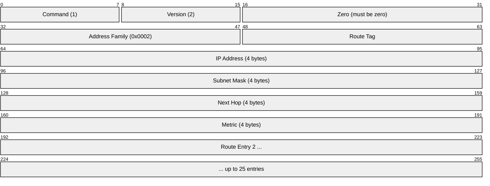
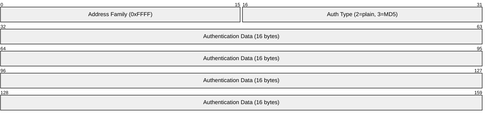
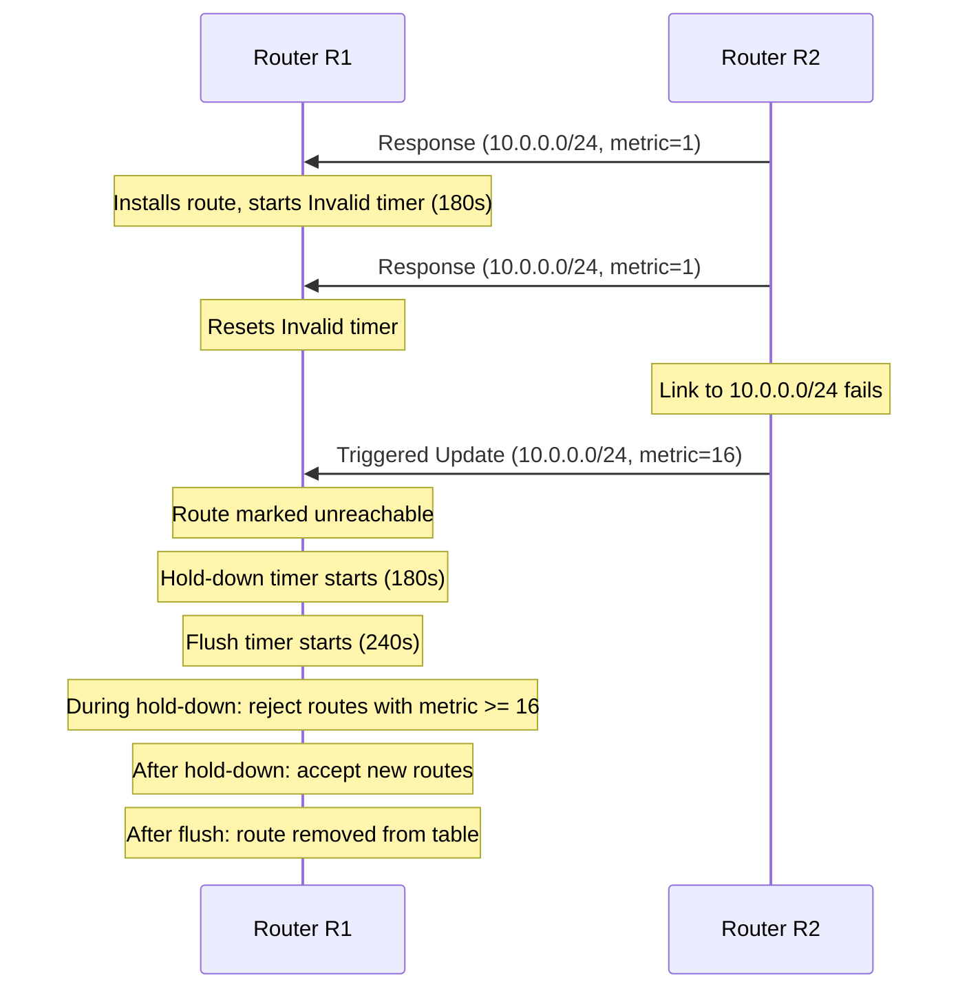

# RIP (Routing Information Protocol)

> **Standard:** [RFC 2453](https://www.rfc-editor.org/rfc/rfc2453) (RIPv2) / [RFC 2080](https://www.rfc-editor.org/rfc/rfc2080) (RIPng) | **Layer:** Application (Layer 7) | **Wireshark filter:** `rip`

RIP is one of the oldest distance-vector routing protocols, using hop count as its sole metric to determine the best path to a destination. Each router periodically broadcasts (RIPv1) or multicasts (RIPv2) its entire routing table to neighbors every 30 seconds. RIP is simple to configure and understand, making it suitable for small networks, but its 15-hop limit, slow convergence, and lack of scalability have led to its replacement by OSPF and EIGRP in most modern networks. RIPv2 added classless routing (VLSM support), multicast updates, and authentication. RIPng extends RIP for IPv6.

## RIPv2 Packet



## Key Fields

### Packet Header

| Field | Size | Description |
|-------|------|-------------|
| Command | 1 byte | 1 = Request, 2 = Response |
| Version | 1 byte | 1 = RIPv1, 2 = RIPv2 |
| Zero | 2 bytes | Must be zero (unused) |

### Route Entry (20 bytes each, max 25 per packet)

| Field | Size | Description |
|-------|------|-------------|
| Address Family | 2 bytes | 0x0002 for IP (0xFFFF for authentication entry) |
| Route Tag | 2 bytes | Tag for external route identification (RIPv2 only) |
| IP Address | 4 bytes | Destination network address |
| Subnet Mask | 4 bytes | Subnet mask (RIPv2 only; zero in RIPv1) |
| Next Hop | 4 bytes | Next-hop IP (0.0.0.0 = use sender; RIPv2 only) |
| Metric | 4 bytes | Hop count to destination (1-15 valid, 16 = unreachable) |

## Command Types

| Command | Name | Description |
|---------|------|-------------|
| 1 | Request | Ask for all or specific routes from a neighbor |
| 2 | Response | Send routing table entries (periodic or triggered) |

## RIPv1 vs RIPv2 vs RIPng

| Feature | RIPv1 | RIPv2 | RIPng |
|---------|-------|-------|-------|
| RFC | RFC 1058 | RFC 2453 | RFC 2080 |
| Addressing | Classful (no subnet mask) | Classless (VLSM/CIDR) | IPv6 prefixes |
| Updates | Broadcast (255.255.255.255) | Multicast (224.0.0.9) | Multicast (FF02::9) |
| Transport | UDP port 520 | UDP port 520 | UDP port 521 |
| Authentication | None | Plain-text or MD5 | IPsec (external) |
| Route tags | No | Yes | Yes |
| Next-hop field | No (implicit) | Yes | Yes (link-local) |
| Max metric | 15 (16 = infinity) | 15 (16 = infinity) | 15 (16 = infinity) |
| Subnet mask in update | No | Yes | Prefix length |

## RIPv2 Authentication Entry

When authentication is enabled, the first route entry slot is used for authentication:



| Auth Type | Value | Description |
|-----------|-------|-------------|
| Plain-text | 2 | 16-byte cleartext password |
| MD5 | 3 | MD5 keyed digest (RFC 2082) |

## Distance-Vector Algorithm

RIP uses the Bellman-Ford algorithm. Each router:

1. Receives routing tables from directly connected neighbors
2. Adds its own hop cost (1) to each received metric
3. Selects the route with the lowest metric for each destination
4. Advertises its routing table to all neighbors every 30 seconds

### Loop Prevention Mechanisms

| Mechanism | Description |
|-----------|-------------|
| Split horizon | Do not advertise a route back out the interface it was learned on |
| Poison reverse | Advertise learned routes back with metric 16 (unreachable) |
| Triggered updates | Send immediate update when a route changes (do not wait for timer) |
| Hold-down timer | After a route is marked unreachable, ignore new routes to it for a period |
| Maximum hop count | 16 = infinity; prevents count-to-infinity (limits network diameter to 15 hops) |

## Timers

| Timer | Default | Description |
|-------|---------|-------------|
| Update | 30 seconds | Interval between periodic full routing table broadcasts |
| Invalid | 180 seconds | Time without an update before a route is marked unreachable |
| Hold-down | 180 seconds | After invalidation, period to reject inferior routes |
| Flush | 240 seconds | Time after which an invalid route is removed from the table |

### Timer Interaction



## Convergence Example

```mermaid
sequenceDiagram
  participant A as Router A
  participant B as Router B
  participant C as Router C

  Note over A,B,C: Normal operation
  A->>B: Response (routes, every 30s)
  B->>A: Response (routes, every 30s)
  B->>C: Response (routes, every 30s)
  C->>B: Response (routes, every 30s)

  Note over A: Interface to 10.1.0.0/24 goes down
  A->>B: Triggered Update (10.1.0.0/24 metric=16)
  Note over B: Poisons route, triggers update to C
  B->>C: Triggered Update (10.1.0.0/24 metric=16)
  Note over A,B,C: All routers converged
```

## RIP vs OSPF vs EIGRP

| Feature | RIP | OSPF | EIGRP |
|---------|-----|------|-------|
| Algorithm | Bellman-Ford (distance-vector) | Dijkstra SPF (link-state) | DUAL (hybrid) |
| Metric | Hop count (max 15) | Cost (bandwidth-based) | Composite (BW, delay, etc.) |
| Convergence | Slow (minutes) | Fast (seconds) | Very fast (sub-second with FS) |
| Scalability | Small networks only | Large networks (areas) | Large networks (stub/summary) |
| Update method | Full table every 30s | LSA flooding on change | Partial updates on change |
| Transport | UDP port 520 | IP protocol 89 | IP protocol 88 |
| VLSM/CIDR | RIPv2 only | Yes | Yes |
| Authentication | RIPv2: MD5/plain | MD5, SHA | MD5, SHA |
| Equal-cost paths | No (typically) | Yes | Yes |
| Unequal-cost paths | No | No | Yes (variance) |
| Administrative distance | 120 | 110 | 90 (internal), 170 (external) |
| Standards | RFC 2453 | RFC 2328 | RFC 7868 (Informational) |

## Encapsulation


- **RIPv1:** UDP port 520, broadcast to `255.255.255.255`
- **RIPv2:** UDP port 520, multicast to `224.0.0.9`
- **RIPng:** UDP port 521, multicast to `FF02::9`

## Standards

| Document | Title |
|----------|-------|
| [RFC 1058](https://www.rfc-editor.org/rfc/rfc1058) | Routing Information Protocol (RIPv1) |
| [RFC 2453](https://www.rfc-editor.org/rfc/rfc2453) | RIP Version 2 |
| [RFC 2080](https://www.rfc-editor.org/rfc/rfc2080) | RIPng for IPv6 |
| [RFC 2082](https://www.rfc-editor.org/rfc/rfc2082) | RIP-2 MD5 Authentication |
| [RFC 1723](https://www.rfc-editor.org/rfc/rfc1723) | RIP Version 2 (obsoleted by RFC 2453) |

## See Also

- [OSPF](../network-layer/ospf.md) — link-state IGP (preferred for larger networks)
- [EIGRP](eigrp.md) — advanced distance-vector/hybrid protocol
- [BGP](bgp.md) — exterior gateway protocol
- [IS-IS](../network-layer/isis.md) — another link-state IGP
- [IPv4](../network-layer/ip.md) — RIP routes IPv4 networks
- [IPv6](../network-layer/ipv6.md) — RIPng routes IPv6 networks
