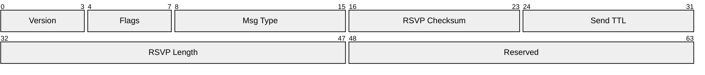
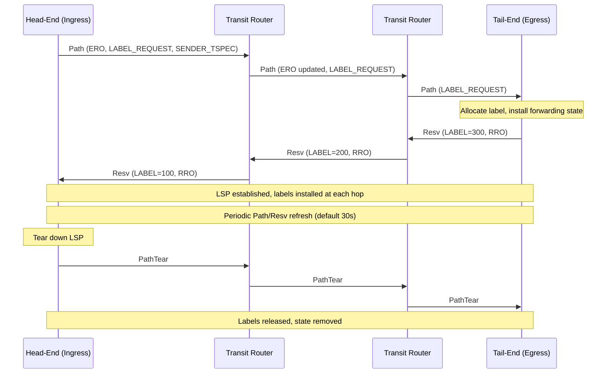
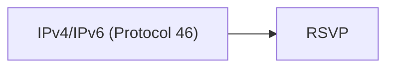

# RSVP (Resource Reservation Protocol)

> **Standard:** [RFC 2205](https://www.rfc-editor.org/rfc/rfc2205) | **Layer:** Network (Layer 3) | **Wireshark filter:** `rsvp`

RSVP is a signaling protocol that reserves resources (bandwidth, buffer space) along a network path to provide Quality of Service (QoS) guarantees for data flows. While the original RSVP was designed for IntServ-style reservations, its most important modern use is RSVP-TE (Traffic Engineering), which signals MPLS Label Switched Paths (LSPs) with explicit route control and fast reroute capabilities. RSVP runs directly over IP (protocol number 46) and uses a soft-state model -- reservations must be periodically refreshed or they time out.

## Common Header

## Key Fields

| Field | Size | Description |
|-------|------|-------------|
| Version | 4 bits | RSVP version; always `1` |
| Flags | 4 bits | 0x01 = Refresh-reduction capable |
| Msg Type | 8 bits | Message type (Path, Resv, Error, Teardown) |
| RSVP Checksum | 16 bits | Checksum over the full RSVP message |
| Send TTL | 8 bits | TTL value when the message was sent (detects non-RSVP hops) |
| RSVP Length | 16 bits | Total length of the RSVP message in bytes |

## Field Details

### Message Types

| Type | Name | Direction | Description |
|------|------|-----------|-------------|
| 1 | Path | Sender → Receiver | Establish path state at each hop; carry sender info |
| 2 | Resv | Receiver → Sender | Request resource reservation along the path |
| 3 | PathErr | Hop → Sender | Report an error in Path processing |
| 4 | ResvErr | Hop → Receiver | Report an error in Resv processing |
| 5 | PathTear | Sender → Receiver | Remove path state and associated reservations |
| 6 | ResvTear | Receiver → Sender | Remove reservation state |
| 7 | ResvConf | Sender → Receiver | Confirm a reservation was installed |

### RSVP Objects

RSVP messages carry a sequence of typed objects. Each object has a class and a C-Type:

| Object | Description |
|--------|-------------|
| SESSION | Identifies the data flow (destination IP, protocol, port/LSP ID) |
| RSVP_HOP | Previous/next RSVP hop address and logical interface |
| TIME_VALUES | Refresh period for soft-state maintenance |
| SENDER_TEMPLATE | Source IP and port identifying the sender |
| SENDER_TSPEC | Traffic specification (token bucket: rate, burst, peak rate) |
| FLOWSPEC | Requested QoS (guaranteed or controlled-load service) |
| FILTER_SPEC | Identifies which senders the reservation applies to |
| STYLE | Reservation style (Fixed-Filter, Shared-Explicit, Wildcard-Filter) |

### RSVP-TE Extensions (RFC 3209)

RSVP-TE adds objects for MPLS traffic engineering:

| Object | Description |
|--------|-------------|
| LABEL_REQUEST | Request a label assignment from downstream |
| LABEL | Assigned MPLS label (carried upstream in Resv) |
| EXPLICIT_ROUTE (ERO) | Ordered list of hops the LSP must traverse |
| RECORD_ROUTE (RRO) | Records the actual path taken (for loop detection) |
| SESSION_ATTRIBUTE | LSP name, setup/hold priority, flags (local protection, etc.) |
| FAST_REROUTE | Request facility or one-to-one backup protection |
| DETOUR | Identify backup path for one-to-one fast reroute |

### ERO (Explicit Route Object)

The ERO encodes a sequence of subobjects specifying the desired LSP path:

| Subobject type | Description |
|----------------|-------------|
| IPv4 prefix (strict) | Must traverse this exact next hop |
| IPv4 prefix (loose) | Must reach this node, path between is flexible |
| AS number | Traverse a specific autonomous system |
| Unnumbered interface | Identified by router ID and interface index |

### Reservation Styles

| Style | Abbreviation | Description |
|-------|-------------|-------------|
| Fixed-Filter | FF | Distinct reservation per sender |
| Shared-Explicit | SE | Shared reservation among listed senders |
| Wildcard-Filter | WF | Shared reservation for all senders |

## MPLS LSP Signaling (RSVP-TE)

### Fast Reroute (FRR)

RSVP-TE supports sub-50ms protection switching using pre-computed backup paths:

| FRR Type | Description |
|----------|-------------|
| Facility Backup | Pre-established bypass tunnel protects many LSPs (NNHOP or NHOP) |
| One-to-One Backup | Dedicated detour path for each protected LSP |

The Point of Local Repair (PLR) detects the failure and immediately reroutes traffic onto the backup path, then signals the head-end to recompute the primary path.

## Encapsulation

RSVP is carried directly in IP packets with protocol number 46. Unlike BGP or LDP, RSVP does not use TCP or UDP -- it is its own IP protocol with its own reliability mechanisms (refresh and summary refresh via RFC 2961).

## Standards

| Document | Title |
|----------|-------|
| [RFC 2205](https://www.rfc-editor.org/rfc/rfc2205) | Resource ReSerVation Protocol (RSVP) |
| [RFC 3209](https://www.rfc-editor.org/rfc/rfc3209) | RSVP-TE: Extensions to RSVP for LSP Tunnels |
| [RFC 4090](https://www.rfc-editor.org/rfc/rfc4090) | Fast Reroute Extensions to RSVP-TE for LSP Tunnels |
| [RFC 2961](https://www.rfc-editor.org/rfc/rfc2961) | RSVP Refresh Overhead Reduction Extensions |
| [RFC 3473](https://www.rfc-editor.org/rfc/rfc3473) | Generalized MPLS Signaling -- RSVP-TE Extensions (GMPLS) |
| [RFC 5440](https://www.rfc-editor.org/rfc/rfc5440) | Path Computation Element (PCE) Communication Protocol |

## See Also

- [MPLS](../tunneling/mpls.md) -- label switching data plane that RSVP-TE signals
- [LDP](ldp.md) -- alternative MPLS label distribution protocol
