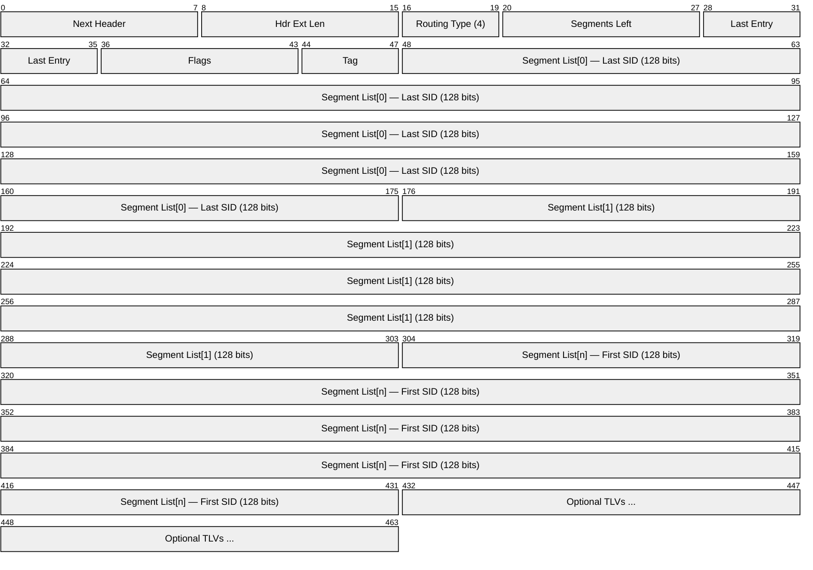
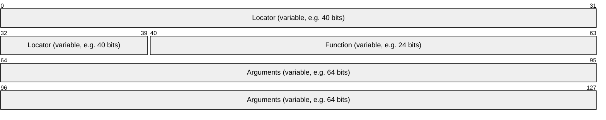
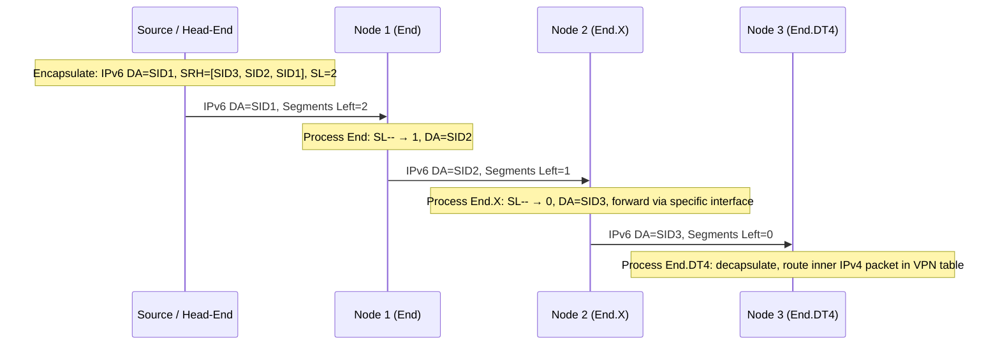
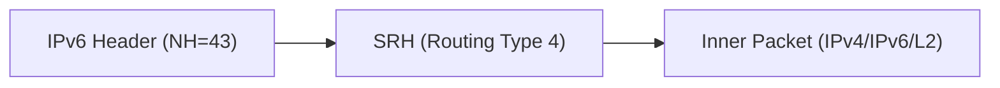

# SRv6 (Segment Routing over IPv6)

> **Standard:** [RFC 8986](https://www.rfc-editor.org/rfc/rfc8986) | **Layer:** Network (Layer 3) | **Wireshark filter:** `ipv6.routing.type == 4`

Segment Routing over IPv6 (SRv6) encodes forwarding instructions as an ordered list of IPv6 addresses (segments) in the Segment Routing Header (SRH), an IPv6 routing extension header. Each segment identifier (SID) is a 128-bit IPv6 address that represents an instruction -- forward to a node, follow a specific link, or apply a network function. SRv6 combines the source-routing paradigm of segment routing with the native IPv6 data plane, eliminating the need for MPLS labels while enabling sophisticated network programming.

## Segment Routing Header (SRH)

The SRH (Routing Type 4) is inserted as an IPv6 extension header:

## Key Fields

| Field | Size | Description |
|-------|------|-------------|
| Next Header | 8 bits | Type of the header following the SRH |
| Hdr Ext Len | 8 bits | Length of the SRH in 8-octet units (not counting first 8 octets) |
| Routing Type | 8 bits | Always `4` for Segment Routing |
| Segments Left | 8 bits | Index (0-based) into the segment list pointing to the active segment |
| Last Entry | 8 bits | Index of the last element in the segment list |
| Flags | 8 bits | Currently unused; must be zero |
| Tag | 16 bits | Packet tagging for policy-based routing |
| Segment List | 128 bits each | Ordered list of SIDs (IPv6 addresses), in reverse order |

## Field Details

### SID Format

An SRv6 SID is a 128-bit IPv6 address composed of three parts:

| Part | Description |
|------|-------------|
| Locator | Routable IPv6 prefix that identifies the node owning the SID |
| Function | Identifies the local behavior (instruction) to execute |
| Arguments | Optional parameters for the function (flow ID, VPN context, etc.) |

### SRv6 Endpoint Behaviors (RFC 8986)

| Behavior | Name | Description |
|----------|------|-------------|
| End | Endpoint | Decrement Segments Left; update IPv6 DA with next segment |
| End.X | Endpoint with Layer-3 cross-connect | Forward to a specific next hop via a specific interface |
| End.T | Endpoint with table lookup | Look up the inner destination in a specific routing table |
| End.DX2 | Endpoint with L2 cross-connect | Decapsulate and forward the L2 frame to an interface |
| End.DX4 | Endpoint with IPv4 cross-connect | Decapsulate and forward to an IPv4 next hop |
| End.DX6 | Endpoint with IPv6 cross-connect | Decapsulate and forward to an IPv6 next hop |
| End.DT4 | Endpoint with IPv4 table lookup | Decapsulate and look up in an IPv4 routing table (L3VPN) |
| End.DT6 | Endpoint with IPv6 table lookup | Decapsulate and look up in an IPv6 routing table (L3VPN) |
| End.DT46 | Endpoint with dual-stack table lookup | Decapsulate and look up in an IP routing table (dual-stack L3VPN) |
| End.B6.Encaps | Endpoint with SRH encapsulation | Insert a new IPv6 header with SRH |
| End.BM | Endpoint with SR-MPLS encapsulation | Encapsulate with MPLS labels |
| H.Encaps | Headend with SRH encapsulation | Encapsulate original packet with outer IPv6 + SRH |
| H.Encaps.Red | Headend with reduced SRH | Omit the last SID from the SRH (it is the DA) |

### Network Programming Model

SRv6 treats the network as a programmable infrastructure. Each node advertises its SIDs (via IGP extensions or BGP), and the head-end composes a segment list that chains together network instructions:

### SRH Optional TLVs

| TLV Type | Name | Description |
|----------|------|-------------|
| 1 | Padding | Align the SRH to a boundary |
| 5 | HMAC | Keyed hash for SRH integrity verification |
| 6 | NSH Carrier | Carries Network Service Header metadata |

### SRv6 vs SR-MPLS

| Feature | SRv6 | SR-MPLS |
|---------|------|---------|
| SID size | 128 bits (IPv6 address) | 20 bits (MPLS label) |
| Data plane | Native IPv6 | MPLS |
| MTU overhead | Higher (each SID = 16 bytes) | Lower (each label = 4 bytes) |
| Network programming | Rich function set per SID | Limited to forwarding actions |
| Midpoint state | Stateless (instructions in packet header) | Stateless (labels in stack) |
| Hardware support | Requires IPv6 extension header support | Mature MPLS silicon |
| Deployment | Greenfield / IPv6-native networks | Brownfield / existing MPLS networks |
| VPN support | End.DT4, End.DT6, End.DX* | VPN labels |
| Encapsulation | IPv6 + SRH | MPLS label stack |
| IGP extensions | IS-IS SRv6, OSPFv3 SRv6 | IS-IS SR, OSPF SR |

### SRv6 Encapsulation Modes

| Mode | Description |
|------|-------------|
| H.Encaps | New outer IPv6 header + SRH encapsulates the original packet |
| H.Encaps.Red | Reduced encapsulation: last SID placed in DA, not in the SRH |
| H.Insert | SRH inserted into the existing IPv6 header (no outer encapsulation) |
| H.Insert.Red | Reduced SRH inserted into the existing IPv6 header |

## Encapsulation

SRv6 uses IPv6 Routing Extension Header (Next Header = 43) with Routing Type 4. The inner payload can be IPv4, IPv6, or Layer 2 frames depending on the endpoint behavior. No MPLS headers are required.

## Standards

| Document | Title |
|----------|-------|
| [RFC 8986](https://www.rfc-editor.org/rfc/rfc8986) | Segment Routing over IPv6 (SRv6) Network Programming |
| [RFC 8754](https://www.rfc-editor.org/rfc/rfc8754) | IPv6 Segment Routing Header (SRH) |
| [RFC 9252](https://www.rfc-editor.org/rfc/rfc9252) | BGP Overlay Services Based on Segment Routing over IPv6 |
| [RFC 9256](https://www.rfc-editor.org/rfc/rfc9256) | Segment Routing Policy Architecture |
| [RFC 9352](https://www.rfc-editor.org/rfc/rfc9352) | IS-IS Extensions to Support SRv6 |
| [RFC 8402](https://www.rfc-editor.org/rfc/rfc8402) | Segment Routing Architecture |

## See Also

- [IPv6](../network-layer/ipv6.md) -- underlying data plane for SRv6
- [MPLS](../tunneling/mpls.md) -- alternative label switching data plane (SR-MPLS)
- [BGP](bgp.md) -- distributes SRv6 SIDs for overlay services
