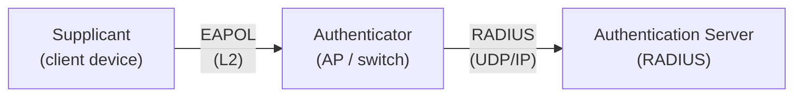
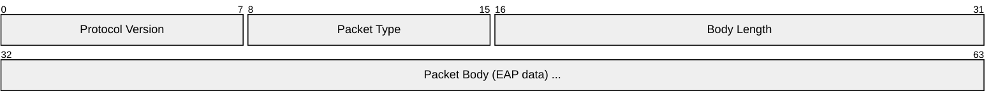
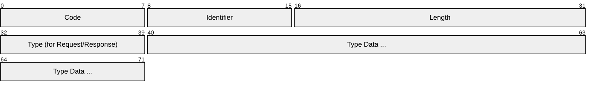
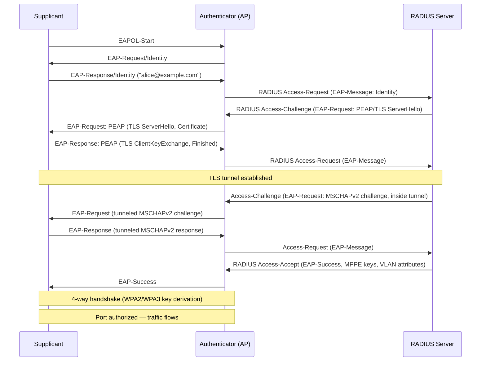
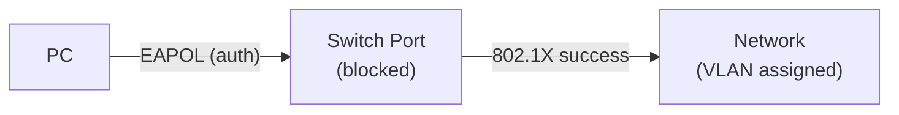
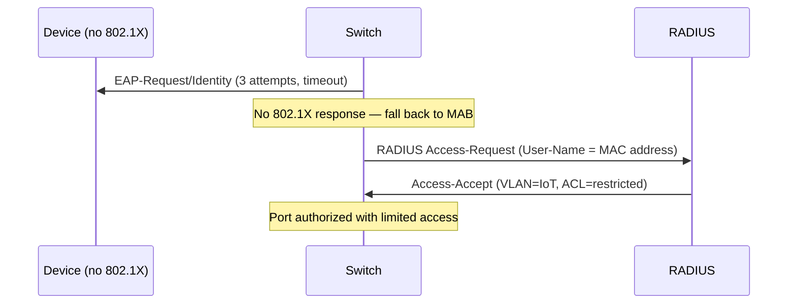
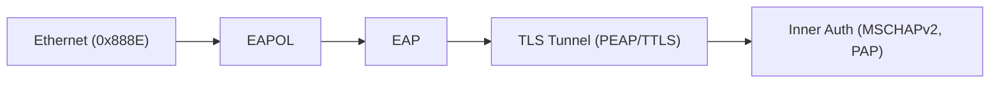

# 802.1X / EAP (Port-Based Network Access Control)

> **Standard:** [IEEE 802.1X-2020](https://standards.ieee.org/standard/802_1X-2020.html) / [RFC 3748](https://www.rfc-editor.org/rfc/rfc3748) (EAP) | **Layer:** Data Link (Layer 2) | **Wireshark filter:** `eapol` or `eap`

802.1X is a port-based access control framework that authenticates devices before granting them network access. It's the standard for WPA/WPA2/WPA3 Enterprise Wi-Fi and wired NAC (Network Access Control). The framework has three roles: the supplicant (client), the authenticator (switch/AP), and the authentication server (RADIUS). EAP (Extensible Authentication Protocol) is the pluggable mechanism that carries the actual authentication exchange — various EAP methods provide different credential types.

## Architecture

| Component | Role | Examples |
|-----------|------|---------|
| Supplicant | Client seeking access | Laptop, phone, IoT device |
| Authenticator | Enforces access control | Wi-Fi AP, Ethernet switch |
| Authentication Server | Validates credentials | FreeRADIUS, Microsoft NPS, Cisco ISE |

The authenticator is a pass-through — it relays EAP between the supplicant (over L2) and the RADIUS server (over IP).

## EAPOL Frame (EAP over LAN)

### EAPOL Packet Types

| Type | Name | Description |
|------|------|-------------|
| 0 | EAP-Packet | Carries an EAP frame |
| 1 | EAPOL-Start | Supplicant initiates authentication |
| 2 | EAPOL-Logoff | Supplicant logs off |
| 3 | EAPOL-Key | WPA/WPA2 4-way handshake key frames |
| 5 | EAPOL-Encapsulated-ASF-Alert | Alert messages |

EAPOL frames use Ethernet type `0x888E` and are sent to multicast `01:80:C2:00:00:03`.

## EAP Frame

### EAP Codes

| Code | Name | Description |
|------|------|-------------|
| 1 | Request | Server → client (challenge) |
| 2 | Response | Client → server (answer) |
| 3 | Success | Authentication succeeded |
| 4 | Failure | Authentication failed |

### EAP Types

| Type | Name | Description |
|------|------|-------------|
| 1 | Identity | Request/provide username |
| 2 | Notification | Display message to user |
| 3 | Nak | Client rejects proposed EAP method |
| 4 | MD5-Challenge | MD5 challenge-response (like CHAP) |
| 6 | GTC | Generic Token Card (one-time password) |
| 13 | EAP-TLS | Mutual TLS with client certificate |
| 21 | EAP-TTLS | TLS tunnel + inner auth (PAP, MSCHAPv2, etc.) |
| 25 | EAP-PEAP | TLS tunnel + inner EAP (MSCHAPv2, GTC) |
| 43 | EAP-FAST | Cisco's tunneled method (PAC-based) |
| 18 | EAP-SIM | GSM SIM card authentication |
| 23 | EAP-AKA | UMTS/LTE SIM authentication |
| 50 | EAP-AKA' | Enhanced AKA for 5G/LTE |

## Authentication Flow (EAP-PEAP)

## Common EAP Methods

| Method | Client Cert | Server Cert | Inner Auth | Security | Deployment |
|--------|-------------|-------------|-----------|----------|------------|
| EAP-TLS | Required | Required | N/A (mutual TLS) | Highest | Enterprises with PKI |
| EAP-PEAP | No | Required | MSCHAPv2 or GTC | High | Most common enterprise Wi-Fi |
| EAP-TTLS | No | Required | PAP, CHAP, MSCHAPv2 | High | Popular in education (eduroam) |
| EAP-FAST | No | Optional | MSCHAPv2, GTC | High | Cisco environments |
| EAP-SIM | SIM card | No | GSM auth vectors | High | Carrier Wi-Fi offload |
| EAP-AKA | USIM card | No | UMTS/LTE auth | High | Carrier Wi-Fi offload |
| EAP-MD5 | No | No | MD5 challenge | Low | Testing only (no key derivation) |

## Port States

The authenticator's port has two virtual states:

| State | Traffic Allowed | When |
|-------|----------------|------|
| Unauthorized | Only EAPOL frames | Before successful authentication |
| Authorized | All traffic | After EAP-Success + key exchange |

### Wired 802.1X

On a wired switch, the physical port is blocked until authentication:

The switch can assign the authenticated device to a specific VLAN, apply an ACL, or quarantine it based on RADIUS attributes.

## RADIUS Attributes for 802.1X

| Attribute | Description |
|-----------|-------------|
| Tunnel-Type (64) | VLAN (value 13) |
| Tunnel-Medium-Type (65) | 802 (value 6) |
| Tunnel-Private-Group-ID (81) | VLAN number or name |
| Filter-Id (11) | ACL name to apply |
| Session-Timeout (27) | Re-authentication interval |
| EAP-Message (79) | Encapsulated EAP data |
| Message-Authenticator (80) | HMAC-MD5 integrity (mandatory for EAP) |
| MS-MPPE-Recv-Key | PMK for WPA key derivation |
| MS-MPPE-Send-Key | PMK for WPA key derivation |

## MAB (MAC Authentication Bypass)

For devices that don't support 802.1X (printers, cameras, IoT):

## Encapsulation

## Standards

| Document | Title |
|----------|-------|
| [IEEE 802.1X-2020](https://standards.ieee.org/standard/802_1X-2020.html) | Port-Based Network Access Control |
| [RFC 3748](https://www.rfc-editor.org/rfc/rfc3748) | Extensible Authentication Protocol (EAP) |
| [RFC 5216](https://www.rfc-editor.org/rfc/rfc5216) | EAP-TLS Authentication Protocol |
| [RFC 7170](https://www.rfc-editor.org/rfc/rfc7170) | Tunnel EAP (TEAP) |
| [RFC 2716](https://www.rfc-editor.org/rfc/rfc2716) | PPP EAP-TLS |

## See Also

- [WPA2 / WPA3](wpa.md) — Wi-Fi security built on 802.1X
- [RADIUS](radius.md) — authentication server
- [Kerberos](kerberos.md) — credential source for EAP-TLS/PEAP
- [802.11 (Wi-Fi)](../wireless/80211.md) — wireless LAN
- [Ethernet](../link-layer/ethernet.md) — wired 802.1X
- [TLS](tls.md) — used inside EAP-TLS/PEAP/TTLS
