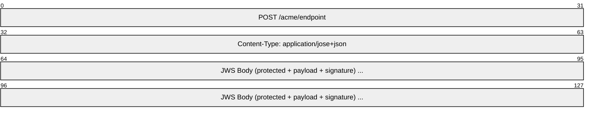
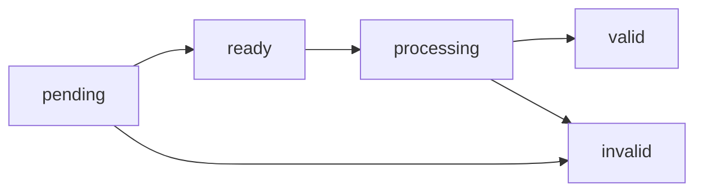
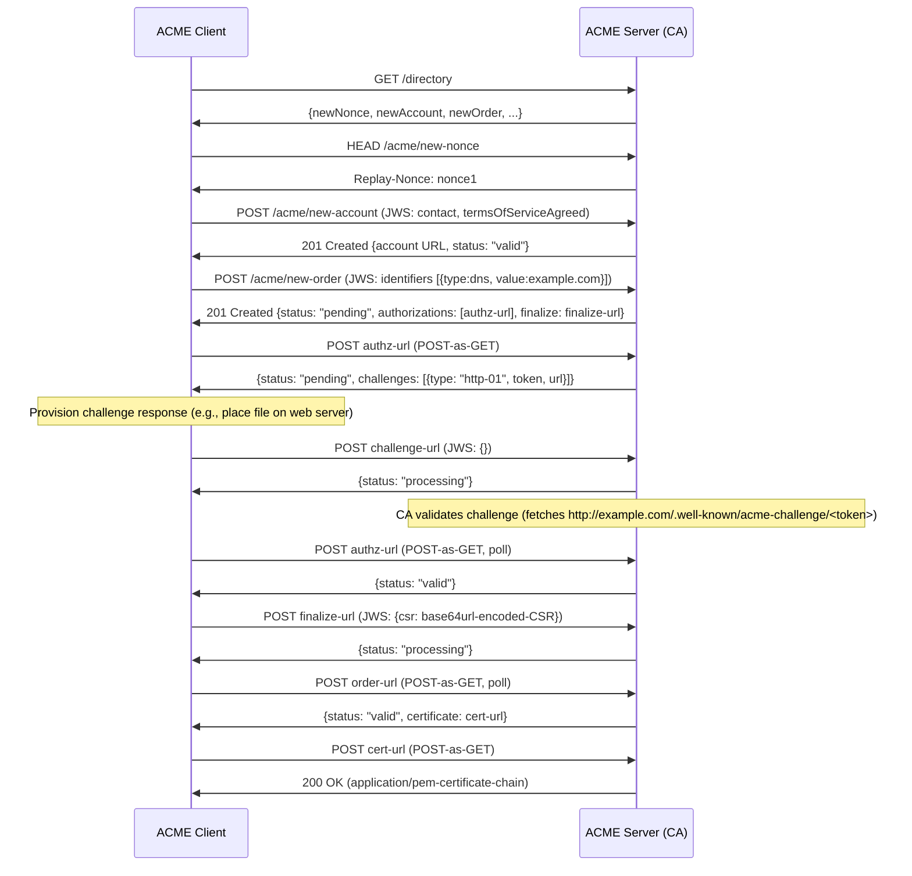
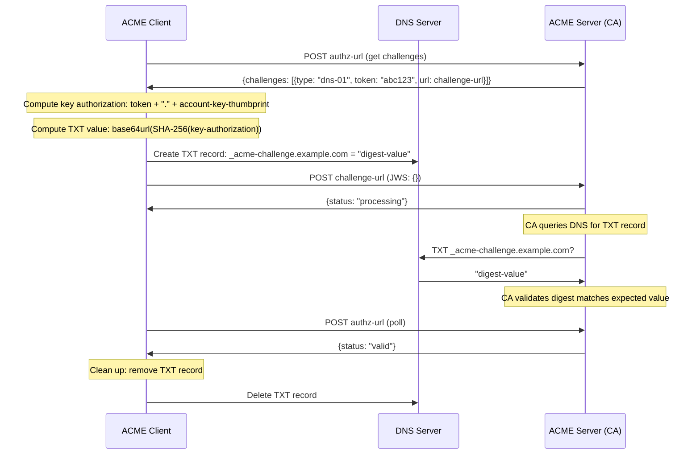
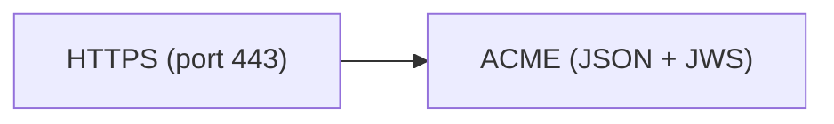

# ACME (Automatic Certificate Management Environment)

> **Standard:** [RFC 8555](https://www.rfc-editor.org/rfc/rfc8555) | **Layer:** Application (Layer 7) | **Wireshark filter:** `http2 or tls`

ACME is a protocol for automating the issuance, renewal, and revocation of X.509 TLS certificates. Developed by the Internet Security Research Group (ISRG) for Let's Encrypt, ACME eliminates the manual, error-prone process of obtaining certificates. The protocol runs over HTTPS, using JSON request/response bodies protected by JWS (JSON Web Signature). An ACME client proves control of a domain through challenge-response validation, then submits a Certificate Signing Request (CSR) and receives a signed certificate — all without human intervention. Let's Encrypt is the most widely used ACME CA, but the protocol is supported by many certificate authorities.

## Protocol Overview

ACME communication is JSON over HTTPS. All POST requests from the client are JWS-signed (using the `Flattened JSON Serialization` with a protected header, payload, and signature). The server uses standard HTTPS responses with JSON bodies.

### JWS-Protected Request

| Field | Description |
|-------|-------------|
| protected | Base64url-encoded JSON header: `alg`, `nonce`, `url`, `kid` (or `jwk` for new accounts) |
| payload | Base64url-encoded JSON body (empty string for POST-as-GET) |
| signature | Base64url-encoded signature over `protected.payload` |

## Directory Resource

Every ACME server exposes a directory at a well-known URL (e.g., `/directory`) listing available endpoints:

| Field | Description |
|-------|-------------|
| `newNonce` | URL to request a fresh anti-replay nonce |
| `newAccount` | URL to create or look up an account |
| `newOrder` | URL to submit a new certificate order |
| `revokeCert` | URL to revoke a certificate |
| `keyChange` | URL to change the account key |
| `meta` | Optional metadata: terms of service, website, CA identifiers |

## Order Lifecycle

An order tracks the certificate issuance process through these states:

| State | Description |
|-------|-------------|
| `pending` | Order created; authorizations need to be completed |
| `ready` | All authorizations satisfied; client may finalize (submit CSR) |
| `processing` | CA is issuing the certificate |
| `valid` | Certificate has been issued and is available for download |
| `invalid` | An authorization failed or the order expired |

## Challenge Types

The client proves domain control through one of these challenge types:

| Challenge | Type String | Method | Description |
|-----------|-------------|--------|-------------|
| HTTP-01 | `http-01` | HTTP | Place a token file at `http://<domain>/.well-known/acme-challenge/<token>` |
| DNS-01 | `dns-01` | DNS | Create a TXT record at `_acme-challenge.<domain>` with a digest of the key authorization |
| TLS-ALPN-01 | `tls-alpn-01` | TLS | Respond on port 443 with a self-signed certificate containing the validation token (ALPN protocol `acme-tls/1`) |

### Key Authorization

For all challenges, the key authorization string is: `<token>.<account-key-thumbprint>`

For `dns-01`, the TXT record value is the base64url-encoded SHA-256 digest of the key authorization.

## Full Certificate Issuance Flow

## DNS-01 Challenge Flow

## Certificate Renewal

ACME certificates (especially Let's Encrypt) have short lifetimes (typically 90 days). Renewal follows the same order/authorize/finalize flow. Clients like Certbot and acme.sh automate this via cron jobs or systemd timers, typically renewing 30 days before expiration.

## Certificate Revocation

A client can revoke a certificate by POSTing to the `revokeCert` endpoint:

| Field | Description |
|-------|-------------|
| `certificate` | Base64url-encoded DER of the certificate to revoke |
| `reason` | Optional revocation reason code (RFC 5280: 0=unspecified, 1=keyCompromise, etc.) |

The request can be signed by the account key or the certificate's private key.

## Encapsulation

## Standards

| Document | Title |
|----------|-------|
| [RFC 8555](https://www.rfc-editor.org/rfc/rfc8555) | Automatic Certificate Management Environment (ACME) |
| [RFC 8737](https://www.rfc-editor.org/rfc/rfc8737) | ACME TLS-ALPN-01 Challenge Extension |
| [RFC 8738](https://www.rfc-editor.org/rfc/rfc8738) | ACME IP Identifier Validation Extension |
| [RFC 7515](https://www.rfc-editor.org/rfc/rfc7515) | JSON Web Signature (JWS) — used for request signing |
| [RFC 8823](https://www.rfc-editor.org/rfc/rfc8823) | Extensions to ACME for Subdomains |

## See Also

- [TLS](tls.md) -- the certificates ACME issues are used to secure TLS connections
- [HTTP](../web/http.md) -- ACME runs over HTTPS
- [DNS](../naming/dns.md) -- dns-01 challenge validates via DNS TXT records
- [WireGuard](wireguard.md) -- modern VPN that also uses X.509-adjacent key management
