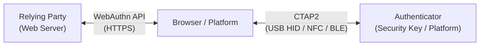
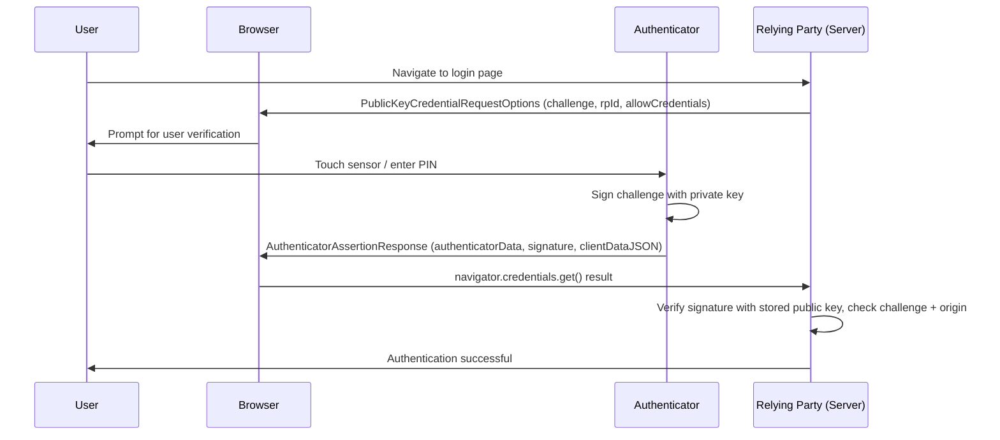
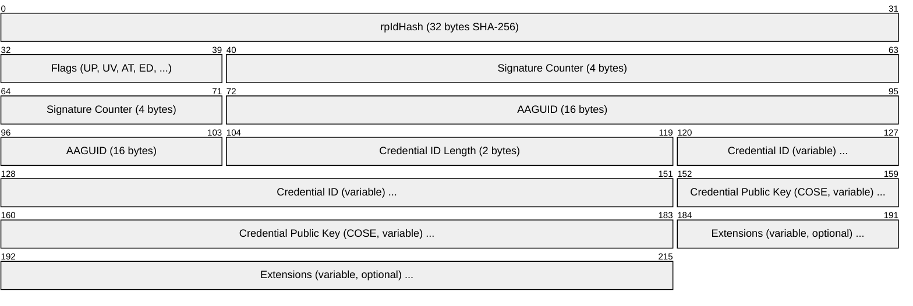
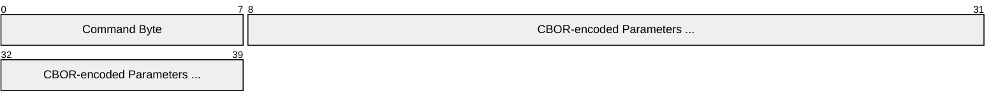
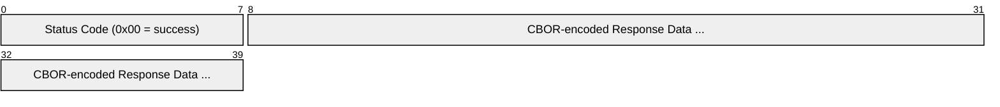

# FIDO2 / WebAuthn (Fast Identity Online 2 / Web Authentication)

> **Standard:** [W3C WebAuthn Level 3](https://www.w3.org/TR/webauthn-3/) / [FIDO Alliance CTAP 2.2](https://fidoalliance.org/specs/) | **Layer:** Application (Layer 7) | **Wireshark filter:** N/A (browser API + local authenticator)

FIDO2 is the passwordless authentication standard that replaces passwords with public-key cryptography. It consists of two complementary specifications: **WebAuthn** (a W3C browser API for relying parties to create and verify credentials) and **CTAP** (the FIDO Alliance protocol for communicating with hardware authenticators like security keys). Together they enable phishing-resistant authentication -- the private key never leaves the authenticator, credentials are origin-bound, and there is nothing to phish, replay, or stuff. FIDO2 is supported by all major browsers and platforms, and powers passkeys (synced multi-device FIDO credentials).

## Architecture



## Authenticator Types

| Type | Description | Examples |
|------|-------------|---------|
| Platform (Internal) | Built into the device; uses biometrics or device PIN | Touch ID, Face ID, Windows Hello, Android biometrics |
| Roaming (Cross-Platform) | External hardware token; portable across devices | YubiKey, Google Titan, Feitian, SoloKeys |
| Synced (Passkey) | Platform credential synced across devices via cloud | iCloud Keychain, Google Password Manager, 1Password |

## Registration Ceremony (Create Credential)

```mermaid
sequenceDiagram
  participant U as User
  participant B as Browser
  participant A as Authenticator
  participant S as Relying Party (Server)

  U->>S: Navigate to registration page
  S->>B: PublicKeyCredentialCreationOptions (challenge, rp, user, pubKeyCredParams)
  B->>U: Prompt for user verification (biometric / PIN)
  U->>A: Touch sensor / enter PIN
  A->>A: Generate new key pair (private key stored locally)
  A->>B: AuthenticatorAttestationResponse (attestationObject, clientDataJSON)
  B->>S: navigator.credentials.create() result
  S->>S: Verify challenge, origin, attestation; store public key + credential ID
  S->>U: Registration successful
```

## Authentication Ceremony (Get Assertion)



## PublicKeyCredentialCreationOptions

| Field | Type | Description |
|-------|------|-------------|
| challenge | BufferSource | Random bytes from server (minimum 16 bytes) -- prevents replay |
| rp | Object | Relying party: `{ id: "example.com", name: "Example Corp" }` |
| user | Object | User: `{ id: <buffer>, name: "alice@example.com", displayName: "Alice" }` |
| pubKeyCredParams | Array | Allowed algorithms: `[{ type: "public-key", alg: -7 }]` (-7 = ES256, -257 = RS256) |
| timeout | Number | Ceremony timeout in milliseconds |
| attestation | String | `"none"` (default), `"indirect"`, or `"direct"` |
| authenticatorSelection | Object | Platform vs cross-platform, resident key requirement, user verification |
| excludeCredentials | Array | Credential IDs to prevent re-registration |

## AuthenticatorAttestationResponse

| Field | Description |
|-------|-------------|
| clientDataJSON | JSON: `{ type: "webauthn.create", challenge: "...", origin: "https://example.com" }` |
| attestationObject | CBOR-encoded: `{ fmt, attStmt, authData }` |

### authData (within attestationObject)



### Flags Byte

| Bit | Name | Description |
|-----|------|-------------|
| 0 | UP | User Present -- user interacted with authenticator |
| 2 | UV | User Verified -- biometric or PIN verified |
| 6 | AT | Attested Credential Data present |
| 7 | ED | Extension Data present |

## AuthenticatorAssertionResponse

| Field | Description |
|-------|-------------|
| clientDataJSON | JSON: `{ type: "webauthn.get", challenge: "...", origin: "https://example.com" }` |
| authenticatorData | rpIdHash + flags + signCount (no credential data) |
| signature | ECDSA/RSA signature over `authData \|\| hash(clientDataJSON)` |
| userHandle | User ID (from registration), enables username-less login |

## CTAP2 (Client to Authenticator Protocol)

CTAP2 defines the wire protocol between the platform (browser/OS) and the authenticator hardware:

### Transports

| Transport | Description | Framing |
|-----------|-------------|---------|
| USB HID | USB Human Interface Device | 64-byte HID reports |
| NFC | Near Field Communication | ISO 7816-4 APDUs (extended length) |
| BLE | Bluetooth Low Energy | FIDO BLE service (GATT) |
| Hybrid | QR code + BLE + cloud assist | Cross-device (phone as authenticator) |

### CTAP2 Commands

| Command | Byte | Description |
|---------|------|-------------|
| authenticatorMakeCredential | 0x01 | Create a new credential (registration) |
| authenticatorGetAssertion | 0x02 | Sign a challenge (authentication) |
| authenticatorGetInfo | 0x04 | Query authenticator capabilities and supported features |
| authenticatorClientPIN | 0x06 | Set/change/get PIN token, get retries |
| authenticatorReset | 0x07 | Factory reset (remove all credentials) |
| authenticatorGetNextAssertion | 0x08 | Get next assertion when multiple credentials match |
| authenticatorCredentialManagement | 0x0A | Enumerate and delete resident credentials |
| authenticatorSelection | 0x0B | Prompt user to select this authenticator (touch) |
| authenticatorLargeBlobs | 0x0C | Store/retrieve large blobs associated with credentials |
| authenticatorConfig | 0x0D | Configure authenticator settings |

### CTAP2 Message Format



Response:



## Passkeys (Multi-Device FIDO Credentials)

Passkeys extend FIDO2 by allowing credential private keys to sync across a user's devices through platform cloud services:

| Feature | Traditional FIDO2 Key | Passkey |
|---------|----------------------|---------|
| Storage | Single hardware device | Synced via cloud (iCloud, Google, etc.) |
| Recovery | Backup key required | Restored from cloud backup |
| Cross-device | Each device needs own credential | Available on all synced devices |
| Phishing-resistant | Yes | Yes (origin-bound) |
| Discoverable | Optional | Always (resident key) |

## Algorithms

| COSE Algorithm ID | Name | Description |
|-------------------|------|-------------|
| -7 | ES256 | ECDSA with P-256 and SHA-256 (most common) |
| -8 | EdDSA | Edwards-curve Digital Signature Algorithm (Ed25519) |
| -257 | RS256 | RSASSA-PKCS1-v1_5 with SHA-256 |
| -37 | PS256 | RSASSA-PSS with SHA-256 |

## FIDO2 vs Password vs TOTP

| Feature | FIDO2 / Passkeys | Password | TOTP (Google Authenticator) |
|---------|-----------------|----------|----------------------------|
| Phishing-resistant | Yes (origin-bound) | No | No (code can be phished in real-time) |
| Replay-resistant | Yes (challenge-response) | No | Partial (time-limited) |
| Server breach risk | Public key only (useless to attacker) | Hashed password (crackable) | Shared secret (reusable) |
| User experience | Biometric touch / tap | Type password | Open app, type 6 digits |
| Account recovery | Platform sync / backup key | Email reset | Backup codes |
| Credential stuffing | Impossible | Common attack | N/A (second factor) |
| Man-in-the-middle | Prevented (TLS channel binding) | Possible | Possible |
| Zero-knowledge | Yes (private key never transmitted) | No (password sent to server) | No (both sides know secret) |

## Attestation Formats

| Format | Description |
|--------|-------------|
| packed | Standard FIDO2 attestation (self-attestation or CA-signed) |
| tpm | Trusted Platform Module attestation |
| android-key | Android hardware keystore attestation |
| android-safetynet | Android SafetyNet / Play Integrity |
| apple | Apple Anonymous Attestation |
| fido-u2f | Backward-compatible U2F attestation |
| none | No attestation (privacy-preserving default) |

## Standards

| Document | Title |
|----------|-------|
| [W3C WebAuthn Level 3](https://www.w3.org/TR/webauthn-3/) | Web Authentication: An API for accessing Public Key Credentials |
| [FIDO CTAP 2.2](https://fidoalliance.org/specs/fido-v2.2-rd-20230321/fido-client-to-authenticator-protocol-v2.2-rd-20230321.html) | Client to Authenticator Protocol |
| [FIDO Metadata Service](https://fidoalliance.org/metadata/) | Authenticator metadata for trust decisions |
| [RFC 8809](https://www.rfc-editor.org/rfc/rfc8809) | FIDO Alliance attestation statement format identifiers |
| [COSE (RFC 9053)](https://www.rfc-editor.org/rfc/rfc9053) | CBOR Object Signing and Encryption (algorithm identifiers) |

## See Also

- [WireGuard](wireguard.md) -- modern cryptographic protocol (different domain, similar philosophy of simplicity)
- [Bluetooth LE](../wireless/ble.md) -- CTAP2 transport for roaming authenticators
- [NFC](../wireless/nfc.md) -- CTAP2 transport for tap-to-authenticate
- [USB](../bus/usb.md) -- CTAP2 transport (USB HID)
