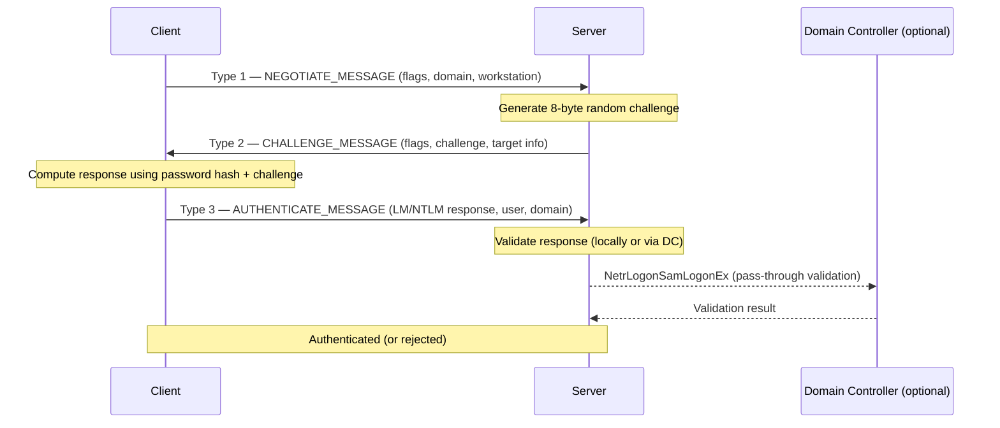
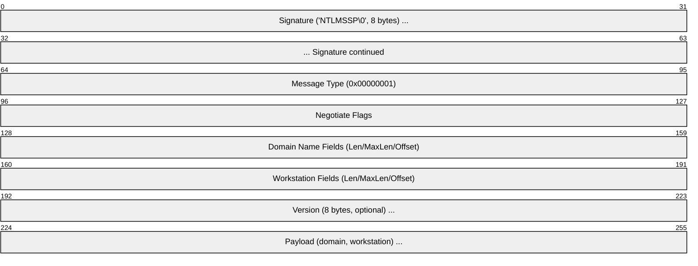
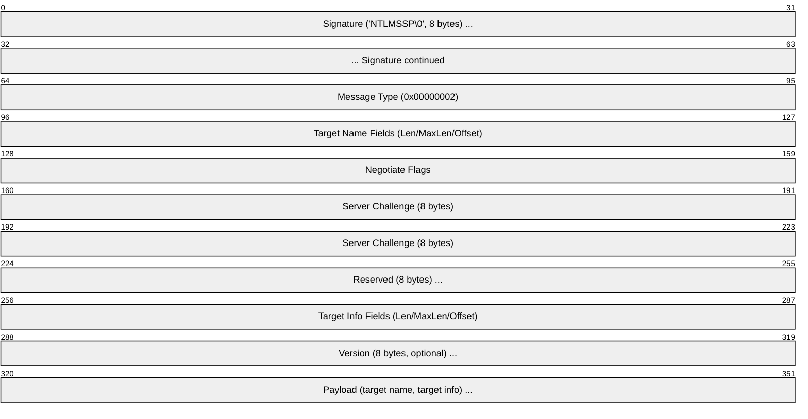
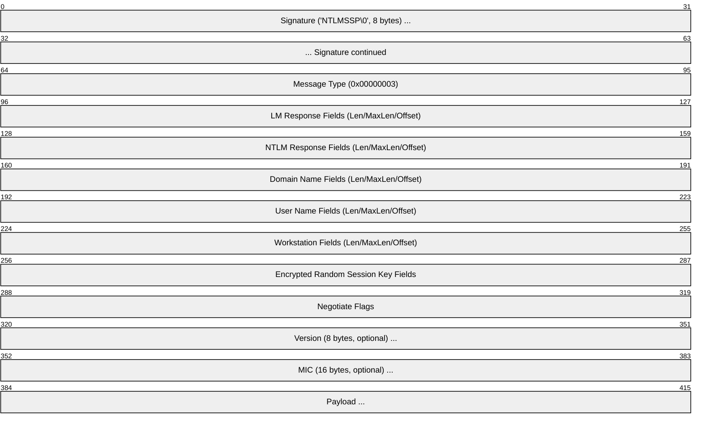

# NTLM (NT LAN Manager)

> **Standard:** [MS-NLMP (Microsoft Open Specifications)](https://learn.microsoft.com/en-us/openspecs/windows_protocols/ms-nlmp/) | **Layer:** Application / Authentication | **Wireshark filter:** `ntlmssp`

NTLM is a challenge-response authentication protocol developed by Microsoft. It authenticates clients without transmitting passwords over the network — instead, the server sends a random challenge and the client proves knowledge of the password by computing a cryptographic response. NTLM operates as a Security Support Provider (SSP) via the NTLMSSP interface and is embedded in many protocols including HTTP, SMB, LDAP, SMTP, and DCE/RPC. While still widely deployed in Windows environments, NTLM is considered legacy and is being deprecated in favor of Kerberos due to fundamental security weaknesses including vulnerability to pass-the-hash, relay, and brute-force attacks.

## Three-Message Challenge-Response

NTLM authentication uses exactly three messages:

## Type 1 — NEGOTIATE_MESSAGE

Sent by the client to initiate authentication and advertise supported features:

| Field | Size | Description |
|-------|------|-------------|
| Signature | 8 bytes | Always `NTLMSSP\0` (null-terminated) |
| Message Type | 4 bytes | Always 0x00000001 |
| Negotiate Flags | 4 bytes | Bitfield of requested capabilities |
| Domain Name | Variable | Client's domain (optional) |
| Workstation Name | Variable | Client's workstation name (optional) |
| Version | 8 bytes | OS version info (present if NEGOTIATE_VERSION flag set) |

## Type 2 — CHALLENGE_MESSAGE

Sent by the server with a random challenge for the client to sign:

| Field | Size | Description |
|-------|------|-------------|
| Signature | 8 bytes | Always `NTLMSSP\0` |
| Message Type | 4 bytes | Always 0x00000002 |
| Target Name | Variable | Server's domain or machine name |
| Negotiate Flags | 4 bytes | Flags reflecting negotiated capabilities |
| Server Challenge | 8 bytes | Random nonce used to compute the response |
| Target Info | Variable | AV_PAIR structures (domain, server name, DNS, timestamp) |

### Target Info AV_PAIRs

| AV ID | Name | Description |
|-------|------|-------------|
| 0x0001 | MsvAvNbComputerName | Server NetBIOS name |
| 0x0002 | MsvAvNbDomainName | Domain NetBIOS name |
| 0x0003 | MsvAvDnsComputerName | Server DNS hostname |
| 0x0004 | MsvAvDnsDomainName | Domain DNS name |
| 0x0007 | MsvAvTimestamp | FILETIME timestamp (used in NTLMv2) |
| 0x0009 | MsvAvTargetName | SPN of the target server |
| 0x000A | MsvAvChannelBindings | MD5 hash of TLS channel binding |

## Type 3 — AUTHENTICATE_MESSAGE

Sent by the client with the computed response proving password knowledge:

| Field | Size | Description |
|-------|------|-------------|
| LM Response | 24 bytes (v1) or variable | LM compatibility response |
| NTLM Response | 24 bytes (v1) or variable | NT response (NTLMv1 or NTLMv2) |
| Domain Name | Variable | User's domain (Unicode) |
| User Name | Variable | Account name (Unicode) |
| Workstation Name | Variable | Client machine name (Unicode) |
| Encrypted Random Session Key | 16 bytes | Session key encrypted with response key (for signing/sealing) |
| MIC | 16 bytes | Message Integrity Code over all three messages (NTLMv2) |

## NTLMv1 vs NTLMv2

| Property | NTLMv1 | NTLMv2 |
|----------|--------|--------|
| Hash algorithm | DES-based (MD4 of password → DES key) | HMAC-MD5 |
| Challenge | 8-byte server challenge only | Server challenge + client challenge + timestamp + target info |
| Response size | 24 bytes (LM + NTLM) | Variable (NTProofStr + client blob) |
| Replay protection | None | Timestamp in blob prevents replay |
| Security | Weak — vulnerable to rainbow tables, DES brute-force | Stronger — but still hash-based (no PFS) |
| LM hash | Optional (can be disabled) | Not used (sent as zeros or dummy) |
| Default since | Windows NT 4.0 | Windows Vista / Server 2008 |
| Recommendation | Disable immediately | Use only when Kerberos is unavailable |

### NTLMv2 Response Computation

| Step | Operation |
|------|-----------|
| 1 | NT Hash = MD4(Unicode(password)) |
| 2 | NTLMv2 Hash = HMAC-MD5(NT Hash, Unicode(uppercase(username) + domain)) |
| 3 | Build client blob (timestamp, client challenge, target info) |
| 4 | NTProofStr = HMAC-MD5(NTLMv2 Hash, server challenge + client blob) |
| 5 | NTLMv2 Response = NTProofStr + client blob |

## Negotiate Flags

Key flags negotiated between client and server:

| Flag | Bit | Description |
|------|-----|-------------|
| NEGOTIATE_UNICODE | 0 | Unicode strings |
| NEGOTIATE_OEM | 1 | OEM character set |
| REQUEST_TARGET | 2 | Server should return target name |
| NEGOTIATE_SIGN | 4 | Message signing requested |
| NEGOTIATE_SEAL | 5 | Message encryption (sealing) requested |
| NEGOTIATE_LM_KEY | 7 | LAN Manager session key |
| NEGOTIATE_NTLM | 9 | NTLM authentication (always set) |
| NEGOTIATE_ANONYMOUS | 11 | Anonymous connection |
| NEGOTIATE_EXTENDED_SESSIONSECURITY | 19 | Extended session security (NTLMv2 session security) |
| NEGOTIATE_TARGET_INFO | 23 | Target info block present |
| NEGOTIATE_VERSION | 25 | Version field present |
| NEGOTIATE_128 | 29 | 128-bit session key |
| NEGOTIATE_KEY_EXCH | 30 | Key exchange for session key |
| NEGOTIATE_56 | 31 | 56-bit encryption |

## Protocols That Carry NTLM

NTLM is embedded in numerous protocols as an authentication sub-protocol:

| Protocol | Mechanism |
|----------|-----------|
| HTTP | `Authorization: NTLM <base64>` header (via WWW-Authenticate negotiation) |
| SMB | NTLMSSP in SMB Session Setup |
| LDAP | SASL NTLM bind |
| SMTP / IMAP | AUTH NTLM command |
| DCE/RPC | NTLMSSP authentication context |
| MSSQL | NTLM via TDS login packets |
| WinRM / PowerShell Remoting | NTLM over HTTP (WSMAN) |

## Security Weaknesses

| Attack | Description |
|--------|-------------|
| Pass-the-Hash (PtH) | The NT hash alone is sufficient to authenticate — no password needed |
| NTLM Relay | Attacker relays Type 1/2/3 messages between victim and target server |
| Brute-force / Rainbow tables | NTLMv1 hashes are DES-based and fast to crack |
| Credential forwarding | No mutual authentication — server is not verified |
| No Perfect Forward Secrecy | Compromised hash exposes all past sessions |
| Reflection attacks | Attacker reflects challenge back to the client (mitigated in NTLMv2) |

### Why NTLM Is Being Deprecated

Microsoft has announced plans to deprecate NTLM in Windows. Key reasons include the lack of mutual authentication, the pass-the-hash vulnerability (attackers with hash access can authenticate without the password), and the absence of modern protections like channel binding by default. Kerberos provides mutual authentication, delegation, and is based on tickets rather than password hashes.

## NTLM vs Kerberos

| Feature | NTLM | Kerberos |
|---------|------|----------|
| Authentication model | Challenge-response (password hash) | Ticket-based (KDC issues tickets) |
| Mutual authentication | No (server not verified) | Yes (both sides verified) |
| Third-party trust | No (direct client-server) | Yes (KDC / Domain Controller) |
| Delegation | No | Yes (constrained and unconstrained) |
| Pass-the-hash vulnerable | Yes | No (uses session keys) |
| Requires DC connectivity | Only for domain validation | Yes (for ticket granting) |
| Protocol overhead | 3 messages | 6+ messages (including TGT + service ticket) |
| Clock sensitivity | None | Requires synchronized clocks (5-minute window) |
| Offline authentication | Yes (cached credentials) | Limited |
| Modern recommendation | Deprecated / fallback only | Preferred for all Windows authentication |

## Standards

| Document | Title |
|----------|-------|
| [MS-NLMP](https://learn.microsoft.com/en-us/openspecs/windows_protocols/ms-nlmp/) | NT LAN Manager (NTLM) Authentication Protocol |
| [MS-NTHT](https://learn.microsoft.com/en-us/openspecs/windows_protocols/ms-ntht/) | NTLM Over HTTP Protocol |
| [RFC 4178](https://www.rfc-editor.org/rfc/rfc4178) | SPNEGO (used to negotiate NTLM vs Kerberos) |

## See Also

- [Kerberos](kerberos.md) — preferred replacement for NTLM in Active Directory environments
- [SMB](../file-sharing/smb.md) — primary protocol that uses NTLM authentication
- [LDAP](ldap.md) — directory protocol that supports NTLM bind
- [TLS](tls.md) — transport-layer security (NTLM can be carried over TLS)
- [OAuth 2.0](oauth2.md) — modern token-based authorization framework
