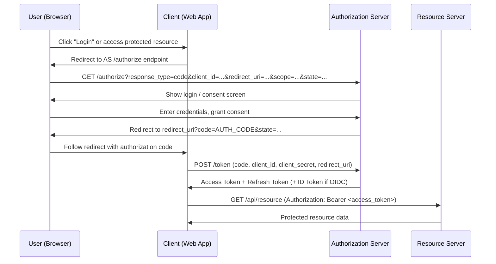
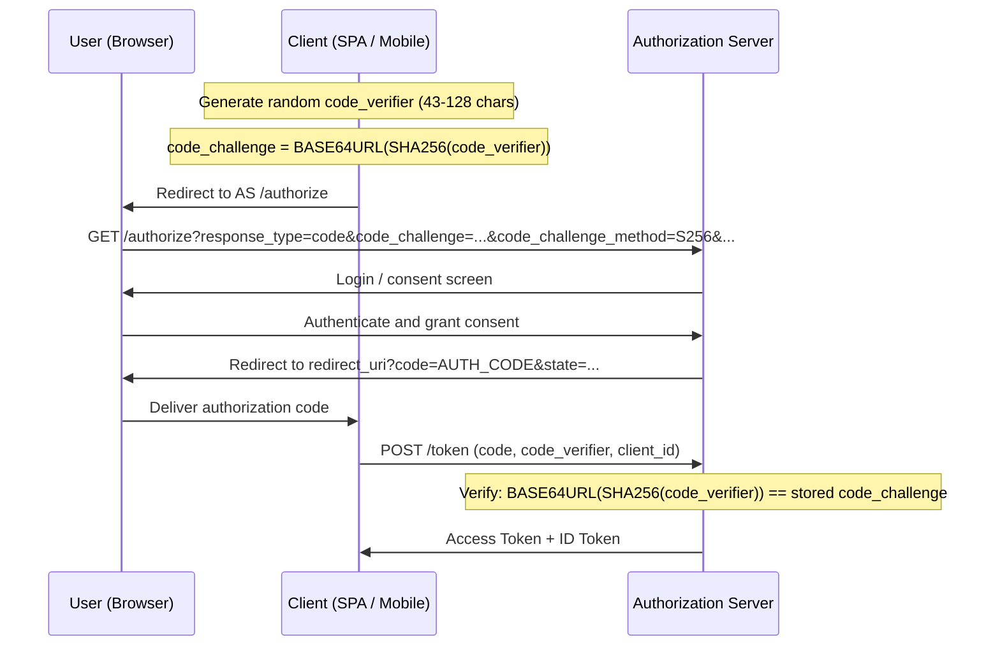
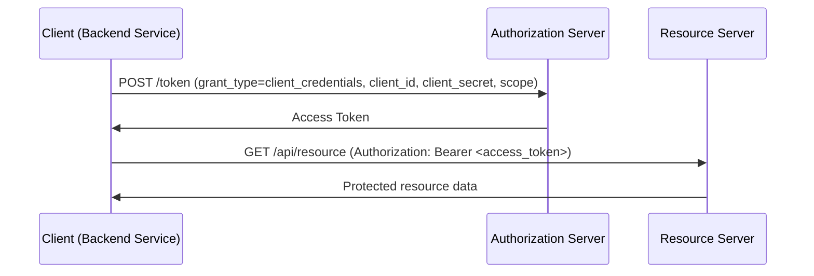
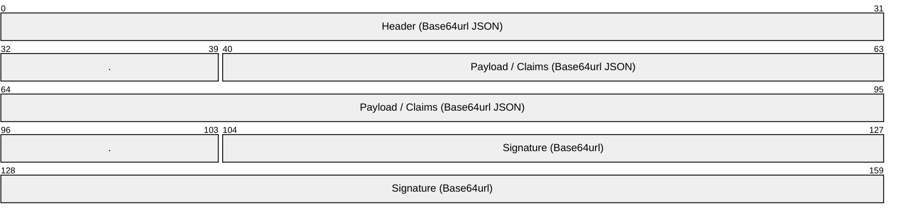
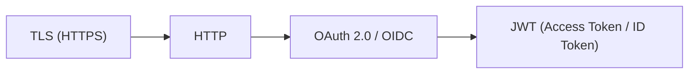

# OAuth 2.0 / OpenID Connect

> **Standard:** [RFC 6749](https://www.rfc-editor.org/rfc/rfc6749) | **Layer:** Application (Layer 7) | **Wireshark filter:** `http contains "Bearer" or http.request.uri contains "oauth" or http.request.uri contains "openid"`

OAuth 2.0 is an authorization framework that enables third-party applications to obtain limited access to an HTTP service on behalf of a resource owner. It replaces the pattern of sharing passwords with delegated, scoped, revocable access tokens. OpenID Connect (OIDC) is an identity layer built on top of OAuth 2.0 that adds authentication, providing a standardized way to verify a user's identity and obtain basic profile information via ID Tokens (JWTs).

## Core Concepts

| Component | Description |
|-----------|-------------|
| Resource Owner | The user who owns the data and grants access |
| Client | The application requesting access (web app, mobile app, CLI) |
| Authorization Server (AS) | Issues tokens after authenticating the resource owner (e.g., Okta, Auth0, Keycloak) |
| Resource Server (RS) | The API that accepts access tokens (e.g., `api.example.com`) |
| Authorization Code | Short-lived code exchanged for tokens (never exposed to the browser) |
| Access Token | Credential used to call protected APIs (typically a JWT or opaque string) |
| Refresh Token | Long-lived credential used to obtain new access tokens without re-authentication |
| ID Token | JWT containing user identity claims (OIDC only) |
| Scope | Permission boundary (e.g., `openid profile email read:documents`) |

## Grant Types

| Grant Type | Use Case | RFC |
|------------|----------|-----|
| Authorization Code | Server-side web apps, SPAs (with PKCE), mobile apps | RFC 6749 Section 4.1 |
| Authorization Code + PKCE | Public clients (SPAs, native apps) — now recommended for all clients | RFC 7636 |
| Client Credentials | Machine-to-machine (no user involved) | RFC 6749 Section 4.4 |
| Device Authorization | Input-constrained devices (smart TVs, CLI tools) | RFC 8628 |
| Refresh Token | Obtain new access token without user interaction | RFC 6749 Section 6 |
| ~~Implicit~~ | ~~SPAs (deprecated — use Authorization Code + PKCE instead)~~ | ~~RFC 6749 Section 4.2~~ |
| ~~Resource Owner Password~~ | ~~Direct username/password (deprecated)~~ | ~~RFC 6749 Section 4.3~~ |

## Authorization Code Flow

The most common and secure flow for interactive users:



### Authorization Request Parameters

| Parameter | Required | Description |
|-----------|----------|-------------|
| response_type | Yes | `code` for authorization code flow |
| client_id | Yes | Client identifier issued during registration |
| redirect_uri | Yes | Where to send the user after authorization |
| scope | Recommended | Space-separated list of requested permissions |
| state | Recommended | Opaque value for CSRF protection (client verifies on callback) |
| code_challenge | PKCE | Base64url-encoded SHA-256 hash of the code verifier |
| code_challenge_method | PKCE | `S256` (recommended) or `plain` |

### Token Request Parameters

| Parameter | Required | Description |
|-----------|----------|-------------|
| grant_type | Yes | `authorization_code` |
| code | Yes | The authorization code received from the AS |
| redirect_uri | Yes | Must match the original request |
| client_id | Yes | Client identifier |
| client_secret | Confidential clients | Client secret (not sent by public clients) |
| code_verifier | PKCE | Original random string used to generate code_challenge |

## Authorization Code Flow with PKCE

PKCE (Proof Key for Code Exchange, pronounced "pixy") prevents authorization code interception attacks. It is now recommended for all OAuth clients, not just public ones.



## Client Credentials Flow

For server-to-server communication where no user is involved:



## Token Types

### Access Token

Used to authorize API requests. Typically short-lived (minutes to hours).

| Format | Description |
|--------|-------------|
| JWT (Self-Contained) | Signed JSON token — resource server validates locally by checking signature |
| Opaque (Reference) | Random string — resource server must call AS introspection endpoint to validate |

### Refresh Token

Used to obtain new access tokens. Longer-lived (hours to days). Must be stored securely and is only sent to the token endpoint, never to resource servers.

### ID Token (OIDC)

A JWT that contains authenticated user identity claims. Only present when the `openid` scope is requested.

## JWT Structure

JSON Web Tokens (RFC 7519) consist of three Base64url-encoded parts separated by dots:



Format: `xxxxx.yyyyy.zzzzz`

### JWT Header

| Field | Description |
|-------|-------------|
| alg | Signing algorithm (`RS256`, `ES256`, `EdDSA`, `PS256`) |
| typ | Token type (`JWT`) |
| kid | Key ID — identifies which key from the JWKS was used to sign |

### JWT Payload (Claims)

#### Registered Claims (RFC 7519)

| Claim | Name | Description |
|-------|------|-------------|
| iss | Issuer | Who issued the token (`https://auth.example.com`) |
| sub | Subject | Unique identifier for the user |
| aud | Audience | Intended recipient(s) of the token (client_id or API identifier) |
| exp | Expiration | Token expiry (Unix timestamp) |
| nbf | Not Before | Token not valid before this time |
| iat | Issued At | When the token was issued |
| jti | JWT ID | Unique token identifier (for revocation / replay prevention) |

#### Common OIDC Claims

| Claim | Scope Required | Description |
|-------|----------------|-------------|
| name | profile | Full name |
| given_name | profile | First name |
| family_name | profile | Last name |
| email | email | Email address |
| email_verified | email | Whether email has been verified |
| picture | profile | Profile picture URL |
| locale | profile | Locale (e.g., `en-US`) |
| updated_at | profile | Last profile update time |

### JWT Signature

The signature is computed over the encoded header and payload:

```
RSASSA-PKCS1-v1_5-SIGN(
  SHA-256(BASE64URL(header) + "." + BASE64URL(payload)),
  private_key
)
```

The resource server verifies the signature using the public key from the AS's JWKS endpoint.

## OpenID Connect

OIDC adds identity and authentication to OAuth 2.0:

| OIDC Feature | Description |
|--------------|-------------|
| ID Token | JWT proving user authentication (contains `sub`, `iss`, `aud`, `exp`, `iat`, `nonce`) |
| UserInfo Endpoint | `GET /userinfo` with access token to retrieve additional claims |
| Discovery | `GET /.well-known/openid-configuration` returns all endpoint URLs and capabilities |
| JWKS Endpoint | `GET /jwks` provides public keys for token signature verification |
| Dynamic Registration | Clients can register programmatically (RFC 7591) |
| Session Management | Front-channel and back-channel logout |

### OIDC Discovery Document

Fetched from `https://{issuer}/.well-known/openid-configuration`:

| Field | Description |
|-------|-------------|
| issuer | Authorization server identifier |
| authorization_endpoint | URL for authorization requests |
| token_endpoint | URL for token exchange |
| userinfo_endpoint | URL for user profile claims |
| jwks_uri | URL for JSON Web Key Set (public signing keys) |
| scopes_supported | Available scopes (e.g., `openid`, `profile`, `email`) |
| response_types_supported | Supported response types (`code`, `id_token`, `token`) |
| grant_types_supported | Supported grant types |
| id_token_signing_alg_values_supported | Signing algorithms for ID tokens |
| token_endpoint_auth_methods_supported | Client auth methods (`client_secret_basic`, `client_secret_post`, `private_key_jwt`) |

### OIDC Standard Scopes

| Scope | Claims Returned |
|-------|-----------------|
| openid | `sub` (required scope for OIDC) |
| profile | `name`, `family_name`, `given_name`, `middle_name`, `nickname`, `picture`, `updated_at`, etc. |
| email | `email`, `email_verified` |
| address | `address` (structured JSON) |
| phone | `phone_number`, `phone_number_verified` |
| offline_access | Requests a refresh token |

## Token Validation

### Access Token Validation at Resource Server

| Step | Description |
|------|-------------|
| 1. Extract | Parse `Authorization: Bearer <token>` header |
| 2. Decode | Base64url-decode the three JWT parts |
| 3. Verify Signature | Fetch JWKS from `jwks_uri`, find key by `kid`, verify signature |
| 4. Check `exp` | Reject if token is expired |
| 5. Check `iss` | Verify issuer matches expected authorization server |
| 6. Check `aud` | Verify audience includes this resource server's identifier |
| 7. Check Scopes | Verify token has required scope(s) for the requested operation |

### Token Introspection (RFC 7662)

For opaque tokens, the resource server calls the AS:

```
POST /introspect
token=<opaque_access_token>

Response:
{
  "active": true,
  "scope": "read write",
  "client_id": "app123",
  "sub": "user456",
  "exp": 1700000000
}
```

### Token Revocation (RFC 7009)

```
POST /revoke
token=<refresh_token>&token_type_hint=refresh_token
```

## Security Considerations

| Threat | Mitigation |
|--------|------------|
| Authorization code interception | PKCE (code_challenge / code_verifier) |
| CSRF attacks | `state` parameter validated on callback |
| Token leakage in browser history | Use `response_mode=fragment` or POST; avoid tokens in URLs |
| Token theft | Short-lived access tokens, token binding, sender-constrained tokens (DPoP) |
| Open redirect | Strict `redirect_uri` validation (exact match) |
| Refresh token theft | Rotation (issue new refresh token on each use, invalidate old one) |
| JWT algorithm confusion | Validate `alg` header against expected algorithms; never accept `none` |
| JWKS spoofing | Pin `jwks_uri` to trusted issuer; validate TLS certificate |

## Encapsulation



OAuth 2.0 and OIDC are carried entirely over HTTPS. Authorization requests use HTTP redirects (302). Token requests use HTTP POST. API calls carry the access token in the `Authorization: Bearer` header.

## Standards

| Document | Title |
|----------|-------|
| [RFC 6749](https://www.rfc-editor.org/rfc/rfc6749) | The OAuth 2.0 Authorization Framework |
| [RFC 6750](https://www.rfc-editor.org/rfc/rfc6750) | The OAuth 2.0 Authorization Framework: Bearer Token Usage |
| [RFC 7636](https://www.rfc-editor.org/rfc/rfc7636) | Proof Key for Code Exchange by OAuth Public Clients (PKCE) |
| [RFC 7519](https://www.rfc-editor.org/rfc/rfc7519) | JSON Web Token (JWT) |
| [RFC 7517](https://www.rfc-editor.org/rfc/rfc7517) | JSON Web Key (JWK) |
| [RFC 7662](https://www.rfc-editor.org/rfc/rfc7662) | OAuth 2.0 Token Introspection |
| [RFC 7009](https://www.rfc-editor.org/rfc/rfc7009) | OAuth 2.0 Token Revocation |
| [RFC 8628](https://www.rfc-editor.org/rfc/rfc8628) | OAuth 2.0 Device Authorization Grant |
| [RFC 9449](https://www.rfc-editor.org/rfc/rfc9449) | OAuth 2.0 Demonstrating Proof of Possession (DPoP) |
| [OpenID Connect Core 1.0](https://openid.net/specs/openid-connect-core-1_0.html) | OpenID Connect Core specification |
| [OpenID Connect Discovery 1.0](https://openid.net/specs/openid-connect-discovery-1_0.html) | OpenID Connect Discovery specification |
| [RFC 7591](https://www.rfc-editor.org/rfc/rfc7591) | OAuth 2.0 Dynamic Client Registration |

## See Also

- [TLS](tls.md) — transport security (OAuth 2.0 requires HTTPS)
- [HTTP](../web/http.md) — underlying protocol for all OAuth/OIDC exchanges
- [SAML](saml.md) — alternative federated identity protocol (XML-based)
- [Kerberos](kerberos.md) — ticket-based authentication for enterprise networks
- [RADIUS](radius.md) — AAA protocol often used alongside OAuth in network access
