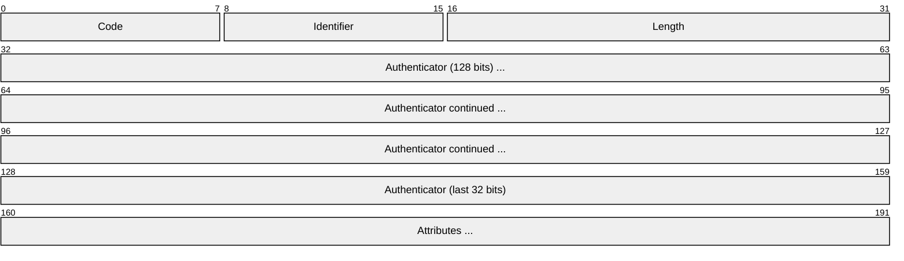
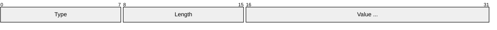
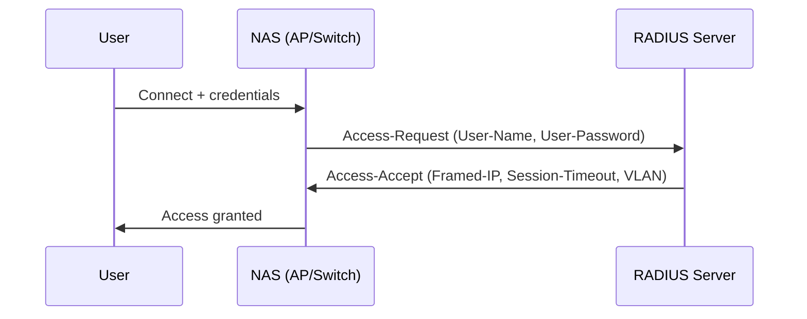
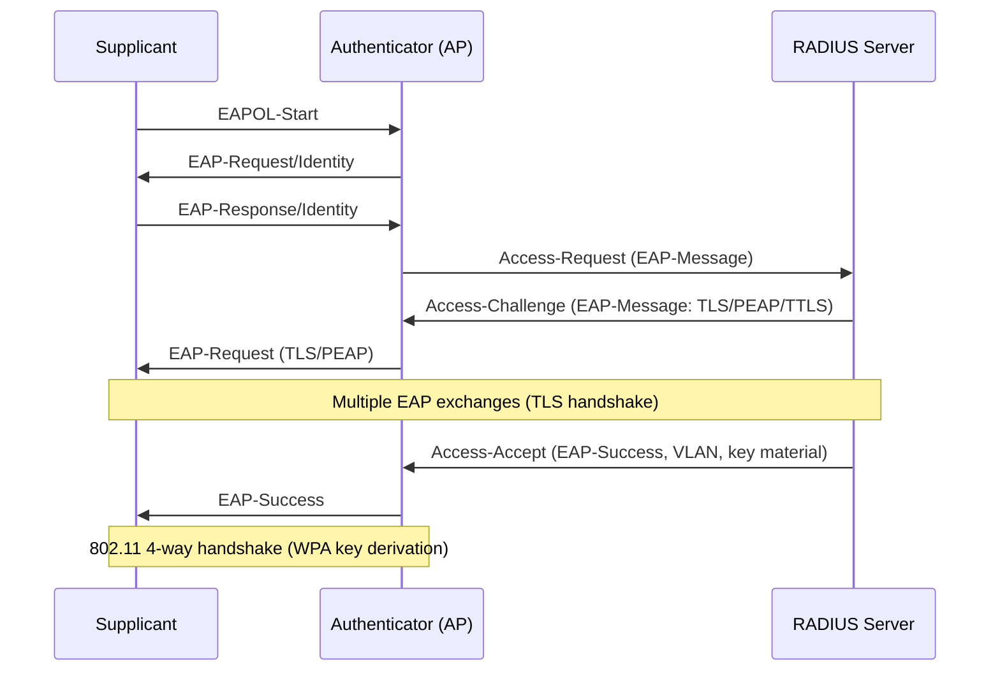
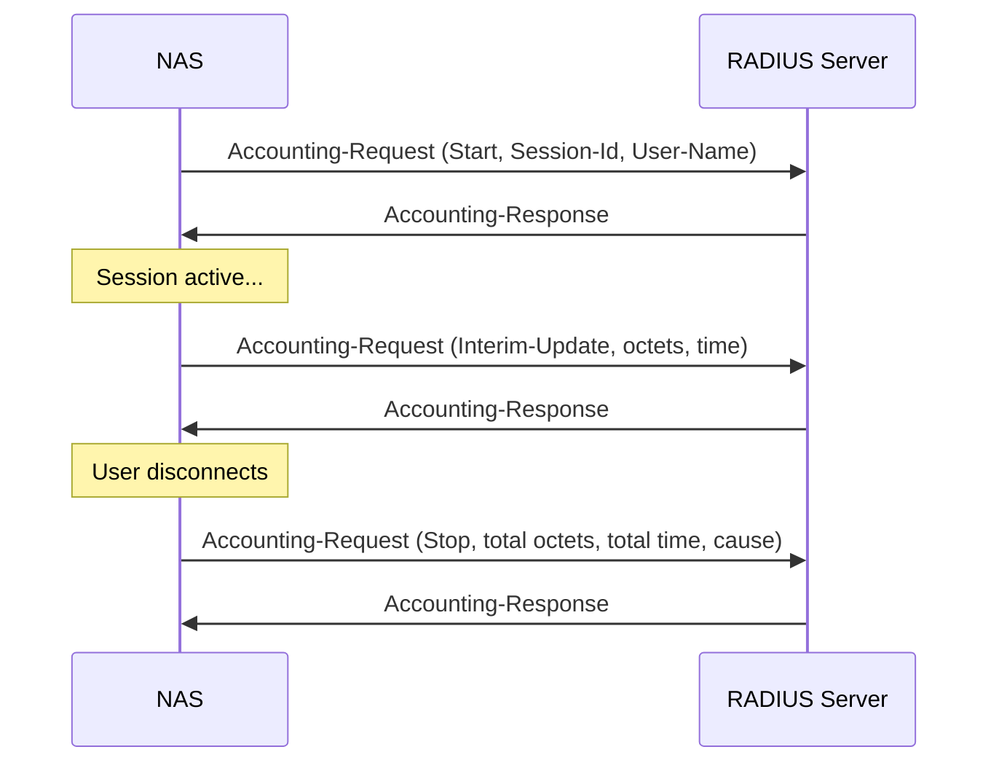
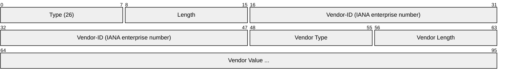
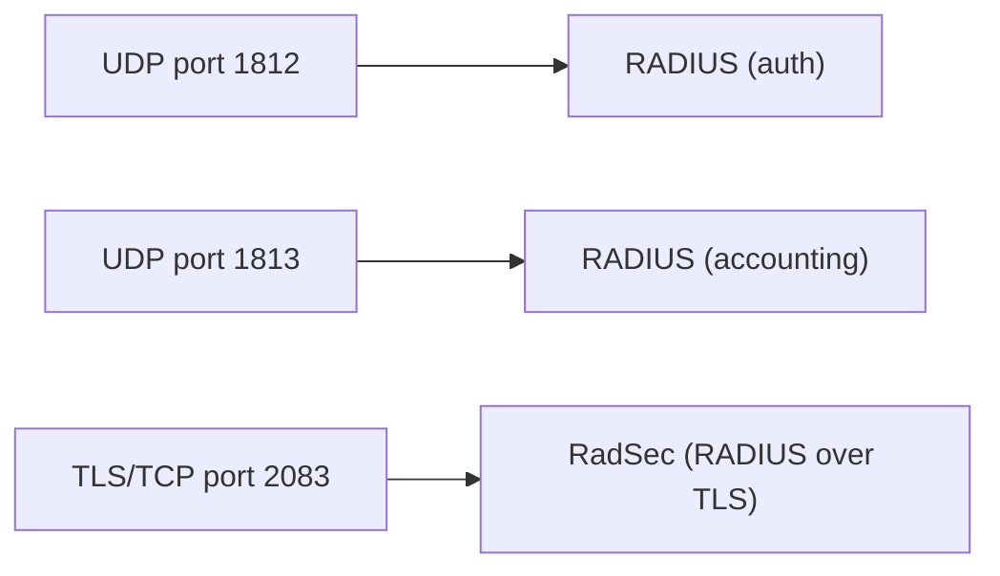

# RADIUS (Remote Authentication Dial-In User Service)

> **Standard:** [RFC 2865](https://www.rfc-editor.org/rfc/rfc2865) | **Layer:** Application (Layer 7) | **Wireshark filter:** `radius`

RADIUS is the dominant AAA (Authentication, Authorization, and Accounting) protocol for network access control. It authenticates users connecting via Wi-Fi (WPA Enterprise), VPN, dial-up, wired 802.1X, and ISP broadband, and tracks their usage for billing and auditing. RADIUS uses a client-server model where the Network Access Server (NAS) — a switch, AP, or VPN concentrator — is the RADIUS client, and a central RADIUS server validates credentials. It is implemented in virtually every enterprise network.

## Packet

## Key Fields

| Field | Size | Description |
|-------|------|-------------|
| Code | 8 bits | Packet type |
| Identifier | 8 bits | Matches requests to responses (0-255) |
| Length | 16 bits | Total packet length (20-4096 bytes) |
| Authenticator | 128 bits | Request: random nonce; Response: MD5 hash for integrity |
| Attributes | Variable | TLV-encoded attribute-value pairs |

## Packet Types (Code)

| Code | Name | Direction | Description |
|------|------|-----------|-------------|
| 1 | Access-Request | NAS → Server | Authentication request with credentials |
| 2 | Access-Accept | Server → NAS | Authentication successful |
| 3 | Access-Reject | Server → NAS | Authentication failed |
| 4 | Accounting-Request | NAS → Server | Usage data (start, stop, interim) |
| 5 | Accounting-Response | Server → NAS | Acknowledge accounting data |
| 11 | Access-Challenge | Server → NAS | Additional information needed (e.g., OTP, EAP) |
| 12 | Status-Server | NAS → Server | Keepalive / server status check |
| 13 | Status-Client | Server → NAS | Response to status check |

## Attribute Format

### Common Attributes

| Type | Name | Description |
|------|------|-------------|
| 1 | User-Name | Username being authenticated |
| 2 | User-Password | Encrypted password (MD5 with shared secret) |
| 4 | NAS-IP-Address | IP of the NAS sending the request |
| 5 | NAS-Port | Physical or virtual port on the NAS |
| 6 | Service-Type | Requested service (Login, Framed, etc.) |
| 7 | Framed-Protocol | Protocol for framed access (PPP, SLIP) |
| 8 | Framed-IP-Address | IP to assign to the user |
| 12 | Framed-MTU | Maximum transmission unit |
| 18 | Reply-Message | Text message to display to user |
| 24 | State | Session state for multi-round exchanges |
| 25 | Class | Opaque value passed to accounting |
| 26 | Vendor-Specific | Vendor-defined attributes (encapsulated) |
| 27 | Session-Timeout | Maximum session time in seconds |
| 29 | Termination-Action | Action on session end (Default, RADIUS-Request) |
| 30 | Called-Station-Id | Phone number or SSID called |
| 31 | Calling-Station-Id | Phone number or MAC of caller |
| 32 | NAS-Identifier | String identifying the NAS |
| 40 | Acct-Status-Type | Start (1), Stop (2), Interim-Update (3) |
| 44 | Acct-Session-Id | Unique session identifier |
| 46 | Acct-Session-Time | Session duration in seconds |
| 47 | Acct-Input-Octets | Bytes received from user |
| 48 | Acct-Output-Octets | Bytes sent to user |
| 61 | NAS-Port-Type | Physical port type (Ethernet, Wireless, Virtual) |
| 79 | EAP-Message | Encapsulated EAP data |
| 80 | Message-Authenticator | HMAC-MD5 integrity check (required for EAP) |

## Authentication Flow

### Simple (PAP)

### EAP (802.1X / WPA Enterprise)

### Accounting

## EAP Methods

| Method | Description |
|--------|-------------|
| EAP-TLS | Mutual TLS with client certificates (most secure) |
| EAP-PEAP | TLS tunnel + inner MSCHAPv2 (most common in enterprise Wi-Fi) |
| EAP-TTLS | TLS tunnel + inner PAP/CHAP/MSCHAPv2 |
| EAP-FAST | Cisco's tunnel method with PAC provisioning |
| EAP-SIM/AKA | SIM card authentication (mobile carrier Wi-Fi offload) |

## Vendor-Specific Attributes (VSA)

Attribute type 26 encapsulates vendor-defined attributes:

Common vendors: Cisco (9), Microsoft (311), Juniper (2636).

## Encapsulation

Legacy ports 1645 (auth) and 1646 (accounting) are still seen on older equipment.

## Standards

| Document | Title |
|----------|-------|
| [RFC 2865](https://www.rfc-editor.org/rfc/rfc2865) | Remote Authentication Dial In User Service (RADIUS) |
| [RFC 2866](https://www.rfc-editor.org/rfc/rfc2866) | RADIUS Accounting |
| [RFC 3579](https://www.rfc-editor.org/rfc/rfc3579) | RADIUS Support for EAP |
| [RFC 5176](https://www.rfc-editor.org/rfc/rfc5176) | Dynamic Authorization Extensions (CoA, Disconnect) |
| [RFC 6614](https://www.rfc-editor.org/rfc/rfc6614) | TLS Encryption for RADIUS (RadSec) |
| [RFC 3748](https://www.rfc-editor.org/rfc/rfc3748) | Extensible Authentication Protocol (EAP) |

## See Also

- [UDP](../transport-layer/udp.md)
- [TLS](tls.md) — used by RadSec and EAP-TLS
- [LDAP](../naming/ldap.md) — RADIUS servers often authenticate against LDAP/AD
- [SNMP](../monitoring/snmp.md) — another ubiquitous network management protocol
