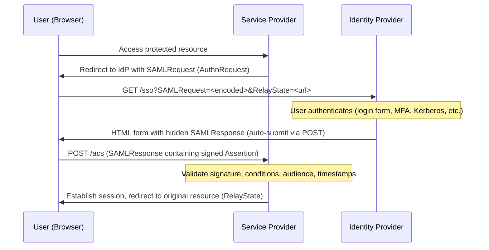
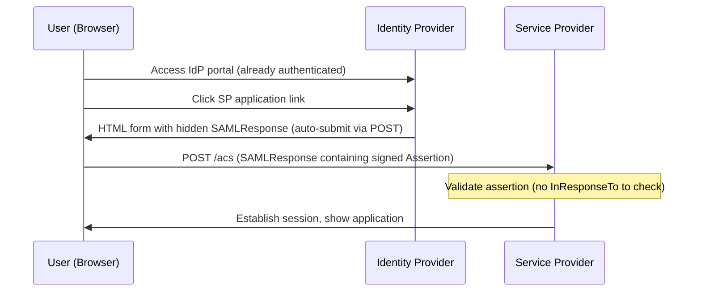
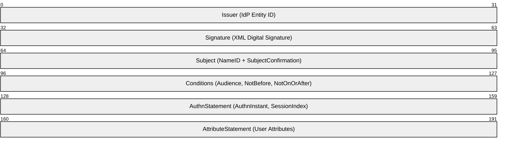
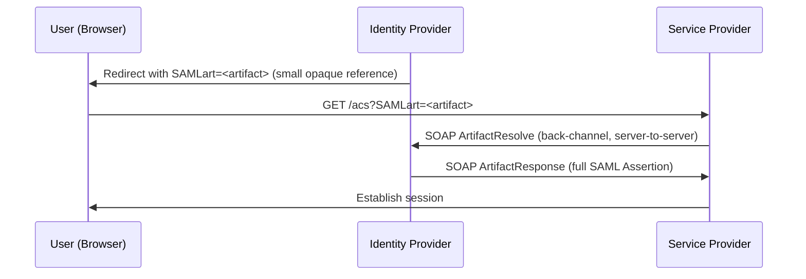
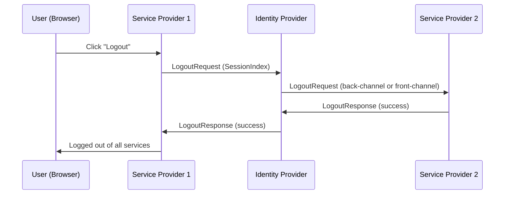
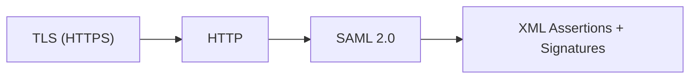

# SAML 2.0 (Security Assertion Markup Language)

> **Standard:** [OASIS SAML 2.0 Core](http://docs.oasis-open.org/security/saml/v2.0/saml-core-2.0-os.pdf) | **Layer:** Application (Layer 7) | **Wireshark filter:** `http contains "SAMLRequest" or http contains "SAMLResponse" or http contains "saml"`

SAML 2.0 is an XML-based open standard for exchanging authentication and authorization data between an Identity Provider (IdP) and a Service Provider (SP). It enables web-based single sign-on (SSO), allowing users to authenticate once with their organization's IdP and access multiple SPs without re-entering credentials. SAML is the dominant SSO protocol in enterprise environments and is widely supported by identity providers such as Active Directory Federation Services (AD FS), Okta, Ping Identity, and Shibboleth.

## Core Concepts

| Component | Description |
|-----------|-------------|
| Identity Provider (IdP) | Authenticates users and issues SAML assertions (e.g., AD FS, Okta, Azure AD) |
| Service Provider (SP) | Application that relies on the IdP for authentication (e.g., Salesforce, AWS Console) |
| Assertion | XML document containing authentication, attribute, and authorization statements |
| Binding | Method of transporting SAML messages (HTTP-Redirect, HTTP-POST, SOAP, Artifact) |
| Profile | Combination of assertions, protocols, and bindings for a use case (e.g., Web Browser SSO) |
| Metadata | XML document describing an IdP or SP's endpoints, certificates, and capabilities |
| Name ID | Unique identifier for the subject (user) — email, persistent ID, or transient ID |
| Relay State | Opaque value that preserves the user's original destination URL across the SSO flow |

## SP-Initiated SSO Flow

The most common flow. The user starts at the SP and is redirected to the IdP:



### AuthnRequest (SP to IdP)

The SP generates and sends this to request authentication:

| Field | Description |
|-------|-------------|
| ID | Unique request identifier (for correlation with response) |
| Version | `2.0` |
| IssueInstant | Timestamp of request creation (UTC) |
| Destination | IdP's SSO endpoint URL |
| AssertionConsumerServiceURL | SP's ACS endpoint where the response should be POSTed |
| Issuer | SP's entity ID (unique identifier) |
| NameIDPolicy | Requested format for the user identifier (e.g., email, persistent, transient) |
| RequestedAuthnContext | Requested authentication strength (e.g., password, MFA) |
| ForceAuthn | If `true`, IdP must re-authenticate even if session exists |
| IsPassive | If `true`, IdP must not interact with user (silent check) |

## IdP-Initiated SSO Flow

The user starts at the IdP portal and selects a service:



Note: IdP-initiated SSO is more susceptible to replay attacks because there is no corresponding AuthnRequest with an ID to correlate against.

## SAML Assertion Structure

A SAML Response contains one or more Assertions. Each Assertion is a signed XML document:



### Key Assertion Elements

| Element | Description |
|---------|-------------|
| Issuer | Entity ID of the IdP that created the assertion |
| Signature | XML Digital Signature (RSA-SHA256 or similar) over the assertion or response |
| Subject | Identifies the authenticated user |
| Subject / NameID | User identifier (email, persistent ID, transient ID, or Windows domain name) |
| Subject / SubjectConfirmation | How the subject is confirmed (`urn:oasis:names:tc:SAML:2.0:cm:bearer`) |
| Subject / SubjectConfirmationData | Constraints: `NotOnOrAfter`, `Recipient` (ACS URL), `InResponseTo` (request ID) |
| Conditions | Validity constraints for the assertion |
| Conditions / AudienceRestriction | Entity ID(s) of the intended SP(s) |
| Conditions / NotBefore | Assertion not valid before this time |
| Conditions / NotOnOrAfter | Assertion not valid after this time |
| AuthnStatement | Describes the authentication event |
| AuthnStatement / AuthnInstant | When the user authenticated at the IdP |
| AuthnStatement / SessionIndex | Session identifier for single logout correlation |
| AuthnStatement / AuthnContext | How the user authenticated (password, MFA, certificate, Kerberos) |
| AttributeStatement | User attributes (name, email, roles, groups) |

### NameID Formats

| Format URI (shortened) | Description |
|------------------------|-------------|
| `...:nameid-format:emailAddress` | Email address (e.g., `user@example.com`) |
| `...:nameid-format:persistent` | Opaque persistent identifier (privacy-preserving) |
| `...:nameid-format:transient` | Temporary identifier (changes per session) |
| `...:nameid-format:unspecified` | IdP decides the format |
| `...:nameid-format:WindowsDomainQualifiedName` | `DOMAIN\username` (AD environments) |
| `...:nameid-format:kerberos` | `user@REALM` (Kerberos principal) |

### Authentication Context Classes

| Context Class (shortened) | Meaning |
|--------------------------|---------|
| `...:ac:classes:Password` | Password authentication |
| `...:ac:classes:PasswordProtectedTransport` | Password over TLS |
| `...:ac:classes:X509` | X.509 certificate |
| `...:ac:classes:Kerberos` | Kerberos ticket |
| `...:ac:classes:TLSClient` | TLS client certificate |
| `...:ac:classes:unspecified` | Unspecified method |

## Bindings

SAML bindings define how messages are transported between IdP and SP:

| Binding | Transport | Message Size | Use Case |
|---------|-----------|-------------|----------|
| HTTP-Redirect | GET query parameter (deflate + base64) | Small only (URL length limit) | AuthnRequest from SP to IdP |
| HTTP-POST | Hidden HTML form field (base64) | Large messages supported | SAMLResponse from IdP to SP |
| HTTP-Artifact | Small reference token, then SOAP back-channel resolve | Any size (resolved server-side) | When assertions must not pass through the browser |
| SOAP | Direct HTTPS call between servers | Any size | Artifact resolution, Attribute Query, single logout |

### HTTP-Redirect Binding

The SAMLRequest is deflated, base64-encoded, and URL-encoded in the query string:

```
GET /sso?SAMLRequest=<deflate+base64+urlencode>&RelayState=<target_url>&SigAlg=...&Signature=...
```

Signatures are applied to the query string itself (not inside the XML).

### HTTP-POST Binding

The SAMLResponse is base64-encoded and delivered via a self-submitting HTML form:

```
<form method="POST" action="https://sp.example.com/acs">
  <input type="hidden" name="SAMLResponse" value="<base64-encoded XML>" />
  <input type="hidden" name="RelayState" value="<target_url>" />
</form>
<script>document.forms[0].submit();</script>
```

Signatures are embedded inside the XML (`<ds:Signature>`).

### Artifact Binding Flow



## Metadata

SAML metadata is an XML document that describes an entity's SSO configuration. It enables automated trust setup between IdPs and SPs.

### IdP Metadata Key Elements

| Element | Description |
|---------|-------------|
| EntityDescriptor / entityID | Unique identifier for the IdP |
| IDPSSODescriptor | Contains IdP-specific SSO configuration |
| SingleSignOnService | SSO endpoint URL and binding type |
| SingleLogoutService | SLO endpoint URL and binding type |
| KeyDescriptor (signing) | X.509 certificate used to sign assertions |
| KeyDescriptor (encryption) | X.509 certificate used to encrypt assertions |
| NameIDFormat | Supported NameID formats |

### SP Metadata Key Elements

| Element | Description |
|---------|-------------|
| EntityDescriptor / entityID | Unique identifier for the SP |
| SPSSODescriptor | Contains SP-specific SSO configuration |
| AssertionConsumerService | ACS endpoint URL(s), binding, and index |
| SingleLogoutService | SLO endpoint URL and binding type |
| KeyDescriptor (signing) | X.509 certificate for signed AuthnRequests |
| KeyDescriptor (encryption) | X.509 certificate for encrypted assertions |
| NameIDFormat | Requested NameID format(s) |
| AuthnRequestsSigned | Whether the SP signs AuthnRequests (`true`/`false`) |
| WantAssertionsSigned | Whether the SP requires signed assertions (`true`/`false`) |

## Single Logout (SLO)



SLO is notoriously fragile in practice because any SP that is unreachable or returns an error can break the logout chain.

## Assertion Validation Checklist

| Step | Validation |
|------|------------|
| 1 | Verify XML digital signature against IdP's public certificate (from metadata) |
| 2 | Check `Issuer` matches the expected IdP entity ID |
| 3 | Check `Destination` matches this SP's ACS URL |
| 4 | Check `AudienceRestriction` includes this SP's entity ID |
| 5 | Check `NotBefore` and `NotOnOrAfter` — assertion must be within validity window |
| 6 | Check `SubjectConfirmationData / NotOnOrAfter` is not expired |
| 7 | Check `SubjectConfirmationData / Recipient` matches this SP's ACS URL |
| 8 | Check `InResponseTo` matches the original AuthnRequest ID (SP-initiated only) |
| 9 | Verify the assertion has not been previously consumed (replay prevention) |
| 10 | If assertion is encrypted, decrypt using SP's private key before validation |

## Security Considerations

| Threat | Mitigation |
|--------|------------|
| Assertion forgery | Require XML digital signatures; validate against IdP certificate from trusted metadata |
| XML Signature wrapping | Use strict schema validation; verify signed element is the one being processed |
| Replay attacks | Enforce `NotOnOrAfter`; track consumed assertion IDs; validate `InResponseTo` |
| Man-in-the-middle | All endpoints must use HTTPS; sign AuthnRequests |
| Assertion eavesdropping | Encrypt assertions using SP's public key (`EncryptedAssertion`) |
| IdP-initiated SSO risks | No `InResponseTo` to validate — higher replay risk; prefer SP-initiated flow |
| Open redirect via RelayState | Validate RelayState URLs against an allowlist |
| XXE / XML injection | Disable external entity resolution and DTD processing in XML parser |

## SAML vs OAuth 2.0 / OIDC

| Feature | SAML 2.0 | OAuth 2.0 / OIDC |
|---------|----------|-------------------|
| Primary purpose | Authentication (SSO) | Authorization (delegated access) + Authentication (OIDC) |
| Data format | XML | JSON (JWT) |
| Token type | SAML Assertion (XML) | Access Token + ID Token (JWT) |
| Transport | HTTP Redirect, HTTP POST, SOAP | HTTPS (REST APIs, redirects) |
| Mobile / SPA support | Poor (XML parsing, large payloads) | Native (compact JSON, PKCE) |
| Enterprise adoption | Dominant in legacy enterprise SSO | Growing rapidly, especially for APIs and modern apps |
| API authorization | Not designed for API access | Core use case |
| Token size | Large (XML, often 5-20 KB) | Small (JWT, typically 1-2 KB) |
| Complexity | High (XML signatures, canonicalization, multiple bindings) | Lower (JSON, standard HTTPS flows) |
| Specification | OASIS (multiple documents) | IETF RFCs + OpenID Foundation |
| Logout | Single Logout (fragile in practice) | Back-channel logout, front-channel logout |

## Encapsulation



SAML messages are carried entirely over HTTPS. AuthnRequests typically use HTTP-Redirect (GET with query parameters). SAMLResponses typically use HTTP-POST (hidden form fields). Artifact resolution and SLO back-channel use SOAP over HTTPS.

## Standards

| Document | Title |
|----------|-------|
| [SAML 2.0 Core](http://docs.oasis-open.org/security/saml/v2.0/saml-core-2.0-os.pdf) | Assertions and Protocols |
| [SAML 2.0 Bindings](http://docs.oasis-open.org/security/saml/v2.0/saml-bindings-2.0-os.pdf) | Protocol Bindings (HTTP-Redirect, HTTP-POST, SOAP, Artifact) |
| [SAML 2.0 Profiles](http://docs.oasis-open.org/security/saml/v2.0/saml-profiles-2.0-os.pdf) | Profiles including Web Browser SSO and Single Logout |
| [SAML 2.0 Metadata](http://docs.oasis-open.org/security/saml/v2.0/saml-metadata-2.0-os.pdf) | Metadata schema for IdP and SP configuration exchange |
| [SAML 2.0 Conformance](http://docs.oasis-open.org/security/saml/v2.0/saml-conformance-2.0-os.pdf) | Conformance Requirements and Test Procedures |
| [XML Signature](https://www.w3.org/TR/xmldsig-core1/) | W3C XML Digital Signatures (used by SAML for assertion signing) |
| [XML Encryption](https://www.w3.org/TR/xmlenc-core1/) | W3C XML Encryption (used for encrypted assertions) |

## See Also

- [OAuth 2.0 / OIDC](oauth2.md) — modern alternative for SSO and API authorization
- [TLS](tls.md) — transport security (SAML requires HTTPS)
- [HTTP](../web/http.md) — underlying transport protocol
- [Kerberos](kerberos.md) — often used as IdP authentication method behind SAML
- [RADIUS](radius.md) — AAA protocol used in network access alongside SAML federation
- [802.1X](8021x.md) — network access control that can integrate with SAML-based identity systems
