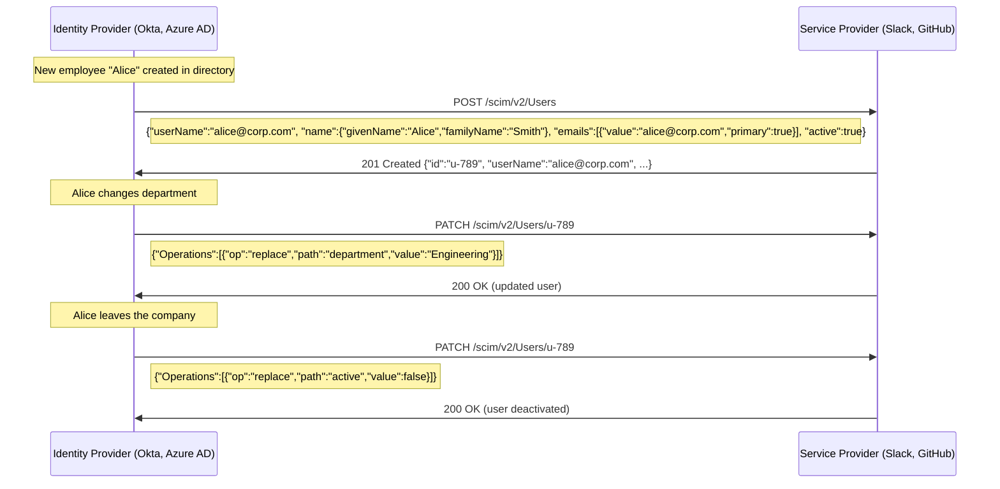
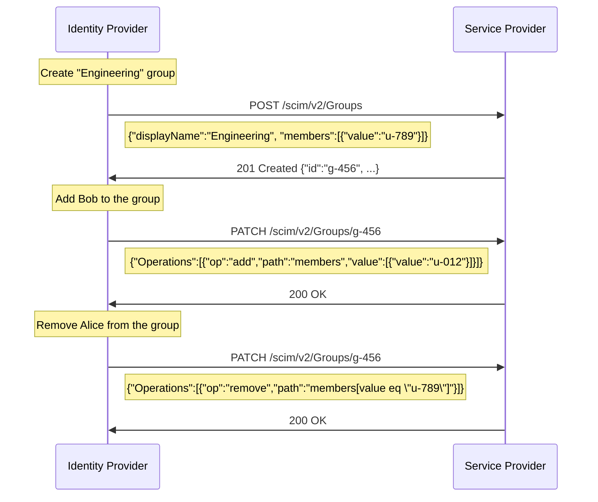
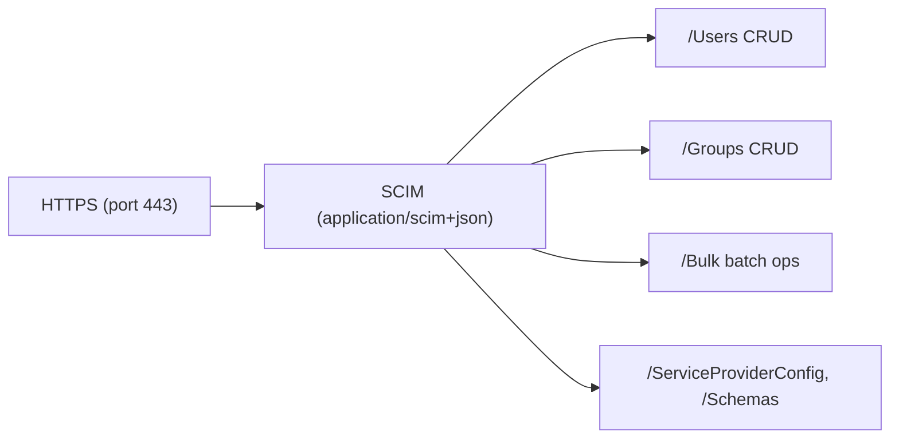

# SCIM (System for Cross-domain Identity Management)

> **Standard:** [RFC 7643](https://www.rfc-editor.org/rfc/rfc7643) / [RFC 7644](https://www.rfc-editor.org/rfc/rfc7644) | **Layer:** Application (Layer 7) | **Wireshark filter:** `http` or `http2`

SCIM is a RESTful protocol for automating the provisioning and deprovisioning of user identities across systems. When an employee joins, changes roles, or leaves an organization, SCIM allows identity providers (Okta, Azure AD, OneLogin) to automatically create, update, or disable accounts in downstream service providers (Slack, GitHub, AWS, Salesforce). SCIM standardizes the schema for user and group resources, the HTTP API for CRUD operations, and the filtering/pagination syntax, replacing proprietary provisioning integrations with a single open standard.

## Request Structure

SCIM uses standard HTTP methods on RESTful endpoints:


## Endpoints

| Endpoint | Methods | Description |
|----------|---------|-------------|
| /Users | GET, POST | List/search users, create a user |
| /Users/{id} | GET, PUT, PATCH, DELETE | Read, replace, modify, or delete a specific user |
| /Groups | GET, POST | List/search groups, create a group |
| /Groups/{id} | GET, PUT, PATCH, DELETE | Read, replace, modify, or delete a specific group |
| /Bulk | POST | Execute multiple operations in a single request |
| /ServiceProviderConfig | GET | Discover server capabilities (supported features) |
| /ResourceTypes | GET | Discover available resource types and their schemas |
| /Schemas | GET | Retrieve the full schema definitions |
| /Me | GET, PATCH | Current authenticated user (optional) |

## HTTP Operations

| Method | Operation | Success Code | Description |
|--------|-----------|--------------|-------------|
| GET | Read | 200 | Retrieve a resource or list of resources |
| POST | Create | 201 | Create a new resource |
| PUT | Replace | 200 | Fully replace a resource |
| PATCH | Modify | 200 | Partially update specific attributes |
| DELETE | Remove | 204 | Delete (or deactivate) a resource |

## User Resource

Core attributes for a SCIM User:

| Attribute | Type | Required | Description |
|-----------|------|----------|-------------|
| schemas | String[] | Yes | Schema URIs (e.g., "urn:ietf:params:scim:schemas:core:2.0:User") |
| id | String | Server-set | Unique server-assigned identifier |
| externalId | String | No | Identifier from the provisioning client |
| userName | String | Yes | Unique login identifier (often email) |
| name.givenName | String | No | First name |
| name.familyName | String | No | Last name |
| name.formatted | String | No | Full formatted name |
| emails[] | Complex | No | Email addresses (value, type, primary) |
| phoneNumbers[] | Complex | No | Phone numbers (value, type) |
| active | Boolean | No | Account enabled/disabled status |
| groups[] | Complex | Read-only | Groups the user belongs to |
| roles[] | Complex | No | Roles assigned to the user |
| title | String | No | Job title |
| department | String | No | Department name (Enterprise extension) |
| manager | Complex | No | Manager reference (Enterprise extension) |

## Group Resource

| Attribute | Type | Required | Description |
|-----------|------|----------|-------------|
| schemas | String[] | Yes | Schema URIs |
| id | String | Server-set | Unique identifier |
| displayName | String | Yes | Human-readable group name |
| members[] | Complex | No | Array of {value (user id), display, type} |

## User Provisioning Flow



## Group Membership Sync



## Filtering

SCIM supports a rich filter syntax for querying resources:

| Operator | Example | Description |
|----------|---------|-------------|
| eq | `userName eq "alice"` | Equals |
| ne | `active ne true` | Not equals |
| co | `name.familyName co "Smith"` | Contains |
| sw | `userName sw "a"` | Starts with |
| ew | `emails.value ew "@corp.com"` | Ends with |
| gt, ge, lt, le | `meta.lastModified gt "2025-01-01"` | Comparison |
| and, or, not | `active eq true and department eq "Eng"` | Logical combinators |

Example: `GET /scim/v2/Users?filter=userName eq "alice@corp.com" and active eq true`

## Pagination

| Parameter | Description |
|-----------|-------------|
| startIndex | 1-based index of the first result to return |
| count | Maximum number of results per page |
| totalResults | Total number of matching resources (in response) |
| itemsPerPage | Actual number of results returned (in response) |

## Bulk Operations

```
POST /scim/v2/Bulk
Content-Type: application/scim+json
```

| Field | Description |
|-------|-------------|
| schemas | ["urn:ietf:params:scim:api:messages:2.0:BulkRequest"] |
| Operations[] | Array of {method, path, bulkId, data} |
| failOnErrors | Number of errors before the server stops processing |

Each operation specifies an HTTP method, path, and optional data. The `bulkId` allows cross-referencing newly created resources within the same batch.

## Discovery

| Endpoint | Returns |
|----------|---------|
| /ServiceProviderConfig | Supported features: patch, bulk, filter, changePassword, sort, etag, authSchemes |
| /ResourceTypes | Available types (User, Group) with schema URIs and endpoints |
| /Schemas | Full attribute definitions including mutability, type, and constraints |

## SCIM vs LDAP

| Feature | SCIM | LDAP |
|---------|------|------|
| Protocol | REST over HTTPS | Binary over TCP (port 389/636) |
| Data format | JSON | ASN.1 / BER encoding |
| Authentication | OAuth 2.0 Bearer tokens | SASL, Simple Bind |
| Direction | Push (IdP provisions to SP) | Pull (client queries directory) |
| Schema | Predefined User/Group + extensions | Flexible, schema-on-write |
| Filtering | URL query parameters | LDAP filter syntax (RFC 4515) |
| Use case | Cloud provisioning across domains | On-premise directory access |
| Firewall | HTTPS (port 443) friendly | Requires port 389/636 open |
| Bulk operations | Built-in /Bulk endpoint | LDIF import (offline) |
| Real-time sync | Webhook or polling | Persistent search / syncrepl |
| Adoption | SaaS (Okta, Azure AD, Google) | Enterprise (Active Directory, OpenLDAP) |

## Encapsulation



## Standards

| Document | Title |
|----------|-------|
| [RFC 7643](https://www.rfc-editor.org/rfc/rfc7643) | SCIM: Core Schema |
| [RFC 7644](https://www.rfc-editor.org/rfc/rfc7644) | SCIM: Protocol |
| [RFC 7642](https://www.rfc-editor.org/rfc/rfc7642) | SCIM: Definitions, Overview, Concepts, and Requirements |

## See Also

- [HTTP](../web/http.md) -- SCIM transport
- [OAuth 2.0](oauth2.md) -- typical authentication for SCIM endpoints
- [TLS](tls.md) -- encrypts SCIM traffic
