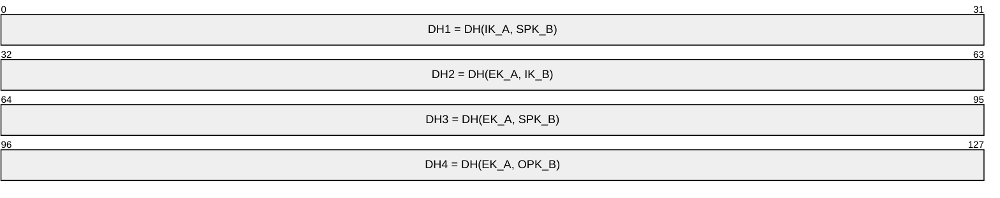
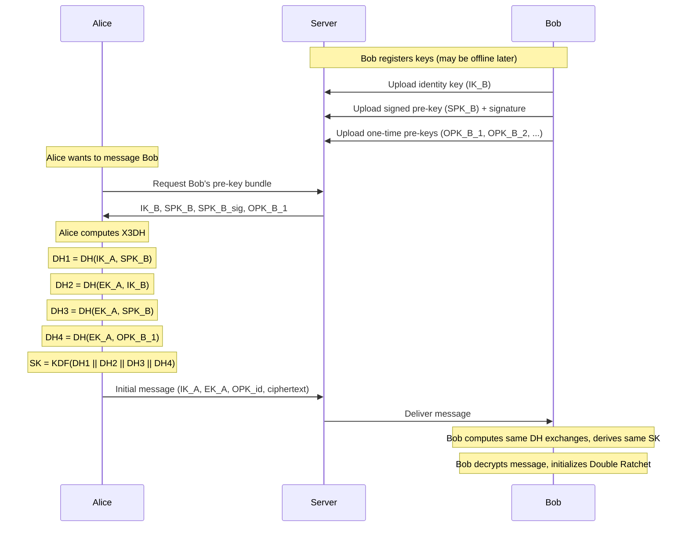
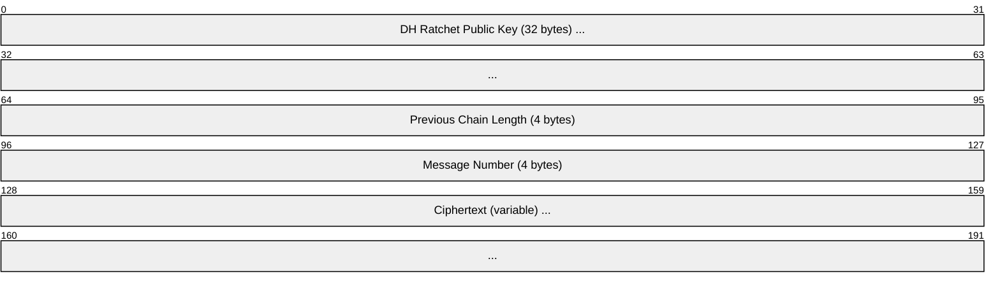
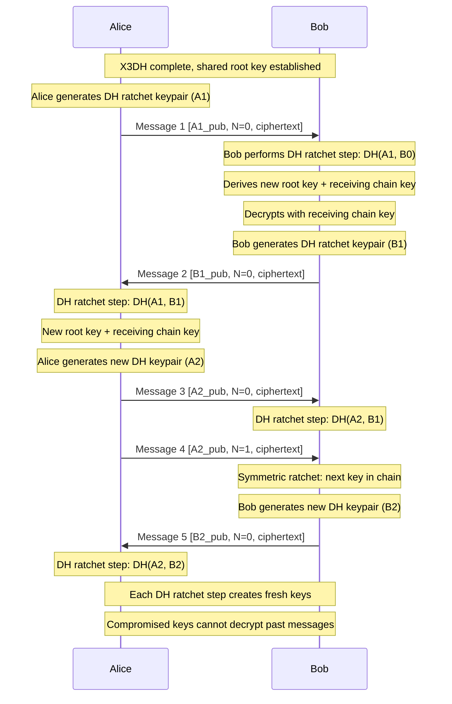

# Signal Protocol (Double Ratchet)

> **Standard:** [Signal Protocol Specifications](https://signal.org/docs/) | **Layer:** Application (Layer 7) | **Wireshark filter:** N/A (end-to-end encrypted; only ciphertext visible on the wire)

The Signal Protocol is an end-to-end encryption protocol providing forward secrecy and post-compromise security for instant messaging. It combines the X3DH (Extended Triple Diffie-Hellman) key agreement protocol with the Double Ratchet algorithm to establish and maintain encrypted sessions. Originally developed for Signal (formerly TextSecure), it is now used by WhatsApp (2+ billion users), Google Messages (RCS), Facebook Messenger, and Skype. The protocol ensures that even if long-term keys are compromised, past messages remain secret (forward secrecy) and future messages become secure again after a single round trip (post-compromise security / self-healing).

## Components

The Signal Protocol consists of two main components:

| Component | Purpose | Description |
|-----------|---------|-------------|
| X3DH | Initial key agreement | Establishes a shared secret between two parties, even if the recipient is offline |
| Double Ratchet | Ongoing encryption | Derives unique keys for every message using a ratcheting mechanism |

## X3DH Key Types

Each user publishes a set of keys to the server:

| Key | Type | Lifetime | Description |
|-----|------|----------|-------------|
| Identity Key (IK) | Curve25519 | Long-term | Permanent identity key pair; represents the user |
| Signed Pre-Key (SPK) | Curve25519 | Medium-term | Signed by IK; rotated periodically (e.g., weekly) |
| One-Time Pre-Keys (OPK) | Curve25519 | Single use | Pool of keys; each consumed by one session setup |
| Ephemeral Key (EK) | Curve25519 | Single use | Generated fresh by the initiator for each new session |

## X3DH Key Agreement

When Alice wants to start a session with Bob (who may be offline), she fetches Bob's pre-key bundle from the server and computes four DH exchanges:

| Exchange | Initiator Key | Responder Key | Purpose |
|----------|---------------|---------------|---------|
| DH1 | IK_A (identity) | SPK_B (signed pre-key) | Authenticates Alice to Bob |
| DH2 | EK_A (ephemeral) | IK_B (identity) | Authenticates Bob to Alice |
| DH3 | EK_A (ephemeral) | SPK_B (signed pre-key) | Forward secrecy (ephemeral component) |
| DH4 | EK_A (ephemeral) | OPK_B (one-time pre-key) | Additional forward secrecy (optional, if OPK available) |

The shared secret is: `SK = KDF(DH1 || DH2 || DH3 || DH4)`

This SK becomes the initial root key for the Double Ratchet.

### X3DH Flow

## Double Ratchet Algorithm

After X3DH establishes the initial shared secret, the Double Ratchet takes over. It combines two ratcheting mechanisms:

| Ratchet | Type | Advances When | Provides |
|---------|------|---------------|----------|
| DH Ratchet | Asymmetric | Each message exchange (new DH key pair) | Post-compromise security |
| Symmetric Ratchet | KDF Chain | Every message sent/received | Per-message keys |

### Three KDF Chains

The Double Ratchet maintains three KDF (Key Derivation Function) chains:

| Chain | Purpose | Advances |
|-------|---------|----------|
| Root Chain | Derives new chain keys when DH ratchet advances | On each DH ratchet step |
| Sending Chain | Derives message keys for outgoing messages | On each sent message |
| Receiving Chain | Derives message keys for incoming messages | On each received message |

### Message Format

| Field | Description |
|-------|-------------|
| DH Ratchet Public Key | Sender's current ratchet public key (Curve25519, 32 bytes) |
| Previous Chain Length | Number of messages in the previous sending chain |
| Message Number | Index in the current sending chain |
| Ciphertext | AES-256-CBC + HMAC-SHA-256 encrypted message |

### Double Ratchet Message Exchange

## Security Properties

| Property | Description |
|----------|-------------|
| Forward Secrecy | Compromised long-term keys cannot decrypt past messages --- ephemeral keys are deleted |
| Post-Compromise Security | After a key compromise, the ratchet "heals" on the next DH exchange --- future messages are secure |
| Per-Message Keys | Every message uses a unique encryption key derived from the KDF chain |
| Out-of-Order Delivery | Skipped message keys are cached temporarily to handle messages arriving out of order |
| Deniability | No cryptographic proof that a specific user sent a message (both parties can forge MACs) |
| Asynchronous Setup | X3DH allows session establishment even when the recipient is offline |

## Sealed Sender (Signal-specific)

Signal extends the protocol with sealed sender --- the server does not learn who sent a message:

| Component | Description |
|-----------|-------------|
| Sender Certificate | Short-lived certificate signed by Signal, includes sender identity and device |
| Encrypted Envelope | Sender encrypts the sender certificate along with the message using the recipient's identity key |
| Server Routing | Server routes based on recipient only; sender identity is inside the encrypted payload |

## Group Messaging (Sender Keys)

For group chats, Signal uses Sender Keys for efficiency:

| Concept | Description |
|---------|-------------|
| Sender Key | Each group member generates a signing key pair and a symmetric chain key |
| Distribution | Sender Keys are distributed to all group members via pairwise Signal Protocol sessions |
| Encryption | Sender encrypts once with their chain key; all members can decrypt |
| Ratchet | Chain key ratchets forward with each message (forward secrecy within the chain) |
| Limitation | No post-compromise security until sender key is rotated (on membership change) |

## Signal Protocol vs PGP/GPG vs Matrix Olm

| Feature | Signal Protocol | PGP/GPG | Matrix Olm/Megolm |
|---------|----------------|---------|---------------------|
| Forward secrecy | Yes (DH ratchet) | No (static RSA/ECC keys) | Partial (Megolm: forward only) |
| Post-compromise security | Yes (heals on DH exchange) | No | No (Megolm sessions are one-directional) |
| Key management | Automatic (transparent to user) | Manual (key exchange, web of trust) | Automatic (server-assisted) |
| Asynchronous setup | Yes (X3DH pre-keys) | Yes (public key on keyserver) | Yes (one-time keys on homeserver) |
| Group encryption | Sender Keys | Encrypt to each recipient | Megolm (single ratchet per room) |
| Deniability | Yes (no binding signatures) | No (signatures are non-repudiable) | Partial |
| Key rotation | Every message exchange (DH ratchet) | Manual | Per-session (Megolm) |
| Adoption | Signal, WhatsApp, Google Messages, FB Messenger | Email encryption, file signing | Matrix/Element ecosystem |
| Primitives | Curve25519, AES-256, HMAC-SHA-256 | RSA/ECC, AES, SHA-2 | Curve25519, AES-256, HMAC-SHA-256 |
| Specification | Open (signal.org/docs) | RFC 4880 | Open (spec.matrix.org) |

## Cryptographic Primitives

| Function | Algorithm | Purpose |
|----------|-----------|---------|
| Key Agreement | Curve25519 (X25519) | DH key exchange (X3DH and ratchet) |
| Signing | Ed25519 | Identity key signatures, pre-key signatures |
| Symmetric Encryption | AES-256-CBC | Message encryption |
| MAC | HMAC-SHA-256 | Message authentication |
| KDF | HKDF-SHA-256 | Derive chain keys and message keys |

## Standards

| Document | Title |
|----------|-------|
| [X3DH Specification](https://signal.org/docs/specifications/x3dh/) | Extended Triple Diffie-Hellman Key Agreement Protocol |
| [Double Ratchet Specification](https://signal.org/docs/specifications/doubleratchet/) | The Double Ratchet Algorithm |
| [Sesame Specification](https://signal.org/docs/specifications/sesame/) | Session Management (multi-device) |
| [Sender Key Specification](https://signal.org/docs/specifications/group/) | Group Messaging with Sender Keys |

## See Also

- [TLS](tls.md) --- transport-layer encryption (different layer; Signal is application-layer E2EE)
- [Matrix](../messaging/matrix.md) --- federated messaging using Olm/Megolm (derived from Signal Protocol)
- [XMPP](../messaging/xmpp.md) --- messaging protocol with OMEMO extension (uses Signal Protocol)
- [WireGuard](wireguard.md) --- VPN encryption (network-layer, different use case)
