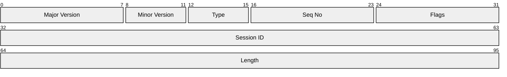
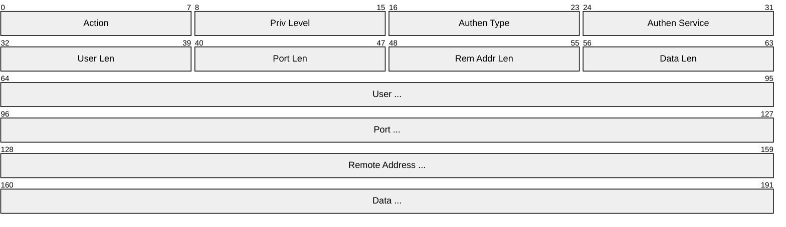
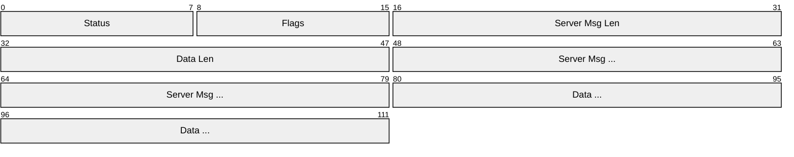
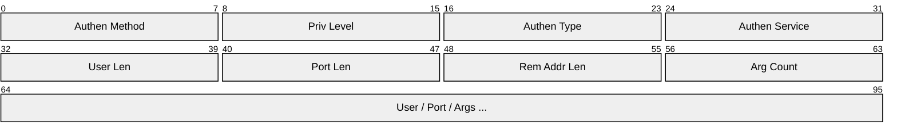
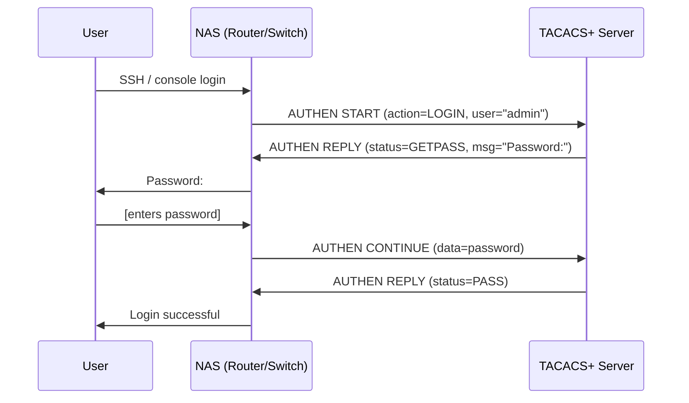
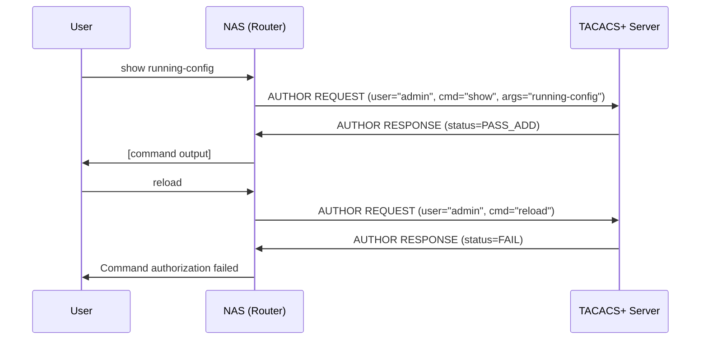
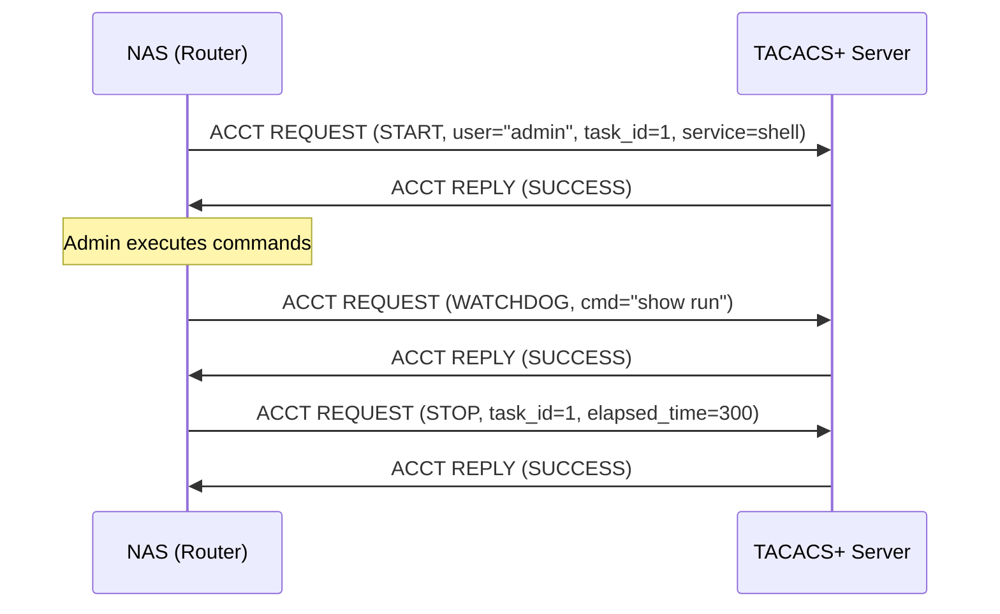
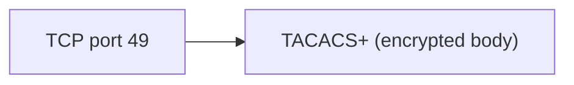

# TACACS+ (Terminal Access Controller Access-Control System Plus)

> **Standard:** [RFC 8907](https://www.rfc-editor.org/rfc/rfc8907) | **Layer:** Application (Layer 7) | **Wireshark filter:** `tacplus`

TACACS+ is an AAA (Authentication, Authorization, and Accounting) protocol used primarily for device administration — controlling who can log into network equipment (routers, switches, firewalls) and what commands they can execute. Unlike RADIUS, which combines authentication and authorization in a single exchange, TACACS+ separates all three AAA functions into independent operations. TACACS+ encrypts the entire packet body (not just the password), runs over TCP port 49 for reliable delivery, and provides per-command authorization — making it the standard for managing Cisco and multi-vendor network infrastructure.

## Packet Header



## Key Fields

| Field | Size | Description |
|-------|------|-------------|
| Major Version | 8 bits | Protocol major version (0xC0 = TACACS+) |
| Minor Version | 4 bits | Minor version (0x00 = default, 0x01 = minor v1) |
| Type | 4 bits | Packet type (Authentication, Authorization, Accounting) |
| Seq No | 8 bits | Sequence number (starts at 1, increments per packet in session) |
| Flags | 8 bits | Control flags (encryption, single-connect) |
| Session ID | 32 bits | Random value identifying the session |
| Length | 32 bits | Length of the body (after this header) |

## Field Details

### Type

| Value | Name | Description |
|-------|------|-------------|
| 0x01 | TAC_PLUS_AUTHEN | Authentication |
| 0x02 | TAC_PLUS_AUTHOR | Authorization |
| 0x03 | TAC_PLUS_ACCT | Accounting |

### Flags

| Bit | Name | Description |
|-----|------|-------------|
| 0 | TAC_PLUS_UNENCRYPTED_FLAG | Body is unencrypted (debugging only) |
| 2 | TAC_PLUS_SINGLE_CONNECT_FLAG | Multiplex sessions on a single TCP connection |

## Packet Types

### Authentication

Authentication uses three packet sub-types exchanged in a multi-step conversation:

| Packet | Direction | Description |
|--------|-----------|-------------|
| START | Client -> Server | Initiates authentication (username, authen_type, action) |
| REPLY | Server -> Client | Server response (PASS, FAIL, GETDATA, GETUSER, GETPASS, ERROR, RESTART) |
| CONTINUE | Client -> Server | Client provides requested data (password, OTP, etc.) |

#### Authentication START Body



#### Authentication REPLY Body



| Status | Value | Description |
|--------|-------|-------------|
| TAC_PLUS_AUTHEN_STATUS_PASS | 0x01 | Authentication successful |
| TAC_PLUS_AUTHEN_STATUS_FAIL | 0x02 | Authentication failed |
| TAC_PLUS_AUTHEN_STATUS_GETDATA | 0x03 | Server requests additional data |
| TAC_PLUS_AUTHEN_STATUS_GETUSER | 0x04 | Server requests username |
| TAC_PLUS_AUTHEN_STATUS_GETPASS | 0x05 | Server requests password |
| TAC_PLUS_AUTHEN_STATUS_ERROR | 0x07 | Server error |
| TAC_PLUS_AUTHEN_STATUS_RESTART | 0x06 | Restart authentication with START |

### Authorization

Authorization uses two packet sub-types:

| Packet | Direction | Description |
|--------|-----------|-------------|
| REQUEST | Client -> Server | Request permission for an action (with attribute-value pairs) |
| RESPONSE | Server -> Client | PASS_ADD, PASS_REPL, FAIL, ERROR (with attribute-value pairs) |

#### Authorization REQUEST Body



### Accounting

Accounting uses two packet sub-types:

| Packet | Direction | Description |
|--------|-----------|-------------|
| REQUEST | Client -> Server | Report event (START, STOP, WATCHDOG with attribute-value pairs) |
| REPLY | Server -> Client | SUCCESS, ERROR (acknowledgement) |

#### Accounting Flags

| Flag | Value | Description |
|------|-------|-------------|
| TAC_PLUS_ACCT_FLAG_START | 0x02 | Session began |
| TAC_PLUS_ACCT_FLAG_STOP | 0x04 | Session ended |
| TAC_PLUS_ACCT_FLAG_WATCHDOG | 0x08 | Interim update (session still active) |

## Encryption

TACACS+ encrypts the entire packet body using a pseudo-random pad derived from the shared secret, session ID, version, and sequence number:

```
pad = MD5(session_id + key + version + seq_no + prev_pad)
encrypted_body = body XOR pad
```

Each packet in a session uses a different pad (sequence number increments), providing per-packet encryption. The header is always sent in the clear to allow demultiplexing.

## Authentication Flow

### Login (ASCII)



### Command Authorization



### Accounting



## Common Attribute-Value Pairs

| Attribute | Example | Description |
|-----------|---------|-------------|
| service | shell | Type of service requested |
| cmd | show | Command being authorized |
| cmd-arg | running-config | Command argument |
| priv-lvl | 15 | Privilege level (0-15, Cisco) |
| protocol | ip | Protocol context |
| acl | 10 | Access list to apply |
| addr | 10.0.0.0/8 | Network address |
| timeout | 60 | Session timeout in seconds |
| task_id | 1 | Unique task identifier for accounting |

## TACACS+ vs RADIUS

| Feature | TACACS+ | RADIUS |
|---------|---------|--------|
| Transport | TCP (port 49) | UDP (ports 1812/1813) |
| Encryption | Entire body encrypted | Only User-Password encrypted |
| AAA separation | Separate authen/author/acct | Auth+authz combined in one exchange |
| Command authorization | Per-command (granular) | Not supported |
| Protocol control | Multilink, multi-protocol | Limited (attribute-based) |
| Vendor support | Primarily Cisco, growing multi-vendor | Universal (every NAS) |
| Primary use | Device administration (CLI access) | Network access (Wi-Fi, VPN, 802.1X) |
| Accounting | START/STOP/WATCHDOG | Start/Stop/Interim-Update |
| Standards | RFC 8907 (2020) | RFC 2865 (2000) |
| Packet size | No practical limit (TCP) | Max 4096 bytes (UDP) |

## Encapsulation



## Standards

| Document | Title |
|----------|-------|
| [RFC 8907](https://www.rfc-editor.org/rfc/rfc8907) | The TACACS+ Protocol |
| [RFC 9476](https://www.rfc-editor.org/rfc/rfc9476) | TACACS+ TLS 1.3 (obfuscation removal) |

## See Also

- [RADIUS](radius.md) -- the other AAA protocol (focused on network access)
- [802.1X](8021x.md) -- port-based network access control (uses RADIUS or TACACS+)
- [Kerberos](kerberos.md) -- authentication protocol used in Active Directory
- [SSH](../remote-access/ssh.md) -- commonly authorized via TACACS+
