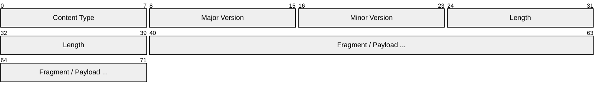
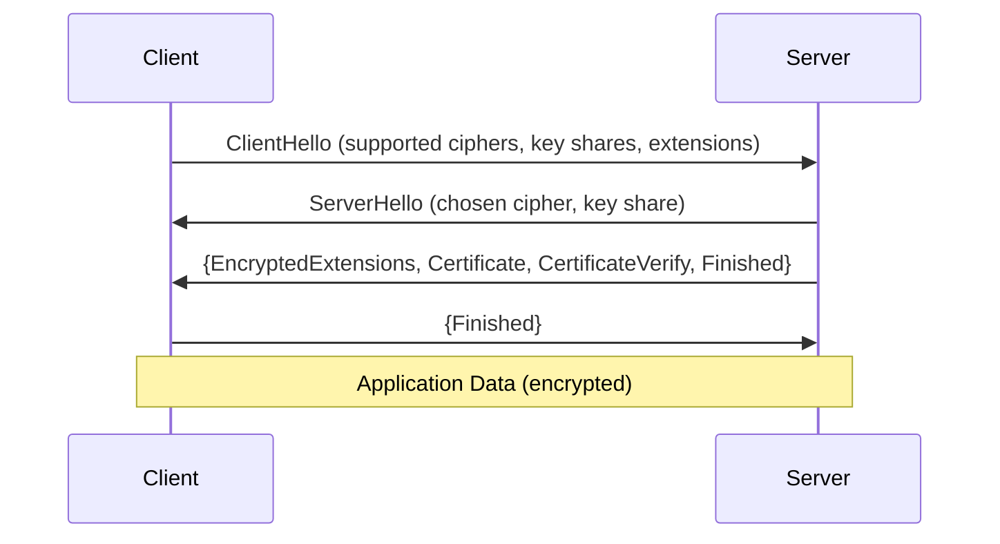
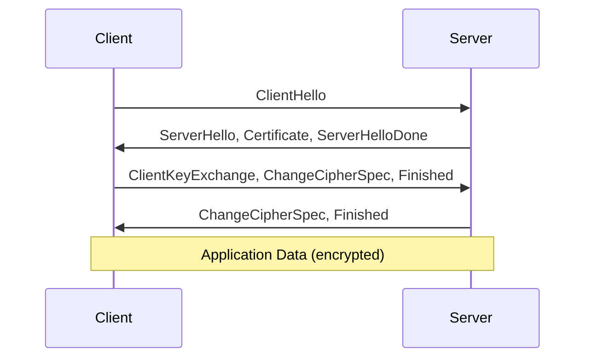
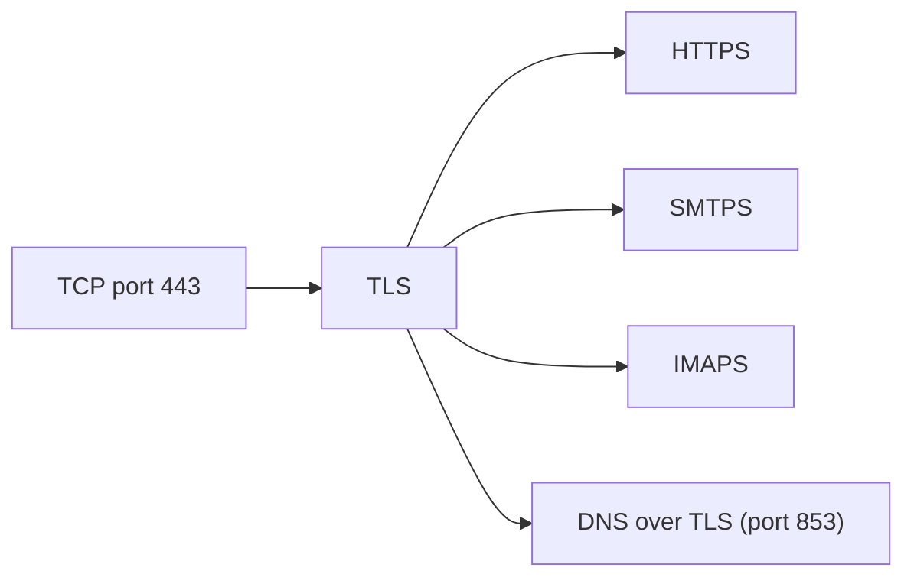

# TLS (Transport Layer Security)

> **Standard:** [RFC 8446](https://www.rfc-editor.org/rfc/rfc8446) | **Layer:** Application / Presentation (Layer 6-7) | **Wireshark filter:** `tls`

TLS provides encryption, authentication, and integrity for communication over a network. It sits between the transport layer (TCP) and the application layer, creating a secure channel for protocols like HTTPS, SMTPS, IMAPS, and others. TLS 1.3 is the current version, significantly simplifying the handshake and removing insecure legacy features from TLS 1.2.

## Record Protocol

Every TLS message is wrapped in a record:

## Key Fields

| Field | Size | Description |
|-------|------|-------------|
| Content Type | 8 bits | Type of the enclosed message |
| Protocol Version | 16 bits | TLS version (see below) |
| Length | 16 bits | Payload length in bytes (max 16384 + 2048) |
| Fragment | Variable | The message payload (encrypted after handshake) |

## Field Details

### Content Type

| Value | Type |
|-------|------|
| 20 | ChangeCipherSpec (legacy, not used in TLS 1.3) |
| 21 | Alert |
| 22 | Handshake |
| 23 | Application Data |
| 24 | Heartbeat (RFC 6520) |

### Protocol Version

| Value | Version |
|-------|---------|
| 0x0301 | TLS 1.0 (deprecated) |
| 0x0302 | TLS 1.1 (deprecated) |
| 0x0303 | TLS 1.2 |
| 0x0303 | TLS 1.3 (uses 0x0303 in record, negotiated via extensions) |

Note: TLS 1.3 reuses the 0x0303 version in the record header for backward compatibility. The actual version is negotiated in the `supported_versions` extension.

### TLS 1.3 Handshake

TLS 1.3 completes in a single round trip (1-RTT), or zero round trips (0-RTT) for resumed connections.

### TLS 1.2 Handshake (for comparison)

TLS 1.2 requires two round trips (2-RTT).

### Handshake Message Types

| Type | Name | Description |
|------|------|-------------|
| 1 | ClientHello | Client initiates handshake |
| 2 | ServerHello | Server responds with chosen parameters |
| 4 | NewSessionTicket | Server provides resumption ticket |
| 8 | EncryptedExtensions | Additional server extensions (TLS 1.3) |
| 11 | Certificate | Server (or client) certificate chain |
| 13 | CertificateRequest | Server requests client certificate |
| 15 | CertificateVerify | Signature proving certificate ownership |
| 20 | Finished | Handshake integrity verification |

### Alert Levels and Descriptions

| Level | Meaning |
|-------|---------|
| 1 | Warning |
| 2 | Fatal (connection terminated) |

Common alert descriptions:

| Value | Description |
|-------|-------------|
| 0 | close_notify (graceful shutdown) |
| 10 | unexpected_message |
| 20 | bad_record_mac |
| 40 | handshake_failure |
| 42 | bad_certificate |
| 43 | unsupported_certificate |
| 44 | certificate_revoked |
| 45 | certificate_expired |
| 48 | unknown_ca |
| 70 | protocol_version |
| 112 | unrecognized_name (SNI mismatch) |

### TLS 1.3 Cipher Suites

| Suite | Description |
|-------|-------------|
| TLS_AES_128_GCM_SHA256 | AES-128 in GCM mode |
| TLS_AES_256_GCM_SHA384 | AES-256 in GCM mode |
| TLS_CHACHA20_POLY1305_SHA256 | ChaCha20 stream cipher |

## Encapsulation

## Standards

| Document | Title |
|----------|-------|
| [RFC 8446](https://www.rfc-editor.org/rfc/rfc8446) | The Transport Layer Security (TLS) Protocol Version 1.3 |
| [RFC 5246](https://www.rfc-editor.org/rfc/rfc5246) | TLS Protocol Version 1.2 |
| [RFC 6066](https://www.rfc-editor.org/rfc/rfc6066) | TLS Extensions (including SNI) |
| [RFC 8449](https://www.rfc-editor.org/rfc/rfc8449) | Record Size Limit Extension |
| [RFC 9001](https://www.rfc-editor.org/rfc/rfc9001) | Using TLS to Secure QUIC |
| [RFC 8996](https://www.rfc-editor.org/rfc/rfc8996) | Deprecating TLS 1.0, TLS 1.1, and DTLS 1.0 |

## See Also

- [TCP](../transport-layer/tcp.md)
- [HTTP](http.md) — primary user of TLS (HTTPS)
- [DNS](../naming/dns.md) — DNS over TLS (DoT)
- [SSH](../remote-access/ssh.md) — alternative encryption for remote access
