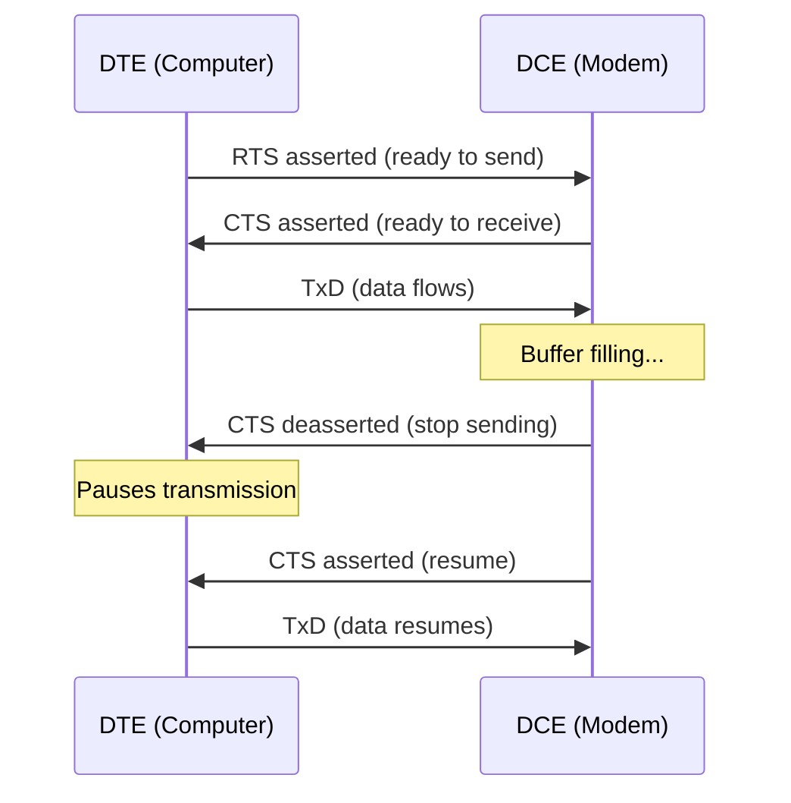
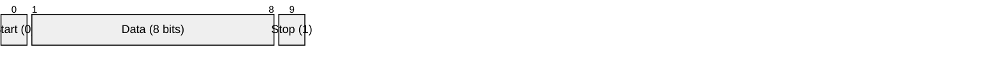

# RS-232 (EIA/TIA-232)

> **Standard:** [EIA/TIA-232-F](https://www.tia.org/) | **Layer:** Physical (Layer 1) | **Wireshark filter:** N/A (sub-packet-capture)

RS-232 is the classic serial port standard, defining the electrical signaling, voltage levels, pin assignments, and mechanical connectors for point-to-point serial communication. It was originally designed in 1960 for connecting terminals to modems and became the universal PC serial port (COM port). RS-232 uses single-ended signaling with voltage swings of ±3V to ±15V. While largely replaced by USB for PC peripherals, RS-232 remains widespread in industrial equipment, networking gear (console ports), scientific instruments, and embedded systems.

## Electrical Characteristics

| Parameter | Specification |
|-----------|---------------|
| Signal type | Single-ended (unbalanced) |
| Logic 1 (Mark) | -3V to -15V |
| Logic 0 (Space) | +3V to +15V |
| Invalid region | -3V to +3V |
| Max cable length | ~15 m (50 ft) at standard rates |
| Max data rate | 20 kbps (original spec); practical up to 115.2 kbps |
| Topology | Point-to-point (DTE to DCE) |

Note: The logic sense is inverted from TTL — a logic 1 is a negative voltage.

## Connector Pinout

### DE-9 (commonly called DB-9)

The 9-pin DE-9 connector is the most common RS-232 connector (replaced the original 25-pin DB-25):

| Pin | Name | Direction (DTE) | Description |
|-----|------|-----------------|-------------|
| 1 | DCD | Input | Data Carrier Detect |
| 2 | RxD | Input | Receive Data |
| 3 | TxD | Output | Transmit Data |
| 4 | DTR | Output | Data Terminal Ready |
| 5 | GND | — | Signal Ground |
| 6 | DSR | Input | Data Set Ready |
| 7 | RTS | Output | Request to Send |
| 8 | CTS | Input | Clear to Send |
| 9 | RI | Input | Ring Indicator |

### DB-25

| Pin | Name | Direction (DTE) | Description |
|-----|------|-----------------|-------------|
| 1 | Shield | — | Protective ground |
| 2 | TxD | Output | Transmit Data |
| 3 | RxD | Input | Receive Data |
| 4 | RTS | Output | Request to Send |
| 5 | CTS | Input | Clear to Send |
| 6 | DSR | Input | Data Set Ready |
| 7 | GND | — | Signal Ground |
| 8 | DCD | Input | Data Carrier Detect |
| 20 | DTR | Output | Data Terminal Ready |
| 22 | RI | Input | Ring Indicator |

## Signal Lines

### Data Lines

| Signal | Description |
|--------|-------------|
| TxD (Transmit Data) | Data from DTE to DCE |
| RxD (Receive Data) | Data from DCE to DTE |

### Handshake Lines

| Signal | Description |
|--------|-------------|
| RTS (Request to Send) | DTE is ready to send data |
| CTS (Clear to Send) | DCE is ready to receive data |
| DTR (Data Terminal Ready) | DTE is powered on and ready |
| DSR (Data Set Ready) | DCE is powered on and ready |
| DCD (Data Carrier Detect) | DCE has established a connection (carrier detected) |
| RI (Ring Indicator) | DCE signals incoming call (modem) |

### Hardware Flow Control (RTS/CTS)

## DTE vs DCE

| Term | Full Name | Examples | TxD Pin |
|------|-----------|----------|---------|
| DTE | Data Terminal Equipment | Computer, terminal, router | Output |
| DCE | Data Communications Equipment | Modem, CSU/DSU | Input |

### Null Modem (DTE-to-DTE)

When connecting two DTEs directly (e.g., two computers), a null modem cable crosses the data and handshake lines:

| DTE 1 | | DTE 2 |
|-------|-|-------|
| TxD (3) | → | RxD (2) |
| RxD (2) | ← | TxD (3) |
| RTS (7) | → | CTS (8) |
| CTS (8) | ← | RTS (7) |
| DTR (4) | → | DSR (6) + DCD (1) |
| DSR (6) + DCD (1) | ← | DTR (4) |
| GND (5) | — | GND (5) |

## Data Framing

RS-232 uses [UART](uart.md) framing:

Common configuration: 9600 baud, 8N1 (8 data bits, no parity, 1 stop bit).

## Standards

| Document | Title |
|----------|-------|
| [EIA/TIA-232-F](https://www.tia.org/) | Interface Between DTE and DCE Employing Serial Binary Data Interchange |
| [ITU-T V.24](https://www.itu.int/rec/T-REC-V.24) | List of definitions for interchange circuits (signal definitions) |
| [ITU-T V.28](https://www.itu.int/rec/T-REC-V.28) | Electrical characteristics for unbalanced interchange circuits |
| [ISO 2110](https://www.iso.org/) | 25-pin connector assignment |

## See Also

- [UART](uart.md) — the framing protocol RS-232 carries
- [RS-485](rs485.md) — differential multi-drop alternative
- [RS-422](rs422.md) — differential point-to-point alternative
