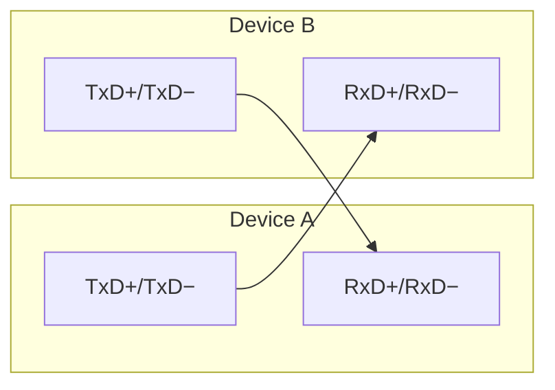
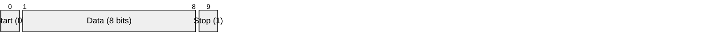

# RS-422 (EIA/TIA-422)

> **Standard:** [EIA/TIA-422-B](https://www.tia.org/) | **Layer:** Physical (Layer 1) | **Wireshark filter:** N/A (sub-packet-capture)

RS-422 is a differential serial standard for point-to-point (or point-to-multipoint) communication. It uses balanced signaling like RS-485 for noise immunity and long-distance capability, but is designed around a single driver with up to 10 receivers — making it inherently full-duplex with separate transmit and receive pairs. RS-422 is commonly found in industrial control, Apple Macintosh serial ports (pre-USB), and as the physical layer for protocols requiring full-duplex differential signaling.

## Electrical Characteristics

| Parameter | Specification |
|-----------|---------------|
| Signal type | Differential (balanced) |
| Signal lines | 4 (TxD+/TxD−, RxD+/RxD−) + GND |
| Logic 1 (Mark) | A < B, differential > +200 mV |
| Logic 0 (Space) | A > B, differential < -200 mV |
| Driver output voltage | ±2V to ±5V differential |
| Receiver sensitivity | ±200 mV minimum |
| Max cable length | 1200 m (4000 ft) |
| Max data rate | 10 Mbps (at short distances) |
| Max receivers | 10 per driver (1 driver only) |
| Topology | Point-to-point or point-to-multipoint |
| Duplex | Full (separate TX and RX pairs) |

## Wiring

### Point-to-Point (most common)



| Wire | Name | Description |
|------|------|-------------|
| TxD+ (B) | Transmit Data + | Non-inverting transmit |
| TxD− (A) | Transmit Data − | Inverting transmit |
| RxD+ (B) | Receive Data + | Non-inverting receive |
| RxD− (A) | Receive Data − | Inverting receive |
| GND | Signal Ground | Common reference |

### Point-to-Multipoint

One driver can feed up to 10 receivers on a shared receive bus. Only one device transmits on each pair:

```
  [Driver] ---+--- [Receiver 1]
              +--- [Receiver 2]
              +--- [Receiver N (max 10)]
```

## Termination

A 100-120Ω termination resistor at the far end of each differential pair:

| Pair | Termination |
|------|-------------|
| TxD+/TxD− (at receiver end) | 100-120Ω |
| RxD+/RxD− (at receiver end) | 100-120Ω |

## Data Framing

RS-422 defines only the electrical layer. Data framing is typically [UART](uart.md):



## RS-422 vs RS-485

| Feature | RS-422 | RS-485 |
|---------|--------|--------|
| Drivers per bus | 1 | 32 (or 256 high-Z) |
| Receivers per bus | 10 | 32 (or 256 high-Z) |
| Duplex | Full (4-wire native) | Half (2-wire) or Full (4-wire) |
| Direction control | Not needed (dedicated TX/RX) | DE pin required in half-duplex |
| Multi-master | No | Yes |
| Electrical compatibility | RS-485 receivers can receive RS-422 | RS-422 receivers may not tolerate RS-485 bus contention |

RS-485 is a superset in many practical ways — an RS-485 transceiver can communicate with RS-422 devices, but not always the reverse.

## Standards

| Document | Title |
|----------|-------|
| [EIA/TIA-422-B](https://www.tia.org/) | Electrical Characteristics of Balanced Voltage Digital Interface Circuits |
| [ITU-T V.11](https://www.itu.int/rec/T-REC-V.11) | Electrical Characteristics for Balanced Double-Current Interchange Circuits |
| [ISO 8482](https://www.iso.org/) | Twisted pair multipoint interconnections |

## See Also

- [UART](uart.md) — framing protocol carried over RS-422
- [RS-232](rs232.md) — single-ended point-to-point alternative
- [RS-485](rs485.md) — multi-drop extension of RS-422
