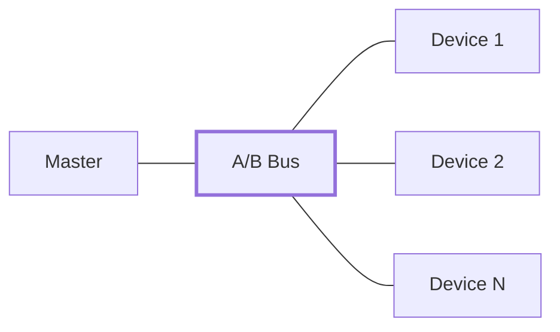
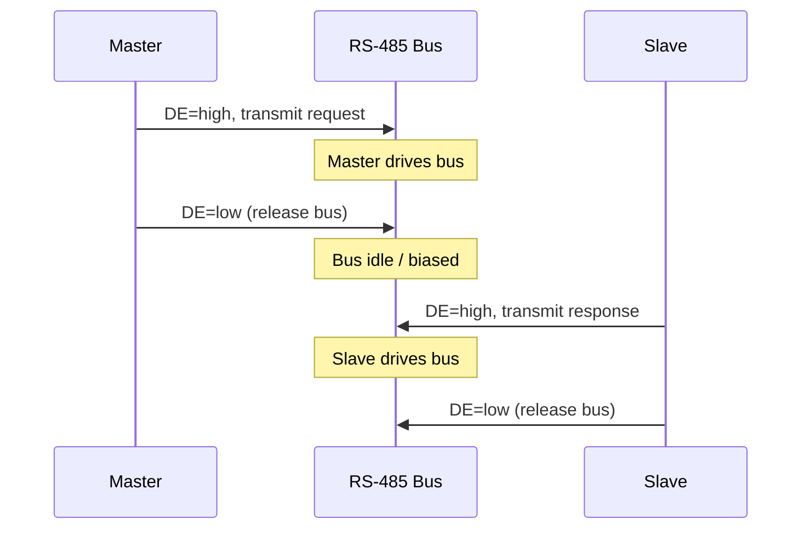
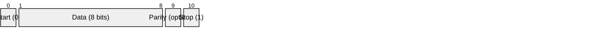

# RS-485 (EIA/TIA-485)

> **Standard:** [EIA/TIA-485-A](https://www.tia.org/) | **Layer:** Physical (Layer 1) | **Wireshark filter:** N/A (sub-packet-capture)

RS-485 is a differential serial communication standard designed for multi-drop networks over long distances in noisy environments. It uses a balanced (differential) signal pair, providing far greater noise immunity and cable lengths than RS-232. RS-485 supports up to 32 unit loads on a single bus (256 with high-impedance receivers), distances up to 1200 m, and data rates up to 10 Mbps. It is the dominant physical layer in industrial protocols like Modbus RTU, PROFIBUS, and BACnet MS/TP.

## Electrical Characteristics

| Parameter | Specification |
|-----------|---------------|
| Signal type | Differential (balanced) |
| Signal lines | 2 (A/B or D+/D−) + GND recommended |
| Logic 1 (Mark) | V(A) < V(B), differential > +200 mV |
| Logic 0 (Space) | V(A) > V(B), differential < -200 mV |
| Driver output voltage | ±1.5V to ±5V differential |
| Receiver sensitivity | ±200 mV minimum |
| Max cable length | 1200 m (4000 ft) at lower baud rates |
| Max data rate | 10 Mbps (at short distances) |
| Max devices | 32 unit loads (256 with 1/8 unit load receivers) |
| Topology | Multi-drop bus |

### Distance vs Data Rate

| Data Rate | Approximate Max Distance |
|-----------|--------------------------|
| 100 kbps | 1200 m |
| 500 kbps | 300 m |
| 1 Mbps | 120 m |
| 10 Mbps | 12 m |

## Bus Topology

### Half-Duplex (2-wire)

The most common RS-485 configuration — all devices share a single differential pair and take turns transmitting:



| Wire | Name | Description |
|------|------|-------------|
| A (D−) | Non-inverting / TxD− / RxD− | Negative when transmitting logic 0 |
| B (D+) | Inverting / TxD+ / RxD+ | Positive when transmitting logic 0 |
| GND | Signal Ground | Recommended to prevent common-mode issues |

Note: The A/B naming convention is inconsistent across manufacturers. Some label A as non-inverting (TIA standard), others as inverting. Always verify with the datasheet.

### Full-Duplex (4-wire)

Uses two differential pairs — one for each direction. Electrically identical to RS-422 in a point-to-point configuration, but can also support multi-drop with a single master:

| Pair | Direction |
|------|-----------|
| TxD+/TxD− | Master transmit / slave receive |
| RxD+/RxD− | Slave transmit / master receive |

## Bus Configuration

### Termination

A 120Ω termination resistor is placed at each end of the bus to match the characteristic impedance of twisted pair cable and prevent signal reflections:

```
  [Master]---/\/\/\---[Device 1]---[Device 2]---/\/\/\---[Device N]
           120Ω                                         120Ω
```

Termination is critical at higher baud rates and longer cable runs. It is typically not needed at low speeds (<9600 baud) over short distances.

### Biasing

When no device is transmitting, the bus is in an indeterminate state. Bias resistors pull the bus to a known idle (mark) state:

| Resistor | Connection | Typical Value |
|----------|------------|---------------|
| Pull-up | B (D+) to Vcc | 390Ω - 750Ω |
| Pull-down | A (D−) to GND | 390Ω - 750Ω |

### Direction Control

In half-duplex mode, the transceiver's driver must be enabled only when transmitting and disabled at all other times. This is typically controlled by a Driver Enable (DE) pin:



Timing the DE signal is critical — asserting too late clips the start bit; deasserting too early clips the stop bit.

## Data Framing

RS-485 defines only the electrical layer. The data framing is typically [UART](uart.md):



The higher-level protocol (Modbus, PROFIBUS, DMX512, etc.) defines message structure, addressing, and error checking on top of this.

## RS-485 vs RS-232 vs RS-422

| Feature | RS-232 | RS-422 | RS-485 |
|---------|--------|--------|--------|
| Signal type | Single-ended | Differential | Differential |
| Topology | Point-to-point | Point-to-point (multi-drop receive) | Multi-drop |
| Max devices | 1 driver, 1 receiver | 1 driver, 10 receivers | 32 drivers, 32 receivers |
| Max distance | 15 m | 1200 m | 1200 m |
| Max data rate | 20 kbps | 10 Mbps | 10 Mbps |
| Duplex | Full | Full | Half (2-wire) or Full (4-wire) |

## Common Protocols Using RS-485

| Protocol | Application | Typical Rate |
|----------|-------------|--------------|
| Modbus RTU | Industrial automation | 9600 - 115200 bps |
| PROFIBUS DP | Factory automation | 9.6 kbps - 12 Mbps |
| BACnet MS/TP | Building automation | 9600 - 115200 bps |
| DMX512 | Stage lighting | 250 kbps |
| DALI (via bus) | Lighting control | 1200 bps |
| M-Bus (via adapter) | Metering | 300 - 9600 bps |

## Standards

| Document | Title |
|----------|-------|
| [EIA/TIA-485-A](https://www.tia.org/) | Electrical Characteristics of Generators and Receivers for Use in Balanced Digital Multipoint Systems |
| [ISO 8482](https://www.iso.org/) | Twisted pair multipoint interconnections |

## See Also

- [UART](uart.md) — framing protocol carried over RS-485
- [RS-232](rs232.md) — single-ended point-to-point alternative
- [RS-422](rs422.md) — differential point-to-point alternative
- [CAN](../bus/can.md) — another differential bus used in automotive/industrial
