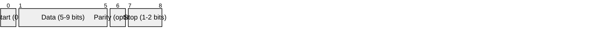
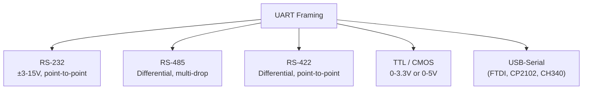

# UART (Universal Asynchronous Receiver/Transmitter)

> **Standard:** No single standard (framing convention) | **Layer:** Data Link / Physical | **Wireshark filter:** N/A (sub-packet-capture)

UART is the most common asynchronous serial communication scheme, used for decades in everything from PC serial ports to embedded systems, GPS modules, and debug consoles. It defines a framing protocol — how bits are packaged into characters — rather than electrical signaling (which is defined by standards like RS-232 or RS-485). UART requires no clock line; both sides agree on a baud rate in advance, and the start bit provides synchronization.

## Frame



The frame above shows the minimum case. A typical configuration is 8N1: 8 data bits, no parity, 1 stop bit (10 bits total per character).

## Key Fields

| Field | Size | Description |
|-------|------|-------------|
| Start Bit | 1 bit | Always logic 0; signals the beginning of a frame |
| Data Bits | 5-9 bits | The payload, transmitted LSB first |
| Parity Bit | 0-1 bit | Optional error detection |
| Stop Bit(s) | 1-2 bits | Always logic 1; marks the end of the frame |

## Field Details

### Idle State

The line idles at logic high (mark). A transition to low (space) indicates the start bit.

```
        ___     ___________     ___
Line:  |   |___|           |___|   |___
       Idle Start D0 D1 ... Stop Idle Start ...
```

### Data Bits

Most modern usage is 8 data bits, but 5 (Baudot), 7 (ASCII), and 9 (address-mark multi-drop) are also used. Data is transmitted **LSB first**.

### Parity

| Setting | Description |
|---------|-------------|
| None (N) | No parity bit — most common |
| Even (E) | Parity bit set so total 1s (data + parity) is even |
| Odd (O) | Parity bit set so total 1s is odd |
| Mark | Parity bit always 1 |
| Space | Parity bit always 0 |

### Common Configurations

Notation: data bits / parity / stop bits

| Config | Total Bits | Usage |
|--------|------------|-------|
| 8N1 | 10 | Most common default |
| 8E1 | 11 | Modbus RTU, industrial |
| 8O1 | 11 | Some legacy systems |
| 8N2 | 11 | Some slower receivers |
| 7E1 | 10 | Legacy ASCII terminals |
| 9N1 | 11 | Multi-drop addressing (RS-485) |

### Common Baud Rates

| Baud Rate | Bit Time | Common Use |
|-----------|----------|------------|
| 300 | 3.33 ms | Legacy modems |
| 9600 | 104 µs | Default for many devices, GPS NMEA |
| 19200 | 52 µs | Industrial equipment |
| 38400 | 26 µs | Faster serial devices |
| 57600 | 17.4 µs | Bluetooth SPP default |
| 115200 | 8.7 µs | Most common high-speed default |
| 230400 | 4.3 µs | Fast embedded debug |
| 460800 | 2.2 µs | High-speed embedded |
| 921600 | 1.1 µs | Maximum for many USB-serial adapters |
| 1000000+ | <1 µs | Custom high-speed applications |

### Error Detection

| Error | Cause | Detection |
|-------|-------|-----------|
| Framing error | Stop bit not detected at expected time | Hardware check |
| Parity error | Data corrupted in transit | Parity bit mismatch |
| Overrun error | New byte arrived before previous was read | Hardware FIFO overflow |
| Break condition | Line held low for longer than one frame | Intentional signal |

### Flow Control

UART itself has no flow control. It is typically added at a higher layer:

| Method | Description |
|--------|-------------|
| None | No flow control — risk of overrun at high speeds |
| Hardware (RTS/CTS) | Dedicated signal lines; receiver deasserts CTS when buffer full |
| Software (XON/XOFF) | In-band control characters (0x11 = XON, 0x13 = XOFF) |

## Physical Layer Implementations

UART defines framing only. The electrical interface depends on the standard:



## Standards

UART framing is not defined by a single standard but is described in the context of various specifications:

| Document | Title |
|----------|-------|
| [EIA/TIA-232](https://www.tia.org/) | Interface between DTE and DCE (includes UART framing) |
| [EIA/TIA-485](https://www.tia.org/) | Electrical characteristics of balanced digital multipoint |
| [16550 UART datasheet](https://www.ti.com/product/PC16550D) | De facto UART hardware reference (TI/National Semiconductor) |

## See Also

- [RS-232](rs232.md) — point-to-point electrical standard using UART framing
- [RS-485](rs485.md) — multi-drop differential electrical standard
- [RS-422](rs422.md) — point-to-point differential electrical standard
